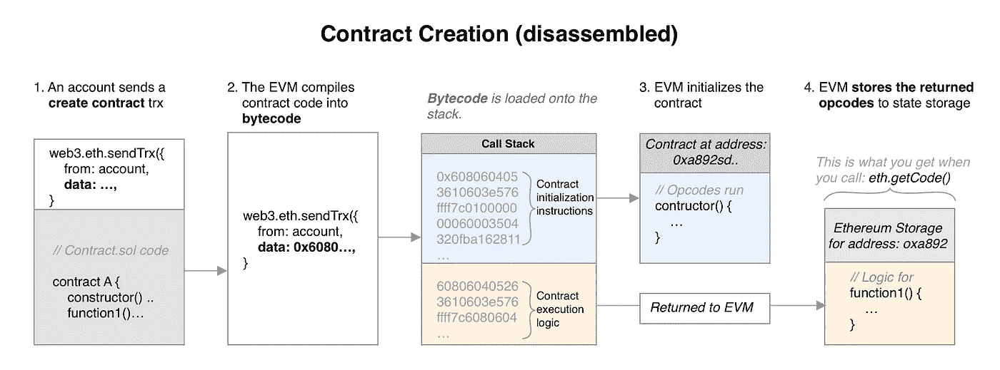
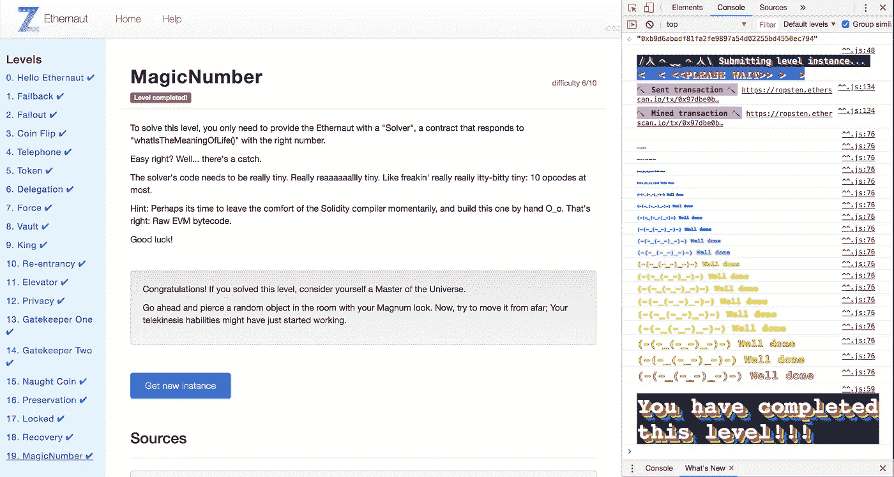
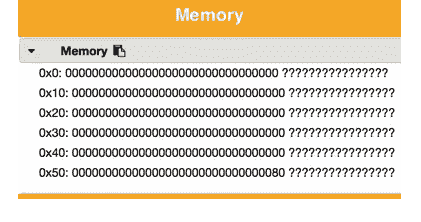

# Ethernaut Lvl 19 MagicNumber 演练:如何使用原始程序集操作码部署协定

> 原文：<https://medium.com/coinmonks/ethernaut-lvl-19-magicnumber-walkthrough-how-to-deploy-contracts-using-raw-assembly-opcodes-c50edb0f71a2?source=collection_archive---------1----------------------->

## 这是一个围绕 [Zeppelin](https://openzeppelin.org/) 团队的[智能合约安全拼图](https://ethernaut.zeppelin.solutions/)的[深度系列](/@nicolezhu)。我们学习关键的可靠性概念，以便 100%靠自己解决难题。

这个级别需要一些汇编编程来将一个微小的契约部署到 EVM。



Let’s break this down :)

# 合同创建期间发生了什么

回想一下，在[合同初始化](/coinmonks/ethernaut-lvl-14-gatekeeper-2-walkthrough-how-contracts-initialize-and-how-to-do-bitwise-ddac8ad4f0fd)期间，发生了以下情况:

1.**首先，用户或合约向以太坊网络发送交易。**本交易包含数据，但无收款人地址。这种格式向 EVM 表明这是一个`contract creation`，而不是一个常规的发送/调用事务。

2.第二，EVM 将 Solidity(一种高级的人类可读语言)中的合同代码编译成字节码(一种低级的机器可读语言)。这个字节码直接翻译成操作码，操作码在单个调用栈中执行。

> 重要的是要注意:`contract creation`字节码包含 1) `initialization code`和 2)契约的实际`runtime code`，按顺序连接。

3.**在合同创建过程中，EVM 只执行** `**initialization code**` ，直到到达堆栈中的第一条停止或返回指令。在这个阶段，契约的 constructor()函数运行，契约有一个地址。

3.1.**该初始化代码运行后，只有** `**runtime code**` **保留在堆栈**中。然后，这些操作码被复制到内存中，并返回到 EVM。

5.**最后，EVM 将该返回的剩余代码存储在州存储器中，**与新合同地址相关联。这是`runtime code`,将由堆栈在将来所有对新契约的调用中执行。

## 简而言之

要解决这个问题，您需要两组操作码:

*   `Initialization opcodes`:由 EVM 立即运行，以创建您的合同并存储您未来的运行时操作码，以及
*   `Runtime opcodes`:包含你想要的实际执行逻辑。这是您的代码的主要部分，应该**返回 0x** `**0x42**` **并且在 10 个操作码之下。**

*至此，要独立解决这个层次，可以深入阅读关于* [*操作码*](/@blockchain101/solidity-bytecode-and-opcode-basics-672e9b1a88c2) *和* [*智能契约解构*](https://blog.zeppelin.solutions/deconstructing-a-solidity-contract-part-i-introduction-832efd2d7737) *(出自本 Ethernaut 层次的作者)。*

*要获得更多指导，让我们继续……*

# 详细演练



0.用 Ropsten (或您的首选设置)启动 [truffle 控制台，以便能够直接将字节码部署到 EVM。并打开这张](/coinmonks/5-minute-guide-to-deploying-smart-contracts-with-truffle-and-ropsten-b3e30d5ee1e)[字节码< >操作码转换](https://github.com/ethereum/pyethereum/blob/develop/ethereum/opcodes.py)图方便参考。

# 运行时操作码—第 1 部分

首先，让我们弄清楚`runtime code`的逻辑。该级别限制您只能使用 10 个操作码。幸运的是，返回一个简单的`0x42`并不需要更多的时间。

**返回值**由`RETURN`操作码处理，它接受两个参数:

*   `p`:您的值在内存中存储的位置，即 0x0、0x40、0x50(见图)。*我们来任意挑一下 0x80 槽。*
*   `s`:你存储数据的大小。*回想一下你的值是 32 字节长(或者十六进制的 0x20)。*

*回想一下以太坊内存是这样的，0x0，0x10，0x20…作为官位参考:*



Every Ethereum transaction has 2²⁵⁶ bytes of (temporary) memory space to work with

但是…这意味着在你可以返回一个值之前，首先你必须把它存储在内存中。

1.  首先，用`mstore(p, v)`将您的`0x42`值存储在内存中，其中 p 是位置，v 是十六进制值:

```
6042    // v: push1 0x42 (value is 0x42)
6080    // p: push1 0x80 (memory slot is 0x80)
52      // mstore
```

2.然后，你可以`return`这个`0x42`值:

```
6020    // s: push1 0x20 (value is 32 bytes in size)
6080    // p: push1 0x80 (value was stored in slot 0x80)
f3      // return
```

这个结果操作码序列应该是`604260805260206080f3`。您的运行时操作码正好是 10 个操作码和 10 个字节长。

# 初始化操作码—第 2 部分

现在让我们创建合同`initialization opcodes`。这些操作码需要将你的`runtime opcodes`复制到内存中，然后再返回给 EVM。*回想一下，EVM 会自动将运行时序列* `*604260805260206080f3*` *保存到区块链——您不必处理最后这一部分。*

将代码从一个地方复制到另一个地方由操作码`codecopy`处理，它接受 3 个参数:

*   `t`:代码在内存中的目的位置。*我们把代码任意保存到 0x00 位置。*
*   `f`:参考整个字节码，`runtime opcodes`的当前位置。记住`f`在`initialization opcodes`结束后开始。*真是鸡和蛋的问题！您目前不知道该值。*
*   `s`:代码的大小，以字节为单位。*回想一下* `*604260805260206080f3*` *的长度是 10 个字节(或者十六进制的 0x0a)。*

3.首先将你的`runtime opcodes`复制到内存中。为`f`添加一个占位符，因为它目前未知:

```
600a    // s: push1 0x0a (10 bytes)
60??    // f: push1 0x?? (current position of runtime opcodes)
6000    // t: push1 0x00 (destination memory index 0)
39      // CODECOPY
```

4.然后，`return`你的内存中`runtime opcodes`到了 EVM:

```
600a    // s: push1 0x0a (runtime opcode length)
6000    // p: push1 0x00 (access memory index 0)
f3      // return to EVM
```

5.注意，总的来说，`initialization opcodes`占用了 12 个字节，或者说`0x0c`个空格。这意味着您的`runtime opcodes`将从索引`0x0c`开始，其中`f`现在已知为`0x0c`:

```
600a    // s: push1 0x0a (10 bytes)
60**0c**    // f: push1 0x?? (current position of runtime opcodes)
6000    // t: push1 0x00 (destination memory index 0)
39      // CODECOPY
```

6.因此，最后的顺序是:

```
0x600a600c600039600a6000f3604260805260206080f3
```

其中前 12 个字节是`initialization opcodes`，后面的 10 个字节是你的`runtime opcodes`。

7.在 Truffle 控制台中，使用以下命令创建您的合同:

```
> var account = "your address here";
> var bytecode = "0x600a600c600039600a6000f3604260805260206080f3";
> web3.eth.sendTransaction({ from: account, data: bytecode }, function(err,res){console.log(res)});
```

8.从返回的事务哈希中查找新创建的**合同地址**。您可以通过 Etherscan 或 getTransactionReceipt(hash)**来完成此操作。**

9.在 Ethernaut web 控制台中，只需输入以下内容即可通过该级别:

```
await contract.setSolver("contract address");
```

# 学习更多的可靠性

查看 [Solidity Koans](https://github.com/nczhu/soliditykoans) ，通过测试驱动开发学习更多的 Solidity。我们计划很快对此进行开源，所以欢迎所有用户的反馈！

# 推荐读物

*   对于所有以前的级别，[从这里开始。](/@nicolezhu)
*   为了更深入地了解 Solidity 装配的奇妙世界，我推荐以下文章:

[](https://blog.zeppelin.solutions/deconstructing-a-solidity-contract-part-i-introduction-832efd2d7737) [## 解构契约——第一部分:引言

### 亚历杭德罗·桑坦德与利奥·阿里亚斯合作。

博客.齐柏林.解决方案](https://blog.zeppelin.solutions/deconstructing-a-solidity-contract-part-i-introduction-832efd2d7737) [](/@blockchain101/solidity-bytecode-and-opcode-basics-672e9b1a88c2) [## 可靠性字节码和操作码基础

### 随着我们更深入地编写智能合同，我们会遇到诸如“PUSH1”、“SSTORE”、“CALLVALUE”等术语…

medium.com](/@blockchain101/solidity-bytecode-and-opcode-basics-672e9b1a88c2) 

> [在您的收件箱中直接获得最佳软件交易](https://coincodecap.com/?utm_source=coinmonks)

[](https://coincodecap.com/?utm_source=coinmonks)