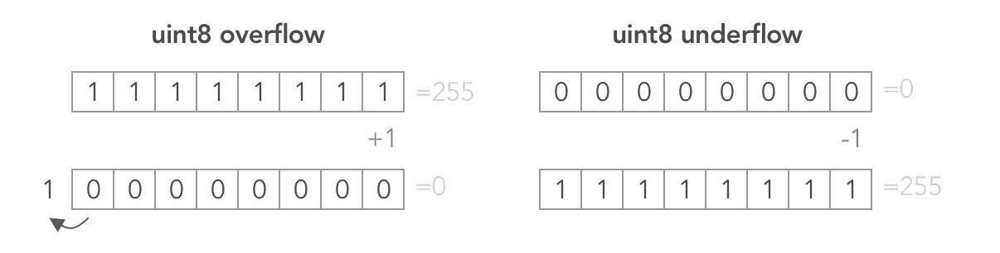
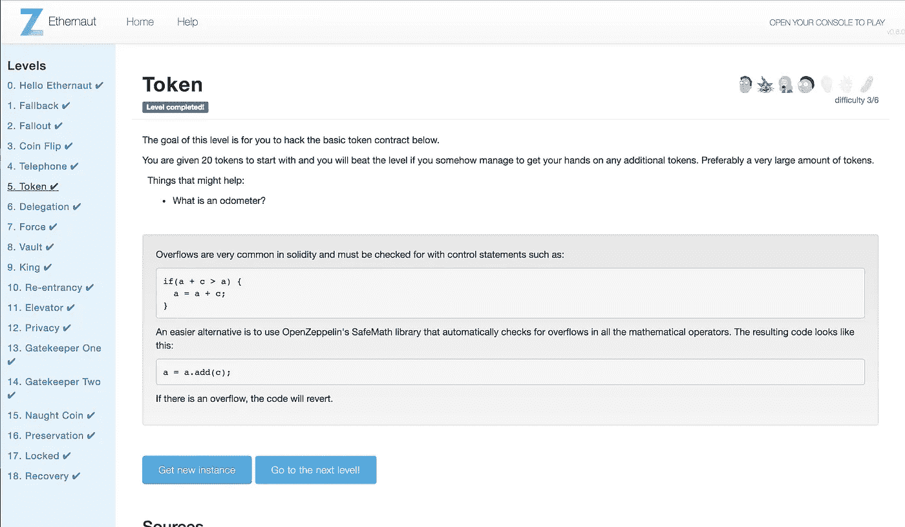

# Ethernaut Lvl 5 令牌演练:如何滥用算术下溢和上溢

> 原文：<https://medium.com/coinmonks/ethernaut-lvl-5-walkthrough-how-to-abuse-arithmetic-underflows-and-overflows-2c614fa86b74?source=collection_archive---------3----------------------->

## 这是一个围绕 [Zeppelin](https://openzeppelin.org/) 团队的[智能合约安全拼图](https://ethernaut.zeppelin.solutions/)的[深度系列](/@nicolezhu)。我会给你直接的资源和你需要的关键概念来 100%自己解决这些难题。

这个等级需要你将你的契约的 20 个代币增加到更多。

# `Integer Overflow and Underflows`

像 C 和 C++一样，Solidity 是一种低级编码语言，它没有处理存储限制的故障保险。这与 Ruby 和 Python 开发人员可能习惯的不同。

以太坊的智能合约存储槽每个都是 256 位，即 32 字节。Solidity 既支持有符号整数，也支持高达 256 位的无符号整数`uint`。

这意味着当你的数字低于或高于分配的存储位时，你的算术运算容易发生下溢和上溢错误。

> 注意:最大可能的 uint256 等于`115792089237316195423570985008687907853269984665640564039457584007913129639935`——希望足以代表你所需要的

下面是上面代码片段的可视化:



这使得自行处理算术运算符的契约变得脆弱。通常，我们从 [safemath.sol](https://github.com/OpenZeppelin/openzeppelin-solidity/blob/master/contracts/math/SafeMath.sol) 库中继承数学运算符。



# 详细演练

1.  注意 Telephone.sol 的`changeOwner`函数检查是否`(tx.origin != msg.sender)`。看起来我们可以通过场景 3 成功触发该功能:

2.创建一个电话合同，`Telephony`作为合同 a。在`Telephony`中实例化合同 B，即您的 phone.sol:

```
contract Telephony {Telephone public phone = Telephone(YOUR_INSTANCE_ADDR_HERE);
    //TODO...
}
```

3.在`Telephony`中创建一个`changeOwner`函数，调用`Telephone`中的`changeOwner`函数，即玩电话游戏。

```
function changeOwner(address _owner) public {
    phone.changeOwner(_owner);
}
```

4.注意控制台中的`await contract.owner()`现在显示您的用户钱包是所有者！

# 关键安全要点

*   使用 [SafeMath.sol](https://github.com/OpenZeppelin/openzeppelin-solidity/blob/master/contracts/math/SafeMath.sol) 来处理简单的数学运算

# 借助 Solidity Koans 深入了解

*   查看第二级 [Solidity Koans](https://github.com/nczhu/soliditykoans) (灵感来自 Ruby Koans)用一些 Zen TDD 来实践这个概念！

# 更多级别

[](/@nicolezhu/ethernaut-lvl-4-walkthrough-how-to-abuse-tx-origin-msg-sender-ef37d6751c8) [## Ethernaut Lvl 4 电话演练:如何滥用 tx.origin & msg.sender

### 这是一个围绕齐柏林团队的智能合同安全难题的深入系列。我会给你直接的资源…

medium.com](/@nicolezhu/ethernaut-lvl-4-walkthrough-how-to-abuse-tx-origin-msg-sender-ef37d6751c8) [](/coinmonks/ethernaut-lvl-6-walkthrough-how-to-abuse-the-delicate-delegatecall-466b26c429e4) [## Ethernaut Lvl 6 委托演练:如何滥用微妙的委托调用

### 这是一个围绕齐柏林团队的智能合同安全难题的深入系列。我会给你直接的资源…

medium.com](/coinmonks/ethernaut-lvl-6-walkthrough-how-to-abuse-the-delicate-delegatecall-466b26c429e4) 

> [在您的收件箱中直接获得最佳软件交易](https://coincodecap.com/?utm_source=coinmonks)

[](https://coincodecap.com/?utm_source=coinmonks)