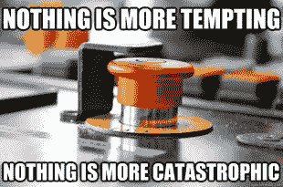
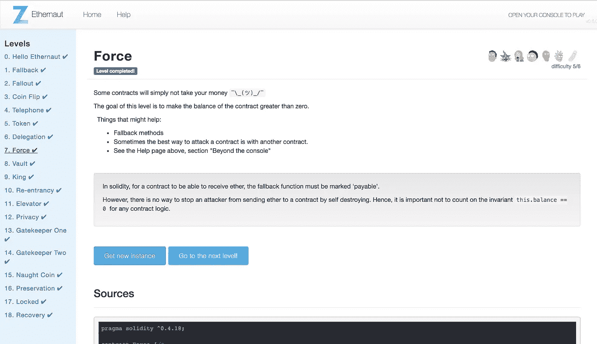

# 以太吕 7 部队演练-如何自毁和创造一个以太黑洞

> 原文：<https://medium.com/coinmonks/ethernaut-lvl-7-walkthrough-how-to-selfdestruct-and-create-an-ether-blackhole-eb5bb72d2c57?source=collection_archive---------1----------------------->

## 这是一个围绕 [Zeppelin](https://openzeppelin.org/) 团队的[智能合约安全拼图](https://ethernaut.zeppelin.solutions/)的[深度系列](/@nicolezhu)。我们学习关键的可靠性概念，以便 100%靠自己解决难题。

这个级别需要你发送醚到一个空的合同。

# `What is selfdestruct`

> 自毁是一个大的红色按钮，让你放弃你的智能合同，并把所有剩余的醚转移到另一个地址



`selfdestruct(address)`是低级操作码调用，*别名为前者，*名不副实，`suicide()`函数。与其他交易不同，`selfdestruct()` **消耗负气**——所以把它想成一个清理无效合同的垃圾收集激励。

## 何时自毁

合同所有者通常包括在以下情况下调用的`selfdestruct`期权:

*   **弃用有缺陷的合同:**当智能合同有缺陷或不希望的方面时，创建者可以销毁合同，并将剩余的以太网转发到备份地址。
*   **清理过时的旧合同。这被视为释放以太坊区块链存储空间的最佳实践。**

如何实现`selfdestruct`的一个例子是:

```
**function** close() **public** onlyOwner {
    //recommended: emit an event as well
    selfdestruct(owner);
}
```


The selfdestruct option makes everything ok when it might not be

## 有趣的事实:`selfdestruct`目前是您的合同接收乙醚的三种方法之一

**方法 1 —通过应付款函数:**之前，我们讨论过[回退函数](https://hackernoon.com/ethernaut-lvl-1-walkthrough-how-to-abuse-the-fallback-function-118057b68b56)是为了*有意*允许您的合同从其他合同和外部钱包接收乙醚。但是如果不存在这样的`payable`函数，您的合同仍然有另外两种间接接收资金的方式:

**方法 2 —获得采矿奖励:**合同地址可以被指定为采矿区块奖励的接受者。

**方法 3 —来自已销毁的合同:**如前所述，`selfdestruct`允许您指定一个备份地址来接收您正在销毁的合同中剩余的醚。

## **警告:小心转发自毁醚到任何智能合约。**

在这一级，我们将乙醚转移到一个没有提取或转移能力的空合同。这意味着我们实际上是将测试醚倒入黑洞——永远不会再被使用。千万不要在 main-net 上这样做，因为它会永远占用普遍有限的以太网数量(和你自己的钱)!

# 详细演练



1.  注意 **Force.sol** 是一个空合同，不能通过直接转账收款。这使我们剩下方法 2 和 3。让我们签订一份自由合同，把剩余的部分转给 Force.sol！
2.  在 [Remix IDE](http://remix.ethereum.org/) 中或者使用 [truffle](http://truffleframework.com/) 框架，发起如下自毁契约:

```
contract SelfDestructingContract {
}
```

3.允许此合同接收乙醚，以便它可以有一个平衡:

```
function collect() public payable returns(uint) {
    return address(this).balance;
}
```

在这一点上，转发你的合同一些醚！

4.允许此契约自毁并将所有剩余的醚转发给 Force.sol。

```
function selfDestroy() public {
    address addr = //your Force.sol instance here
    selfdestruct(addr);
}
```

5.调用`selfDestroy()`。你的 Force.sol 实例现在已经成为所有以太的永久水槽！

# 关键安全要点

*   **永远不要相信你自己的会计:**即使作为合同的所有者，你也不能控制合同的余额。切勿将合同余额用作会计或授权检查。
*   即使你没有实现自毁()，也仍然有可能通过任何 [delegatecall](/coinmonks/ethernaut-lvl-6-walkthrough-how-to-abuse-the-delicate-delegatecall-466b26c429e4) ()漏洞实现。
*   如果您实现了一个`selfdestruct`，I)验证`msg.sender = owner`和 ii) **发出一个事件**，用于此契约的外部依赖和未来参考。

# 更多级别

[](/coinmonks/ethernaut-lvl-6-walkthrough-how-to-abuse-the-delicate-delegatecall-466b26c429e4) [## Ethernaut Lvl 6 委托演练:如何滥用微妙的委托调用

### 这是一个围绕齐柏林团队的智能合同安全难题的深入系列。我会给你直接的资源…

medium.com](/coinmonks/ethernaut-lvl-6-walkthrough-how-to-abuse-the-delicate-delegatecall-466b26c429e4) [](/coinmonks/how-to-read-private-variables-in-contract-storage-with-truffle-ethernaut-lvl-8-walkthrough-b2382741da9f) [## Ethernaut Lvl 8 Vault 演练—如何读取契约存储中的“私有”变量(使用…

### 这是一个围绕齐柏林团队的智能合同安全难题的深入系列。我们学习关键的可靠性概念…

medium.com](/coinmonks/how-to-read-private-variables-in-contract-storage-with-truffle-ethernaut-lvl-8-walkthrough-b2382741da9f) 

> [直接在您的收件箱中获得最佳软件交易](https://coincodecap.com/?utm_source=coinmonks)

[](https://coincodecap.com/?utm_source=coinmonks)