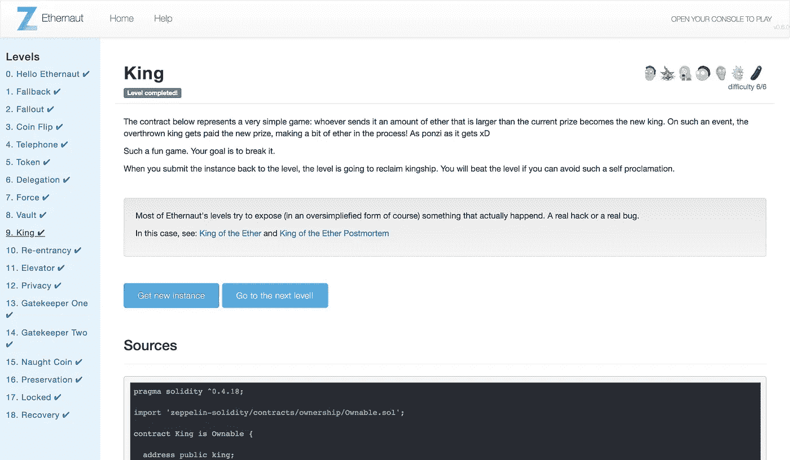

# 以太者 Lvl 9 国王演练:如何糟糕的合同可以滥用提款

> 原文：<https://medium.com/coinmonks/ethernaut-lvl-9-king-walkthrough-how-bad-contracts-can-abuse-withdrawals-db12754f359b?source=collection_archive---------0----------------------->

## 这是一部[深度系列](/@nicolezhu)围绕[齐柏林](https://openzeppelin.org/)团队的[智能合约安全拼图](https://ethernaut.zeppelin.solutions/)。我们学习关键的可靠性概念，以便 100%靠自己解决难题。

这个关卡需要你阻止关卡重新获得王权。

在之前的深入探讨中，我们[讨论了回退功能](https://hackernoon.com/ethernaut-lvl-1-walkthrough-how-to-abuse-the-fallback-function-118057b68b56)。

具体来说，每个智能合约都可以有一个简单的回退功能，以便从其他合约和钱包接收以太网。

每次你的契约向另一个契约发送 Ethers，**你都依赖于另一个契约的代码来处理事务并决定事务的成功**。

> 这意味着你的**有效**交易可以**任意失效**。

作为交易发送者，您总是容易受到以下情况的影响:

*   **漏洞 1** :接收合同没有应付回退功能，不能接收以太网，在应付请求时会抛出错误。
*   **漏洞二**:收款合同有恶意应付款回退功能，抛出异常，使有效交易失败。
*   **漏洞三**:收货合同有恶意应付功能，消耗大量燃气，使您的交易失败或超额消耗您的燃气限额。

# 详细演练



当你将这个`King.sol`实例提交回 level 时，Ethernaut 会调用这个 fallback 函数来重新获得王权。关键是保证 Ethernaut 的交易失败，你才能继续称王。

注意在这个回退函数内部，有一个`king.transfer()`，如果当前王者是恶意契约，拒绝退出，这个函数就会失效。

为了快速解决这个问题，你可以在新合同中省略回退功能(L1)或者实现恶意回退功能(L2)。让我们实现恶意回退函数，这样我们还可以包含一个嘲讽消息。

> 注意:如果你在这个级别使用混音，请给出完整的导入路径:
> 
> `import ‘github.com/OpenZeppelin/zeppelin-solidity/contracts/ownership/Ownable.sol’;`

1.  创建一个恶意契约，并在构造函数中至少植入`1 Ether`:

```
contract BadKing {
    functionBadKing() public payable {
    }
}
```

2.创建一个函数，让这个坏蛋成为`King.sol`中公认的国王，确保发送至少 1 个以太超过当前奖励。

```
function becomeKing() public {
    address(king).call.value(1000000000000000000).gas(4000000)();
}
```

3.实施可立即恢复交易的应付回退功能。给它一个错误消息(可选)。

您的最终合同应该是这样的:

4.最后，只需将您的`King.sol`契约实例提交回该级别，然后等待事务失败！

# 关键安全要点

*   永远不要假设外部合同的交易会成功
*   如果您确实需要依赖事务成功来执行其他核心逻辑，请确保在客户端处理失败的事务

# 更多级别

[](/coinmonks/how-to-read-private-variables-in-contract-storage-with-truffle-ethernaut-lvl-8-walkthrough-b2382741da9f) [## Ethernaut Lvl 8 Vault 演练—如何读取契约存储中的“私有”变量(使用…

### 这是一个围绕齐柏林团队的智能合同安全难题的深入系列。我们学习关键的可靠性概念…

medium.com](/coinmonks/how-to-read-private-variables-in-contract-storage-with-truffle-ethernaut-lvl-8-walkthrough-b2382741da9f) [](/coinmonks/ethernaut-lvl-10-re-entrancy-walkthrough-how-to-abuse-execution-ordering-and-reproduce-the-dao-7ec88b912c14) [## 以太网 Lvl 10 重入演练:如何滥用执行顺序和再现道…

### 这是一个围绕齐柏林团队的智能合同安全难题的深入系列。我们学习关键的可靠性概念…

medium.com](/coinmonks/ethernaut-lvl-10-re-entrancy-walkthrough-how-to-abuse-execution-ordering-and-reproduce-the-dao-7ec88b912c14) 

> [在您的收件箱中直接获得最佳软件交易](https://coincodecap.com/?utm_source=coinmonks)

[](https://coincodecap.com/?utm_source=coinmonks)