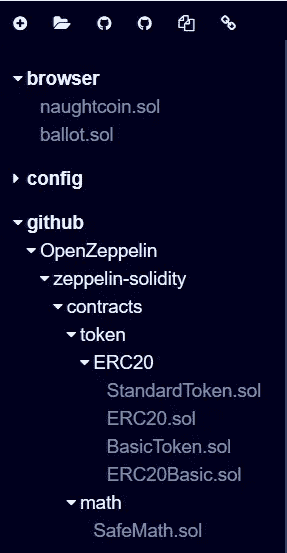
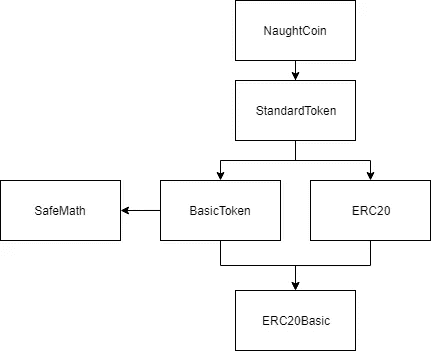
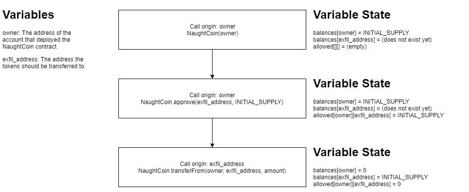

# 以太币-零币(ERC20)开发

> 原文：<https://medium.com/coinmonks/ethernaut-naught-coin-erc20-exploitation-218c86bb953b?source=collection_archive---------5----------------------->


# 背景

在过去的一周半时间里，我一直在努力熟悉以太坊智能合约及其使用 Solidity 的实现。考虑到这一点，到目前为止，我只是玩了玩开发、部署，然后与我在本地 testnet 上创建的基本 Solidity 契约进行交互。考虑到这一点，我没有根据 Consensys 在这里记录的一些已知攻击来创建自己的易受攻击的合同，我四处寻找以太坊合同的捕获旗帜风格挑战。就在那时，我无意中发现了[齐柏林飞船](https://medium.com/u/4e5199c3ee0a?source=post_page-----218c86bb953b--------------------------------)的一系列以太挑战，并决定处理他们制造的问题。

# 宝宝的第一个 ERC20 代币！

在深入研究了这些挑战之后，我决定开始着手零硬币挑战。这一挑战涉及识别 ERC20 令牌实施中的漏洞。这种实现使得玩家在合同创建时接收到全部代币供应。有一个问题是，玩家必须等待 10 年才能转让或使用任何代币——或者这至少是它应该要求的。为了完成这一挑战，玩家必须成功地将合同创建者的所有代币转移到另一个帐户，而无需等待 10 年。

# 入门指南

## 概念前提

根据齐柏林飞船的难度等级，这个挑战的难度是 5/6。在我看来，这是因为需要对可靠性契约继承和变量状态(特别是映射)有扎实的理解。除此之外，还需要理解一个基本的 ERC20 令牌是如何工作的(稍后会谈到)。

## 测试环境

以太挑战集已经为玩家在 Ropsten 测试网络上的使用而设置，并且可以通过带有 JavaScript 界面的玩家浏览器控制台进行交互。

尽管如此，我还是决定使用浏览器本地测试环境，以避免设置 Ropsten 帐户进行测试。为此，我使用了浏览器版本的 Remix，可以在这里找到。

## 为混音准备 NaughtCoin(浏览器版本)

NaughtCoin 挑战赛的原始源代码已粘贴在下面，但是，必须进行更改，以便在浏览器版本的 Remix 中正常工作。如果对 Ethernaut 提供的给定实例使用 MetaMask 和 Ropsten，则可以安全地忽略这一点，并且可以按原样执行该质询的所有其他步骤。

```
pragma solidity ^0.4.18;

import 'zeppelin-solidity/contracts/token/ERC20/StandardToken.sol';

 contract NaughtCoin is StandardToken {

  string public constant name = 'NaughtCoin';
  string public constant symbol = '0x0';
  uint public constant decimals = 18;
  uint public timeLock = now + 10 years;
  uint public INITIAL_SUPPLY = 1000000 * (10 ** decimals);
  address public player;

  function NaughtCoin(address _player) public {
    player = _player;
    totalSupply_ = INITIAL_SUPPLY;
    balances[player] = INITIAL_SUPPLY;
    Transfer(0x0, player, INITIAL_SUPPLY);
  }

  function transfer(address _to, uint256 _value) lockTokens public returns(bool) {
    super.transfer(_to, _value);
  }

  // Prevent the initial owner from transferring tokens until the timelock has passed
  modifier lockTokens() {
    if (msg.sender == player) {
      require(now > timeLock);
      if (now < timeLock) {
        _;
      }
    } else {
     _;
    }
  } 
}
```

为了在基于浏览器的重新混合中进行测试，必须进行以下更改:

```
import 'zeppelin-solidity/contracts/token/ERC20/StandardToken.sol';
```

必须更改为:

```
import '[https://github.com/OpenZeppelin/zeppelin-solidity/contracts/token/ERC20/StandardToken.sol'](https://github.com/OpenZeppelin/zeppelin-solidity/contracts/token/ERC20/StandardToken.sol');
```

进行这一更改将允许导入在编译的依赖链上正确发生，然后 Remix 会将源代码导入 Remix 编辑器的侧面板:



# 浅析诺顿硬币

为了开始分析这个挑战，我首先仔细列举了 Ethernaut 挑战中提供的`NaughtCoin`实现。为了做到这一点，我将这种方法分解成逻辑进展，并在下面详细说明。

## 进口

当我第一次开始挑战时，首先映入我眼帘的是这样一句话:

```
contract NaughtCoin is StandardToken
```

如果我想了解 NaughtCoin 是什么，我需要先确定什么是 T1，因为`NaughtCoin`是从它派生出来的。因此，看着`import` ed 契约，我决定开始沿着导入和实现的链条走下去。

```
import 'zeppelin-solidity/contracts/token/ERC20/StandardToken.sol';
```

从`StandardToken`追踪，确定了以下进口和实施:

```
import "./BasicToken.sol";
import "./ERC20.sol";contract StandardToken is ERC20, BasicToken
```

因此，`BasicToken`和`ERC20`被导入，然后在`StandardToken`的实现中被继承。

从`BasicToken`继续，确定了以下导入和实施:

```
import "./ERC20Basic.sol";
import "../../math/SafeMath.sol";contract BasicToken is ERC20Basic
```

根据`BasicToken`契约的定义，`BasicToken`从导入的`ERC20Basic`继承，并使用`SafeMath`库。为了简洁起见，跳过了`SafeMath`库，因为它与包含在该跟踪中无关。最后，`ERC20Basic`不需要派生任何其他契约。

跳回到`StandardToken`的实现，`ERC20`也是从。通过跟踪该导入，确定了以下导入和实现:

```
import "./ERC20Basic.sol";contract ERC20 is ERC20Basic
```

与`BasicToken`类似，`ERC20`也是从`ERC20Basic`继承而来，因为共享继承，所以不需要任何进一步的追踪。

为了方便参考，我在下面创建了一个基本的继承流程图。



## NaughtCoin 合同变量

跳过导入和继承，我的下一个重点是在`NaughtCoin`中定义变量。`NaughtCoin`中的定义(但不包括所有继承的定义)如下:

```
string public constant name = 'NaughtCoin';
string public constant symbol = '0x0';
uint public constant decimals = 18;
uint public timeLock = now + 10 years;
uint public INITIAL_SUPPLY = 1000000 * (10 ** decimals);
address public player;
```

对我们来说特别重要的是`timeLock`和`player`变量。`timeLock`定义提供了 10 年期限，挑战描述为在进行代币交易之前需要的期限，而`player`变量是收到所有`INITIAL_SUPPLY`代币的玩家的地址。

## NaughtCoin 构造函数

相关的 NaughtCoin 构造函数代码已包含在下面，以供参考:

```
function NaughtCoin(address _player) public {
    player = _player;
    totalSupply_ = INITIAL_SUPPLY;
    balances[player] = INITIAL_SUPPLY;
    Transfer(0x0, player, INITIAL_SUPPLY);
}
```

当`NaughtCoin`合同展开时，需要`player`的地址并随后存储。这几乎等同于大多数合同中`owner`的标准用法，并且对于涉及令牌传输的操作很重要(我们将在后面加以利用)。

`totalSupply`也被存储并初始化为`INITIAL_SUPPLY`的值。尽管如此，初始化期间发生的更有趣的分配是`balances[player]`。该分配在`balances`映射中为`player`的地址创建一个条目，值为`INITIAL_SUPPLY`。初始化时，`player`是唯一存在且有余额的条目。因此，要获得 NaughtCoin，其他地址必须从初始化`NaughtCoin`合同的`player`接收到转移。但是，再一次，回到挑战描述，这应该是不可能的，直到自初始化以来的 10 年时间之后。

## `lockTokens`修饰词

相关`lockTokens`修改器源代码已经收录如下，仅供参考:

```
modifier lockTokens() {
    if (msg.sender == player) {
      require(now > timeLock);
      if (now < timeLock) {
        _;
      }
    } else {
     _;
    }
}
```

在这个挑战中，`lockTokens`修饰语最初在我看来是最重要的，主要是因为它被应用于`transfer`功能，允许特定的发送者在`balances`的范围内将令牌从一个地址转移到另一个地址。

对于分析的这一部分来说，重要的是要理解修饰语(这里的正式文件)是封装对特定函数的调用的东西。如果您想在任意函数调用之前或之后执行操作，修饰符是调用这些操作的方法。阅读修饰语的一个简单方法是将`_`视为函数体(想想函数的源代码:`function lol() public { /* everything in here */ }`)。

当第一次分析`lockTokens`时，如果您是`msg.sender`(执行呼叫的人)，并且您也是发起`NaughtCoin`的玩家，您将在 if 语句的第一个分支内继续执行:

```
if (msg.sender == player) {
    require(now > timeLock);
    if (now < timeLock) {
      _;
    }
}
```

这是`require`街区检查的地方，以确保`timeLock`已经过去了 10 年。如果没有，将发生`revert`(重置合同的修改状态并产生错误)。if 语句检查`now`(当前日期/时间)是否小于`timeLock`，如果是，将执行函数体。

根据我们的分析，我们已经确定，如果我们使用`player`以外的账户进行呼叫，我们将无法通过`msg.sender == player`检查。此外，我们永远无法通过这个块中的`require`和`if`语句实现函数执行，因为它们相互矛盾。正因为如此，`transfer`函数变得非常无用，因为我们永远无法从`player`调用范围实现执行。因此，我们无法使用`transfer`功能成功将令牌移动到另一个地址余额。

## n 硬币传递函数

相关`transfer`修改器源代码已经收录如下，仅供参考:

```
function transfer(address _to, uint256 _value) lockTokens public returns(bool) {
    super.transfer(_to, _value);
}
```

最后但同样重要的是`transfer`功能。该函数只调用`StandardToken`使用`super`实现`transfer`函数，因为`NaughtCoin`继承了`StandardToken`。

然而，更重要的是,`lockTokens`修饰符被应用于`transfer`函数。因此，基于我们之前对`lockTokens`修改器的分析，我们已经确定我们将永远无法执行`super.transfer(...)`，因为我们永远无法绕过`timeLock`检查。

## 结论

基于我们目前为止的发现，我们已经确定`transfer`功能是完全禁止的！然而，这让我们没有什么习俗可以分析。相反，我们现在被迫研究`StandardToken`的实现，以进一步了解如何耗尽`player`的余额！

# 超越 naught coin——Zeppelin ERC 20 功能实现分析

之前在执行对`NaughtCoin`的导入和继承的分析时，我们确定了导入和继承的链。这很重要，因为它实际上在`NaughtCoin`中公开了大量额外的功能。特别是，我们正在寻找能够在 10 年时间锁定之前修改`balances`的功能，并将`balances[player]`中的内容分配给我们选择的`balances[notPlayer]`。

## ERC20 接口规范

为了使令牌与 ERC20 规范兼容，它必须实现以下接口。

```
// ERC Token Standard #20 Interface// [https://github.com/ethereum/EIPs/blob/master/EIPS/eip-20-token-standard.md](https://github.com/ethereum/EIPs/blob/master/EIPS/eip-20-token-standard.md)contract ERC20Interface {function totalSupply() public constant returns (uint);function balanceOf(address tokenOwner) public constant returns (uint balance);function allowance(address tokenOwner, address spender) public constant returns (uint remaining);function transfer(address to, uint tokens) public returns (bool success);function approve(address spender, uint tokens) public returns (bool success);function transferFrom(address from, address to, uint tokens) public returns (bool success);event Transfer(address indexed from, address indexed to, uint tokens);event Approval(address indexed tokenOwner, address indexed spender, uint tokens);}
```

该规范是最流行的规范之一，这使得找到更多的文档变得非常容易。但是，我粘贴了规范接口，因为这在完成这个挑战解决方案时参考起来会非常有用。

## 识别有趣的功能

为了开始确定我应该首先查看哪里，我发现仅仅查看 ERC20 接口就给了我一些我想要进一步查看的方法。特别是第一个跳出来给我看的函数是`transferFrom`函数。我们已经发现`NaughtCoin`的`transfer`实现被`lockTokens`修饰符变得无用，但是`NaughtCoin`没有实现`transferFrom`函数，这意味着`transferFrom`的`StandardToken`实现正在被调用。

推断出这一点后，`transferFrom`实际上做什么的问题是我们耗尽一些硬币的旅程中要解决的下一个问题。

## 分析 transferFrom 的实现

在`StandardToken.sol`中找到的相关`transferFrom`函数源代码已包含在下面以供参考:

```
function transferFrom(
  address _from,
  address _to,
  uint256 _value
)
  public
  returns (bool)
{
  require(_to != address(0));
  require(_value <= balances[_from]);
  require(_value <= allowed[_from][msg.sender]);

  balances[_from] = balances[_from].sub(_value);
  balances[_to] = balances[_to].add(_value);
  allowed[_from][msg.sender] = allowed[_from][msg.sender].sub(_value);
  emit Transfer(_from, _to, _value);
  return true;
}
```

在阅读`transferFrom`函数的源代码时，似乎它允许第三方将指定数量的令牌从一个帐户转移到另一个帐户。这是通过阅读转移要求(函数体的前三行)得出的。

在第一个`require`中，`_to`函数参数与`address(0)`值进行比较。对`address(0)`值做了一点研究，发现`address(0)`有时被[用作焚烧令牌](https://ethereum.stackexchange.com/questions/42717/what-does-address0-mean/42718#42718)的地址。更重要的是，这是一个没有人能控制的地址。因此，这个`require`检查以确保某人不能随意烧毁令牌(这对我们来说是可行的，因为我们只想从`balances[player]`中耗尽令牌)。接下来，检查传递给该函数的`_value`以确保`_from`的余额更大。这可以防止任何人提取超过可用数量的代币。最后，最后一个`require`正在检查以确保传递的`_value`小于或等于允许`msg.sender`代表`_from`管理的`allowed`令牌数量。这个函数体的其余部分只包含适当地将令牌从`balances[_from]`传输到`balances[_to]`的逻辑。

从这个函数中得到的重要收获是，我们在这个契约中发现了一个新的重要变量:`allowed`映射。似乎基于第三个`require`，如果我们有一个`player`的条目作为`_from`(例如`allowed[player]`),一个`allowed``_to`的子条目(例如`allowed[player]`),以及除了`address(0)`之外的任何其他地址作为`_to`，我们就可以使用`transferFrom`。

基于`transferFrom`中的发现，我们现在知道，如果我们希望能够通过`transferFrom`函数修改`balances`，我们首先需要在`allowed`中有一个用于`player`的条目，它似乎定义了一个被管理的账户，以及在`allowed`中该条目下的对应地址，它似乎是一个管理顶级账户的账户`allowed`，直到由`allowed[player][managerAccount]`的返回所定义的特定数量的令牌。

## 搜索津贴(批准)

在`StandardToken.sol`中找到的相关`approve`函数源代码已包含在下面以供参考:

```
function approve(address _spender, uint256 _value) public returns (bool) {
  allowed[msg.sender][_spender] = _value;
  emit Approval(msg.sender, _spender, _value);
  return true;
}
```

现在，我们已经确定了使用`transferFrom`执行转移所需的约束，我们需要将约束融入到`allowed`映射中。回头参考 ERC20 接口规范，有一个名为`approve`的函数，它接受`spender`的地址和一个 uint `tokens`。

类似于`transferFrom`函数，`StandardToken`似乎也提供了`approve`函数的实现。在这个函数中，它构建了精确的`allowed`层次结构，只要`msg.sender`是`player`并且`spender`是我们希望给予令牌的帐户，我们就需要拥有使用`transferFrom`的权限。

# 将所有这些放在一起——开发 NaughtCoin

根据我们现在掌握的信息，我们应该拥有成功使用`transferFrom`所需的所有调用。漏洞链详细描述如下。



最初，`player`是代币/契约的`owner`，契约用`balances[owner]=INITIAL_SUPPLY`初始化。因此，我们面临的挑战是将资金注入一个我们可以控制的账户——T4。为了做到这一点，我们发现我们有能力调用`transferFrom`函数来绕过`lockTokens`修饰符，并将一定数量的令牌从一个帐户转移到另一个帐户。一个问题是要求执行转账的帐户是`allowed`来执行操作，并带有特定数量的令牌。因此，我们继续调用`approve`函数作为`player` ( `owner`)，将`exfil_address`作为批准的支出者，将允许支出的代币总数作为`INITIAL_SUPPLY`。一旦批准，这将允许`exfil_address`将令牌的`INITIAL_SUPPLY`从`player` ( `owner`)转移到`exfil_address`。因此，我们已经成功地在 10 年的`timeLock`期之前耗尽了`player`的代币。

漏洞中详细描述的调用可以通过使用内存执行和 5 个默认帐户，通过浏览器版本重新混合来轻松执行。只需要两个帐户——一个用于部署 NaughtCoin 契约和后续的`approve`调用(这将填充侧栏中的现有契约),另一个用于将`transferFrom`作为`exfil_account`调用。一旦部署了契约，就可以在 Remix 中严格遵循上图中的调用图来成功执行漏洞。

# 结论

这个挑战是学习如何调试 Solidity 契约，以及理解执行范围如何修改契约的底层逻辑的一次疯狂之旅。这也是学习 ERC20 规范和实施的一个非常彻底的方法，因为你必须理解每一个主要功能，以便利用`NaughtCoin`。