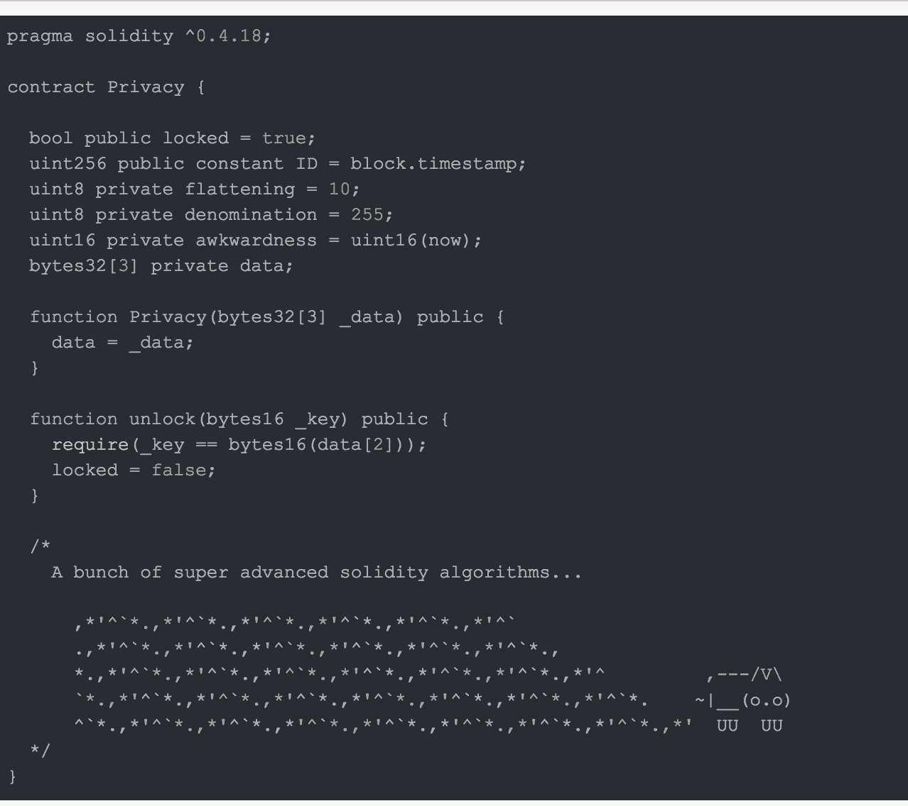
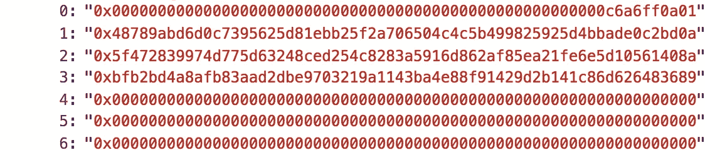
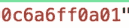

# 以太网“隐私”问题

> 原文：<https://medium.com/coinmonks/ethernaut-privacy-problem-7106562caee2?source=collection_archive---------3----------------------->


Bugs…I hate these guys

这是 Zeppelin Solutions 的好朋友们在 ether naut 上撰写的一系列文章中的第五个例子，这些文章打破了令人敬畏的可靠性安全编码挑战。

现有的一系列问题非常有趣，说明了智能合约中常见的安全陷阱，因此，如果您感觉陷入了一个特定的挑战，并且只想了解解决方案的方式和原因，那么这篇文章以及我以相同术语发表的其他文章都适合您。

这一次将应对以下挑战:



The “Privacy” Contract

> 这份合同的创建者足够小心地保护其存储的敏感区域。
> 
> 解锁此合约以击败关卡。

# 让我们检查一下合同🔍

```
bool public locked = true; 
uint256 public constant ID = block.timestamp; 
uint8 private flattening = 10; 
uint8 private denomination = 255; 
uint16 private awkwardness = uint16(now); 
bytes32[3] private data;
```

首先，合同声明了一堆存储变量和一些破坏者，只有“锁定的”(我们需要更改的)和“数据”(我们需要读取的)才是真正重要的，其余的都是来捣乱的。

```
function Privacy(bytes32[3] _data) public { 
   data = _data;
}

function unlock(bytes16 _key) public {     
    require(_key == bytes16(data[2]));     
    locked = false;  
}
```

*构造器*是神秘数据最初被传递给契约的地方，找到更多关于此信息的一个选项是窥探创建此契约的事务的**输入参数**，并从那里获得相关信息。

*解锁*功能是我们与此合同的唯一交互点，在这里我们只需要传递正确的字节序列 16 来解锁合同，并将此视为一次胜利。

# 我们的方法🏃

这个问题和解决方案实际上与我之前提到的挑战[金库问题](/coinmonks/ethernaut-vault-problem-b2675393650b)非常相似。这基本上是那个挑战的一个加强版，我们被迫知道更多一点关于存储变量的索引方式以及不同类型的转换是如何工作的。

首先要知道的是，没有什么可以阻止我们窥探合同存储变量(甚至是私有变量！)非常容易，比如 web 3 . eth . get storage at(/contract . address//var index/)

存储变量在定义时被索引，换句话说，在这种特殊情况下，契约中首次定义的“锁定”变量将在 web 3 . eth . get storage at(/contract . address/，0)中可用

虽然这是真的，但考虑到存储优化，事情会变得更加复杂！说明这一点的最好方法是获取所有可用的数据，看看我们得到了什么！

```
let data = []let callbackFNConstructor = (index) => (error, contractData) => { data[index] = contractData}for(var i = 0; i < 6; i++){web3.eth.getStorageAt(contract.address, i, callbackFNConstructor(i))}
```

在上面的 web 控制台中运行代码将获取目标契约中定义的前 6 个存储变量。

您应该看到这样的内容:



Dat is storage data

但是嘿，这太奇怪了！此合同中定义了 6 个存储变量，而我们的数据阵列只有 4 个变量的信息。此外，定义的第一个变量是一个简单的布尔值，因此我们希望第一个结果类似于:

```
"0x0000...001"
```

相反，我们得到的比我们在第一个位置讨价还价的要多得多。

这一切都与存储优化有关，它遵循非常简单的规则。

1.  为存储变量留出的每个索引允许 256 位。
2.  变量按照它们在契约中定义的顺序进行索引。
3.  如果变量在< 256 bits to represent, leftover space will be shared with subsequent variables **下，如果它们符合**。
4.  常量不使用这种类型的存储。

回顾我们的存储变量，我们可以看到索引是这样的。

```
bool public locked = true;  //rightmost bits of index[0]
uint256 public constant ID = block.timestamp; //Not indexed
uint8 private flattening = 10; //rightmost bits of index[0] - 2 
uint8 private denomination = 255; //rightmost bits of index[0] - 4
uint16 private awkwardness = uint16(now); //bits of index[0] -6
bytes32[3] private data; //indexes 1,2,3 occupied by each piece
```

有了这个索引规则，我们实际上可以理解我们的*数据[0]* 结果:



从十六进制

01 =真

0a = 10

ff = 255

c6a6 = "A 被强制为 16 位'现在' "

既然我们已经知道在我们取出的存储数据中什么代表什么，就很容易为我们的黑客获取相关信息: ***数据【3】***(相当于契约中的数据【2】)

# 可变强制🛠

```
function unlock(bytes16 _key) public {     
    require(_key == bytes16(data[2]));     
    locked = false;  
}
```

unlock 函数将我们的“key”与一个被强制转换为 bytes16 的 data[2]相匹配。现在我们知道了数据[2]是什么，解决这个问题是轻而易举的，我们只需要从字节 32 = >字节 16 理解强制是如何工作的。

如果你有不错的编程经验，类型强制的概念应该不会陌生，但基本上是这样的:

```
int datumA = 5; /This is 5/
uint datumB = uint(datumA);  /This is 5/
```

datumB 现在不能为负，该类型与数组索引和许多其他有用的东西有关。很简单吧？让我们看另一个例子:

```
int datumA = -5; /This is -5/
uint datumB = (datumA);  /This is 115792089237316195423570985008687907853269984665640564039457584007913129639931/
```

WTF 对吧？这都与你强制的类型的位表示有关。从某种意义上说，强制打破了统计类型语言的基本规则，一种处理强制的元规则出现了。不同的语言和不同的类型会有不同的结果(你应该能够将非数字字符串强制转换成 uints 吗？终究都是比特……)

在任何情况下，理解支配强制的规则的最好方法是[阅读文档](https://solidity.readthedocs.io/)或[玩弄强制直到你明白为止](http://remix.ethereum.org/)(或者两者都做)

我跑题了，我们对 bytes32 => bytes16 感兴趣，这样我们就可以知道 bytes16 类型的键作为输入参数发送，这个特殊的强制非常简单。

你只需要取字节 32 数据的前半部分，那将是你新的字节 16 类型的数据。用它作为输入参数调用 unlock 方法应该可以清除最后一个障碍。

# **结论**

就像保险库问题一样，这个挑战强调了在区块链中我们的私有变量(或任何真正的东西)是多么的不私有。胜利屏幕包括一个链接，链接到 [Darius 关于 snooping contract 的存储的文章](/aigang-network/how-to-read-ethereum-contract-storage-44252c8af925),其中有更多关于更复杂数据类型的例子，我在 vault 问题中也链接过这些例子，所以如果你对这个话题仍然感兴趣，请务必阅读一下。