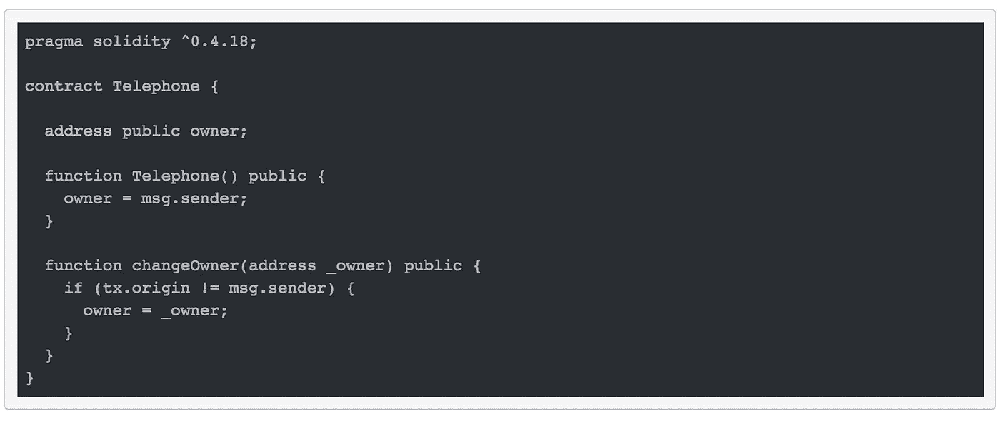
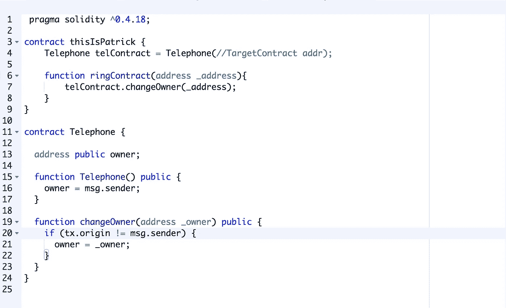
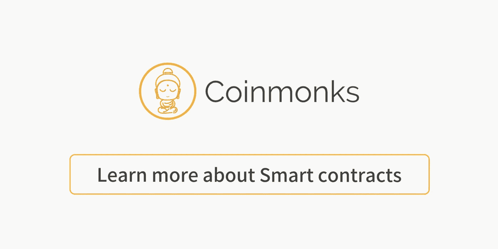

# 以太网“电话”问题。

> 原文：<https://medium.com/coinmonks/ethernaut-telephone-problem-77c574ac8da?source=collection_archive---------9----------------------->

*Brrbbb… Brbbb…*

由 Zeppelin Solutions 策划的一系列安全问题中的第三个例子，涵盖了**可怕的**安全问题，地点:[以太网](https://ethernaut.zeppelin.solutions/level/0x6b7b4a5260b67c1ee9196a42dd1ed8633231ba0a)。

这一个将会很短，因为问题本身是相当做作的，没有太多可看的:

The Telephone contract

> 在下面声明合同的所有权以完成这一关。

如果你不是一个完全陌生的人，你应该能够阅读这篇文章并思考。“嗯 tx.origin 怎么！= msg.sender "？快速的谷歌搜索将回答这个问题， **tx.origin** 将总是指进行原始交易的原始地址(即使你调用的合同调用另一个，tx.origin 将总是指你的地址)，而 **msg.sender** 是指评估交易的当前合同的最后一个调用方的地址。

像在大多数情况下一样，您可以使用另一个:

ring ring ring

从任何以太坊地址打电话给 Patrick，并把你玩以太坊游戏的地址作为参数，就会赢！

# 结论

尽管这个漏洞相当明显，但在你实际上希望*使用 **tx.origin** 而不是 **msg.sender 的情况下，这仍然是一个很好的问题。)但是想出一些好处就有点难了。你为什么不把你想到的贴在这里呢？我保证我会和你反复思考这个问题: )***

**Click to read more about smart contracts**