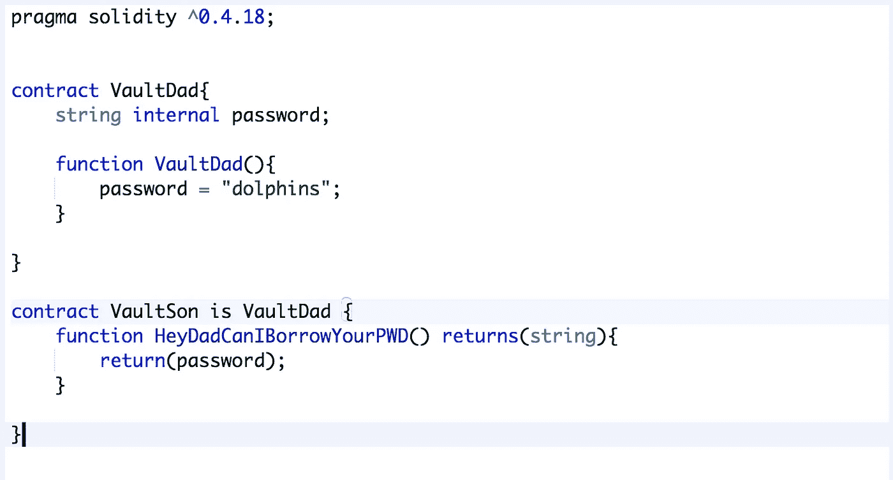
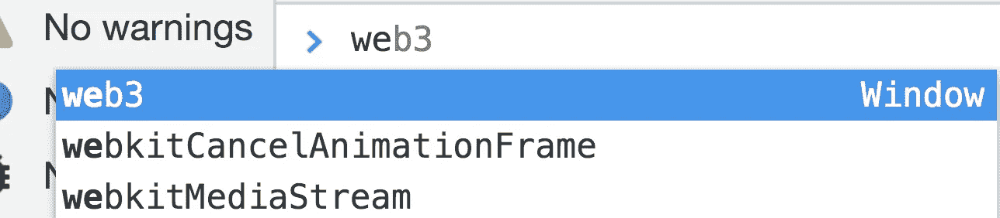

# 以太网“保险库”问题

> 原文：<https://medium.com/coinmonks/ethernaut-vault-problem-b2675393650b?source=collection_archive---------2----------------------->


A soft touch… A quick glance

这是我第四次在: [Ethernaut](https://ethernaut.zeppelin.solutions/level/0x6b7b4a5260b67c1ee9196a42dd1ed8633231ba0a) 上写一个可怕的以太坊安全问题，我在这方面已经变得非常有效率了！让我们开始吧。


The “Vault” contract

> 解锁金库通过关卡！

与我们迄今为止面临的其他问题相比，这一个肯定有不同的味道。我们可能有两条路可以打开这个保险库:

1.  蛮力它不知何故，通过一个漏洞解锁保险库，而不知道密码。
2.  用我们的诡计得到秘密密码。

老实说，1 只是浪费时间，这个合同是如此简单，真的没有太多的空间来玩杂技，我们通过的唯一方法是如果我们知道密码。那么，在这个早期阶段，我们对密码了解多少呢？

# **知道你的目标👀**

```
bytes32 private password;
```

密码是一个存储变量，类型为 bytes32，具有私人访问权限。最后一点值得澄清，根据文档，以下是不同访问类型的含义:

*   外部:所有，仅外部
*   public: all(这是默认值)，外部和内部
*   内部:仅限于本合同及其衍生合同，仅限于内部
*   **私人:只有这个合同，只有内部**

基本上，这意味着我们不能只在控制台上运行 contract.password()就结束工作。值得注意的是，如果 password 具有内部可见性，我们可以从这个契约中继承并通过 son 访问 password 变量！



This works

但是对于私有可访问性，只有来自同一个契约的内部调用才能访问它们。在这一点上，你可以感到挫败，或者记住以太坊是一个公共账本，以完全透明的方式详细记录了数百万笔交易，供全世界的眼睛看到。这意味着我们可以查询合同的**存储。无论你在合同中多么小心地封装微妙的变量，这一事实都不会改变。**

# 洞穴存储🐚

那么，我们如何非正式地检查合同呢？(即通过公共分类账而不是合同本身的整洁实施)

进入**web 3**js 库与以太坊区块链进行交互。



It’s been available for Ethernauts all along…

我们感兴趣的方法名为 **web3.eth.getStorage.** 接受一个契约地址，一个整数(index！)如果你使用元掩码，你也必须传递一个回调函数来避免不必要的错误。

等等，索引？是啊！我们不是查询整个存储，而是一点一点地获取，幸运的是，存储是以一种非常简单的方式组织的。

**每个存储元素**按照它们被定义的顺序进行索引。在保险库契约的情况下，*锁定的*存储变量的索引为 0，而这个有趣的密码的索引为 1。

将所有这些放在一起，然后:

```
let contractAddress = //contract Address
password = web3.eth.getStorageAt(contractAddress, index))
// For Metamask callback whining
web3.eth.getStorageAt(contractAddress, 1, 
function(error, result) {password = result}))
```

这里你将得到一个十六进制的字符串，所以如果你想确定你得到了正确的变量，为什么不试着把结果转换成 Ascii 呢？

# 结论

这个问题是为了钻透这个简单的事实:**“在一个公共的区块链上，一切都是公开的”。**在客户端/区块链环境中，不存在客户端/服务器应用程序的信息不对称。

在将你的 DNA 以“私人”可见的方式上传到区块链之前，想想这个问题。👩‍🔬

如果你想了解更多关于检查以太坊智能合约的信息，请查看著名 TSM 策划人[大流士](https://medium.com/u/6e8ea834f227?source=post_page-----b2675393650b--------------------------------)撰写的这篇[精彩文章](/aigang-network/how-to-read-ethereum-contract-storage-44252c8af925)！

> 加入 Coinmonks [电报频道](https://t.me/coincodecap)和 [Youtube 频道](https://www.youtube.com/c/coinmonks/videos)获取每日[加密新闻](http://coincodecap.com/)

## 另外，阅读

*   [复制交易](/coinmonks/top-10-crypto-copy-trading-platforms-for-beginners-d0c37c7d698c) | [加密税务软件](/coinmonks/crypto-tax-software-ed4b4810e338)
*   [网格交易](https://coincodecap.com/grid-trading) | [加密硬件钱包](/coinmonks/the-best-cryptocurrency-hardware-wallets-of-2020-e28b1c124069)
*   [密码电报信号](http://Top 4 Telegram Channels for Crypto Traders) | [密码交易机器人](/coinmonks/crypto-trading-bot-c2ffce8acb2a)
*   [最佳加密交易所](/coinmonks/crypto-exchange-dd2f9d6f3769) | [印度最佳加密交易所](/coinmonks/bitcoin-exchange-in-india-7f1fe79715c9)
*   开发人员的最佳加密 API
*   最佳[密码借贷平台](/coinmonks/top-5-crypto-lending-platforms-in-2020-that-you-need-to-know-a1b675cec3fa)
*   [杠杆代币](/coinmonks/leveraged-token-3f5257808b22)终极指南