# Etherscan.io 教程

> 原文：<https://medium.com/coinmonks/etherscan-io-tutorial-f5903bb43bc9?source=collection_archive---------1----------------------->

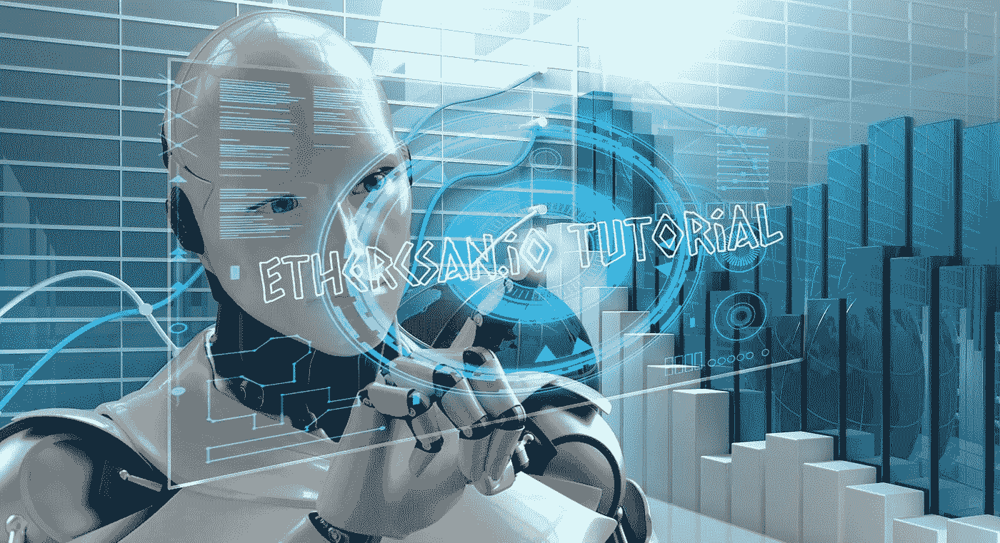

*Image from:* [*Piqsels*](https://www.piqsels.com/en/public-domain-photo-jcurz) *(public domain)*

以太扫描是以太坊智能合约最受欢迎的区块链浏览器。除了交易的实时显示，它还拥有对研究人员和投资者有用的功能。

在之前的教程中，我解释了 Metamask，并说明了如何在我们的浏览器上设置钱包，更重要的是讨论了如何插入额外的网络(侧链)。("[如何设置元掩码和添加网络(BSC，Matic，SmartBCH) —教程](/me/stats/post/476d5d023191))。)

在这篇教程中，我将解释初学者需要知道的使用 Etherscan 的基础知识。

本教程不仅仅是关于以太扫描，它包含的信息也可以应用于不同区块链的探索者，如 BSCscan 和 Polygonscan。

**Tronscan** 曾经有一个几乎相同的结构，但最近它改变了一些功能，并改进了网站，使其与众不同。

# 以太扫描

以太扫描的地址是:【https://etherscan.io/】T5

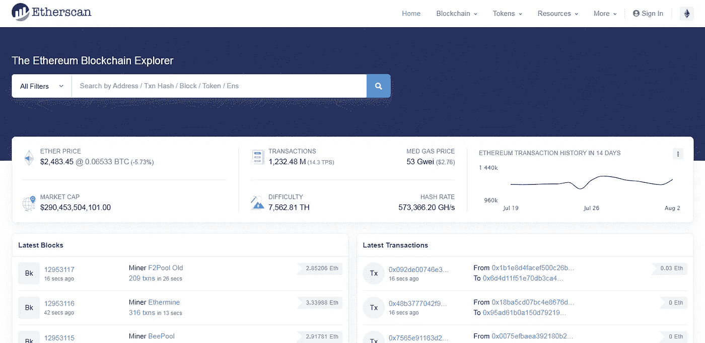

这是以太扫描的主页。它是一个用户友好的环境，网站是快速和可靠的。每个新用户只需要一些时间来熟悉界面。

我们可以使用地址、Tx 哈希、特定块等进行搜索。

在这个例子中，我们使用我的一个地址(公钥从 0x 开始)执行搜索，我们可以查看钱包余额。

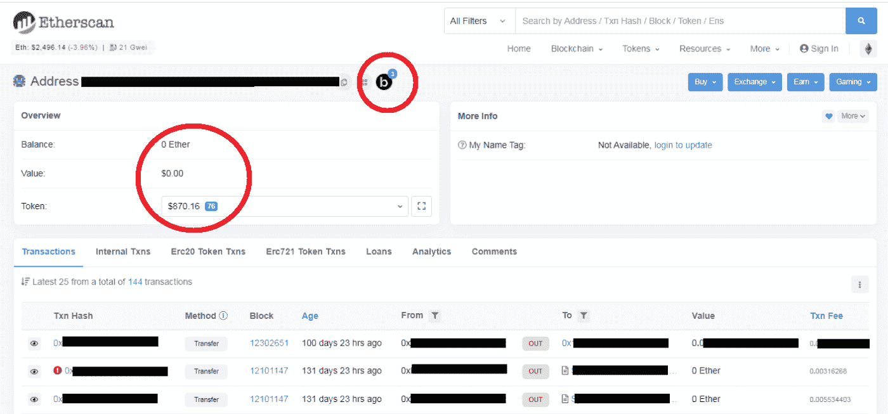

使用我们的钱包地址进行搜索后，将出现此屏幕。

我们的交易在底部(我已经把它们隐藏起来了)，我们可以通过点击 Txn 散列来阅读更多信息。作为初学者，这样做并不重要，如果需要的话，我们可以将这些信息作为参考。Txn 散列是进出我们钱包的交易的标识。

您还可以看到我的一个事务失败了，并且有一个红色的感叹号。发生这种情况是因为我使用的汽油费用太低，所以我不得不将这笔交易替换为费用更高的类似交易。

当我们用以太坊执行这个动作时，第一个失败，第二个继续。这类似于在 BTC 区块链被费取代。

本页的关键信息是以太坊和代币的总余额。两个圆圈的底部包含两个重要的细节。钱包里的 ETH 余额和代币价值。

以太网扫描从各种来源获取这些值，有时它可能会错误地评估某些令牌，或者使用几年前最后一次交易的过期价格。

这是我的一个旧以太坊钱包，虽然显示余额超过 800 美元，但暂时没有任何值钱的东西。我有大约 70 个代币在里面，但是我不能卖掉它们赚钱，因为以太坊的费用会更高。

这些代币中有一些是我在 2017 年做的糟糕投资，我现在已经注销了，因为它们的价值已经损失了 99%，还有一些是作为空投给我的。

了解顶部圆圈中的符号“b”是什么意思也很重要。

当符号旁边有一个数字时(和这个例子一样)，这意味着我们的钱包在以太坊之外的网络中也有余额(即 BSC)。

这是 Etherscan 的一项最新功能，可以帮助用户找到他们在 Polygon (Matic)或币安智能链(BSC)等网络中获得的隐藏空投。

这项新整合的服务被称为“Blockscan”。

# 块扫描

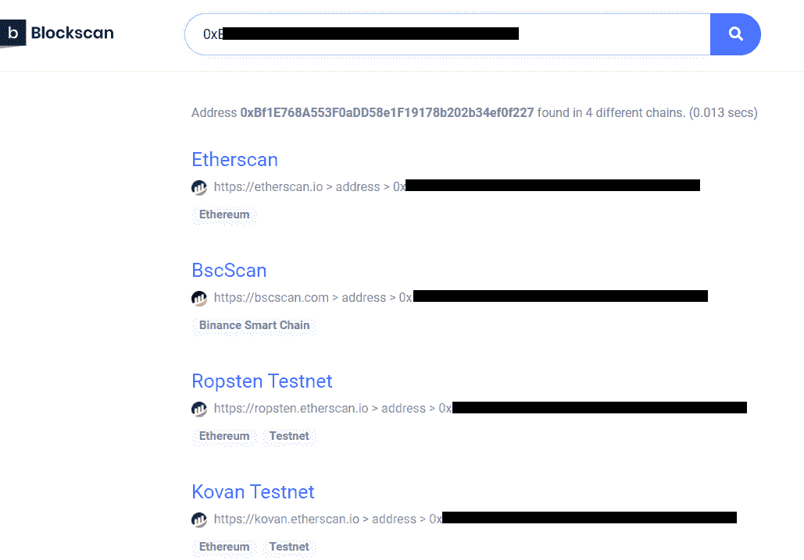

根据 Blockscan，我在它追踪的所有网络中都有令牌。然而，Blockscan 并没有覆盖所有以太坊侧链，而是覆盖了一些最重要的侧链。测试网顾名思义，它们并不重要，可能不包含任何有价值的东西，但你永远不知道，也许在那里也能发现一些重要的东西。

尽管以太扫描提供了另一个重要的原因，DEX 交易。

# DEX 交易

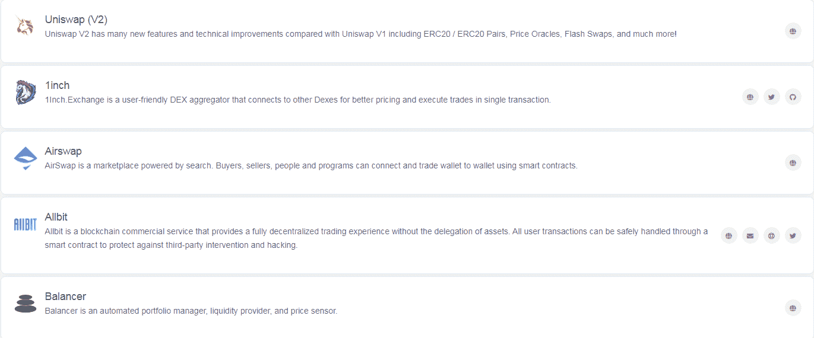

Etherscan 跟踪这 37 个分散式交换机(dex):[列表](https://etherscan.io/directory/Exchanges/DEX)

它提供了最新的交易信息，如 Uniswap，Pancake 等。

要查看最新的 DEX 交易，我们必须首先在 Etherscan 上找到合约地址屏幕。

每个令牌都有一个约定地址。这与公共地址相同，但也包含相关令牌的信息。它有源代码，并解释了 tokenomics。

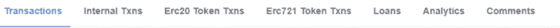

当我们在 Etherscan 上检查我们的(或任何)钱包时，这个列表在页面的中间。第一个标签，“交易”给出了每笔交易的信息，以太坊或代币。

ERC20 令牌 TXns 提供了更多关于令牌的信息以及我们发送或接收的确切数量。ERC721 令牌是关于 NFT 的。

在我的例子中，我有一些来自一个叫做球体宇宙的项目的代币，在它的价格突然上涨后，我已经在几个月前卖掉了。

现在，在价格下跌后，我想从这个令牌检查 DEX 交易，如果价格再次走低，可能会再次买入。

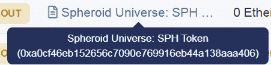

我只需将鼠标悬停在令牌名称上，智能合约的地址就会出现。单击此按钮将打开包含智能合同信息的页面。

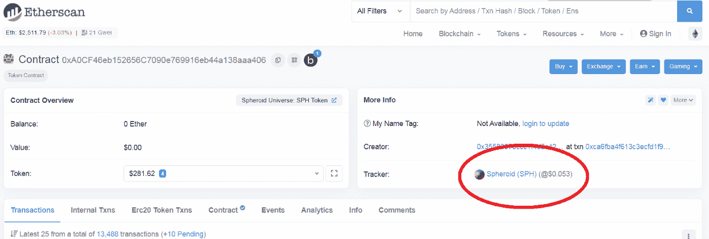

在那里，我们必须点击跟踪图标(圆圈中),跟踪价格行为和最近的指数交易。

这将为我们带来包含所有令牌信息的页面:

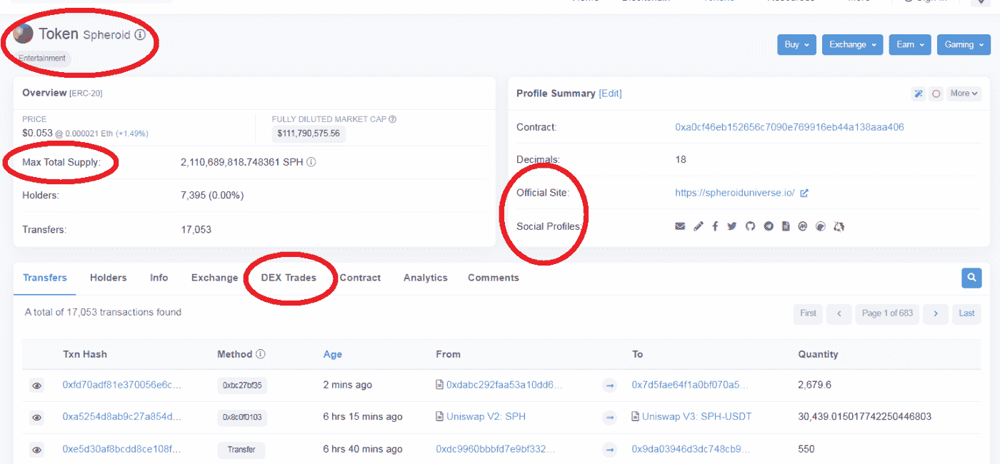

这包含了一切。从社交媒体和网站链接到所有的词汇学，我们都想知道。它还包含用于开发人员和审计的智能合同细节。

这个页面在研究以太坊网络上的新项目时至关重要，并在决定投资与否时给有经验的投资者多一个提示。

我们要找的是 DEX 交易。这将向我们表明对令牌的需求。

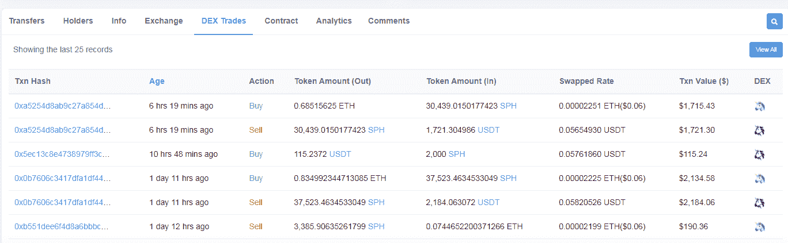

最近的 25 笔交易首先出现，我们可以通过点击“查看全部”按钮查看更多交易(这将打开一个新标签)。

我们例子中的 token 似乎有一些兴趣，至少它没有被抛弃，它有一个活跃的团队和一个有趣的概念。它的价格最近有所下跌，但跌幅没有我想追加的那么大。自最近的 ATH 以来，它仍然低了约 90%，所以如果我相信这个令牌，如果它再次开始上涨，也许美元成本平均投资策略将有助于获利。

然而，DEX 交易也指向了另一个事件。音量很低。过去两天每天大约 3000 美元。交易所交易量少通常表明我们投资的风险高，所以如果我们计划投资这家交易所，最好在我们的赌注中分配较小的规模。

以太扫描也给了我们进行交易的 DEX 的名字。这些交易都是在 Uniswap (V2 和 V3)上进行的。

# 一个能帮你节省时间的提示

有时，您可能会在您的 ERC20tokens 中的另一个页面上按下跟踪器。

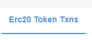

如果我们从 ERC20 页面内按下令牌跟踪器:

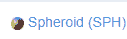

…我们将在跟踪者页面中找到，但只有我们的地址信息。

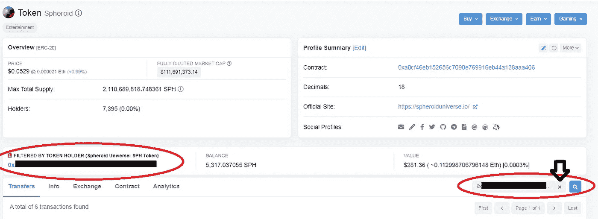

这是很多人会对 Etherscan 感到困惑的地方，因为它不会在标签上显示 DEX 交易，并且还会隐藏其他信息。

要打开我们要找的页面，我们必须按下地址旁边的 x 按钮(底部红色圆圈，箭头所在的位置)。

通过这样做，令牌跟踪器的页面将会出现，而不会限制令牌持有者的信息。

这可能会困扰初学者，因为页面上的信息量太大，对于许多人来说，很难找到重要的信息，如 DEX 交易。

# 结论

以太扫描有我们能找到的难以置信的有价值的信息，我认为通过这个教程我们已经覆盖了一些基础知识。我仍然记得

这是我们研究的重要部分，但在社交媒体、telegram 或 discord 上跟踪项目也很重要，因为他们在这些媒体上更活跃。如果项目不经常与其社区交流，通常这是个坏消息，但这也只是我们研究的一部分。

投资时还有很多要考察的，首先我们会进行尽职调查，找出开发商和团队的名字和背景，调查其他项目和以前在区块链的经历，等等。

然后，当然验证这些档案是真实的人，而不是被盗的身份。这种情况发生得太频繁了，尤其是在 2017 年的 ICO 热潮期间。

我们研究的一部分是令牌和以太扫描的分析。io 是我们研究以太坊相关项目的一部分。

***在以下平台找我。***

*●*[***read cash***](https://read.cash/@Pantera)*●*[***noise cash***](https://noise.cash/u/Pantera99)*●*[***Medium***](/@panterabch)*●*[***Hive***](https://hive.blog/@pantera1)*●*[***steem it***](https://steemit.com/@pantera1)

*●* [***推特***](https://twitter.com/Panterabch)*●*[***LinkedIn***](https://www.linkedin.com/in/panterabch/)**●*[*Reddit*](https://www.reddit.com/user/PanteraBCH)*

**原发布于*[*https://read . cash*](https://read.cash/@Pantera/etherscanio-tutorial-1e8b86e5)*。**

## *另外，阅读*

* [## 2021 年 9 大最佳加密借贷平台

### 当谈到加密货币贷款时，大量因素等同于良好的收入状况。此外，借款的一部分…

blog.coincodecap.com](https://blog.coincodecap.com/crypto-lending)  [## 加密交易机器人——最佳免费加密交易机器人

### 2021 年币安、比特币基地、库币和其他密码交易所的最佳密码交易机器人。四进制，位间隙…

medium.com](/coinmonks/crypto-trading-bot-c2ffce8acb2a)  [## 最佳 6 个加密交易信号电报通道

### 这是乏味的找到正确的加密交易信号提供商。因此，在本文中，我们将讨论最好的…

medium.com](/coinmonks/best-crypto-signals-telegram-5785cdbc4b2b)  [## BlockFi 评论 2021:利弊和利率

### 今天，我们提出了一个全面的 BlockFi 评论，这是一个成立于 2017 年的加密贷款平台，拥有其…

blog.coincodecap.com](https://blog.coincodecap.com/blockfi-review)  [## 加密税务软件——五大最佳比特币税务计算器[2021]

### 不管你是刚接触加密还是已经在这个领域呆了一段时间，你都需要交税。

medium.com](/coinmonks/best-crypto-tax-tool-for-my-money-72d4b430816b)  [## Pionex 评论 2021 |免费加密交易机器人和交换

### Pionex 是为交易自动化提供工具的后起之秀。Pionex 上提供了 9 个加密交易机器人…

medium.com](/coinmonks/pionex-review-exchange-with-crypto-trading-bot-1e459d0191ea)  [## 存储比特币的最佳加密硬件钱包[2021]

### 保管您的数字资产很容易，但找到正确的存储方式却是一项繁琐的任务。在线钱包有一个风险…

blog.coincodecap.com](https://blog.coincodecap.com/best-hardware-wallet-bitcoin)*