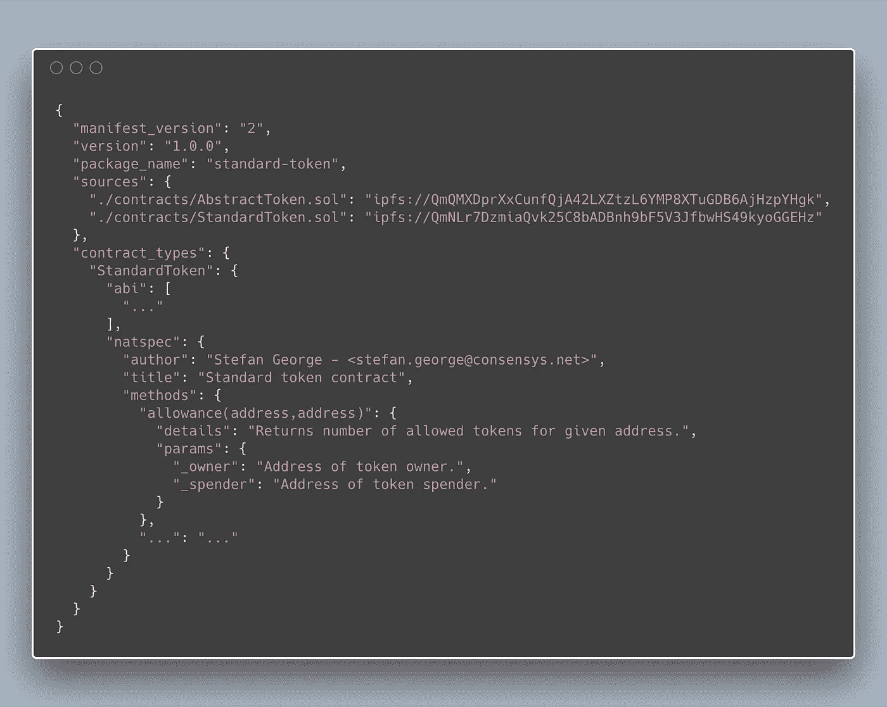
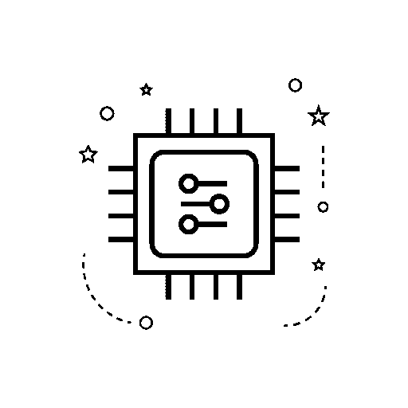

# EthPM:可重用智能合同包

> 原文：<https://medium.com/coinmonks/ethpm-smart-contract-packages-for-developers-81c77481c491?source=collection_archive---------2----------------------->

*为什么包管理好，为什么以太坊提出了新的挑战，EthPM 希望如何解决这个挑战。*

*还包括:* [*devcon iv。*](https://devcon4.ethereum.org/) *车间预览*

世界计算机为我们提供了一个紧密互联的平台，用于不可信的、可验证的软件。凭借其唯一的地址和相互委托的能力，智能契约(只是运行代码块)应该具有大量重用的手段。代表可重用组件的概念甚至被嵌入到智能契约语言中(例如，Solidity 的`library`)。尽管如此，仍然强烈需要更好的系统和过程来促进代码共享。

能够参与构建以太坊包管理标准的社区工作是我和所有松露的荣幸，这是一项令人印象深刻的工作，最初由 Piper Merriam、Tim Coulter 和其他人  完成，现在由于 ETHPrize 的慷慨资助而得到资助。

在这篇文章中，我提供了软件包管理的重要性的一些基本原理(对于任何计算平台)，概述了以太坊作为开发平台的特殊之处，并描述了正在进行的影响 EthPM 的工作。

An abbreviated EthPM package description for an ERC-20 token implementation ([full version](https://github.com/ethpm/ethpm-spec/blob/master/examples/standard-token/1.0.0-pretty.json))

# 为什么包管理是好的

软件的一个很重要的基本特征是它可以被免费复制——当一些软件被创建来解决一个问题时，同样的软件可以被重复使用来为许多不同的人解决这个问题。同样的软件经常可以被扩展来解决所有类似性质的问题。甚至更进一步，许多软件可以被重复收集和捆绑，嵌入到其他软件中，直到这些软件和解决方案无处不在，以至于我们可以把它们视为理所当然，进而解决更有趣的问题。

Example Package: [owned](https://github.com/ethpm/ethpm-spec/blob/master/examples/owned/1.0.0-pretty.json)

这个复用的过程本身就是一个软件问题:开发者如何共享代码？开发者如何借用别人的代码？

例如，如果一个开发人员为他们的智能合同实现了一个简单的授权机制(也许“合同所有者”有特权访问)，那么同一个解决方案如何能被其他开发人员广泛使用，而不必重新编写或复制粘贴代码？

为了展示软件重用问题的复杂性，考虑一下在一个软件被广泛共享和重用之后接下来会发生什么。假设“契约所有权”解决方案变得无处不在，并被许多开发人员使用。如果在解决方案中发现了缺陷，该怎么办？或者该解决方案是否可以在某些方面得到改进？难道不应该很容易地分享这一知识的成果，以最小的努力重新发布这些更新，给每个已经在使用该解决方案的人吗？

这是当代软件开发中常见的想法。大多数编程语言和大多数计算环境都有成熟的工具，使得打包(“共享和重用”问题)和版本控制(“软件往往会改变”问题)变得非常容易。大多数程序员甚至习惯于先寻找现有的解决方案来解决问题。

不幸的是，以太坊和智能契约开发(更一般地说)是计算领域的新生事物，因此开发生态系统缺乏针对该问题的量身定制的解决方案。代码经常被复制和粘贴(例如，我个人在各种项目中看到的同一个 [Owned.sol](https://github.com/ethpm/ethpm-spec/blob/master/examples/owned/contracts/Owned.sol) 文件的副本数都数不过来，只做了微小的修改)，或者使用其他语言的包管理系统(例如 NPM)，它们并没有完全处理以太坊对代码共享的独特需求。

# 为什么以太坊提出了新的挑战

智能合约不同于其他类型的可共享代码，因为它们允许我们以一种新的方式共享它们…

在当代软件开发过程中,“包管理器”的概念被很好地理解为代表一种工具或服务，它让您打包一些代码:给它一个名称、一个描述、一个许可，更重要的是，给它一个接口，其他人可以通过它使用您的代码，而不需要理解您代码的细节。

这种形式的代码是一个静态的、没有生命的计算机编码文本，是一组告诉计算机在特定时间做特定事情的书面指令。它可能是一个独立的程序，如网络浏览器或运行自动化测试的工具，也可能是一个软件库，一个大型程序的构建模块，为人类提供接口，以计算机理解的方式表达抽象的想法。

这种代码，即“指令集”的隐喻，在以太坊中仍然极其有用。 [Owned.sol](https://github.com/ethpm/ethpm-spec/blob/master/examples/owned/contracts/Owned.sol) 是一个软件库，它提供了“契约所有权”的构建块抽象。如果你是一个聪明的合同开发者，想要利用合同所有权的思想，你只需要看看这个。

但是智能合约以太坊上的代码不仅仅如此…

Example Packages: [standard-token](https://github.com/ethpm/ethpm-spec/blob/master/examples/standard-token/1.0.0-pretty.json) (static token code), [piper-coin](https://github.com/ethpm/ethpm-spec/blob/master/examples/piper-coin/1.0.0-pretty.json) (smart contract)

智能合同 [⁴](#9d52) 作为区块链的一个独特而活跃的组成部分持续存在。

它作为一个连续的实体存在，有自己的历史和记忆——一种内在状态。

它有自己的钱包，可以被编程花自己的钱。

任何人，不管是人还是机器，都可以通过它自己编程的外部接口与它互动。

智能合约提供了共享静态代码的所有特性，以及这个新特性:持久状态。利用智能合约，我们可以构建一种稀缺的数字资产，一种可替代的代币 [⁵](#1f05) 。这不仅仅是一些执行转账和审批的代码，也是每个人余额的历史一致记录。

在以太坊上，要打包代码以供重用，我们必须能够以静态形式打包它，我们还必须能够描述这些运行的智能契约。我们可能想要共享令牌契约的*抽象概念，或者我们可能想要共享一个*特定的令牌契约*，它有自己的地址，维护固定的令牌供应并可靠地跟踪余额。*

旁白:在传统计算中，智能合约有着很强的相似性。现代计算机代表了*进程*的概念，一个正在运行的程序当前是活动的，可能在等待用户输入或处理数字。智能合约就像正在运行的流程，只是该流程被设计为公共的，与世界交互，感觉上相同的流程将永远连续运行。因此，“世界计算机”

# EthPM

以太坊包管理系统就是解决这一问题的尝试。EthPM 试图为描述和分发可重用智能契约和智能契约代码的系统提供基础。它旨在满足上面列出的具体要求，并保持通用:支持多个区块链网络，支持并鼓励软件包注册中心的松散联盟，并兼容多个存储网络，包括 IPFS [⁶](#d358) 和 Swarm [⁷](#fabd) 。

在架构层面，这包括:

*   描述包的模式
*   包注册表的标准接口
*   多种语言的核心库集合

## EthPM 包清单

EthPM 中的包通过一个*清单*来描述，这是一个代码和智能契约捆绑集合的表示。它表示软件包的名称、版本、描述、许可等。，以及包内的任何代码，和/或区块链网络的任何智能合约部署。

包可能依赖于其他包、特定的构建块库或各种已部署的智能合约。包清单格式还提供了一种以可验证的方式表示包之间这些关系的方法。

这种格式在由 Nick Gheorghita、我和其他人撰写的草案 [EIP-1123 修订版以太坊智能合约包装标准](https://eips.ethereum.org/EIPS/eip-1123)中有所描述。这种描述也在[货单规范网站](https://ethpm.github.io/ethpm-spec/)上维护和提供，并以[正式的机器可读版本](https://github.com/ethpm/ethpm-spec/blob/v2.0.0-prerelease.0/spec/package.spec.json)提供。 [⁸](#da73)

## 注册接口标准

软件包注册表包含按名称和版本列出的软件包。通过描述一个包注册中心的标准接口，EthPM 试图鼓励开发人员、审计人员，甚至整个组织建立和维护一个包注册中心的分散集合。提供标准接口的目标是尽可能通用，希望开发社区可以重用和构建这个接口。

注册中心接口标准在由 Piper Merriam、Christopher Gewecke 和我本人撰写的草案 [EIP-1319:智能合同包注册中心接口](https://eips.ethereum.org/EIPS/eip-1319)中有所描述。

## 核心语言库

为了实现易用性，EthPM 希望促进跨多种编程语言和计算环境的实现。除了描述包格式和接口标准之外，EthPM 还必须提供自己的软件库，以便简单地读写包，以及将包发布到注册中心和从注册中心安装包。

这些库的目标是使区块链开发工具的生态系统能够采用这些库，以使所有开发人员能够打包和重用他们的智能合约。

正在为 [Python](https://py-ethpm.readthedocs.io/en/latest/) 、 [Go](https://github.com/ethpm/ethpm-go) 和 [Javascript](https://ethpm.github.io/ethpm.js/) 积极开发实施中的工作。

## 背景和现状

EthPM 设计的基本原理是通过大量核心用例的案例研究分析来维护的。通过这些例子，EthPM 旨在了解自己的需求，并将这些需求传达给其他人。请参见这些[用例](https://ethpm.github.io/ethpm-spec/use-cases.html#id1)了解更多信息。

What’s in a smart contract package? See example [Use Cases](https://ethpm.github.io/ethpm-spec/use-cases.html#id1)

EthPM 的当前工作代表了这种清单格式的第二次迭代，以及包注册中心和工具集成的早期实现。该项目试图应用在第一次交互中获得的经验，为软件重用提供一个更直观、更可用的系统。

当前工作的进展要感谢它的开发者社区，包括 Nick Gheorghita、Mitch Kosowski、克里斯托弗·布朗、Christopher Gewecke、Piper Merriam 和许多其他人的杰出努力。更多信息，参与项目，甚至只是打个招呼，请加入[项目的 Gitter 频道](https://gitter.im/ethpm/Lobby)。

# 研讨会预览— devcon iv。

克里斯托弗·布朗的 Nick Gheorghita 和我很高兴在[以太坊开发者大会](https://devcon4.ethereum.org/)即将举行的研讨会上展示 EthPM。

我们的研讨会将为开发人员提供 EthPM 的实践体验，包括:

*   包裹清单格式的检查
*   部署您自己的包注册中心的演练
*   构建您自己的 EthPM 包
*   通过 Web3 与您的包交互

我们希望在那里见到你！

# 参考

https://eips.ethereum.org/EIPS/eip-190[^](https://eips.ethereum.org/EIPS/eip-190)EIP 190:以太坊智能合约包装标准

http://ethprize.io/[^](#3159)埃塞俄比亚[美国](http://ethprize.io/)

[https://www.npmjs.com](#c5c7)国家预防机制[^](https://www.npmjs.com)

[^](#d141) ⁴更准确地说，EthPM 将这个概念称为*智能合约实例*，以区别于*智能合约类型*。本文使用术语*智能契约*来隐含地表示*实例*。

[https://eips.ethereum.org/EIPS/eip-20](#d531)^[⁵ERC-20 令牌标准](https://eips.ethereum.org/EIPS/eip-20)

[https://ipfs.io/](#3caa)^[⁶星际文件系统](https://ipfs.io/)

[^](#3caa)⁷swarm[https://swarm-guide . readthedocs . io/en/latest/introduction . html](https://swarm-guide.readthedocs.io/en/latest/introduction.html)

[http://json-schema.org/](#2be0)[^](http://json-schema.org/)⁸正式清单规范通过正式规范的 JSON-Schema 标准格式维护

> [直接在您的收件箱中获得最佳软件交易](https://coincodecap.com/?utm_source=coinmonks)

