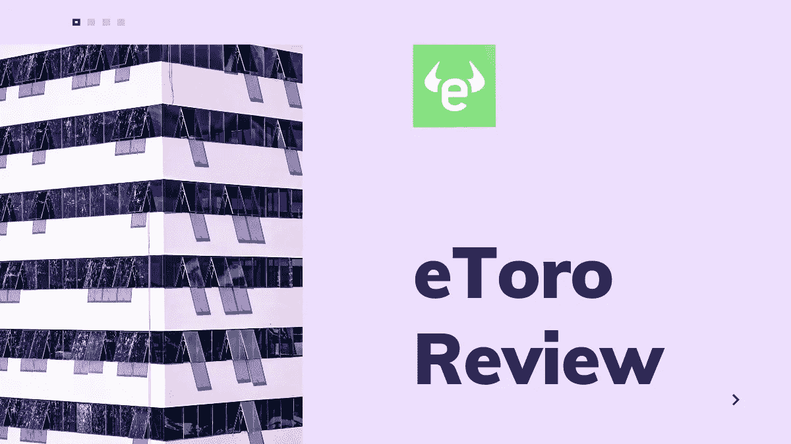
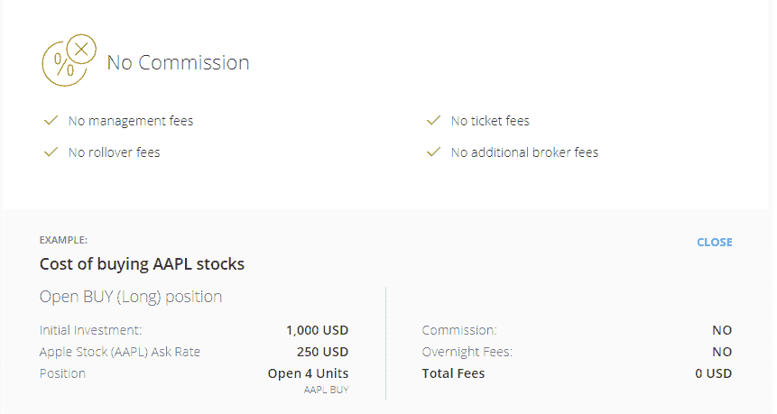
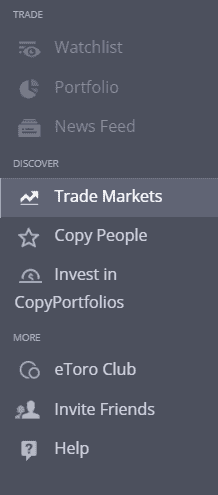
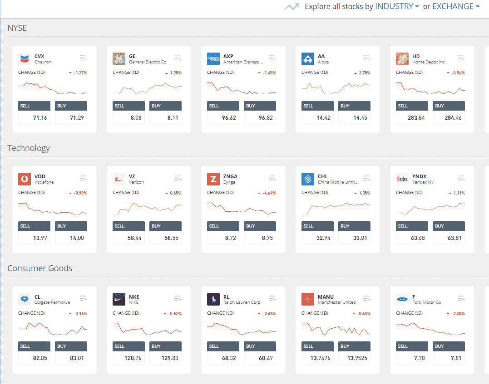

# eToro 评论|交易股票、加密、交易所交易基金、差价合约和商品

> 原文：<https://medium.com/coinmonks/etoro-review-78807ddeb33c?source=collection_archive---------5----------------------->

eToro Review

如果你在寻找一个投资平台，并且相信 1300 万的交易者和投资者不会错，你肯定会想去探索 [eToro](https://med.etoro.com/B13974_A94531_TClick_SEtoro%20main.aspx) 。如此庞大的交易基础投资于各种各样的股票、加密货币、交易所交易基金、差价合约、指数和大宗商品，你可以正确地假设他们在做一些事情——甚至可能是很多事情——是正确的。从 2007 年开始运营， [eToro](https://med.etoro.com/B13974_A94531_TClick_SEtoro%20main.aspx) 开始改变公众投资的方式，让人们有更多的机会进行网上交易。

10 年后，他们做了更多，创造了一个充满活力的社交网络社区，交易者跟随成功的交易者，互相交流，从其他客户那里学习和受益。这些创新的[社交交易工具](/coinmonks/top-10-crypto-copy-trading-platforms-for-beginners-d0c37c7d698c)，包括 [CopyTrader](http://blog.coincodecap.com/go/etoro) 和 Copy Portfolio，补充了 eToro 的教育部门——交易学校，向更多的交易新手解释和展示市场的来龙去脉。

此外， [**eToro**](http://blog.coincodecap.com/go/etorocrypto) 一直走在向大众以及通过专业交易所 [eToroX](http://blog.coincodecap.com/go/etorocrypto) 向机构和算法交易员 VIP 群体开放**加密货币交易**的前沿，提供针对他们独特需求的功能。

# **eToro 回顾:总结**

*   已建立的、有声誉的、受监管的
*   丰富的资产选择，包括加密货币
*   专业加密交换 eToroX
*   社会贸易方面
*   了解行业的多种方式
*   低费用
*   母公司:eToro 集团有限公司
*   移动交易

# **eToro 评论:特色**

Trusted eToro 拥有几项市场领先的功能，例如高度可靠的网络安全和来自一些世界顶级投资机构的严格监管。因此，eToro 对那些刚刚涉足市场的人以及技术高超、经验丰富的交易者很有吸引力。

整个资产领域也是如此:从那些渴望尝试差价合约的人，到专注于特定利基、密码或商品市场的重量级人物。以下是交易者可能希望探索的一些关键特性，以及 eToro 提供的一些一般好处。

先说一分钟 [**文案**](http://blog.coincodecap.com/go/etoro) 。CopyTrader 允许投资者复制其他 eToro 用户的实际交易，这些用户过去的表现是根据风险、成功等几个因素显示的。

虽然用户肯定会从他们复制的内容中学到很多东西，但一个专门介绍**新闻和分析**的部分是各种程度的交易员钻研市场变化、特定资产和可能影响持股的经济新闻的好方法。其他的教育工具可以在交易学校和金融科技完全指南中找到。

eToro 的**投资组合**提供现成的主题投资组合，因此用户可以根据特定行业、特定研究方法以及高度成功或受欢迎的交易员的投资组合等各种主题，轻松进入预定的投资组合。

与其他社交网络中的供稿类似，eToro 的**新闻供稿**让用户能够互动，分享见解，提出问题，并相互了解和学习。

新交易者尤其会喜欢**模拟账户**，它让用户用 10 万美元的虚拟货币探索 [eToro 平台](https://med.etoro.com/B13974_A94531_TClick_SEtoro%20main.aspx)。这对新人来说是一个很好的机会，他们可以在提高交易技巧的同时发现这个平台及其所有功能。

该网站最大的吸引力之一是它对交易市场的关注，总共有 2000 多个交易市场。eToro 为客户提供了投资 90 多个加密货币市场的机会，包括[比特币](https://blog.coincodecap.com/a-candid-explanation-of-bitcoin)、比特币现金、币安币、Ripple、IOTA、以太坊、以太坊经典、NEO、Cardano、TRON、Dash、Stellar、Litecoin、Zcash、EOS 和 Tezos。此外，用户可以从 150 多种 ETF、40 种货币对(CFD)以及数十种商品、指数和股票中进行选择。

# eToro 费用

因为没有两个投资者是相同的，eToro 提供了几种交易方式，包括**杠杆**。其他特点包括**低费用和佣金**，这肯定会在用户中排名靠前。在某些情况下，根本没有佣金，意味着没有差价、费用或收费；在其他情况下，eToro 提供非常低的利差，如许多顶级外汇货币对的 1 个点。

对密码感兴趣的交易者，有专业的**密码交易所**、 [**eToroX**](http://blog.coincodecap.com/go/etorocrypto) 。它是为工业级、公司和算法交易投资者设计的，提供了 eToroX 的支持，加上几个专业加密交易者理想的强大功能。其产品套件包括一个用于增加流动性的现货信贷交易程序，一个具有银行即时转账选项的菲亚特网关，一个专业的 FIX API，军用级冷保管服务存储，以及个性化的 VIP 入职服务。

**eToro 如何工作？**

在 eToro 上很容易上手。

1.  从[**eToro.com**](https://med.etoro.com/B13974_A94531_TClick_SEtoro%20main.aspx)点击“立即加入”或“立即交易”。
2.  输入开立新 eToro 交易账户所需的个人资料。
3.  阅读并同意条款和条件以及隐私政策。
4.  点击注册按钮提交您的信息。
5.  所有用户都需要完成 KYC 流程。填写 KYC 调查问卷，并根据要求提供所需文件。

# **eToro 回顾:与其他产品的比较**

凭借 2000 个交易市场，eToro 在行业中脱颖而出，凭借其多资产平台，用户可以在一个易于使用、受监管的平台上找到所有这些资产。它的交易者来自 140 多个国家，包括美国(eToro USA)，显然它正在与各种各样的用户群体建立联系。(请注意，eToroX 目前不向美国居民提供)。

作为一个社交交易平台，社交组件无疑是它区别于竞争对手的一个主要方面。

# eToro:常见问题

*   **没有佣金？请告诉我更多关于那件事的情况。**

eToro 没有存款或交易费用，尽管它有差价和 5 美元的取款费。其他费用可能包括与开放式差价合约相关的隔夜和周末费用。

*   如何在 eToro 上存款？

用户可以通过多种支付方式存款，如主要信用卡、银行电汇、Skrill、PayPal 和其他电子钱包。最低存款额是 200 美元。

*   **最大杠杆额度是多少？**

eToro 提供的最大杠杆比率为 1:30。专业交易者有资格获得更高的杠杆。

*   **我可以从 eToro 账户取钱到信用卡吗？**

取款时使用的资金方法与存款时相同，可以发送到信用卡和其他几个资金来源，包括 PayPal 和银行。

# **eToro 用户体验**

eToro 致力于让用户的交易变得简单明了，这一点在平台上体现得很明显，你可以根据行业和交易所进行分类，快速访问你的投资组合和观察列表，并探索投资 CopyPortfolios 或其他交易者。

# **eToro 审查:性能和安全性**

*   来自 140 多个国家的 1300 万用户。
*   受 CySEC、FCA、ASIC、GFSC、FinCen 和 FinRA 监管。
*   经商 14 年。
*   在一级欧洲银行开设的独立客户账户，加上最高标准的客户资金保护。
*   免费保险，为因 eToro 破产或不当行为而遭受损失的合格客户提供高达 100 万欧元/英镑/澳元的保障。
*   eToro Club 根据投资组合价值分为五个等级，根据每个等级提供特殊功能。

# **eToro 定价**

凭借免费账户、零股票佣金和无存款费用，eToro 立即证明了自己不同于许多投资网站。利差保持在较低水平，尽管根据支付方式(包括信用卡、PayPal、Skrill、银联等)的不同，有账户闲置和转换费。

# **eToro:利弊**

## **优点**

*   易于使用的监管平台
*   值得信赖、透明的交易
*   低费用(包括某些情况下的零佣金)
*   大量的资产
*   社交交易机会

## **缺点**

*   有限杠杆
*   仅在部分市场的美国贸易商

# **eToro 审查:结论**

几年前刚刚成立的 eToro 公司凭借众多让用户保持联系的超酷功能，正在投资行业顺利发展。其易于使用的平台、广泛的资产选择和友好的网站使数百万投资者能够进行交易，无论他们是经验丰富还是刚刚在舞台上迈出第一步。如果你属于第一类，你会欣赏为你这样的交易者创造的功能(杠杆、保险、菲亚特网关)；缺乏经验的交易者将会受益于教育和接触其他更成功的交易者。无论哪种方式，eToro 都是一个可靠、有信誉、透明的平台，可以为全球交易者提供很多东西。

## 另外，阅读

*   最好的[密码交易机器人](/coinmonks/crypto-trading-bot-c2ffce8acb2a)
*   [德里比特评论](/coinmonks/deribit-review-options-fees-apis-and-testnet-2ca16c4bbdb2) |选项、费用、API 和 Testnet
*   [FTX 密码交易所评论](/coinmonks/ftx-crypto-exchange-review-53664ac1198f)
*   [Bybit 交换审查](/coinmonks/bybit-exchange-review-dbd570019b71)
*   最好的比特币[硬件钱包](/coinmonks/the-best-cryptocurrency-hardware-wallets-of-2020-e28b1c124069?source=friends_link&sk=324dd9ff8556ab578d71e7ad7658ad7c)
*   [密码本交易平台](/coinmonks/top-10-crypto-copy-trading-platforms-for-beginners-d0c37c7d698c)
*   最好的[加密税务软件](/coinmonks/best-crypto-tax-tool-for-my-money-72d4b430816b)
*   [最佳加密交易平台](/coinmonks/the-best-crypto-trading-platforms-in-2020-the-definitive-guide-updated-c72f8b874555)
*   最佳[加密贷款平台](/coinmonks/top-5-crypto-lending-platforms-in-2020-that-you-need-to-know-a1b675cec3fa)
*   [block fi vs Celsius](/coinmonks/blockfi-vs-celsius-vs-hodlnaut-8a1cc8c26630)vs Hodlnaut
*   [莱杰 vs 特雷佐](/coinmonks/ledger-vs-trezor-best-hardware-wallet-to-secure-cryptocurrency-22c7a3fd391e)
*   Bitsgap 评论——一个轻松赚钱的加密交易机器人
*   为专业人士设计的加密交易机器人
*   [3commas Review](https://blog.coincodecap.com/3commas-review-an-excellent-crypto-trading-bot) |一款优秀的密码交易机器人
*   [PrimeXBT 审查](/coinmonks/primexbt-review-88e0815be858) |杠杆交易、费用和交易
*   Bitmex 上的[保证金交易的白痴指南](/coinmonks/the-idiots-guide-to-margin-trading-on-bitmex-dbbd7742c6fc?source=friends_link&sk=7bfa99d2a181142510c8442c8ddb0786)
*   [加密摇摆交易的权威指南](/coinmonks/the-definitive-guide-to-crypto-swing-trading-7e4af6496d4d?source=friends_link&sk=70448050bd9323b42f63bfc0bb1e60d1)
*   [Bitmex 高级保证金交易指南](/coinmonks/bitmex-advanced-margin-trading-guide-2270c195ce25?source=friends_link&sk=1d986cca731f5084b9a2db4a4bc4a7ad)
*   [面向开发人员的最佳加密 API](/coinmonks/best-crypto-apis-for-developers-5efe3a597a9f)
*   [加密套利](/coinmonks/crypto-arbitrage-guide-how-to-make-money-as-a-beginner-62bfe5c868f6)指南:新手如何赚钱
*   顶级[比特币节点](https://blog.coincodecap.com/bitcoin-node-solutions)提供商
*   最佳[加密制图工具](/coinmonks/what-are-the-best-charting-platforms-for-cryptocurrency-trading-85aade584d80)
*   了解比特币的[最佳书籍有哪些？](/coinmonks/what-are-the-best-books-to-learn-bitcoin-409aeb9aff4b)

> [直接在您的收件箱中获得最佳软件交易](https://coincodecap.com?utm_source=coinmonks)

