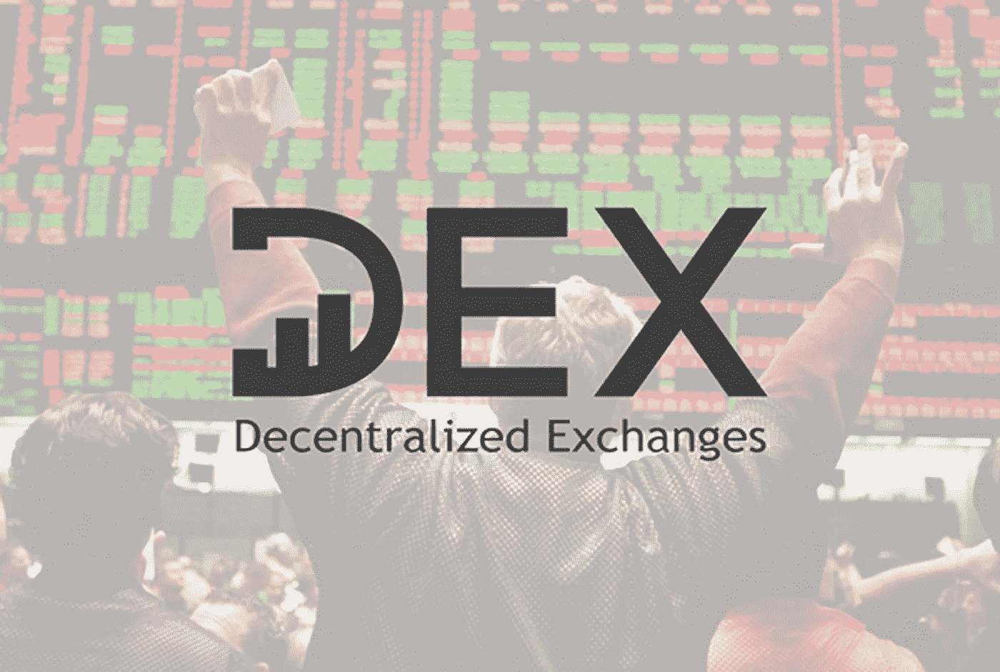
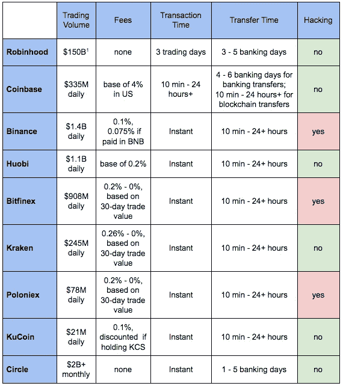

# 评估分散交易所的兴起。一

> 原文：<https://medium.com/coinmonks/evaluating-the-rise-of-decentralized-exchange-pt-1-9883d76f4f38?source=collection_archive---------4----------------------->

这是评估分散交易所的价值和兴起的两部分中的第一部分；点击这里看第二部分。本文件是对高风险资产的个人投资分析，不应被视为投资建议。该文档有来自 [*徐德立*](https://medium.com/u/2029f26ffab8?source=post_page-----9883d76f4f38--------------------------------) *和* [*狄龙陈*](https://medium.com/u/b1d8cbfdefbb?source=post_page-----9883d76f4f38--------------------------------) *的反馈和编辑。*

在不久的将来，区块链最有希望的用例之一是分散交换(DEX)。这是由于区块链在以分散方式跟踪资产方面固有的技术价值，以及它为散户投资者解决当前集中交易问题的能力。

由于 dex 的价值，在未来 2 年内，它们可能会管理大约 1–4%的市场交易量。由于市场容量目前约占总市场的 0.2%，假设市场容量没有增长，并且项目使用和令牌价格之间存在长期相关性，我们预计这些协议将在未来两年内增长 5-20 倍。

在这两部分的分析中，我们涵盖了:

**第一部分**

*   对任何种类的交换的要求
*   集中式 exchange 的问题
*   分散交换的好处
*   分散交换面临的潜在问题

**第二部分**

*   该领域的顶级项目
*   当前的行业瓶颈
*   市场论文

# **换货要求**

为了构建对分散式和集中式交换之间的差异的评估，考虑任何类型的交换的要求是重要的。

**1。庞大的买方和卖方网络:**一个交易所要正常运转，需要有大量的买方和卖方，以防止市场操纵，确保准确定价，并允许流动性。

**2。一个或几个定价对:**虽然提供多个定价对可以为投资者提供灵活性，但这意味着资产将根据用于购买的货币而有不同的价格。这为套利打开了市场大门，对投资者不利。

**3。低使用费:**如果费用不合理的低，用户将被要求交易大量的资本以抵消投资成本。这降低了大多数投资者的利润，也为个人投资设立了相当大的进入壁垒。

**4。快速交易速度:**用户需要能够在尽可能短的时间内进行交易，完成交易，并从他们的账户中收回资金。这个时间受到执行交易的速度和在账户之间移动资产的速度的影响。

**5。简单有效的用户界面:**不同类型的投资者对自己的交易所用户界面会有不同的要求。普通人可能希望能够尽可能快速、轻松地进行交易，而来自华尔街的人则希望获得更多信息和分析。不管是哪种情况，交易所的界面在很大程度上决定了用户的体验和成功。

**6。可扩展技术:**最后，交易所能够最大限度地处理交易活动是至关重要的。当交易量激增时，交易所仍然需要能够处理交易，而不是关闭。

# **集中交易的问题**

**高成本:**由于更大的人员配备、利润、管理费用和安全要求，集中式交易所固有地具有更高的成本。这些成本通过更高的交易费转嫁给消费者。一个可能的解决方案包括[交易挖掘](/zkcapital/how-asian-exchanges-and-investors-are-making-huge-profits-through-trade-driven-mining-92745c4b5693)，其中交易所利用本地交易令牌收取费用，并通过比例再分配来偿还用户；通过需求增加，象征性地升值来获取利润。

**安全/黑客攻击:**集中式交易所必须将所有客户的资产保存在一个集中式服务器中，这使得集中式交易所成为黑客攻击的主要目标。诸如 Mt. Gox 和 CoinCheck 等事件凸显出数字资产交易所尤其容易引发安全问题。

**订单套利:**集中交易的最大问题之一是，它们能看到进出的订单。他们能够滥用这些信息来“跑在”订单的前面并迅速获利(这种做法被称为[抢先](https://www.ft.com/content/9a09df46-4f18-11e6-88c5-db83e98a590a))。此外，他们可以在价格变动期间延迟贷记订单，以便利用价差获利。

**交易规模:**在 12 月底和 1 月初，[密码交易所每天收到超过 250，000 份注册](https://cointelegraph.com/news/binance-bitfinex-bittrex-temporarily-say-no-to-new-users)，在交易高峰期间[的交易量将增长 40 倍](https://finance.yahoo.com/news/coinbase-halts-litecoin-ether-trades-174049125.html)。由于交易所拥有集中的计算能力，这些软件上的压力导致了交易所的日常关闭和交易延迟。

Major Centralized Exchanges (total transaction volume ever for Robinhood including both equities and cryptocurrencies)

# **分散交换的优势**

**增强安全性:**在分散交易中，你永远不会将资产控制权交给第三方。由于没有一个集中的资产账户，这使得个人可以亲自保护他们的资产，并大大降低了被黑客攻击的几率。

**费用降低:**由于开销需求降低，用户受益于交易费用降低。然而，尽管区块链生态系统正在建设，区块链拥堵仍是一个问题，但由于天然气价格上涨，分散式和集中式交易所的费用在某些情况下是相当的。*(基于来自*[*ethers can . io*](https://etherscan.io/)*和集中交易公共费用结构的数据)。)*

更容易的资产管理:投资者在分散的交易所持有自己的资产，而不必将资产交给交易所托管。这使得用户可以进行交易，然后立即使用它们来购买产品、向朋友付款或在不同的交易所进行交易。而像罗宾汉和比特币基地这样的集中交易所在存款和取款之间会有持续几个工作日的时间延迟(见上表)。

**电子商务支付的灵活性:**通过分散式交换，用户可以用他们的加密钱包购买物品，并且商家以他们想要的令牌接收支付。

# **分散交易所面临的问题**

**前置:**去中心化的交易所还是需要某种机制(无论是第三方还是代码)来匹配买卖双方。需要有一种不可信的机制来防止第三方查看未经确认的订单，并通过降价来轻松获利。 [0x 正在探索的一个可能的解决方案](https://blog.0xproject.com/front-running-griefing-and-the-perils-of-virtual-settlement-part-2-921b00109e21)是一个半分散的交易执行协调员。

**分散的市场:**由于分散的交易所通常旨在减少结构和增加自由，买家和卖家将更加分散，网络效应对增长率的好处也将减少。将市场分成太多具有不同汇率和流动性池的定价组合，会放大这种情况。这可能会影响 Kyber、OmiseGO 和 Bancor 的流动性网络方法。

此外，如果相同 DEX 协议上的项目有它们自己的孤立的买方和卖方集合(就像 0x 和它们的“中继”)，总的协议增长可能会更慢。0x 目前正试图通过 API 让继电器共享流动性，但不确定是否有相当一部分继电器会采用它。

作为参考，纳斯达克和纽约证券交易所市场的日交易量分别为 1306 亿美元和 553 亿美元，而币安(第三大加密货币交易所)的日交易量为 14 亿美元，整个 DEX 部门的日交易量约为 2500 万美元。*(贸易额统计自*[*【nasdaqtrader.com】*](https://www.nasdaqtrader.com/)*[*【nyxdata.com】*](http://www.nyxdata.com/nysedata/asp/factbook/viewer_edition.asp?mode=table&key=3141&category=3)***截至 2018 年 8 月 1 日)。)****

**原子互换:部分由于区块链的技术限制，分散的交易所需要建立原子互换，当买方和卖方的订单具有完全相同的偏好时，它们可以跨链交换买方和卖方的资产。这降低了费用，提高了交易速度。许多分散式交换机目前正在开发和测试这项技术，因为互操作性已经成为一个主要的重点。**

****KYC/反洗钱:**随着美国证券交易委员会(SEC)开始监管加密行业，最合理的监管点落在了交易所身上，要求跟踪谁进入了这个领域以及他们持有多少股份。该领域的交易所需要更好地开展 KYC/反洗钱工作。对于分散的交易所，这可能涉及一个协议层，在允许用户加入交易所之前验证用户身份，并在适用时将不良行为者或未经认可的投资者列入黑名单。**

****#汇率:**交易所目前正试图弄清楚如何允许用户将任何代币兑换成另一个代币，而不需要先向 BTC 出售代币，然后用 BTC 购买另一个代币。要求出售给 BTC 会延迟交易速度并增加费用，而允许所有代币之间的直接销售会产生太多的定价对，从而无法进行有效的交易。Bancor Network 通过“智能代币”解决了这一问题，智能代币为任何以美元计价的代币提供了市场流动性。这是通过许多智能合约实现的，这些合约存储市场流动性，允许用户从一种代币转移到另一种代币。**

****交易冲突:**区块链通过将交易分组为“块”并进行处理来发挥作用。对于许多协议，这大约每 5-10 秒发生一次。如果两个人在 5-10 秒内提交完全相同的订单，交易将进入同一个区块，两个用户都必须支付交易费，但只有一个交易会通过。这被称为贸易冲突，随着市场规模的增加，如果没有解决方案，[这种情况将会更频繁地发生，并导致用户支付更高的费用](https://blog.0xproject.com/front-running-griefing-and-the-perils-of-virtual-settlement-part-1-8554ab283e97?gi=121ad504ea2f)。我们将在第 2 部分探讨 DEX 限制或防止交易冲突的几种方法，以及对具体 DEX 项目和我们个人投资前景的分析。**