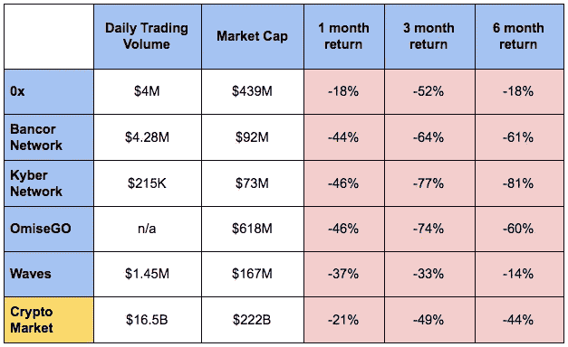

# 评估分散交易所的兴起。2

> 原文：<https://medium.com/coinmonks/evaluating-the-rise-of-decentralized-exchange-pt-2-a6dc7226f5a0?source=collection_archive---------8----------------------->

这是两部分分析的第二部分，评估分散交易所的价值和兴起； [*点击这里看第一部*](/@georgebeall/evaluating-the-rise-of-decentralized-exchange-pt-1-9883d76f4f38) *。本文件是对高风险资产的个人投资分析，不应被视为投资建议。本文档有来自* [*徐德立*](https://medium.com/u/2029f26ffab8?source=post_page-----a6dc7226f5a0--------------------------------) *和* [*狄龙陈*](https://medium.com/u/b1d8cbfdefbb?source=post_page-----a6dc7226f5a0--------------------------------) *的反馈和编辑。*

在第一部分中，我们讨论了交换需求、集中式交换的问题，以及分散式交换的好处和潜在问题。第二部分将涵盖:

*   该领域的顶级项目
*   当前的行业瓶颈
*   我们的市场前景

# **现有最大项目**

目前有许多不同的项目在处理分散式 exchange 用例；以下是最大的和/或最有希望的。

Technical development for top decentralized exchanges

## ***0x (ZRX)***

0x 通过为其他交换提供一个协议，或者如他们所称的“中继器”，来实现分散交换该协议允许中继者在“制造者”和“接受者”之间进行订单匹配，而中继者不需要控制资产。他们称之为“链上结算的链外订单传递”

该项目是各种分散交流项目中发展最快的项目之一。它于 2017 年推出，目前有 16 个基于其协议的不同部署的中继器。这些中继每天进行超过 10 万美元的 2M 交易。最近，比特币基地主要交易所收购了基于 0x 的分散交易平台 Paradex，证明了这些项目可以提供的直接价值。

0x 的好处之一是它们是一个允许适应性的相当简单的协议，并且团队在开发和添加项目功能方面有很好的记录。这有助于投资者清楚地了解他们的发展路线图，并相信他们能够实现每个目标。他们的路线图还显示了对该行业目前面临的主要问题的理解，并提供了克服这些问题的合理解决方案。

在他们的开发中，0x 开发了一个用于加密和交易 ERC-721 资产的协议，这些资产是不可替代的资产(即 Cryptokitties，它们都是唯一的)。该团队正在为 relayer API 添加功能，该 API 将允许 relayer 共享市场流动性，一个帮助用户通过 0x exchange 购买加密的浏览器插件，帮助 KYC/反洗钱和将不良行为者列入黑名单的 exchange 过滤器，以及一个防止抢先交易的时间加密。

## ***【班科网络(BNT)***

[Bancor Network](https://www.bancor.network/) 利用一个带有“智能令牌”的分散式系统，作为所有令牌的转换对。该系统允许增加市场流动性、一个定价对和即时交易。没有订单簿，而是 Bancor 公式商店在智能合同中销售订单，用于履行以后的销售订单。除了区块链所需的汽油之外，没有其他费用。

Bancor 不向消费者收取任何额外费用，并致力于创建优化代码，以减少以太坊燃气费。在 2018 年初的主要网络拥塞期间，Bancor 部署了代码[为用户](https://blog.bancor.network/how-bancor-dramatically-cut-ethereum-gas-costs-e674488faed3?gi=53151e3e369a)减少了超过 80%的费用。他们还利用加密时间签名创建了一个前端运行的解决方案，类似于 0x 描述的设计。此外，他们的交易所列出了 100 多个令牌，并且是 EOS 合作伙伴。

虽然 Bancor 作为交易所有各种各样的好处，如即时流动性、低费用、高质量的用户界面等。最近[发生了一起黑客事件](https://techcrunch.com/2018/07/10/bancor-loses-23-5m/)，恶意用户攻击了 Bancor 的一些流动性智能合约，窃取了数百万美元的资产。这一事件破坏了技术的质量和 Bancor 的品牌，导致使用量的合理减少。

dex 只有在安全设置的情况下才会比集中式交换更安全，因此关注协议质量和基础设施至关重要。任何导致消费者损失的 DEX 黑客事件都应该作为产品价值的主要负面指标。

## ***凯伯网络(KNC)***

Kyber Network 的分散式交易所生态系统运行在一个储备池系统上，而不是订单簿上。储备池与指定适当汇率的智能合约相结合，这使得交易可以立即完成，而不需要支付超过区块链要求的天然气费用。

2018 年 6 月初，Kyber 在他们的 [Kyber 2.0 活动](https://blog.kyber.network/kyber-network-2-0-the-worlds-decentralized-liquidity-network-792e170ebaa1)上宣布了品牌支点，公布了他们成为“令牌化世界的去中心化流动性网络”的计划。通过利用其不可信的流动性池系统和利用 4 个新的平台接口(KyberSwap、KyberDeveloper、KyberReserve 和 KyberGO)，Kyber 2.0 寻求为许多主要用户群体提供流动性，包括主流个人、项目、钱包提供商、基金、代币销售贡献者和拥有大量资产的代币持有者。

虽然完整的 Kyber Network 2.0 服务套件尚未完全推出，但 KyberSwap 和 KyberDeveloper 已于 7 月发布，并计划在第三季度发布 KyberGO，在第四季度发布 KyberReserve。他们的分散式 exchange mainnet 部署在以太坊网络上，目前列出了 39 种代币，日均交易量为 21.5 万美元。

Kyber 正通过与钱包提供商和代币项目的合作，积极扩大其用户群。Kyber Network 目前有 16 个分散的项目集成到他们的生态系统中，包括 MyEtherWallet 和 Request Network。Kyber 还致力于在其平台上提供点对点期权交易和分散式 KYC 合规。到目前为止，Kyber 团队已经按时完成了路线图中的所有里程碑，为剩余目标的及时交付做出了承诺。

展望未来，团队和投资者需要监控 Kyber 网络如何通过其链上储备池系统处理增加的流量、交易量和流动性要求。为了缓解这些担忧，Kyber 团队正在开发一种扩展解决方案 Gormos，与等离子体和当前分片解决方案相比，它的速度明显更快，可扩展性更强，预计将于 2019 年第三季度发布。

## ***【OMG】***

OmiseGO 是目前市值最高的分散交易项目。从 Omise 分离出来，Omise 是一家成熟的东南亚在线支付网关。OmiseGO 提供了一个平台，用于针对有或没有银行账户的个人进行分散的资产交换。OmiseGO 正在利用 Omise 的企业合作伙伴关系和以太坊网络来扩大其用户群，并有可能提供与传统支付网关的互操作性。

OmiseGO 的白标电子钱包允许个人用户和传统支付网关无缝地加入 OmiseGO 网络。OmiseGO 试图通过类似于 Bancor 和 Kyber 的智能合约网络提供资产无关的交换，允许用户将数字或法定货币兑换为不同的首选货币。持有本地 OMG 令牌的用户验证网络激励的交易，并且一旦达到验证阈值，交易就被清除。

OMG 未来成功的最大威胁是他们正在等待网络的全面部署。该平台的全面部署预计要到 2018 年底或 2019 年初，这将允许竞争 DEX 的市场份额增长，阻止投资者分析经过市场测试的产品，并导致令牌估值不植根于使用指标。

## ***【波浪】***

[Waves](https://wavesplatform.com/) 是一个平台，主要设计为新项目的替代发射工具，而不是硬叉、软叉和空投。这些新项目与 BTC、ETH 和 LTC 等其他更成熟的令牌一起被列入 Waves 分散式交易所，允许即时交易功能。

这种发行方式存在技术问题，而不是硬叉、软叉和空投的行业标准，以及行业是否会采用它。分叉/空投为项目提供了利用现有网络效果、开发者和矿工的能力，而 Waves 除了易于启动和可交换性之外，没有任何实质性的好处。

Waves exchange 在 2018 年 7 月全面推出后不久也遭到了黑客攻击。虽然这次攻击是通过他们的域名注册商实施的网络钓鱼计划的结果，因此基本上不受他们的控制，但这仍然凸显了他们的结构存在问题，因为损失是不可逆转的。Waves 的白皮书很少讨论该项目的技术功能，也没有讨论去中心化交易所面临的主要问题。

由于 Waves 没有明确阐述他们的技术，并且有过去的安全问题，他们目前是一个更加不确定的 DEX 项目。

Market data for top decentralized exchanges and blockchain market. 0x is one of the few that has fairly consistently outperformed the market.

# **市场前景**

对分散式交易所技术的评估清楚地表明，用户有需求，该技术在散户投资者中采用是可行的。目前的行业市值约为 2200 亿美元，日交易量不到 170 亿美元。*(数据来自*[*coinmarketcap.com*](https://coinmarketcap.com/)*截至 2018 年 8 月 8 日)。)*该技术的内在价值正在推动市场采用，甚至比特币基地等主要交易所也表现出了兴趣。

随着区块链市场的成熟，更多的市场交易量将来自机构投资者。由于股市中约 90%是机构投资者，长期来看，我们可以预计区块链散户投资者将占区块链交易量的 10%左右。鉴于并非所有的散户投资者都会从 DEX 中获益，DEX 应该会在未来两年内达到市场交易量的 1-4%左右。这意味着在 2 年内 DEX 的使用量将增长 5 到 20 倍。

基于技术发展，0x 是最复杂的项目，至少领先其他任何竞争项目几个月。此外，其既定的用户基础、稳定的增长率、不断扩大的项目列表以及历史表现和透明度使他们成为该领域的明确领导者。0x 也展示了高水平的安全性，而许多其他项目较少经过市场测试。

0x 目前的估值低于尚未上市的 OmiseGO，随着技术的进一步发展，0x 将成为一个增长机会。虽然 Kyber Network 和 OmiseGO 是有趣的技术，但它们都没有完全推出的交易所，并将在用户基础规模方面不断追赶。此外，这两个平台的长期功效仍存在技术问题。

然而，由于 dex 可能永远不会接受机构投资者的数量，对 dex 的投资应该与对高质量集中交易的投资相结合。此外，投资托管代理的机会将允许直接接触机构投资者市场份额的增长。我们个人允许投资组合中 15%的 dex 敞口，5%的集中交易投资。