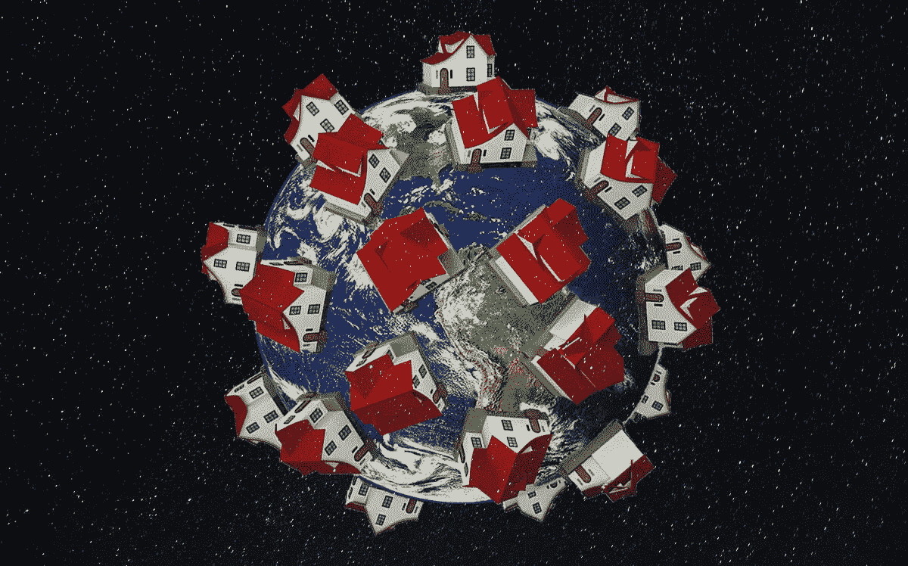
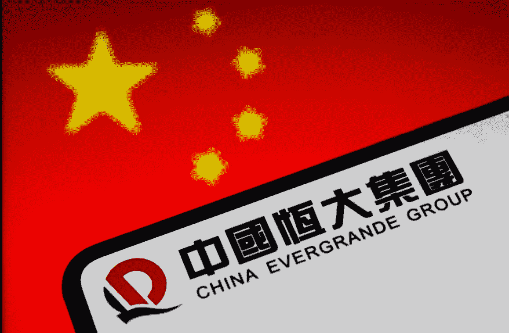
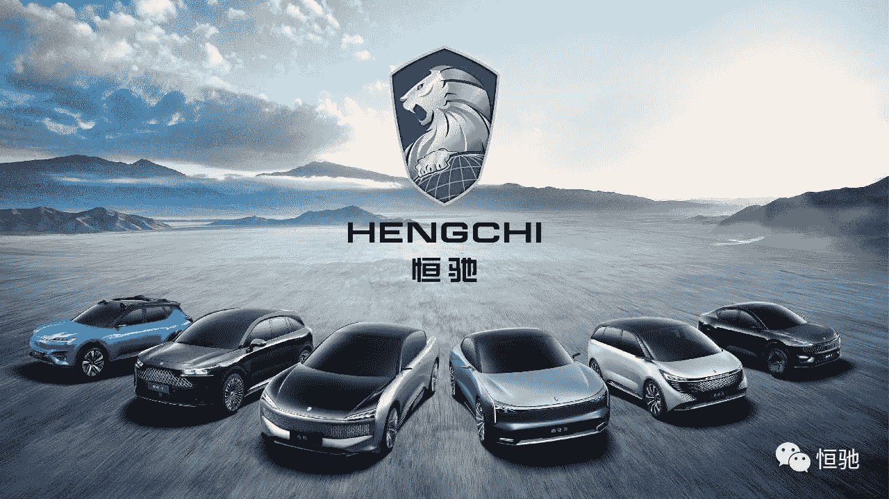
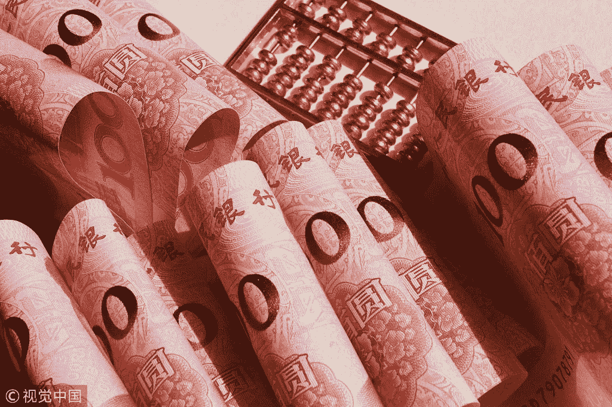
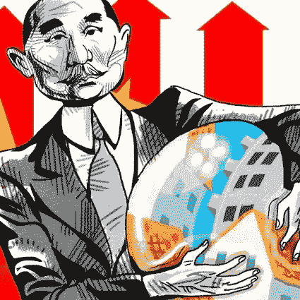
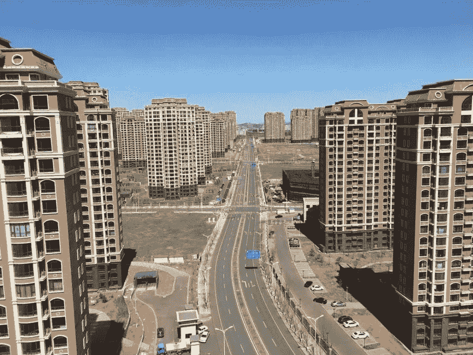
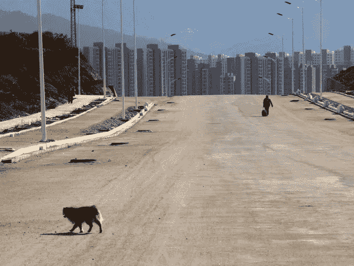
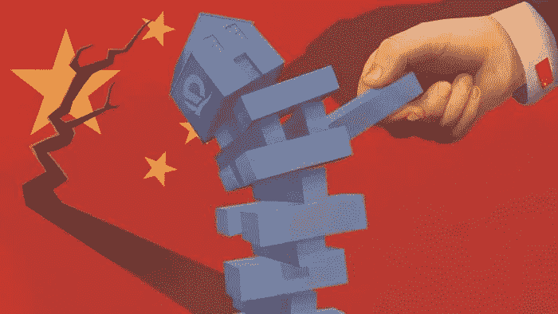
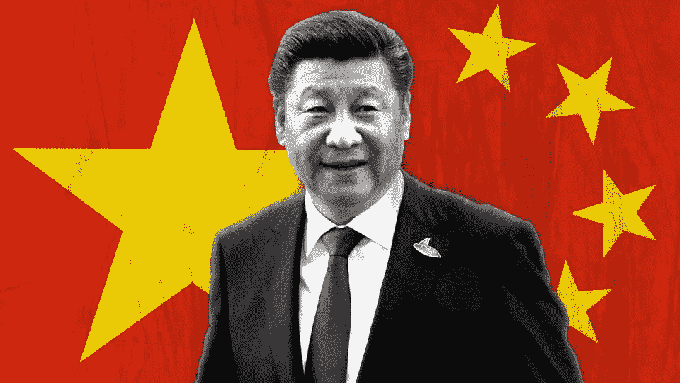

# 恒大:我们会吸取教训吗？

> 原文：<https://medium.com/coinmonks/evergrande-will-we-ever-learn-e3a0193fe41c?source=collection_archive---------1----------------------->

## 一个似乎从未吸取的教训

record High Prices in the housing market in the OECD countries — ownership of a ‘home’ is becoming a mirage?

正如我们在上一篇文章' ***中看到的，一个名为比特币*** '的故事([https://wire . insider finance . io/A-Tale-called-bit coin-58ec 764 ff 119](https://wire.insiderfinance.io/a-tale-called-bitcoin-58ec764ff119))在导致 2008 年金融危机的高潮中，经济的指数级增长往往与房地产市场*:*房屋*的扩张和发展密切相关*

*然而，在一个经济增长的时代，过度兴奋和盲目信任的危险结合，金融体系中高水平的杠杆和缺乏基本常识可能会带来挑战。*

*进入这个危险游戏的最新部分:*

## *一切欢迎**恒大**。*

# *多大才算大？*

**

***中国恒大集团**曾经是世界上最大的房地产公司。*

*该集团于 1996 年*在广州成立，创始人是中国亿万富翁**许家印**，粤语中又称为 ***许家印*** ，他曾是中国首富。**

**[*https://money . CNN . com/2017/10/12/news/economy/China-首富-胡润-list/index.html*](https://money.cnn.com/2017/10/12/news/economy/china-richest-man-hurun-list/index.html)**

> ***恒大代表了中国自由借贷和建设的时代，该公司是* ***全球 500 强*** *的一部分——这意味着它也是全球收入最高的企业之一。***

** [## 中国恒大集团| 2021 年世界 500 强

### 今年的全球 500 强创造了 31.7 万亿美元的收入和 1.65 万亿美元的利润。

fortune.com](https://fortune.com/company/china-evergrande-group/global500/) 

恒大去年的收入接近 780 亿美元，在中国 280 多个城市拥有数百个项目，雇佣超过 20 万人。

Hengchi 1 to Hengchi 6, photo credit: Hengchi

它的权力和影响力还扩展到汽车行业(有一个电动汽车制造部门)、游乐园&旅游、卫生部门和一支足球队。

几年来，它利用贷款和预售公寓来大举囤积土地和开发项目。一路走来，该公司向股东支付了数十亿美元的股息，包括过去三年向创始人、最大股东和董事长许家印支付的相当于超过*50 亿美元的股息*。** 

# **以利润的名义**

****

**购买房地产作为一种资产，一直被中国消费者视为安全可靠的投资，到目前为止一直如此。**

**许多中上层中国人继续购买第二套甚至第三套住房。随着对未来资产增值的预期，拥有房产 ***意味着在中国社会*** 更高的地位，并被视为一个人在结婚成家之前必须达到的*基准*。**

**在经济增长和繁荣时期，随着投资者看到健康的回报和官方 GDP 数字的上升，这种模式运行良好。**

**基于这些理念，恒大多年来利用贷款和预售公寓大举囤地和开发项目。**

****

**China housing bubble , illustration: Craig Stephens**

**一路走来，该公司向股东派发了数十亿美元的股息，其中包括相当于过去三年多**50 亿美元的创始人、最大股东，以及董事长*许家印。*****

# **龙的故事**

****

**去年，当疫情的封锁影响了几个月的房地产销售时，问题开始出现，并在去年秋天滚雪球般变成对现金短缺的担忧。**

**与此同时，中国打击房地产开发商通过限额借贷的努力阻止了该公司承担新的债务。**

**该公司面临着巨大的现金短缺，因此，今年夏天，它开始用未完工的公寓而不是钱来支付一些供应商。**

**近年来，作为降低金融风险和推广经济适用房的努力的一部分，中国对开发商实施了债务和土地购买限制以及数百项新规定。**

**新规包括将开发商的抵押贷款和信贷限制在银行贷款总额的 40%，并要求恒大等开发商在借入更多贷款之前偿还现有债务。**

**这是旨在对整个经济实施信贷纪律的更广泛运动的一部分，但在可能出现违约的情况下，这种政策的影响将是可怕的，考虑到近 70%的中国家庭财富被束缚在房地产上，价格暴跌将对整个社会产生冲击波。**

# **“鬼城”的兴起**

****

**Apartments in Ordos Kangbashi, image: Carla Hajjar**

**The building standards of Chinese apartments are notoriously low, but this isn’t a problem for most ***investors*** because many of them never plan on living in them in the first place.**

**High rise apartments and railroads were built, but the city failed to populate in its early years, leading to the appearance of the so-called ‘***Ghost Towns***’:**

****

**Chenggong in 2013 , image: VCG - Getty Images**

***building* *complex* built in such remote areas where the basic connection infrastructure hasn’t yet reached.**

# **The fact that shocks most first-time visitors to the country though is that the apparently empty apartments **ALL HAVE OWNERS**.**

# **WHERE ARE WE NOW?**

****

**House domino falling? — image: Ewan White**

**Evergrande has been scrambling to raise funds to pay its many lenders, suppliers, and investors, with regulators warning that its ***$305 billion*** of ***liabilities*** could spark broader risks to the country’s financial system if not stabilized.**

> *****$305 billion in liabilities equivalent to 2% of China’s gross domestic product (GDP)*****

**Other worries include the exposure of banks and the determination of regulators to press on with property market reforms despite hints of damaging consequences.**

**This storm is unfolding right in the main part of China’s President ***Xi Jinping***’s new ‘**COMMON PROSPERITY**’ campaign, which is attempting to correct the issue of widening social inequality access to affordable housing is a key component.**

****

**China’s President: Xi Jinping**

> ***The Chinese government has floated the idea of implementing a* ***nationwide residential property tax*** *to cool the housing market.***

## **Despite that, today, Evergrande represents the largest threat to the nation’s economic stability.**

**The company may be allowed to default on some bonds or bank loans, but Beijing probably has the capacity to prevent a total collapse. China’s relatively closed financial system, state-owned banks, and weak rule of law allow the government to stage-manage a restructuring to avoid a systemic meltdown.**

**Evergrande also owes new homes to the many individual buyers who paid in whole or part for homes that aren’t finished yet — and who may have borrowed to fund the purchases.**

**There is no doubt that besides the case of a potential default (despite being highly unlikely and deeply tied with money printing policies), the situation is causing a lot of social unrest and already a certain degree of financial burden: deeper and deeper wounds in the socio-economic tissue of an already fragmented and wealth-unequal society.**

****了解我们的新平台**👉**[**【https://thecapital.io/】**](https://thecapital.io/)****

****[https://twitter.com/thecapital_io](https://twitter.com/thecapital_io)****

> ****加入 Coinmonks [电报频道](https://t.me/coincodecap)和 [Youtube 频道](https://www.youtube.com/c/coinmonks/videos)了解加密交易和投资****

# ****另外，阅读****

*   ****[什么是保证金交易](https://coincodecap.com/margin-trading) | [美元成本平均法](https://coincodecap.com/dca)****
*   ****[支持卡审核](https://coincodecap.com/uphold-card-review) | [信任钱包 vs MetaMask](https://coincodecap.com/trust-wallet-vs-metamask)****
*   ****[Exness 回顾](https://coincodecap.com/exness-review)|[moon xbt Vs bit get Vs Bingbon](https://coincodecap.com/bingbon-vs-bitget-vs-moonxbt)****
*   ****[如何开始用加密贷款赚取被动收入](https://coincodecap.com/passive-income-crypto-lending)****
*   ****[BigONE 交易所评论](/coinmonks/bigone-exchange-review-64705d85a1d4) | [电网交易机器人](https://coincodecap.com/grid-trading)****