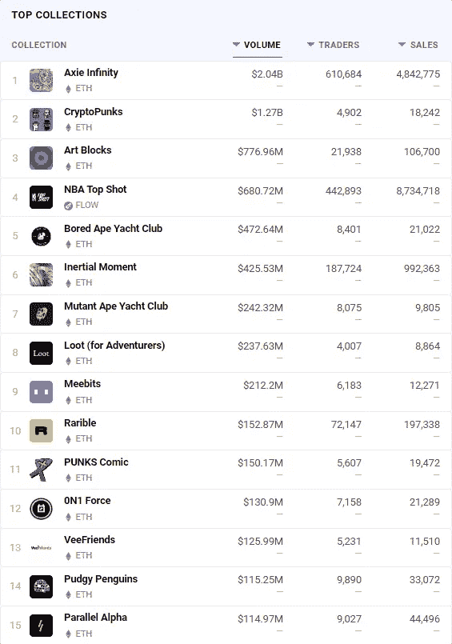
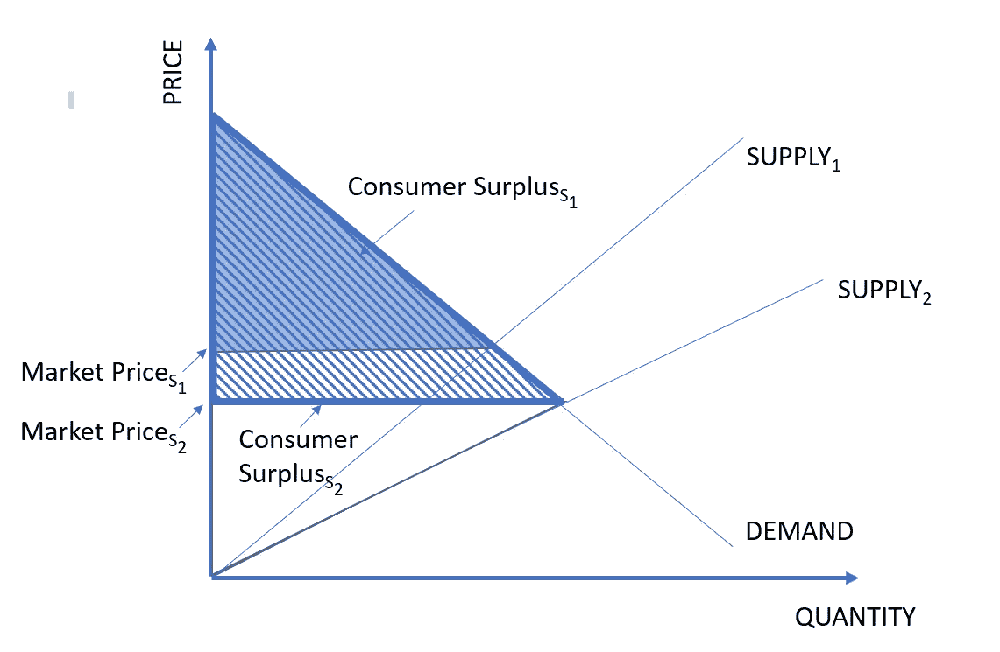

# 每个媒体公司都需要一个 NFT 战略——现在就要

> 原文：<https://medium.com/coinmonks/every-media-company-needs-an-nft-strategy-now-3a3399a08745?source=collection_archive---------0----------------------->

## NFT 不是艺术，它们是互联网的所有权层

Photo by [Omar Flores](https://unsplash.com/@__itsflores?utm_source=unsplash&utm_medium=referral&utm_content=creditCopyText) on [Unsplash](https://unsplash.com/s/photos/blockchain-lego?utm_source=unsplash&utm_medium=referral&utm_content=creditCopyText)

TL；博士:

*   最初，我和其他人一样对当前的 NFT 热持怀疑态度我不再是了。我现在强烈认为，NFT 不仅仅是一个东西，而且很可能会成为推动大量采用加密技术的杀手级应用*。*
*   关键是，NFT 不仅仅是数字收藏品，它们是互联网的“所有权层”。
*   流动性是一个很好的类比。1995 年，大多数人认为手机是可以让你离家打电话的设备。他们是。但是，移动性加上一系列额外的技术、生态系统、消费者行为和商业模式的结合导致了创新的爆炸，改变了地球上大多数人的生活方式。
*   与移动性一样，NFT 有潜力释放巨大的创新，所有这些都建立在可移植、可认证的数字产权的基础上。这在实践中意味着什么将需要数年时间才能变得清晰，但与媒体公司特别相关的 NFTs 效用的早期例子包括会员资格/独家访问/治理、即玩即赚游戏和虚拟世界(又名“元宇宙”)。
*   也像移动性一样，许多东西需要到位，但大规模采用的技术先决条件，包括新的扩展技术和无缝的平面到加密的开/关斜坡，正在迅速出现。
*   到目前为止，大多数传统媒体公司几乎没有参与 NFTs。除了 NBA Top Shot 之外，最成功的 NFT 应用程序都采用了 NFT 本地 IP(图 1)。这既反映了大型媒体的关注不足，也反映了加密社区支持分散化(和反建制)的风气，加密社区自然倾向于 NFT 本地/加密本地项目。
*   在这篇文章中，我认为 NFTs 对传统媒体公司来说代表了巨大的财务和战略机会。
*   金融机会似乎很容易用数十亿美元来衡量。从战略上来说，NFT 有可能让媒体公司重新获得失去的消费者剩余；去中介化占主导地位的互联网平台；涡轮增压风扇；为迅速发展的元宇宙提供一个立足点；并建立一座通向区块链媒体发行未来的桥梁。
*   对于大媒体来说，不作为的风险大于作为的风险。他们现在应该正在分配资源。

如果你把大部分时间花在 BAYC Discord 服务器上，关注跨链流动性或有一只叫 Vitalik 的虎斑猫，你就不是这篇文章的目标读者。但是如果你和我一样是一个普通人，对 NFT 事件的来龙去脉以及它对媒体公司的影响很感兴趣，希望它能启发你的思考。

**图一*。顶级 NFT 收藏***

资料来源:DappRadar

# (必修)什么是 NFT？(第节)*

*如果您已经知道答案，请随意跳过。

密码学是一门令人生畏的学科。在新兴技术(AI/ML、云计算、虚拟现实、“大(非结构化)数据”、5G、机器人、自动驾驶汽车，你能想到的)中，crypto 不一定更具技术性，但它很难用一句话来描述。

*   **自动驾驶汽车:**自动驾驶的汽车。
*   **AI/ML:** 可以自己学习的电脑。
*   **5G:** 高速无线技术。
*   **机器人学:**机器人做的事情。
*   **Crypto:** 具有内在经济激励的分散分类账。等等，让我重新开始。好的，首先你有一个在一堆计算机上复制的数据库，然后有一种方法来确保数据库保持一致，这种方法是通过这个令牌实现的…

它的移动速度也非常快。与局限于大学和企业实验室的技术不同，它是开源的，有一个非常大的、受经济激励的、几乎是福音派的社区，该社区正在不断开发新的协议和新的应用程序，并建立在旧的协议和应用程序之上。因此，很容易陷入困境，很难保持最新，即使对于那些全职专注于加密的人来说。这里是我试图提供足够的信息来理解 NFTs。

让我们从区块链的**开始。公共区块链有三个基本要素。**

*   **这是一个分布式分类账**，它只是指一个数据库，它在多台计算机(或“节点”)上有相同的副本。(比特币网络有大约 13000 个节点，以太坊有大约 3000 个。)这就是为什么区块链是分散的。任何一个节点(或者 10 个或 1，000 个)都可能发生故障，而数据库仍然存在。这些数据可以包括任何可以数字化的信息，包括可执行代码。
*   它有某种共识机制，使所有这些计算机能够就数据库的更改达成一致。共识机制旨在防止任何一方能够单方面改变数据库(尽管它不会阻止一些团体的尝试)。公共区块链通常被称为“不可信的”，因为它不需要信任一个集中的实体。(虽然信任仍然是必要的——只是转移到了网络和代码本身。)
*   **它有一个令牌**通常用于多种目的，例如为参与者(包括保持共识的节点)创造经济激励，确定网络的治理和/或提供一些其他效用，例如充当网络内货币。通常，这些代币或加密货币在交易所交易，这使得(相对)容易买卖它们，并将其交易为“法定”货币(即由主权国家支持的货币，如美元)或其他加密货币。

可互换的资产——如所有的法定货币和加密货币——是可互换的。相比之下，你可能会认为你的大部分财产是不可替代的**。可替代性是主观的，但你(很可能)不会对所有房子和你的房子，或者所有皮夹克和你的最爱无动于衷。**

**NFT 代表**不可替代的标志**。NFTs 的原始协议是为以太网而写的。(尽管如下所述，后来出现了支持非功能性测试的替代区块链。)该协议(ERC 721)规定每个 NFT 具有唯一的标识符，元数据记录在公共分类帐中，包括谁最初铸造了 NFT 以及谁拥有它。因此，真实性和所有权都是可独立公开验证的。就像你可以把汽车的所有权从一个城镇带到另一个城镇或者从一个州带到另一个州一样，你可以把你的 NFT 的所有权移植到任何能够读取账本的软件环境中。**

**NFT 可以与实物资产相关联，比如任何具有复杂供应链的东西，或者对其来源很重要的东西(比如这种对葡萄酒的努力或这种对奢侈品的努力)，但出于我们的目的，让我们坚持使用数字资产。这些可以是任何文件格式:文本、图像、视频、音频、编程代码或任何你能想象的专有格式，比如游戏中的物品。一个数字资产可能与一个 NFT 相关联，也可能被分割成一个限量版系列(例如，一个 NFT 是 100 个中的第 37 个)，就像一幅石版画。文件本身可以存储在区块链上，或者块中的元数据可以只记录文件的位置，例如指向服务器的 URL 或 IPFS 地址(这是一种在分布式基础上存储数据的方式，在许多节点上复制)。**

**一些区块链(如以太坊)的另一个重要属性是所谓的**。如前所述，任何数据都可以存储在区块链中，包括可执行代码，这被称为**智能合约**。这些智能合约是公共的，因此其他智能合约可以访问它们——这就是可组合性的含义。重要的是，开发人员可以在其他契约中构建和利用现有的功能。正如本文[的](https://lindajxie.com/2019/09/25/interoperability-and-composability-within-ethereum/)中所解释的，例如，游戏发行商可以将游戏中的物品铸造成 NFT，然后通过智能合约，进入现有的 NFT 市场，在不创建自己的市场的情况下实现这些 NFT 的交易。****

> ****那又怎样？NFT 的重要性在于，它们代表了第一种可验证的、可移植的、不可改变的方式来证明独特数字资产的所有权。****

****每当区块链出现时，一个很好的问题是:**这个用例需要它吗？理论上，你不会。中央权威机构可以向您颁发一个数字证书，该证书传达了唯一数字资产的所有权。但是这相对于 NFT 有一些(非常显著的)缺点:你将依赖于保持业务和/或不改变服务条款的实体；您的所有权可能是也可能不是可审计和可独立核实的；您可能无法将该所有权转让、出售或移植到其他地方；第三方开发者不太可能有同样的能力为你的资产所有权增加效用。******

# ****等等——拥有一辆 NFT 意味着什么？****

****NFTs 不断出现的一个关键问题是:**当你拥有一辆 NFT 时，你实际上*拥有什么*？许多人，尤其是媒体高管，需要考虑的一个核心观点是**视情况而定。因此，我们可能需要重新思考所有权的定义。****

****所有权已经是一个流动的概念，不管我们是否这样认为。一般来说，财产权包括消费和使用权、商业化和可转让性(包括出售、租赁、出租、贸易、易货、贷款、赠与或抵押的权利)以及其他权利(如改变或毁坏的能力)。但是“拥有”某样东西并不总是意味着你得到了所有这些权利。由于分区法，你可能不能在一块土地上随心所欲地建造任何东西；你不能想开多快就开多快；在某些情况下，如果你拥有的东西被认为具有文化意义，你甚至没有权利毁掉它。在媒体领域，产权分离很常见。例如，如果你“拥有”一张 DVD，你可以观看它，但不能复制、展示或以其他方式将其商业化。****

****这个问题不断出现的原因是，第一批 NFT 应用程序传递的权利非常有限。可收集的 NFT 的所有者通常不控制相关媒体的“消费”——任何人都可以随心所欲地剪切、粘贴和分发一张矮胖企鹅的 jpeg 图片。NFT 收藏品也可能包括或不包括潜在的版权。虽然无聊猿的所有者可以将他们的猿或衍生产品商业化，但 CryptoPunks 和 NBA Top Shot moments 的所有者却不能。那么，你得到了什么呢？在 NBA Top Shot 的情况下，你基本上获得了有限的转让权(你可以出售一段时间)和我们可以称之为灵活的权利，这意味着你可以证明你的所有权，而不是其他。来自 NBA 的顶级镜头[服务条款](https://nbatopshot.com/terms):****

> *****为清楚起见，您理解并同意:……(b)除非本条款中另有规定，否则您无权复制、分发或以其他方式商业化 App 材料的任何元素(包括但不限于任何艺术)……*****

****要记住的关键点是，非专利技术本身并不具有有限的权利，而是**非专利技术在拆分和分配产权方面具有几乎无限的灵活性**，因为这些权利可以通过智能合同精确地描述、执行和实施。对于一些可收集的 NFT 来说，所有权不会阻止其他人查看或分发相关文件的想法只是 NFT 固有灵活性的一个具体例子，由于它们是数字的，所以更加方便。所有有形资产都会随着时间的推移而退化，因此所有权和消费权是密不可分的。数字资产是无限可复制和无限可消费的，源文件没有任何退化。这使得将所有权和消费专有权分开成为可能。****

> ****对于媒体公司来说，理解定制 NFTs 所传达的权利以避免危及现有收入流是非常重要的。****

****在媒体中，从历史上看，权利或许可几乎总是意味着消费某物或将其商业化的权利。非关税壁垒不一定包括这些权利。对于没有预先存在的商业价值的新的 NFT 本土知识产权来说，这可能不是一个重要的区别，但对于有预先存在的商业价值的现有知识产权来说，这是至关重要的，因为这意味着可以定制 NFTs 以避免危及现有的收入流。****

# ****理解价值的起点:作为数字艺术的 NFTs****

****在考虑了一些最受欢迎的 NFT 藏品所传达的相对有限的权利——以及它们的交易价格之后，下一个合乎逻辑的问题是:**为什么会有人想要一个？**这是个公平的问题。从表面上看，任何人都愿意支付数百万美元来证明他们拥有一个数字文件，但不一定拥有商业化或控制该文件消费的权利，这似乎是荒谬的。****

****理解 NFT 的吸引力的最简单的起点是将它们视为艺术的数字版本或任何其他种类的收藏品(重点是*起点*，原因如下所述)。所有商品都包含一些功能和情感价值的组合。任何人都想拥有一件 NFT 收藏品的原因和任何人都想拥有任何收藏品的原因是一样的，主要是受情感价值的驱动:****

******吹牛的权利******

****地位是艺术情感价值的重要组成部分。为什么有人会拥有一幅毕加索的画、一幅德·库宁的画或者一条悬浮在甲醛中的死鲨鱼？(或者，就此而言，任何奢侈品？)显然，对所有者而言，价值的一个关键部分是商品传达了关于他或她的地位的信息。****

****一件商品的所有权只向那些知道内情的人表明地位。今天，NFT 只向相对较小的密码爱好者群体传达身份。但是，随着 NFTs 变得越来越主流，社区的规模以及“地位价值”只会增长。另外，炫耀你的 NFT 比你的死鲨鱼容易多了。自豪的 CryptoPunks 拥有者将它们作为他们的 Twitter 个人资料图片。已经可以使用你的 NFTs 来装饰你家的墙壁或虚拟世界中的公共空间，如沙盒和分散地，如图所示[这里](https://www.youtube.com/watch?v=5bglDDuVV6w)和[这里](https://docs.decentraland.org/builder/nfts/)。随着时间的推移，人们在他们的社交媒体个人资料中包含他们的画廊(或其链接)可能会变得很常见。****

******粉丝圈******

****情感价值的其他关键组成部分是**自我表达**和**社区**。几年前，咨询公司 Troika 出版了《粉丝的力量》,报告称 78%的人认为自己是某样东西的“粉丝”,其中 49%的人认为自己是“最狂热的粉丝”该粉丝群体可以针对职业或业余运动队、特定运动员、运动(作为观众或参与者)、音乐家、音乐流派、电视节目、节目中的特定人物、演员、艺术家、电影、电影特许经营商、电影导演、视频游戏、视频游戏发行商、视频游戏特许经营商、数字发行商、个人创作者、时装设计师、建筑师、作家、记者、电视网络、消费品(尤其是奢侈品)品牌、汽车、商业人物、甚至技术。人们对什么事情充满激情几乎没有限制。互联网，以及随之而来的信息获取和围绕共同爱好形成社区的能力的爆炸，助长了这种狂热。可能没有理由离题进入粉丝心理；受粉丝启发的纹身的流行说明了很多问题。对许多人来说，他们认为粉丝是他们身份的重要组成部分。****

******光顾******

****仁慈是情感价值的另一个可能的组成部分。有时候粉丝就是想支持自己喜欢的艺人。对于他们认为会变得更受欢迎的新兴艺术家来说尤其如此。这就把我们带到了…****

******猜测******

****这是艺术的关键功能价值。因为非艺术珍品可以出售，就像任何收藏品一样，一个人可能想拥有一件，只是作为一个赌注，其他人将来会愿意花更多的钱买它。****

****Either this essay or this tweet will not age well.****

# ****不仅仅是艺术:互联网的所有权层****

****如今，拥有加密货币的人相对较少。估计范围从 [8%](https://www.coininsider.com/survey-8-percent-of-americans-want-to-buy-cryptocurrency/) 到 [23%](https://www.finder.com/how-many-people-own-cryptocurrency) ，尽管后者看起来非常高(截至 2019 年，不到 [20%的美国家庭直接持有股票](https://www.federalreserve.gov/econres/scfindex.htm))。普通人不太可能关心比特币是不是一种价值储存手段，或者是不是金融服务的替代市场。相比之下，随着 NFT 的效用越来越清晰，它们可能会成为推动大量加密应用的杀手级应用。****

****为了理解这种潜力，有必要超越“NFTs 作为数字艺术”的类比。NFT 不仅仅是数字收藏品，它们是互联网的“所有权层”。****

****现在很难理解这意味着什么。上面，我在 NFTs 和移动性之间做了类比。二十年前，很难从概念上理解“在口袋里装一台联网的超级计算机”意味着什么。许多新技术、生态系统、消费者行为和商业模式必须到位。(没有智能手机，没有应用程序，没有 4G，手机里没有 GPS，没有人习惯爬进陌生人的车里，没有人会预测到 2001 年的优步。)对于 NFTs 来说，类似的问题是“我能用可移植的、可验证的数字所有权做什么？”或者，换句话说，“随着技术、生态系统、消费者行为和商业模式的发展，拥有产权的独特数字产品的功能效用会是什么？”****

****现在还为时尚早，这在实践中意味着什么将在几年后变得更加清晰，如果不是几十年的话。但这里有几个与媒体公司特别相关的早期应用:****

****独家访问/会员资格/影响力****

****官方粉丝俱乐部已经存在了几十年，它们提供某种类型的独家或早期内容访问、现场表演甚至是名人/创作者本人。更现代的版本是 Patreon。根据 Graphtreon 的数据，Patreon 拥有 20 万名创作者，他们总共拥有近 1300 万名顾客。只要按月付费，这些赞助人就能获得好处，比如早期或独家访问内容，访问社区 Discord 服务器，与创作者一起参与问答，个性化的呐喊，甚至可能参与到创作过程中。“货币化独家”的另一个版本是 Cameo，它去年向[出售了 130 万个名人的个性化视频，比前一年增长了 350%。](https://cameoblog.medium.com/celebrating-a-blockbuster-2020-expanded-c-suite-b66ccb0d561d)****

****显而易见，知识产权持有者和创造者如何为 NFT 所有者提供这些好处，尽管伴随着产权而来的是额外的效用，最重要的是可销售性。Socios 与职业运动队(目前主要是欧洲足球俱乐部)合作，创造[球迷代币](https://www.socios.com/fan-tokens/)，代币持有者可以影响球队决策，并独家获得体验和商品。据报道，刚刚从巴塞罗那转会到巴黎圣日耳曼的莱昂内尔·梅西正在以巴黎圣日耳曼球迷代币的形式领取他的部分[报酬。同样，拥有一只无聊的猿类 NFT 就像一张会员卡，可以打开会员专用的留言板和商品。](https://www.reuters.com/lifestyle/sports/exclusive-messis-paris-st-germain-package-includes-crypto-fan-tokens-2021-08-12/)****

****一个说明性的(如果有点极端的话)例子是最新的《列昂之王》专辑，《当你看到你自己的时候》(T0)，这是它在二月份作为 NFTs(T3)的合集在[发行的。它在流媒体服务和数字下载上提供了这张专辑，但它也销售了 6500 张 NFT，其中包括数字下载和限量版黑胶印刷。更有趣的是，它出售了六张“黄金门票”NFT，保证每位所有者在每次巡回演唱会期间获得四张前排门票，终身享受一名司机、一名礼宾、与乐队的预先时间和商品。此次拍卖筹集了约 220 万美元，其中最高价的金券拍出了 15.7 万美元。(从那以后，在我写这篇文章的时候，《金票:强盗 2》已经卖到 30 万美元左右。)而这一切都是在 ETH 进行的，限制了可寻址市场。](https://www.rollingstone.com/pro/news/kings-of-leon-when-you-see-yourself-album-nft-crypto-1135192/)****

******玩即赚游戏******

****如果你是一个游戏玩家，或者家里有游戏玩家，你会直接知道游戏玩家在堡垒之夜、国际足联、英雄联盟、GTA、Roblox 等游戏上投入了大量的时间和金钱。，升级和购买游戏中的资产，如特定的运动员，皮肤，武器和车辆。但最终所有这些价值都滞留在游戏中——当你进入下一个游戏时，这些都是沉没成本。你也知道早期发现一个游戏的价值是有限的，除了吹牛的权利。****

****相比之下，玩赚游戏根据玩家花费的时间和技能来奖励玩家，随着游戏变得越来越受欢迎，早期玩家也可以受益。Axie Infinity 是一款基于区块链的游戏，玩家可以繁殖、交易和战斗 Axie(口袋妖怪类型的角色)，每个 axie 都是独一无二的，被铸造为 NFT，以赚取可兑换为法定货币的代币。该平台拥有近 100 万 dau，预计今年将为 T2 带来 10 亿美元的收入。这里的[是一个伟大的深度挖掘——但最引人注目的是，据报道，在菲律宾，人们已经辞职去玩这个游戏，因为这个游戏更有利可图。Zed Run](https://www.notboring.co/p/infinity-revenue-infinity-possibilities) 是一个类似的(甚至更容易掌握的)想法，但用于赛马。Sorare 是一款梦幻足球游戏，玩家可以收集限量版和独特的球员卡(当然是可以出售的)，组建梦幻球队并赢得 ETH。这个领域正在爆炸式增长，仅在过去几个月里，就有数十款新的 RPG、纸牌交易、赛车、策略和益智游戏推出。****

****像 Axie Infinity 这样的游戏是否能够维持对游戏玩家如此有吸引力的经济效益，将取决于他们是否能够从游戏之外吸引收入(如广告、赞助、许可等)。).否则，随着用户增长放缓，普通游戏玩家只会拿出她投入的东西。即便如此，传统游戏发行商理应保持高度警惕。一旦游戏玩家听说他们可以通过玩游戏赚钱(或至少部分收回)并在游戏中建立资产价值，发行商可能会被迫做出回应。他们或许在技术上能够做到这一点，但由于 P2E 博彩的前提是大部分价值与玩家分享，这不仅仅是一个技术挑战，而是一种根本不同的商业模式。****

******元宇宙******

****正如产权是现代经济的基础一样，要让“元宇宙”发展成为一个全面运转的经济体，就需要所有权。什么的所有权？身份，头像，土地，载具，武器，盔甲，魔法神器(为什么不呢？)，NPC(非玩家角色，不管是不是人形)，服装和配饰，美术，原材料，库存，商家，谁知道还有什么。此外，虽然一些企业巨头，如脸书，可能希望元宇宙演变成一个封闭的系统(带有从 *Ready Player One* 创新在线行业的邪恶回声)，鉴于[对 Web 2.0 期间出现的大规模集中式平台越来越不信任](https://advocacy.consumerreports.org/press_release/consumer-reports-survey-finds-that-most-americans-support-government-regulation-of-online-platforms/)，将有许多力量反对这种重复出现。一个开放的、可互操作的元宇宙将要求所有权在它们之间是可独立验证和可移植的。NFT 看起来是最有可能实现这一目标的方法，如果不是唯一的方法的话。****

****显然，密码爱好者愿意为头像和虚拟商品支付真金白银。Meebits 是 NFT 的一个集合，专门用来作为虚拟世界中的化身。截至本文撰写之时，[顶级米比特](https://dappradar.com/ethereum/collectibles/meebits)售价为 270 万美元。最流行的虚拟世界，如上面提到的沙盒和分散土地，使用户能够购买和开发虚拟土地。在这两种情况下，地块的数量是固定的，因此土地是稀缺的，所有者可以使用游戏内开发工具通过举办活动和游戏或出租或出售财产来货币化他们的财产。6 月，一家“数字房地产公司”以将近 100 万美元的价格购买了分散土地上的 259 块土地。****

****这个活动会成为主流吗？已经是了。以堡垒之夜为例。基本上，堡垒之夜的所有收入都来自玩家购买 V-bucks，他们只用来购买化妆品，如服装、镐、滑翔机和表情(舞蹈)。换句话说，堡垒之夜不是一个“付钱才能赢”的游戏；不能用 V-bucks 来提高胜算。如此处[所示](https://s3.documentcloud.org/documents/20696836/epic-apple-trial-epic-games-exhibit.pdf)，在 2018 年，在其受欢迎程度最高的时候，Epic 通过将其 22%的月活跃用户转化为付费玩家创造了 55 亿美元的收入，这些玩家平均每月花费近 32 美元——只是为了在游戏中看起来很酷。****

> ****游戏玩家已经在只具有装饰价值的虚拟商品上花了很多钱。****

****下一步是什么？****

****对于拥有数字产权意味着什么，我们仍然只是略知皮毛。由于可组合性，如上所述，NFTs 中的创新可能会比 Web 2.0 中发生的更快，因为第三方开发人员将能够很容易地将实用程序附加到 NFTs 上。****

****[Loot](https://techcrunch.com/2021/09/03/loot-games-the-crypto-world/) 是最近 NFT 掉落的一个物品，只是某个未描绘的幻想世界的一个独特物品列表。这听起来可能不那么令人兴奋，但它颠覆了 NFT 的整个概念；它没有将 IP 转换成 NFT，而是创造了要求社区创建 IP 的 NFTs。看看[带电粒子](https://charged.fi/) (h/t 到 [Lou Kerner](https://medium.com/u/b01056393401?source=post_page-----3a3399a08745--------------------------------) )，它正在寻求给 NFTs 带来 DeFi。它开发了一个协议，使用户能够将其他令牌嵌入 NFT(包括其他 NFT)，可能的应用包括出租、出借、抵押 NFT 或创建一篮子 NFT 的“指数基金”。或者阅读这篇关于智能 NFT 或 iNFTs 的惊人的[帖子](https://andrewsteinwold.substack.com/p/ai-nfts-what-is-an-inft-)，它们在代码中嵌入了 GPT-3 提示，因此看起来很智能，可以与人类或彼此互动。****

# ****什么需要到位？****

****要使这一切在大规模上可行，还需要克服一些关键的技术障碍。深入探究这一问题超出了本文的范围，但简短的回答是，这些障碍下降的速度比许多人预期的要快。****

******缩放问题正在解决******

****由于以太坊是第一个为 NFTs 建立协议的区块链，所以直到最近大多数 NFT 交易都在以太坊进行也就不足为奇了。但由于其(当前)共识机制的性质，它有几个内在的扩展挑战。首先，目前以太坊每秒只能处理 15-20 次交易。其次，交易结算可能需要 15 秒或更长时间。第三，以太坊可以根据网络拥塞情况收取相对较高的交易费或“汽油费”——今年春天，这些费用飙升至每笔交易 50 美元。如果你正在交易 3000 美元以上的 ETH，或者偶尔出售一个 Beeple 或一个 CryptoPunk 数百万美元，这些限制是没问题的，但当你在 NBA Top Shot 上交易 10 美元或在区块链的游戏中每天创造数千或数十万 NFT 时，这些限制就不起作用了。****

****虽然加密社区多年来一直专注于扩展，但随着 DeFi 应用程序和 NFT 在过去一年中的普及，更多的资源已经投入到解决这些挑战中。这些努力可以分为几类:****

*   ******第 2 层解决方案:**这些技术解决方案受益于以太坊的安全性和网络效应，但也通过将一些功能移出链来减少“主网”(即以太坊网络)上的负载。例如，可以容纳约 2，000 tps 的 rollups 在链外聚合和执行事务，然后将聚合事务的证据发送回 mainnet。****
*   ******侧链:**侧链类似于第 2 层解决方案，因为它们也在主网之外进行交易，但不同之处在于它们有自己的共识机制，因此有一个额外的安全层。其中最流行的是 Polygon，它现在支持超过 400 种加密应用程序(或 Dapps)。据报道，它已经在一个侧链上处理[7000 TPS，理论上可以支持 65000 TPS](https://www.xdaichain.com/about-xdai/news-and-information/comparisons/matic)。****
*   ****替代区块链:一些开发者已经决定完全避开以太坊，部署与之竞争的第 1 层区块链。尽管最近出现了一些成长的烦恼，但其中最有前途的一个是 [Solana](https://solana.com/) ，它使用一种不同的共识机制，使其能够支持多达 50，000 tps，每笔交易的成本为 0.00025 美元。它目前还支持 400 多个区块链项目。其他包括雪崩，币安智能链和泰拉。其他几个人已经创建了专门为 NFTs 构建的区块链，如 Flow(由 NBA Top Shot 的母公司 Dapper Labs 创建)，其目标是以每笔交易几分之一的成本实现 1 万笔交易。****
*   ******以太坊 2.0。**以太坊目前正在进行升级，旨在增强安全性和可扩展性，其中最重要的部分是共识机制的变化。据报道，在完全实施后，它将实现 100，000 tps。****

******越来越容易“抽象出密码”******

****尽管参与的人相对较少，但 NFTs 受到了如此多的关注，这一点令人瞩目。如果你在 crypto Twitter 上交易，似乎每个人都拥有加密货币，但根据上述调查，今天可能只有 2-6%的美国成年人拥有 ETH。而且，在许多情况下，你需要拥有 ETH(并通过非托管钱包管理你的资产)，才能购买 NFT 或玩基于区块链的游戏。****

****通过让人们只需输入他们的信用卡号码来减少消费者的摩擦，可以极大地扩大 NFT 应用程序的市场。这一障碍也在下降，这要感谢一些公司致力于创建一个无缝的菲亚特到加密的桥梁。与 Circle 合作，Dapper Labs 允许使用信用卡购买 NBA 顶级投篮时刻，并提供 Dapper wallet，以便在第三方平台(如 OpenSea)上实现这一功能。其他公司，如 Wyre(Lou Kerner 的另一个 h/t)甚至更进一步，提供 API，使 Dapps 能够直接接受信用卡，将加密-菲亚特转换进一步推向后台。****

****这些早期的努力可能会遇到一些小问题——例如，NBA Top Shot 有一些广为人知的问题，使人们能够快速将资金转移回他们的银行账户——但随着时间的推移，没有技术原因不会变得更顺利。****

# ****对于媒体公司来说，NFT 可能是一个巨大的金融机会…****

****在 crypto 中有很多激烈的争论，但统一的哲学基础是，去中心化将颠覆现有的权力结构。毫不奇怪，社区已经被 NFT 本地/加密本地 IP 所吸引。许多人认为 NFTs 是赋予创作者阶层权力的工具，使他们能够打破收取高额租金的中央平台的束缚，调解创作者和粉丝之间的关系。****

****尽管如此，我相信下一个 1 亿 NFT 用户更有可能被知名电影、电视、音乐和体育明星以及特许经营权所吸引，而不是被朋克、猩猩或摇滚所吸引。为了获利，每家媒体公司都应该马上制定出 NFT 战略。部分原因只是钱。****

******光是收藏的机会就很大******

****很难估计潜在市场的规模，但以下几个数据点表明，NFT 娱乐收藏品市场很容易以数十亿计:****

*   ****据《T4》报道，除了老爷车，全球收藏品市场每年超过 2000 亿美元。****
*   ****据 collectibles 称，仅体育收藏品市场估计每年就超过 50 亿美元。****
*   ****根据 DappRadar 的数据，2021 年上半年，NFT 的总销售额(横跨几个区块链)总计约为 25 亿美元(包括一级和二级市场销售额)。****
*   ****在一波“NFT 泡沫破灭”之后，像[这个](https://www.surfacemag.com/articles/nft-market-bubble-crash/)、[这个](https://www.highsnobiety.com/p/nft-bubble-burst/)和[这个](https://protos.com/nft-market-bubble-popped-crypto-collectibles-are-over/)，市场似乎又回到了[这个](https://decrypt.co/77501/nft-market-roaring-back-ethereum-rises)，主要收藏品的价格和市场上的交易量(如 OpenSea 和 Rarible)最近都在飙升。****
*   ****5 月，NBA Top Shot 母公司 Dapper Labs 的首席执行官披露[去年一级和二级市场销售额为 7 亿美元，每天有 15 万到 20 万用户登录](https://www.coindesk.com/dapper-labs-nba-top-shot-has-crossed-the-million-user-mark)。(请注意，这些数据是在我刚刚提到的 DappRadar 图中捕获的。)记住 NBA Top Shot 只发布了' 19-'20 和' 20-'21 赛季的瞬间。“流感”比赛中的乔丹，耸肩，对黄玉荣的投篮，闭眼罚球，他在哪里？科比？雷吉·米勒在 9 秒内得了 8 分？新秀勒布朗？菜鸟斯蒂芬？菜鸟卢卡？沙克和巴克利？克莱德·弗雷泽？威尔特·张伯伦？卡里姆。鸟？即使达里尔·道金斯打破了一两个篮板？NBA 和 Dapper Labs 应该明智地发布这种时刻，但如果两个奇怪的赛季已经有 7 亿美元的销售收入，这就给人一种潜力的感觉。****
*   ****媒体公司正在凭空创造 IP。今年 3 月，Bleacher Report 拍卖了由 2Chainz、Quavo、Lil Baby 和 Jack Harlow 设计的限量版篮球，价格为 80 万美元。整个努力花了[几天](https://www.sportico.com/business/media/2021/bleacher-reports-first-nft-1234624553/)。如果这有价值，那么现有库的价值是什么？****

****有了这些数据作为背景，考虑媒体公司在这里的广泛可能性几乎令人难以置信，即使只是 NFT 收藏品的简单应用。想想迪士尼图书馆最具标志性的时刻。汽船威利号的第一批图像有什么价值？还是灰姑娘把脚伸进玻璃鞋的那一刻？有人愿意出多少钱来拥有达斯·维德透露自己是卢克父亲的那一刻？或者当灭霸打响指的时候？还是 *Up* 的开场？或者特洛伊·波顿和加布里埃拉·蒙特兹初吻的时候？****

****但这些只是显而易见的。真正的超级粉丝会愿意深入暗箱——部分是作为一种表明他们粉丝深度的方式。例如，我儿子是《办公室》的超级粉丝。如果 NBCU 把办公室(T2)切成小块，我们会抵押他几年的零花钱来竞标凯文(T4)带着他的辣椒(T5)去工作的冷场，或者加布骄傲地宣布他的中间名是苏珊的时候。大多数主要媒体公司都有庞大的图书馆，如果考虑周到，可以挖掘多年。****

> ****大多数主要媒体公司都有庞大的图书馆，如果考虑周到，可以挖掘多年。****

******收藏品只是一个开始******

****收藏品的想法是一阶思维。暂时，让我们忽略一个难以忽视的事实，即大多数媒体公司对游戏的尝试都是灾难性的。把收藏、社区、便携性和游戏结合起来，你能做什么——尤其是对于有着丰富神话色彩的 IP？想想华纳兄弟可以用哈利波特做什么。一滴哈利波特 NFTs，特点是不同的人物在不同的发展点(哈利在不同的年龄；伏地魔(汤姆·里德尔，在他回归权力的不同阶段)和人工制品(斗篷，魔杖，魂器，邓布利多办公室的冥想盆，等等。等。).现在想象一下，你可以将这些化身和神器移植到多个世界。现在想象一个哈利波特世界，游戏在其中发生，有公共和私人财产，商业和战争？MCU？DC？LOTR？明白了吗？可能性是巨大的。****

# ****…而战略理由可能更为重要****

****钻研非功能性金融交易的战略原因可能比潜在的金融意外之财更重要。****

******NFT 重新引入媒体稀缺******

****过去 20 年来，传统媒体最大的问题，一言以蔽之，就是*丰富*。一系列相关的颠覆性技术——数字化、网络化和移动化——打破了分发和创作内容的门槛。虽然内容曾经相对稀缺，因此管理这些内容的价值相对较低，但今天内容丰富，管理却很少。这给内容权利所有者带来了两个大问题:1)内容贬值；以及 2)监管的重估和控制监管的异常强大的平台的崛起。NFTs 有助于缓解这两个问题。****

****1.NFT 是弥补消费者剩余损失的工具。在之前，我已经写过关于消费者剩余[的文章。根据定义，对于每一种需求曲线向下倾斜的商品，都会有人支付高于市场价的价格。消费者剩余是以市场出清价格产生的收入与如果每个人都支付他们愿意支付的价格所产生的总收入之间的差额。](/@dougshapiro/getting-creators-paid-is-the-next-big-thing-in-media-8d5e88bc7895)****

******图二*。当价格下降时，消费者剩余增加*******

********

****在媒体领域，消费者剩余在过去 20 年里一直在上升，价值从媒体公司转移到消费者手中。这部分是因为价格已经下降(图 2)。例如，在印刷业，今天许多曾经订阅报纸或杂志的人只是免费获取信息。在付费电视领域，曾经每月支付 80 美元或 100 美元购买付费电视套餐的消费者，现在正以每月不到一半的价格，用一些流媒体服务的虚拟捆绑包来替代。****

****与此同时，由于流媒体的出现，通过价格歧视模式榨取消费者剩余的传统方式——对不同的人收取不同的价格——已经变得无效。在音乐领域，曾经购买单曲和专辑的消费者现在可以从 Spotify 或 Apple music 获得“吃到饱”的服务。电影业过去常常通过窗口化榨取消费者剩余(消费者支付一个价格在影院看电影，几个月后支付另一个价格购买 DVD，几个月后又支付另一个价格在 HBO 观看，等等。).随着流媒体服务的普及，这些窗口正在消失。****

****对版权所有者来说，解决这个问题的一个办法是创造衍生产品卖给狂热的粉丝。但这说起来容易做起来难。当我在特纳工作时，我(短暂地)负责创建一个集中的“360 度”货币化小组，帮助我们的有线电视网络在活动、商品和游戏等领域开发新的业务线。但这些并不是大多数媒体公司的核心竞争力，并构成了重大挑战。事件难以衡量；商品只产生很少的版税，并且需要密切监督产品质量；成功的游戏需要引人入胜的游戏性。NFT 是一个更加有机的产品扩展。****

> ****NFT 使版权所有者能够以更高的价格向最狂热的粉丝出售稀缺的衍生产品，夺回部分消费者剩余。****

****2). **NFTs 可以使脱媒者脱媒。许多最大的 Web 2.0 平台脱颖而出，因为网络效应使它们成为管理几乎无限信息的特定方法的最佳选择。谷歌是通过算法管理信息的最佳方式。脸书、Linked In、Pinterest 和 Twitter 分别是将策展外包给你的朋友、专业网络、喜爱的时尚人士和选定的专家小组的最佳方式。所有这些平台，以及其他类似的平台，可以帮助你从几乎无限多的干草堆中挑选出稀有的针。******

****然而，由于 NFT 与独特的数字资产相关联，它们本身就很稀缺，因此监管的价值要小得多。因为 NFT 是公开可审计的，所以它们不会被封闭系统所束缚。对于一个实体来说，将自己确立为交易、展示或以其他方式管理非物质文化遗产的主导平台要困难得多。不是不可能，只是可能性比较小。****

******NFTs 可以增加粉丝数量******

****NFT 不仅仅是一种将粉丝群体货币化的机制，它们还可以增强粉丝群体。因为 NFT 是可出售的资产，他们为粉丝提供了品牌或 IP 成功的财务利益。给粉丝经济上的激励会让他们变成更热情的传道者。****

******NFT 在元宇宙立足******

****Ready Player One 有着惊人的先见之明，描绘了一个现实世界由于气候变化而变得越来越不适合居住的未来，以及大部分人口将大部分时间花在网络上。有一个地方可能没有被证明是有先见之明的，那就是小说中虚构的绿洲中的大多数虚拟世界都是基于作者年轻时的流行书籍、电视节目、电影和音乐。事实上，到目前为止，早期的元宇宙正被全新的知识产权所主导。媒体公司现在应该努力确保他们的知识产权最终在元宇宙和在“真实”世界一样突出。****

******区块链可能是媒体分发的(一部分)未来******

****这听起来可能有点离谱，但请耐心听我说。出于某些原因，区块链可能在未来的媒体发行中扮演重要角色，而 NFTs 可能是桥梁。****

****1).**区块链可以商品化分发，一劳永逸。**在大多数媒体中，内容和发行之间一直存在讨价还价的斗争。正如萨姆纳·雷德斯通在他的新英格兰口音中常说的，“内容为王”他的意思是，由于内容是一种高度差异化的产品，通常具有强大的消费者品牌，因此它占据上风——除非分销商变得足够主导。因此，内容所有者不断努力使发行商商品化，发行商不断努力建立准垄断。在互联网出现之前，分销商很难建立垄断地位。即使在付费电视这个资本最密集的分销行业(因此最有可能成为自然垄断)，卫星电视、电信提供商和偶尔出现的过度建设也能抑制现有的有线电视系统运营商。互联网以及具有难以置信的强大网络效应的多边平台的出现，以前所未有的力量推动了分销商的崛起，从而改变了这一局面。****

*   ****在报纸上，这场战斗已经输给了看门人。大多数印刷媒体严重依赖社交媒体，尤其是脸书，因为他们的大部分流量。去年，脸书创造了 350 亿美元的国内广告收入，远远超过所有报纸、杂志和数字出版商的总和。****
*   ****电视网岌岌可危。他们愚蠢地向网飞授予独家权利，使其成为最大的流媒体提供商，这为网飞创造了一个良性循环，为电视网络创造了一个恶性循环:随着它的发展，网飞在产品质量和原创内容上投入更多，进一步巩固了它的统治地位，提高了它的定价能力，刺激了更多的投资。如今，最大的电视转播权所有者都在投入数十亿美元开发自己的流媒体服务(迪士尼+、HBO Max、派拉蒙 Plus 等)。)只是为了对抗网飞的统治地位。这是令人难以置信的低效，因为他们都复制流，客户支持，计费和其他基础设施成本。****
*   ****在音乐领域，唱片公司明智地拒绝将内容独家授权给流媒体服务，迄今为止成功地让 Spotify 与苹果和亚马逊竞争，因此他们能够获得大部分经济租金(每 1 美元零售中的约 65 美分由唱片公司和创作者分享)。但是有一个风险，一个提供商最终变得足够强大——例如，如果 Spotify 进军独家播客成功的话——来改变力量的平衡。****

****内容版权所有者一劳永逸地结束这场永恒斗争的一个方法是将所有内容(或者更准确地说，所有内容元数据)放在一个区块链上，让任何人都可以管理它，任何人都可以消费它，交易(以及货币化)通过智能合同执行。它可以永久地将分销商品化。****

****2).它可以带来更好的消费者体验。在内容和发行的竞争中，消费者有时是附带的受害者。例如，在流媒体电视中，需要在应用程序之间转换以找到内容，这导致了糟糕的客户体验。许多图书馆内容在流媒体服务上根本不可用。消费者实际上也付钱补贴包装和分发内容的中间商。通过让所有内容“明码标价”来使监管民主化，将会带来更好的体验，而且价格可能会更低。****

****3).**在较小的地区，这可能是一个更有效的分销系统。**在最大的地区(美国、加拿大、西欧、澳大利亚和日本)之外分发内容可能是一个复杂而低效的过程，交易成本高得令人望而却步。同样，根据智能合同中概述的条款提供内容可能会更有效率。****

****4).**它可以简化参与和版税。**版税和人才参与的计算和分配也是一个复杂且有时充满争议的过程。将这些结构直接构建到智能合约中也能产生更高的效率。****

****5).**它还可以简化内容交付技术体系。福克斯最近向 Eluvio 投资了 1 亿美元，该公司在区块链发行视频内容。据 Eluvio 称，其 Eluvio Content Fabric 可以以更低的成本和延迟取代传统的摄取、转码、内容交付和权限管理技术。******

****诚然，从目前的内容许可实践到基于区块链的分发还有很长的路要走。但是已经有微弱的信号出现，比如福克斯对 Eluvio 的投资。Audius 是 Spotify、Apple Music 和 Soundcloud 在区块链的竞争对手，它允许任何人管理其图书馆，并使创作者能够与粉丝建立直接关系。这个想法也不是全有或全无；版权所有者可能会发现一种混合模式是最佳方案，在这种模式下，一些内容仍然授权给封闭平台，一些内容通过区块链发布。传统媒体公司现在就开始开发这些肌肉将会受益匪浅。****

# ****大型媒体现在应该分配资源****

****无论 NFT 市场是一周接一周地繁荣(T0)还是萧条(T3 )(是的，相关文章相隔一周),这都是一个分散注意力的话题。关键在于，作为赋予独特数字资产产权的机制，非功能性数字技术已经催生了大量令人眼花缭乱的创新。这还不是第一局，我们还在唱国歌。****

****坏消息是，传统媒体公司很有可能不会很快关注这里，即使他们关注了，也不会做好。媒体在进军游戏市场方面几乎完全失败是一个警示。如果非功能性食物在主流消费者中流行起来，这看起来很有可能，失败可能会带来很高的成本。如上所述，如果媒体公司不能确保他们的内容在元宇宙是相关的，随着消费者使用的增长，他们将失去更多的时间和注意力。而且，随着时间的推移，*而不是*制造非功能性食品可能会成为竞争劣势。想象一下，如果抖音和 YouTube 允许创作者在上传时无缝地将每个视频制作成 NFT，会怎么样？(一家名为 [Melon](https://www.melon.ooo/) 的初创公司打算让创作者们这么做。)如果消费者有机会从每一个创作者和每一个视频中获得经济利益，这会对粉丝数量、使用量和关注度产生怎样的影响？对任何现任者来说，最大的风险之一是当消费者对质量的定义发生变化时，我在这里写了一些关于[的东西](/@dougshapiro/the-future-of-media-fewer-bigger-hits-an-even-longer-tail-no-middle-and-lower-returns-b92a82713735)。“可投资性”可能成为质量的新维度之一。****

****然而，好消息是现在还不算太晚。大型媒体公司现在应该开始分配资源了。****

*****感谢*[*Shilpa Bisaria*](https://medium.com/u/9fcad324a6e7?source=post_page-----3a3399a08745--------------------------------)*审阅本文的初稿。*****

> ****加入 Coinmonks [电报频道](https://t.me/coincodecap)和 [Youtube 频道](https://www.youtube.com/c/coinmonks/videos)了解加密交易和投资****

## ****另外，阅读****

*   ****[尤霍德勒 vs 考尼洛 vs 霍德诺特](/coinmonks/youhodler-vs-coinloan-vs-hodlnaut-b1050acde55a) | [Cryptohopper vs 哈斯博特](https://blog.coincodecap.com/cryptohopper-vs-haasbot)****
*   ****[币安 vs 北海巨妖](https://blog.coincodecap.com/binance-vs-kraken) | [美元成本平均交易机器人](https://blog.coincodecap.com/pionex-dca-bot)****
*   ****[新加坡十大最佳加密交易所](https://blog.coincodecap.com/crypto-exchange-in-singapore) | [购买 AXS](https://blog.coincodecap.com/buy-axs-token)****
*   ****[投资印度的最佳加密软件](https://blog.coincodecap.com/best-crypto-to-invest-in-india-in-2021) | [HitBTC 评论](/coinmonks/hitbtc-review-c5143c5d53c2)****
*   ****[加拿大最好的加密交易机器人](https://blog.coincodecap.com/5-best-crypto-trading-bots-in-canada) | [赌注加密](https://blog.coincodecap.com/staking-crypto)****
*   ****[如何在印度购买比特币？](/coinmonks/buy-bitcoin-in-india-feb50ddfef94) | [瓦济克斯评论](/coinmonks/wazirx-review-5c811b074f5b)****
*   ****[比特币主根](https://blog.coincodecap.com/bitcoin-taproot) | [Bitso 点评](https://blog.coincodecap.com/bitso-review) | [排名前 6 的比特币信用卡](/coinmonks/bitcoin-credit-card-bc8ab6f377c6)****
*   ****[加密货币储蓄账户](/coinmonks/cryptocurrency-savings-accounts-be3bc0feffbf) | [加密交易机器人](https://blog.coincodecap.com/best-crypto-trading-bots)****
*   ****[BigONE 交易所评论](/coinmonks/bigone-exchange-review-64705d85a1d4) | [CEX。IO 审查](https://blog.coincodecap.com/cex-io-review) | [交换区审查](/coinmonks/swapzone-review-crypto-exchange-data-aggregator-e0ad78e55ed7)****
*   ****[最佳比特币保证金交易](/coinmonks/bitcoin-margin-trading-exchange-bcbfcbf7b8e3) | [比特币保证金交易](https://blog.coincodecap.com/bityard-margin-trading)****
*   ****[加密保证金交易交易所](/coinmonks/crypto-margin-trading-exchanges-428b1f7ad108) | [赚取比特币](/coinmonks/earn-bitcoin-6e8bd3c592d9) | [Mudrex 投资](https://blog.coincodecap.com/mudrex-invest-review-the-best-way-to-invest-in-crypto)****
*   ****[WazirX vs coin dcx vs bit bns](/coinmonks/wazirx-vs-coindcx-vs-bitbns-149f4f19a2f1)|[block fi vs coin loan vs Nexo](/coinmonks/blockfi-vs-coinloan-vs-nexo-cb624635230d)****
*   ****[BlockFi 信用卡](https://blog.coincodecap.com/blockfi-credit-card) | [如何在币安购买比特币](https://blog.coincodecap.com/buy-bitcoin-binance)****
*   ****[火币交易机器人](https://blog.coincodecap.com/huobi-trading-bot) | [如何购买 ADA](https://blog.coincodecap.com/buy-ada-cardano) | [Geco。一次回顾](https://blog.coincodecap.com/geco-one-review)****
*   ****[加密复制交易平台](/coinmonks/top-10-crypto-copy-trading-platforms-for-beginners-d0c37c7d698c) | [五大 BlockFi 替代品](https://blog.coincodecap.com/blockfi-alternatives)****
*   ****[CoinLoan 点评](https://blog.coincodecap.com/coinloan-review)|[Crypto.com 点评](/coinmonks/crypto-com-review-f143dca1f74c) | [火币保证金交易](/coinmonks/huobi-margin-trading-b3b06cdc1519)****
*   ****[Bybit vs 币安](https://blog.coincodecap.com/bybit-binance-moonxbt)|[stealth x 回顾](/coinmonks/stealthex-review-396c67309988) | [Probit 回顾](https://blog.coincodecap.com/probit-review)****
*   ****[顶级付费加密货币和区块链课程](https://blog.coincodecap.com/blockchain-courses)****
*   ****[在美国如何使用 BitMEX？](https://blog.coincodecap.com/use-bitmex-in-usa) | [BitMEX 评论](https://blog.coincodecap.com/bitmex-review)****
*   ****[最佳期货交易信号](https://blog.coincodecap.com/futures-trading-signals) | [期交所评论](https://blog.coincodecap.com/liquid-exchange-review)****
*   ****[南非的加密交易所](https://blog.coincodecap.com/crypto-exchanges-in-south-africa) | [BitMEX 加密信号](https://blog.coincodecap.com/bitmex-crypto-signals)****
*   ****[MoonXBT 副本交易](https://blog.coincodecap.com/moonxbt-copy-trading) | [阿联酋的加密钱包](https://blog.coincodecap.com/crypto-wallets-in-uae)****
*   ****[雷米塔诺审查](https://blog.coincodecap.com/remitano-review)|[1 英寸协议指南](https://blog.coincodecap.com/1inch)****
*   ****[MoonXBT vs Bybit vs 币安](https://blog.coincodecap.com/bybit-binance-moonxbt) | [Arbitrum:第二层解决方案](https://blog.coincodecap.com/arbitrum)****
*   ****[买 PancakeSwap(蛋糕)](https://blog.coincodecap.com/buy-pancakeswap)|[matrix export Review](https://blog.coincodecap.com/matrixport-review)****
*   ****[最佳免费加密信号](https://blog.coincodecap.com/free-crypto-signals) | [YoBit 评论](/coinmonks/yobit-review-175464162c62) | [Bitbns 评论](/coinmonks/bitbns-review-38256a07e161)****
*   ****[阿联酋 5 大最佳加密交易所](https://blog.coincodecap.com/best-crypto-exchanges-in-uae) | [SimpleSwap 评论](https://blog.coincodecap.com/simpleswap-review)****
*   ****[购买 Dogecoin 的 7 种最佳方式](https://blog.coincodecap.com/ways-to-buy-dogecoin) | [ZebPay 评论](https://blog.coincodecap.com/zebpay-review)****
*   ****[美国最佳加密交易机器人](https://blog.coincodecap.com/crypto-trading-bots-in-the-us) | [经常性评论](https://blog.coincodecap.com/changelly-review)****
*   ****[火币的加密交易信号](https://blog.coincodecap.com/huobi-crypto-trading-signals) | [BitMEX 评论](https://blog.coincodecap.com/bitmex-review)****