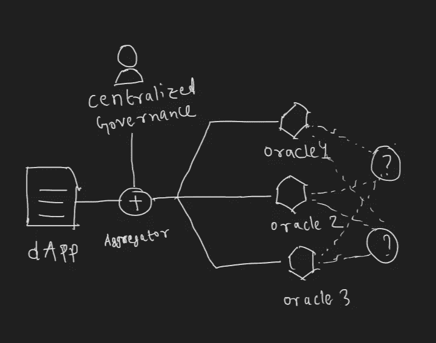

# 关于 API3 的一切

> 原文：<https://medium.com/coinmonks/everything-about-api3-c0a5dd2c75ba?source=collection_archive---------7----------------------->

这篇文章是关于区块链甲骨文 API3 的。

本文涵盖以下主题:

区块链 Oracle
API3 intro
API 连接问题
Oracle 问题
去中心化 API
第三方 vs 第一方 Oracle
air node
去中心化治理通过 tokenomics
安全通过保险
结论

# **什么是区块链神谕？**

区块链 oracles 是第三方服务，提供具有真实世界数据的智能合约。
区块链和智能合约无法访问真实世界或链外数据(不存储在区块链上的数据)。然而，当区块链技术使用外部数据，然后在此基础上做一些工作时，它的潜在用途就显现出来了。分散金融对神谕产生了巨大的需求，因为它们不断需要不同密码对的链外值。这就是区块链神谕发挥作用的地方。他们在区块链和外界之间起着桥梁的作用。它们扩大了智能合约可操作性的范围。没有他们，智能合同的使用被限制在更少的链上作品。
区块链 oracle 不仅是一个数据源，还是一个查询、验证和认证外部数据源，然后传递这些信息的层。oracles 提供的数据可能会有所不同，从价格反馈到传感器测得的温度，到天气预报，到实况转播的板球比赛，再到股票价格。

# **API3 简介**

企业通过 Web APIs 提供各种各样的服务，从提供资产价格数据到执行传统的金融交易。为了获得真实世界的感觉，能够访问这些 API 提供的服务对于分散式通信来说是很重要的。这一领域的现有解决方案通常需要中间人，这使得系统集中化、不安全且昂贵。API3 的目标是将 API3 的概念推进到下一个发展阶段，以满足 Web 3.0 不可避免的严格去中心化要求，而不依赖于任何第三方中介。简而言之，这里的 API 通常被称为分散式 API 或 dAPI。

API3 旨在大规模构建、管理和货币化 dAPIs。该项目具有开放和直接的治理模式，任何 API3 令牌持有者都可以将其令牌投入赌注池，以获得 API3 DAO 的投票权。此外，赌注将有资格获得奖励。当 dAPI 用户接收到来自 dAPI 的错误响应时，标记的令牌将作为链上保险服务的抵押品，以向 dAPI 用户提供索赔。正如我们所知，代币是由政府保管的，一旦提出保险索赔，他们将无法收回代币。因此，该系统确保治理部门对 dAPI 及其正常运行失败做出公正的判断，他们将因此失去作为 dAPI 用户保险索赔的股份。

**API 连接问题** API(或应用程序编程接口)是一种标准化和文档化的协议，用于与特定应用程序进行通信，以从其接收服务。这些服务从获取一些数据到触发一个事件不等。API 通常被认为是将数字世界结合在一起的粘合剂。
通过 API 将现有服务集成到应用程序中，使开发人员能够在 web 上构建复杂而强大的应用程序。然而，这些 API 并不直接与智能合约兼容。在构建可以与现实世界交互的分散式应用程序时，我们面临一些困难。

**Oracle 问题:** 一个去中心化应用的业务逻辑被实现为一个智能合约，它运行在一个基于区块链的智能合约平台上。去中心化允许参与者在不需要相互信任或可信任的第三方的情况下进行合作，因此提供了对攻击和审查的鲁棒性。
为了实施共识规则，智能契约平台节点必须通过在本地重复计算来验证每个契约调用都产生了正确的结果。为了实现这一点，智能合约只能对所有智能合约平台节点可访问并同意的信息进行操作。简单来说，智能合约只能对链上数据进行操作，与实时数据没有直接联系。这就是众所周知的“神谕问题”，指的是一个理想化的代理人可以向区块链传递一个任意定义的真理。
“oracle 问题”是一个三体:Oracle 数据源和链上数据消费者。现有的解决方案只关心 oracles 和数据消费者，而忽略了 sata 的来源。这里互操作性也是一个问题。它解决了三个主要方面的问题:API 提供者、oracles 和数据消费者。与源代码无关的互操作性解决方案会导致以下后果:
*不安全且昂贵的第三方 Oracle 中间层，它可能已经被 API 提供商运营的 Oracle 所取代。
*一个培育寻租中间人的生态系统，同时排除数据的实际来源
*在数据馈送中不加区别地处理从不同来源收到的数据

Decentralized interoperability solution: Consists third-party oracles that do not reveal sources of data.

**分散式 API** 分散式应用程序要求以完全分散、经济高效且安全的方式将特定的 Web API 服务交付给区块链。分散式 API，简称 DAPI，是 API 提供者操作的第一方 oracles 网络，以分散的方式进行管理。相比之下，分散的互操作性解决方案由一个由集中实体管理的第三方中间人的 oracle 网络组成，这是由它们未详细说明的问题定义所决定的。

Decentralized API or dAPI composed of first-party oracles operate their own Airnodes.

第三方 Oracles 作为中间人的问题
依赖中间人作为互操作性解决方案的一部分会有各种后果。
* *漏洞*:一个分散的 oracle 网络使用一个聚合函数将 oracle 报告缩减为一个答案。这个函数本质上是一个一致性算法。在这里，一群恶意的神谕可以合谋扭曲结果，甚至完全控制结果。这增加了西比尔攻击的机会。那么，在安全性方面，最终的解决方案是彻底去除中间商。

中间人税:一个先知在玩一个游戏，在这个游戏中，他们可以如实报告，也可以虚报。先知从诚实行事中获得的潜在利益必须超过从任何时候的误报中获得的利益，以避免任何误报。
能够从攻击中获利的第三方可以使用先知，并保证如果他们串通起来，他们将获得确定的金额。

* *无效冗余*:依赖于第三方 oracle 的数据馈送需要 Oracle 级别的过度冗余。这是因为第三方 oracles 远不如 API 提供商可信，后者有传统的外链业务和各自的声誉要维护。通常，在这样的数据馈送中，每个 API 提供者由 2-3 个 oracles 提供服务。请注意，这种分散化并没有在数据源级别提供额外的安全性，而只是减少了使用第三方 oracles 所导致的额外漏洞。不幸的是，这导致运营成本在许多层面上成倍增加。此外，使用更多的 oracles 会直接增加燃气成本。

* *缺乏透明度*:API 级的去中心化和 oracle 级的去中心化是相互独立的。由第三方 oracles 组成的数据馈送看起来比实际情况更加分散。此外，当数据馈送的数据源不透明时，开发人员无法评估数据馈送的完整性，只能信任管理实体。然而，如果数据来源不透明，就没有直接的动机促使管理实体选择高质量而不是低价格和便利，这可能导致通常称为“垃圾进，垃圾出”的结果。
大多数 API 服务条款禁止转售或未经授权分发 API 数据，这使得提供此类 API 的 oracle 节点违反了这些条款，并容易受到包括索赔在内的各种法律责任的影响。

**Airnode:为第一方 Oracle 设计的节点** 第一方 Oracle 是 API3 解决方案的组成部分。这些是由 API 提供者自己操作的 oracle 节点。

*去中介化的好处*:第一方 Oracle 是对第三方 Oracle 的替代，是对后者带来的问题的解决方案。
运行他们自己的 oracles 的 API 提供者将在智能合约平台协议层签署他们的响应。这将确保证明数据没有被篡改。
默认情况下，第一方的 oracles 是私有的，第三方无法观察到来自 API
的原始数据，因为没有中间人，所以成本效益高。中间商负责支付服务费用和诚实的动机。
因为神谕少了，不需要过多的去中心化。
在汽油成本方面高效
数据来源透明。你知道数据的来源。
不会有任何数据泄露，因此不存在法律问题。API 提供者将直接从他们的服务中获得收入。

*数据的链外签名*:有一种混合解决方案仍然依赖于第三方 oracles，不让他们篡改数据。
所有 API 提供者用他们的私钥签署数据，并通过常规端点提供服务。
第三方 oracles 调用此端点来获取签名数据并将其发送到 chain。
可以检查数据的真实性。可以使用 API 提供者的公钥在链上验证它。

*API 提供商运营 oracles 的障碍* :
传统 API 提供商不熟悉区块链。他们更喜欢 exchange 的加密数据 API
oracle 节点操作员没有这样的工作市场
操作 Oracle 节点会消耗大量资源，如工时和基础架构成本。在看到未来利润之前，这是不可行的。
运营 oracle 节点需要在 cryptos 中进行交易，还需要支付 gas 费用。此外，由于法律和会计原因，他们不喜欢加密支付。

Airnode : Airnode 是一个完全无服务器的 oracle 节点，专门为 API 提供商设计，用于运行他们自己的 Oracle。
air node 的优点:
它不需要任何操作诀窍。就像一劳永逸。它不涉及任何日常维护，如更新、监控等。
它建立在按需定价的服务基础上，这意味着节点运营商按照其节点的使用量付费。它还允许 API 提供者免费运行 oracle，并在开始产生收入后才付费。
节点运营商不需要处理密码。申请人自己将负责汽油费用。

Airnode is designed to be deployed once and need no further maintenance.

一种看待 Airnode 的方式是将其作为 Web API 的轻量级包装器，允许它与智能合约平台进行通信，而没有开销或支付令牌摩擦。使用 Airnode 可以比作利用 API 网关，使 API 可以通过 Web 访问。

**通过令牌组学进行分权治理:** 单点失败会毁了你所有的努力。系统可能会出现故障，如果出现故障，则没有冗余来补偿，从而导致整个系统出现故障。集权会产生单点故障，而分权旨在消除它们。区块链应用隐含地声称去中心化，然而大多数在某些方面仍然是集中的，治理就是其中之一。

*集中式 oracle 网络治理:* 如果一个分散式 oracle 网络可由一个集中式实体配置，那么它的治理就是集中式的。这可能会导致治理错误被忽视，这可能会导致数据馈送误报，即使底层 API 和 oracles 运行正常。管理实体有权重组数据提要，这意味着将 oracles 和它们各自的数据源换入换出。这对于数据馈送的长期维护是必需的，但是它将数据馈送用户暴露给治理实体的各种滥用和攻击。然后，用户要么必须信任一个集中的治理实体，要么必须通过有利于安全性的激励来分散数据馈送的治理。

*API3 DAO:* 为了分散对 dAPIs 和整个项目的治理，API3 将由一个 DAO 来治理。治理将是完全分散和开放的，这意味着所有的涉众将能够直接参与项目的治理。这将通过 API3 令牌实现，该令牌将授予 API3 DAO 中的投票权。DAO 将就赌注激励和抵押等机制方面的高层参数进行投票。此外，道事务部将从道事务银行发放赠款，用于进一步的项目方面和改进。为了可扩展的治理，将通过分层的团队结构来执行更精细的任务。
预期的工作流程是人们组成链外团队，并申请拨款来执行一次性项目或有利于 API3 的持续运营。该团队通过将团队成员指定为用户的 multisig 提出拨款申请，如果拨款建议被接受，DAO 将向 multisig 拨款。此外，DAO 可授权团队 multisig 根据所分配的任务进行具体交易，例如，为个人用户设定 dAPI 订阅费。

主道通过有选择地分配资金和授权进行治理。当一项任务达到一个团队无法完成的规模时，它会被分配给一个子 DAO。

这种基于团队的治理方案在天然气成本方面是可扩展的，因为它需要在 DAO 级别投票表决的提案更少。它在实践中也更具可扩展性，因为它不需要所有执政者持续关注各种各样的微小细节。此外，它允许根据专家意见快速执行 dAPI 管理等关键操作。随着 API3 运营规模的扩大，这个治理层次结构可能需要额外的层，这意味着子 Dao。

*dAPI 货币化和 API 提供商补偿:* API 订阅费通常按月或按年支付，因为该方案适合 API 提供商及其客户。API3 的目标是对 dAPIs 采用相同的方案。为了获得对 dAPI 的访问权，用户将支付定期订阅费用，该费用可以是固定的，也可以根据具体的使用情况为用户定制。这些价格将由各自的团队决定，如果用户希望获得保险服务，这些价格将包括保险费。
支付将能够以任何加密货币进行，DAO 将通过基于流动性池的分散式交易所以 API3 代币形式接收这些加密货币。
API 供应商将定期获得固定费率的补偿，这将符合他们现有的定价模式。这将尽可能使用 stablecoins 来完成。一些 API 提供者不喜欢加密支付。在这种情况下，DAO 将提供一笔赠款，这笔赠款将作为 API 提供者得到被资助者法定报酬的证明的回报。

*API3 Tokenomics:* 去中心化的治理需要能够准确模拟积极和消极结果的平衡的激励机制。换句话说，治理的
实体应该因好的结果而受到奖励，因坏的结果而受到惩罚。API3
令牌旨在通过三个主要的实用程序来实现这一点。赌注:授予 dAPI 收入和通货膨胀奖励。
2。抵押品:支持保险服务，保护用户免受 dAPI 故障造成的
损害。
3。治理:授权在 API3 DAO 中的直接表示。

API3 Mechanics

赌注公用事业为参与 API3 和增加其收入提供了财务激励。抵押品效用让参与者分担 API3 的运营风险，并激励他们将风险降至最低。最后，治理效用为参与者提供了实施这些激励的最终工具。请注意，这三个实用程序的一致性非常重要。所有的治理实体都必须接受赌注奖励，以便以最大化收入的方式进行治理。所有管理实体必须将其资金用作抵押品，以便以最大限度降低安全风险的方式进行管理。为此，API3 将有一个单一的赌注池。在该池中下注 API3 代币将授予代表权和下注奖励，但同时，下注的代币将用作抵押品，以根据需要支付保险索赔。

**结论**
API3 将把分散的应用程序与传统 Web APIs 提供的丰富数据和服务连接起来，从而在不牺牲分散性的情况下扩展区块链的适用性。这将通过完全分散的区块链本地 API3 DAO 来实现，该 API 将由 API3 DAO 进行设置、管理和规模化货币化。

API3 解决方案通过设计体现了多种品质。其中最重要的是安全性。dAPIs 不依赖于第三方 oracles，而第三方 oracles 是替代解决方案中持续存在的重大风险因素。此外，dAPI 保险服务为其用户提供了可量化和不可信的安全保证，进一步巩固了 API3 作为以分散应用程序形式接收 API 服务的最安全解决方案的地位。

API3 解决方案的第二个特点是多层次的稳定性。Airnode 使用无服务器技术，具有很强的抗停机能力。API3 oracles 采用了不易受错误或不利网络条件影响的无状态节点设计，具有很强的健壮性。此外，dAPIs 将由 DAO 管理，该 DAO 通过精心设计的激励措施保持风险和回报的自我调节平衡，从而提供了一个稳健的风险缓解框架。

dAPIs 消除了中间商，这赋予了他们第三个品质，即成本效益。他们不必支付中间人税，这是支付给第三方先知的款项，以激励他们不要试图攻击。此外，由第一方 oracle 组成的数据馈送不需要 Oracle 级别的过度冗余。通过使用更少的 oracles 实现同等程度的分散化，dAPIs 可以显著节省燃气成本。

最后，API3 解决方案通过将治理完全分散给游戏中有真实皮肤的各方来实现灵活性。因此，该项目将永远不会受到本文所述内容的限制，并将不断发展以满足新的挑战和需求。

第一代分散式应用仅限于区块链的范围内。今天，我们有分散的应用程序，可以用有限的和伪分散的方式与外部世界交互。API3 将推动下一波发展浪潮——第三代去中心化的应用程序，它们与链外世界进行有价值的交互，以真正去中心化和信任最小化的方式利用 API。

**参考文献**:

API3 白皮书

 [## API3

### API3 引领着从传统第三方 oracle 网络向第一方 oracle 解决方案的转变，提供更多…

medium.com](https://medium.com/api3) 

> *交易新手？试试* [*加密交易机器人*](/coinmonks/crypto-trading-bot-c2ffce8acb2a) *或* [*复制交易*](/coinmonks/top-10-crypto-copy-trading-platforms-for-beginners-d0c37c7d698c) *上* [*最好的加密交易*](/coinmonks/crypto-exchange-dd2f9d6f3769)

> 加入 Coinmonks [电报频道](https://t.me/coincodecap)和 [Youtube 频道](https://www.youtube.com/c/coinmonks/videos)获取每日[加密新闻](http://coincodecap.com/)

# 另外，阅读

*   [免费加密信号](/coinmonks/free-crypto-signals-48b25e61a8da) | [加密交易机器人](/coinmonks/crypto-trading-bot-c2ffce8acb2a)
*   [杠杆代币](/coinmonks/leveraged-token-3f5257808b22)终极指南
*   [16 款最佳折叠电动自行车](/coinmonks/top-17-folding-electric-bikes-5e296f0918cb)
*   [28 款最佳电动自行车点评](/coinmonks/the-28-best-electric-bikes-review-and-buying-guide-in-2023-7bb3146cb403)
*   前三名[币安期货交易机器人](/coinmonks/top-3-binance-futures-trading-bots-e6031f84b3f9)