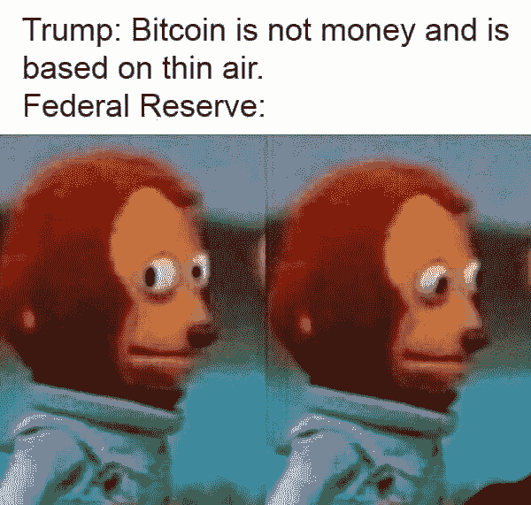

# 2019 年比特币的所有毛病

> 原文：<https://medium.com/coinmonks/everything-wrong-with-bitcoin-in-2019-b9b7653befc8?source=collection_archive---------0----------------------->

当你花这么多时间向无知的人捍卫比特币时，它会错误地让人们认为你喜欢比特币，而实际上还有很多需要改进的地方。

有三种无知需要为比特币辩护。

1.  人们对比特币的概念毫无头绪，并被媒体和他们最喜欢的政客所左右。这种对比特币的敞口几乎普遍是负面的。
2.  有些人有一点点线索，但认为生态系统任何部分的问题都是对整个比特币概念的控诉。(即。当一家运营交易所的运营不善的私人公司遭到黑客攻击，导致客户失去比特币时，指责“比特币”
3.  人们以当前的状态看待比特币，并没有注意到它的变化和改进，因为它是软件。

一般来说，对于第一种和第二种类型，必须非常耐心地处理幼稚的世界观，而不引入细微差别。这就是你所说的“比特币是数字黄金，拥有黄金的所有优势，但没有重量，无需昂贵的机械就可以无限分割，可以在全球范围内携带”。但这篇文章大约是第三篇，我指出了使用比特币的令人沮丧的事情，以及如何改进它。它的标题是有意引起第一类和第二类人的注意，他们会利用这一点来证实他们无知的信念，即这整个不安全的资产类别只适合毒贩和恐怖分子，同时告诉第三类人它的去向。随着比特币效用的增加，这三种类型都成为这种技术的用户，或者至少第三种类型急剧扩张，将无知者边缘化。

这篇文章是专门针对比特币的，而不是区块链、加密和分布式账本技术(DLT)的整体。有明显的重叠。

# **2019 年比特币的一切都错了。**

**账户类型和不兼容**

现在是 2019 年，有 7 种不同类型的比特币地址。这是一个漫长的过程。比特币地址基本上是识别你的账户和别人账户的方式。至少有 7 种可用的地址类型，这是非常复杂和荒谬的，这就是你需要知道的，也许应该跳过这一部分。代替任何统一性的，至少有七种类型，这里按介绍顺序列出它们:

1.  版本 1 比特币地址。它们以数字 1 开头，有一串字符。我的别名 1 区块学家向第 1 版比特币地址致敬。例[17 ausmvhwddgjw 6 stqg 1 of gfn G5 m 47 kdfz](https://www.blockchain.com/btc/address/17AUsMvHWDdgjW6STqG1oFgfng5m47kDfz)
2.  使用 P2SH 的多签名比特币地址。这些从数字 3 开始。这些是联名账户。比特币所有权变得更加安全的一种方式是，你的电脑可能被黑客攻击，但黑客无法转移比特币，因为它也需要另一个账户持有人授权交易。您可以拥有需要 2 个所有者的帐户，或者需要 3 个所有者但只需要 2 个所有者就可以授权交易的帐户，等等。千禧一代扼杀托管行业🥑。可编程的钱，宝贝！
3.  秘密地址。隐藏发送者、接收者和金额的隐私的基本实现。没有人使用这种实现，只有 2013 年的 Darkwallet 短暂地使用过。与之前的交易有关联。
4.  版本 2 比特币地址，Segwit 版本 1。这些地址也以 3 开头。Segwit 版本 1 的目的仅仅是因为已知的和更好的 Segwit 版本 2 (bech32)地址不被所有使用版本 1 比特币地址的比特币客户端识别。你也无法分辨一个地址是 P2SH Multisig 地址还是 Segwit 地址，直到拥有者从中花钱。🤦🏽‍♂️:2016 年、2017 年和 2018 年都是如此。但是 Segwit v1 地址也可以是使用 P2WPKH、[或其他](https://bitcoin.stackexchange.com/questions/64733/what-is-p2pk-p2pkh-p2sh-p2wpkh-eli5)的 multisig 地址。
5.  版本 3 比特币地址，Segwit 版本 2 (bech32)。这些地址以 *bc1* 开始，而不是以 *1* 或 *3 开始。*比特币地址的黄金标准。它们在比特币交易高速公路上占用的空间更少，允许更多的交易通过，提高了比特币的交易速度。[在发布时，1.4%的比特币存储在这个新地址。](https://p2sh.info/dashboard/db/bech32-statistics?orgId=1)
6.  照明网络地址。这些不再是地址，而是发票。同样的概念，你得到字母和数字的组合，你向它发送一个余额，或者从它接收。需要使用 v2 或 v3 比特币地址来创建 lightning 网络地址。这些技术成倍增加了比特币的吞吐量，基本上消除了所有对比特币交易速度缓慢的批评。理论上。这些还引入了新的隐私级别，因为照明交易与之前的交易无关，没有记录存储在链上(但一些服务提供商可能自己保留记录)。
7.  因为我可能漏了一个。有几件事情正在进行中，比如机密事务(CT ),这将比以前实现的秘密地址好得多。

但是等等，还有更多😐因此，所有这些账户类型的问题都与向前和向后兼容性有关，这意味着如果你有一个账户，你将无法向比特币网络上的 100%用户发送/接收信息。现在看来，这仅仅是与你碰巧用来存储比特币的钱包软件有关，这对用户体验没有真正的影响，(但令人困惑)。专注于版本 1 比特币账户的钱包开发者不会实现任何与版本 3 bech32 比特币账户相关的东西，反之亦然。Electrum 就是这样一个钱包，它总是[不幸地]在技术上实现飞跃，早在 2016 年就实现了。他们让用户知道它更好，但给出了非常糟糕的选择，告诉用户他们基本上不会使用比特币，直到其他人赶上。

2019 年的好消息是，很多钱包和交易所都赶上来了。请注意，所有这些东西都比计划落后了至少 15 个月，因为整个 segwit 概念导致了比特币社区的裂痕。为了使 segwit 成为可能，必须删除一些功能，因此它花了大约 15 个月的时间来达成共识，并允许 segwit 实现新的创新。例如，如果没有首先将 segwit 技术添加到比特币中，闪电网络实际上是不可能的。对于一个完全不同的进化路径，你可以看看比特币现金，和比特币 SV 但⚠️beware 的小丑🎈🤡

回到比特币网络，由于 nobody major 使用的是 bech32 地址(type #5)，nobody major 使用的是闪电网络(type #6)，比特币在时间上卡住了。1 版比特币地址(type #1)和 segwit 版(type #4)的盛行，直接导致了比特币的速度缓慢和恐怖的用户体验。

在比特币的一半生命周期中，它一直是市场上最慢的加密货币。五年了。最慢，最不可扩展的一个，我们的密码爱好者仍然必须将无知的大众从他们完全不合理的批评中转化出来。

美国的银行系统仍然很慢，在银行或经纪公司之间转账仍然需要 2 到 3 个工作日。在西海岸，银行在太平洋时间上午 9 点开门，只有 4 个小时的时间窗口，一周 5 天，可以进行更昂贵的当天银行转账。对于门外汉来说，这种抱怨是关于比特币交易如何在一个好的日子里花费 20 分钟，而在其他一些区块链和 DLT 上的转移花费大约 1 分钟。

具有讽刺意味的是，如果闪电网络更加盛行，比特币可以比竞争对手更快。

**闪电网**

如果比特币的闪电网络更进一步，竞争的加密货币/区块链/分布式账本技术，如以太坊、Tron、EOS、Libra 等，将失去它们的失败者故事。

比特币基地和币安等主要交易所都应该运营用于存款和取款的闪电网络支付通道。他们应该有权选择——或者强迫用户——使用闪电网络。网上交易只是闪电支付通道的打开和关闭，看不到真实的交易信息。这可以减少他们与世界各地的政府的合规负担，这些政府刚刚知道如何分析区块链，大规模监控权力将从政府那里被移除，并回到实际上为老式的侦探工作发出授权令和传票。

但是闪电网络软件还没准备好。目前，用户需要下载整个 220 千兆字节的比特币区块链，并不断增长，使用他们的快速互联网跟上所有新的交易，然后他们还必须保持 100%的正常运行时间，以出于某种原因保持他们的闪电支付通道开放。那是愚蠢的。一个名为 Watchtowers 的解决方案即将推出，它让第三方为你打开支付通道。与此同时，你可以买一台 300 美元的专门为此而设计的电脑。🤮明年再来看看吧！

**资产**

分布式账本技术的价值主张的很大一部分是将所有资产和合同的表示转移到他们那里的能力，区块链是其中的大多数，比特币是第一个区块链。这将创建可靠的记录，不需要分散的过时的市政府、许多行业、行业监管机构的信任，同时也消除了执行所有这些所需的法院的障碍。所有的基础设施都是多余的。

自 2013 年以来，比特币已经有能力做这种事情的初级版本，发行资产和合同。代表公司股份、艺术品、婚姻联盟和限量产品的资产都被存储在比特币分类账上。

OMNI 协议是允许人们这样做的主要软件。现在，如果你想在不咨询任何昂贵的法律、注册会计师或申请在纳斯达克上市的情况下提供你公司的股票，以便人们可以无缝交易你的股票，你可以在使用 OMNI 协议的比特币网络上进行。

只是其他所有竞争对手区块链现在也可以这样做，而且速度更快，成本更低，而且拥有非常强大的基础设施来交易这些资产。因此，即使这整个概念对你来说是新的，许多组织已经迁移到更好的区块链或完全跳过比特币。系绳一直是纽约州监管机构的新闻，它是根据 OMNI 协议发行的资产。

比特币是慢 af，贵 af，按 OMNI 协议发行资产更慢更贵。

但是 OMNI 甚至没有跟上比特币的变化！👎看看这个，OMNI 资产只能在版本 1 比特币地址(类型#1)中持有，并且只能在[某些情况下](https://blog.omni.foundation/2016/12/12/multisignature-addresses-and-omni/)与 P2SH multisig 地址(类型#2)一起使用？基本上没有批量交易是可能的，这意味着使用一个交易发送给许多收件人一次。直接导致了比特币缓慢的最大交易速度和拥塞，其中系绳交易是使用比特币的主要或唯一资产。

甚至系绳也在试图尽快迁移到其他区块链，在以太坊区块链和创区块链上发布了镜像系绳。在匆忙中，他们不小心在创区块链上制造了价值 50 亿美元的系绳，而实际上他们只打算制造 5000 万。(多余的部分很快被透明地烧掉，不再存在)

因此，尽管比特币闪电网络目前比所有这些竞争的区块链都快，但没有 OMNI 的资产可以通过它发送！😅😅😅

这可能是比特币不可调和的局限性。但这取决于 OMNI 开发者的想法和优先顺序，祝你好运能搞清楚！

每一次比特币交易都只是进入一个数据库，在这种情况下我们称之为区块链。除了“金额”“发送者”“接收者”之外，每个条目都有一点额外的元数据空间。过去比特币地址版本 1 的每一项创新都在交易中使用这一额外的空间来实现联合账户、照明网络支付渠道、OMNI 资产创建和发送、婚姻和衍生品合同以及任何你能想到的东西！只要信息以人类或机器可读的格式适合这个额外的空间。但问题是，你可能无法在同一个额外空间里同时容纳 OMNI/联名账户/闪电支付渠道/多个收款人。所以非此即彼。增加额外的空间仅仅意味着 220 区块链的大小增加得更快，因此对于必须存储区块链的人(矿工、闪电网络受虐者)来说，他们不会将他们的软件升级到交易量更大的版本，比特币只有在大多数参与者使用兼容软件的情况下才能工作。明白了吗？

因此，OMNI 的资产不能变得更好或更快，很可能无法在 2019 年或永远无法通过闪电网络传输。我想我曾经在 youtube 上看到有人这样做过，警告说你可能会不小心删除你的资产。只是比特币的东西🌈

**交易所**

嘿，这些已经变得好多了！

首先，你不应该把比特币储存在交易所里。现在是 2019 年，人们仍然会这样做，当交易所遭到黑客攻击、具有内在恶意或者是一家不称职的私营公司时，他们会感到惊讶。发生了阻止您访问您的数字资产的情况。

使用交易所和拥有比特币的方式对比特币交易者和爱好者来说是违反直觉的，所以让我们试着想象一下与其他金融机构相比的区别。

您如何使用您的银行账户:将美元存入->，将美元取出->，存入您的个人钱包。

你如何使用你的股票交易帐户:存款美元->购买股票->注销并离开。或者卖股票->提现$ ->注销走人。

你**应该如何**使用你的比特币兑换账户:存入$ - >购买比特币- >提取比特币- >个人钱包里的比特币。或者存入比特币- >卖出比特币- >提取美元到你的个人银行账户

但相反，人们对待比特币交易所账户就像对待股票交易账户一样。他们存入美元，购买比特币，然后注销。交易所被黑了，他们留在里面的所有东西都被偷了。呜呜蠢蛋。如果它不在你的私人钱包里，那它就不是你的比特币。通俗地说，这就是“不是你的钥匙，也不是你的比特币”。我不同情你，目前也没有监管机构给你报销。

*所改进的是，更多的交易所至少使用了 multisig 技术。在这种情况下，客户资金存储在联合账户中，因此当黑客入侵系统时，他们仍然需要同时攻击多名高管和第三方，以便将比特币转移到未知地址。*

此外，一些交易所现在有私人保险，以及各种其他方法来救助或保护客户。但只有少数几个市场领先的交易所拥有这一功能。现在比以往任何时候都有更多的交易所没有这样做，但它们在系统上是不相关的。

尽管现在至少有几个地方给顾客一些信心，让他们有机会拿到他们的钱，但这仍然是业余时间🤹‍♀️

2019 年，依然基本没有经纪人。这些交易所仍有别于传统交易所，因为它们为散户客户提供直接的市场准入。散户交易者仍然没有共享的流动性池，让客户能够匹配不同交易所的订单。而且这些费用不会奖励流动性制造者。

但你知道最疯狂的是什么吗？这些特点都有！交易所的大规模扩散是因为有卖铲子的技术供应商，他们有你花几千美元就能建立起来的交易所！这些东西很复杂。在过去的一年里，我参加了几次销售电话会议，他们告诉我这款 exchange 软件与他们唯一的直接竞争对手有多么不同🙄。因此，所有的交易所只需许可这个软件并对其进行皮肤处理，并具有以下功能:子账户、经纪能力、使用 FIX 协议的共享流动性池、websockets、REST，等等。它真的非常先进，但没有交易所能实现这些功能，你知道为什么吗？贪婪😃！这真是目光短浅🤓，但谁知道这些家伙的派对会持续多久，所以我明白了。虽然令人沮丧。

交易所向客户收取过多的取款费用，收取过多的列出额外数字资产的费用，收取过多的服务费用，收取过多的客户佣金，等等。其中大部分不适用于比特币，但这是交易所的商业计划。如果他们给流动性制造者回扣，只向流动性接受者收费，他们可以获得更多的业务。它将把创造流动性作为自己的商业计划，人们将会参与竞争。

他们正在变得越来越好，让我们明年再来看看吧！

**隐私和最佳实践**

比特币本质上不是私有或匿名的。但是你可以这样使用它。你可以做很多事情来挫败政府正在努力学习的“连锁分析”。哦，是的，向政府出售链式分析技术是极其有利可图的——如果你在为人们所知的最愚蠢的“广告技术再定位优步”创业公司工作时批评一切加密，你真的错过了这种平行经济是如何运作的。(看你们 Hackernews。)

即使没有有意识地试图躲避政府，使用比特币的最佳实践也极大地改善了隐私。具体来说:不是👏重新使用👏地址👏👏

所以我们已经确定你应该使用你自己的钱包，而不是通过交易所。一个钱包有无限的地址，所以基本上每次你接受付款时，你都应该告诉发送者一个全新的未使用的地址。

这里有一个小事实:区块链不知道任何地址，地址只在事务发送给它时第一次出现。所以当你告诉别人一个新地址的时候，没有链接到你或者其他任何东西。链接主要来自于多方发送到该地址，而你从该地址发送到多方。这是你的指纹。它增加了链分析的信心，所有的“到”和“从”服务是你在交易所的帐户。

但是 2019 年比特币怎么还在这吸？

当然，用户不喜欢这个，你也不喜欢这个，你甚至不在乎。但即使你真的在乎，钱包也会积极地与你作对！

当你要求钱包发送任何金额时，比特币钱包通常会将你所有钱包地址中的余额组合在一起。假设你有 3 个地址，一个有 1 个比特币，一个有 5 个比特币，一个有 2 个比特币。你进入你的钱包应用程序，尝试发送 4 个比特币。最有可能的是，你的钱包 app 会从有 1 个比特币的地址和有 5 个比特币的地址进行组合交易，导致第一个地址剩下 0 个比特币，第二个地址剩下 1 个比特币。现在，在区块链和收件人那里，这两个地址都与你有关。第一个地址的所有交易现在都与您相关联。很少有钱包让你选择具体地址，说“从这个地址用 5 个比特币发 4 个比特币，忽略其他的”。Electrum 允许您这样做，但即使他们有时在恢复它之前已经删除了该功能。钱包积极地与你作对。🤦🏽‍♂️

哦，但是比特币的隐私正在复苏。2019 年最大的比特币迷因是武士钱包和 Wasabi 钱包，它非常隐私，混合了你的所有交易，用其他人的混合比特币替换你自己的比特币。虽然这很愚蠢，因为混合比特币，特别是使用武士钱包或 Wasabi，意味着多次在线交易和高额费用，甚至在这一切完成之前不能花你的比特币。哦，但是等等，是的，这是相当多的隐私。市场上也有更多私人的、更快的替代品，因为比特币已经在时间上停滞了 5 年。我说的选择只是指 Monero。然而，更多的选择紧随其后。

一个改进是，照明网络支付渠道也可以充分解除交易链接。这里叶这里叶洗钱，连锁分析死了🙄(虽然仍然向政府出售这项服务，但他们在🥴的发展有点慢)基本上你可以用你在其他钱包中的其他地址打开照明网络支付通道，并通过它解除链接/清理比特币，然后进一步融入经济。关于洗钱的部分，我是开玩笑的，洗钱要求钱的来源是非法的，这取决于原告来证明，所以如果你永远无法找出来源是什么，那就不是洗钱。🥁🎉混淆资金来源有很多原因，尽管金融隐私和资金流动的成功文化诽谤，但这样做并不是一项被批准的活动。通过连锁分析进行大规模监控是懒惰的，这迫使执法部门回归到老式的带传票和搜查令的侦查工作，就像跟踪银行间的交易一样。如果你刚刚赶上，这就是透明的公共比特币区块链的用武之地，当交易在“链上”完成时，所有交易都是公开的，你可以查看每个账户的余额和交易历史，以及向该账户发送资金的人的余额和交易历史。虽然你不知道这些发送者的身份，但你可以推断出很多，所以这是非常*而不是*隐私，闪电网络改变了这一点。

未来，比特币有望实现保密交易，基本上与 Monero 平起平坐。一些比特币核心开发团队也在 Monero 上工作，在这一点上反之亦然。通常情况下，政府行为会加速这些改善，我专门称之为“向可替代性的转移”。

2019 年，与其他公共不透明区块链的原子互换相当强劲。在任何给定的时间点，你都可以在 Bisq 上以一个好价格将价值约 50 万美元的比特币原子交换到 Monero，解除你的交易历史的链接。没有私人公司会因为原子互换而被传唤。比特币用户可以使用的可替换入口和出口变化很大，但我预计这些会有更大的改善。有耐心的话，你可以在几天内轻松解除数百万美元比特币的链接或“清洗”它们。政府或许应该停止将纳税人的资源用于白名单交易？让一切看起来干净很容易，向政府出售连锁分析软件让他们觉得自己有权力也很容易。政府想要确保不被资助的危险活动进行起来真的不那么昂贵，所以当汇丰银行、丹麦银行和德意志银行已经用美元和€清洗了数千亿美元时，更有可能的是已经与地球上的每个人进行了相互合作。

结论:使用和存储比特币的钱包很烂，技术本身很棒。如果你知道如何在没有漂亮按钮告诉你该做什么的情况下使用比特币，隐私比看起来要好。

**矿业能源利用、环境影响**

维持比特币是一种资源密集型操作和高度竞争的资本密集型商业模式。除此之外，对环境问题的报道严重失实。比特币挖矿被用来确保交易从一个地方到达另一个地方，并得到新比特币的补贴，新比特币的数量越来越少，被称为区块奖励。这是非常有利可图的，因此非常有竞争力。盈利的唯一方式是用非常强大的计算机实现非常低的能源成本，因此采矿业务被可再生能源或利用发电厂多余能源的精品交易所吸引。这在未来将变得更具竞争力，因此大坝、地热能和对其他可再生能源的投资将不得不由矿商来考虑。

许多出版物仅仅报道了不断增长的能源消耗，却没有分解能源的来源，这是非常不诚实的。

支持银行业、华尔街、加那利码头和其他金融中心及其所有地区业务所需的基础设施远远超过了比特币。但是，如果民族国家参与进来，比特币的能量使用可能会增加。明年再来重温这个叙事吧！

**交易、衍生品、风险管理**

我们讨论了交换，但这一部分更多的是关于可用的产品。对比特币感兴趣并持有比特币意味着二元和线性的金融赌注，这很糟糕，因为你要么做多，要么做空比特币。这是一个完全零和游戏的不必要的订阅。现货市场烂，合成现货市场烂。

交易比特币现货(指你可以提现到私人钱包的比特币本身)有那些桶店交易所。交易合成现货意味着更糟糕的交易所，或者说是我这辈子见过的除了$TVIX 之外最蠢的 ETF(交易所交易基金)📉。

对于合成现货，我们有非美国监管的“永久掉期”和期货。合同标准化是一个矛盾修饰法，杠杆以神秘的方式应用，保证金分类本身是未知的，基本上是虚构的，没有信任交易所就没有办法做到这一点，维持头寸的费用过高。Bitmex 是其中最大的，它就是 MEME CENTRAL。[阿瑟·海斯](https://medium.com/u/b8b32531d77?source=post_page-----b9b7653befc8--------------------------------)是梅姆斯中央银行的主席。所以你有线性下注，并利用线性下注，就是这样。适当的衍生品允许像保险一样的风险管理:在不利的市场条件下，巨额回报的成本很小。期权合同做得最好，以后再说。

对于美国监管的合成现货，我们有[巴里·希尔伯特](https://medium.com/u/dc6e666f290?source=post_page-----b9b7653befc8--------------------------------)的 GBTC 调制，在 OTCBB 交易，允许股票投资者获得敞口。GBTC 满足了一个需求，但因为它 30-120%的保费，所以很糟糕。这很糟糕，因为股票市场上的交易所交易基金受限于股票市场的交易时间，公告板几乎没有市场前和市场后的交易时间。这很糟糕，因为 OTCBB 没有期权合约，即使 GBTC 不在 OTCBB，但在真正的纳斯达克，它可能仍然是不可期权的。

我们还有美国监管的比特币期货，它们在 2019 年的流动性相当好。他们一天 24 小时，一周 5.5 天进行交易。CME 集团管理这些账户，拥有期货经纪账户的人可以获得这些账户。为什么它们很烂？嗯，与其他期货合同相比，保证金要求相当高。它们是现金结算的，这意味着不涉及实际的比特币😩出于完全不同的原因，这使得这些产品和 Bitmex 一样像一个视频老虎机赌场。虚弱。

这方面的一个进展是，新创企业巴克特公司(Baktinc .)计划推出比特币结算期货合约，该公司是芝加哥商品交易所(CME)竞争对手纽约证券交易所(NYSE/ICE)的一家新子公司。但他们应该在六个月前的“两周”内完成，仍在等待。让我们明年再来看看这个！

在衍生产品的另一个角落，空间功能选项合同，事情正在升温，但在电感炉的最低设置。如果几个结构性问题得到解决，比特币期权合约将是人类历史上最大的财富转移。按照我的标准，比特币期权合同基本上不存在。

在非美国监管的领域，名义上在新加坡运营的 Deribit 从 2016 年左右开始提供这些服务。它们还不错，尽管缺乏任何可识别的合同标准，价差太大，难以使用，而且奇怪的是，买卖价格是用比特币而不是美元来定价的。我确实喜欢罢工的位置。我在这个网站的每一瞥似乎都没有显示出这个领域的进步。

在美国，只要你有 10，000，000 美元的启动资金，LedgerX 就能提供这些服务。Wtf？如果你单方面决定对冲，只需要 100 万美元，这是一个安慰奖。这就是我的一家公司所做的，“自我证明”我们正在“对冲”，在其他交易中，我们还在 2018 年用比特币看跌期权对冲了我们的加密敞口，我可以告诉你的是，价差非常可怕，罢工间隔太远，你必须在会员的聊天室里与会员谈判价格，才能获得回报。用任何实际大小或体积来做这件事是不可能的。

2019 年年中这一领域的新进展是，监管机构 CFTC(商品期货交易委员会)最近批准 LedgerX 向零售提供比特币期权。没有净值要求的必要！耶！LedgerX 市场时间让你每周 7 天、每天 23.5 小时交易比特币期权。

但目前，没有人可以在现有的经纪账户中交易这些股票。我不能在互动经纪商或 TD Ameritrade 上交易比特币期权。在商品期货市场监管体系下，在指数下，在股票市场的交易所交易基金下，都没有。完全站不住脚，软弱，没有明确的可预测的监管结构或交易经验。没有真正的方法来管理风险。也许 LedgerX 被 TD 或高盛收购，所以他们提供这些产品，而不必建立任何新的东西🤞🏽

因此，2019 年在管理风险方面很糟糕，更有可能的是，当风险降低时，大部分剩余的上涨空间都将消失。很容易下注，长比特币。让我们明年再来看看吧！

**监管，续。**

全世界都在等待美国想出如何监管比特币。

到 2019 年，比特币是什么样的资产至少已经确定，这是一种数字商品。我们可以在比特币现货存在于商品框架下的假设下运作，这意味着 CFTC 名义上的监管，但完全没有进一步的监管，只有对比特币期货市场的监管。

这消除了监管阴影，但可能会引入 CFTC 对托管人代表他人交易的许可要求。

CFTC 支撑着实物结算的比特币期货、比特币期货期权、比特币现货期权、比特币指数期权的存在。但同样，他们刚刚批准了包括 LedgerX 在内的一些实体向所有人提供比特币现货期权。CFTC 是金融监管机构中最灵活的，他们喜欢比特币，但仍然被束缚住手脚，他们认为这是对市场负责。CFTC 将为任何事情开绿灯，美国国会将在 CFTC 说不之前彻底禁止一项合同

美国证券交易委员会(SEC)比 CFTC 保守得多，持有适当的比特币 ETF，并持有股票经纪账户中已经存在的数万亿美元的敞口。特别是可以选择的 ETF。美国证券交易委员会在这件事上虚构的更高审查标准大大加快了整个比特币和加密行业的发展👍尽管令人沮丧的是，他们也在阻碍创新。最大的交易所做了很多事情来增加市场的信心，避免被黑客攻击，帮助价格发现和避免欺诈。美国证交会希望得到这些东西，尽管它并没有监管现货市场的任务，但目前它们可以监管比特币交易所交易基金。此外，美国证券交易委员会的员工不希望这样的事情存在，因为他们已经被讨厌比特币的现有金融系统所俘获。*太糟糕了，因为 SEC 专员的空缺是有益于加密领域的政变的一部分。*我要说的是，它没能起到催化剂的作用。到目前为止，只有一名专员任命了 pro-crypto ETF，她的名字是 Hester Pierce。SEC 还提议完全停止 ETF 审批，这也将为比特币 ETF 审批开绿灯。它们都已经附有招股说明书，让市场来决定它们是否有用，就像每次 IPO 一样。SEC 的任务不是审查投资的价值，但 ETF 恰好是被动基金，其管理者也是公开交易的，因此有各种各样的行为导致 SEC 有效地判断投资的价值。让我们回到 2020 年！

SEC 和 FINRA 关于数字资产托管的规定有助于推动事情向前发展。CFTC 的比特币资产分类清晰化和 SEC/FINRA 的动向正在推动事情向前发展！

不过，早在 2014 年，我就想要标准化的交易所交易比特币期权，所以我很失望。

我的 2014 年 [stablecoin 专利](https://patents.google.com/patent/US10121126B2/en?inventor=Eric+lamison-white&oq=Eric+lamison-white)是关于利用分布式账本技术进行现货数字资产对冲的，将会从这一切中受益。特别是当这些公司独立地意识到他们想要锁定所有的知识产权，或者独立地得出这个专利描述的相同结论，并试图提供其中描述的产品。🤑🤑🤑假设金融机构喜欢垄断直到 2036 年。

线上比特币衍生品规避了所有这些监管审批。你应该能够直接从你的私人钱包中交易比特币期货、掉期和期权，而不是必须将资金存入 LedgerX 或任何这些交易所。有些人已经创造了这些。让我们明年再来看看吧！

FinCEN 和美国财政部更新了对包括比特币在内的数字资产的指导。其中大部分只适用于比比特币领先几光年的更实用的区块链。

美国国税局仍在执行他们 2014 年的指引，将比特币称为“财产”，这与大宗商品现货税待遇非常吻合。因此，CFTC、证交会和国税局不再相互冲突，但现在有一些悬而未决的问题。

比特币期权合约现在是否算作 1256 条款合约，受到有利的 60/40 规则税收待遇，即每笔交易都获得 60%的长期资本收益待遇？🤑🤑🤑去年，我在我们的办公室会见了 LedgerX，他们说，他们与美国国税局在税务处理方面的对话并不顺利，但我没有得到这样的印象，即国税局在比特币被一个完全不同的联邦机构视为商品的问题上有任何发言权。当比特币期权真正问世时，我会根据 1256 条款报告我的期权交易，并让你知道它是如何实现的！

现在是 2019 年，所有这些机构都在考虑比特币。想要以太坊期货还是期权？艰难。涟漪 XRP 风险管理？滚出去，你这个疯子！

**社区**

比特币社区比以往任何时候都好！

在那段黑暗的岁月里，有一两个论坛在谈论比特币。在黑暗的岁月里，所有这些论坛都是由同一个人拥有的，所以缺乏共识的软件升级和想法无法获得共识，因为那个人会禁止异议。这导致 segwit 和 Lightning Network 比需要的时间多花了 15 个月。因为法典已经存在，它只需要如此高比例的共识——超过宪法修正案——人们希望被告知讨论可能性。幸运的是，他们进行的这场猜谜游戏将比特币经济中的许多有生产力的成员推开，去建立他们自己的沟通渠道。在 2015-2016 年期间，我的几个 reddit 账户因“推广敌对技术”而被几个比特币渠道禁止。不管怎样，现在脸书的群体庞大而众多，Youtube 上的直播社区生机勃勃，Telegram 群体很可笑，微信，Line，Kakao，你能想到的都有。在过去的两个月里，我被邀请加入了几个由专业人士组成的 Whatsapp 群组，但由于 sim 卡互换，我礼貌地拒绝了邀请。

比特币社区比以往更加成熟。来自各行各业、在各种地方都有影响力的人是他们的一部分。投机推动创新，如果赚钱和应用的方法不是如此之多，他们就不会在这里。这对监管者和政府来说是一样的。政治家是 2017 年泡沫的持有者，他们意识到他们的职责是让比特币被更多人持有和使用。对一些人来说，这是对这一概念的控诉，对另一些人来说，区块链正在以它被建造来行动的方式行动。它通过吸收人类的欲望来传播。

被边缘化的无政府主义者已经消失，认为数字资产只能有一种的“比特币最大主义者”基本上被淹没了。比特币比以前更容易获得，尽管整篇文章都在谈论它有多糟糕。

当唐纳德·特朗普总统在推特上发布一些普通的意大利面时🍝对比特币持否定态度的人，所有加密推特的反应如此之快，以至于俄罗斯的机器人农场都非常困惑，他们只是决定坐以待毙。

or maybe its the beginning of an intelligent “4-D Chess” narrative to reform the central bank 🤷🏽‍♂️

教育相当糟糕。学术性的、可引用的书籍仅仅存在了几年。从全球范围来看，这些术语并不标准化，而且非常容易被误解。有很多骗子不知道他们在说什么，这让他们很难合作。我曾听到一位欧洲合伙人认为，比特币现金更像是比特币的法定现金版本，旨在帮助个人对个人的“场外”交易。当我提到许多人在 Satoshis 或“sats”中引用数字资产价格时，我曾经在 Hackernews 上有过分歧，当时那里的人从未听说过这些，并希望学术引用的来源证明一些不值得证明的东西，所以他们不相信它。(satoshi 是比特币的最小单位，目前有 8 位小数，在比特币经济中，许多商品和服务都以比特币定价，所以人们可能会说“823 sats”，而不是花费“. 00000823 BTC”的东西。现在，许多人用这个词来表示以其他资产定价的东西，但是用像“Eth Sats”这样的形容词来表示少量的乙醚。)归根结底，我可以与平行比特币经济中的交易者交流，而许多比特币爱好者从未在比特币经济中交易过，正在试图用他们的比特币换取比购买时更多的美元。证明人们在随意的谈话中说 *satoshis* 是没有好处的，当有人无知时，交易进行得更好🤷🏽‍♂️

政客们将所有的概念混为一谈，并且普遍被技术所包围。当谈到比特币和整个空间时，他们是他们所代表的人的延伸，但迄今为止，美国政府在很大程度上采取了一种平衡和审慎的方法。世界各地的国会和立法机构自封的比特币代表一直是一堆误解和互相谈论，但新法律通过的结果迄今为止大多是好的，并且变得相当成熟。这些法律主要是关于整个加密空间的，并没有真正帮助或伤害比特币。

[大卫·马库斯](https://medium.com/u/2df0de7546a0?source=post_page-----b9b7653befc8--------------------------------)将代表脸书在美国国会面前跳天秤座舞，哎呀，但是“前付款人”确实有很大的影响力和关系网才能达到他们的位置。脸书的一名招聘人员试图看看我是否适合 Ca/Libra 项目，但没有我的“前付款”经验——这意味着“不是前 paypal”，这意味着“大卫·马库斯没有听说过我”——我们只能明年再来一次了！我向他们提供的主要内容是类似于 Lightning/Raiden 或 sharding 的第 2 层架构，以帮助提高吞吐量。他们正在做的授权证明风格的节点系统可能就足够了，但实际上并不是所有东西都需要在链上。

Tron 的 Justin Sun 将带来几个密码专家，如与沃伦巴菲特坐下来，我预计这将是一个业余时间，关键是谈论巴菲特的价值投资原则如何应用于密码领域，并通过比特币得到放大。一年后，看看受沃伦巴菲特(Warren Buffett)的保守投资大师品牌影响的人是否会在比特币领域投机，将是一件有趣的事情。我个人喜欢沃伦·巴菲特在 20 世纪 60 年代和 70 年代的杠杆投资时代，这让他走到了今天，沃伦·巴菲特在 30 多岁和 40 多岁时会喜欢过度杠杆化的 Bitmex 迷因。

个人金融社区仍然对比特币这个词怀有敌意。这是一种人为的迷因，他们一度基于监管的不确定性来支撑自己的地位，但这种情况已经消失了。交易和持有比特币通常不适合需要基本金融教育和帮助的人，但认识到你的新有限责任公司在 2019 年不需要银行账户进行全球交易是没有争议的。虽然这些社区的共识是比以前好了一点，但现在他们对这个空间充满敌意，因为否则他们会被宣传其他不合适的数字资产的人所欺骗。

**结论**

所以，任重而道远！关于无许可技术的伟大之处在于，你也不需要许可就可以做出贡献！我发现这些问题，并帮助解决问题，无论是个人还是通过我的公司 [Blockology](https://blockology.org) (区块链开发公司 d/b/a Blockology)，我们在分布式账本和区块链领域建立公司并为其提供咨询，在 [Pareto Network](https://pareto.network) 我们使用区块链技术进行信息交易，我还为其他公司提供咨询。你也可以！解决这些问题使我所有的公司对更广泛的社区更有活力和有用！如果您需要导航密码空间的指导，请联系我们！

私营行业花费了过多的资源来寻找专家，并在广泛的领域边缘化具有深厚能力的人，但比特币、区块链和加密空间奖励通才，只要他们能够应用自己。这种平行经济是真正的机会之地，我希望你能清楚地把它推向前进。

大家收工了！在未来的系列文章中，我计划强调整个加密空间的状态，以及其他加密网络，如以太坊。我们必须每年重温一次，看看是否有任何改进！

你可以在 [Twitter](https://twitter.com/1blockologist) 和 [LinkedIn](https://www.linkedin.com/in/eric-lamison-white-749873112/) 上关注我

如果你喜欢这篇文章，点击👏按钮，你可以在评论区随意提及不正确或有争议的地方。

> [在您的收件箱中直接获得最佳软件交易](https://coincodecap.com/?utm_source=coinmonks)

