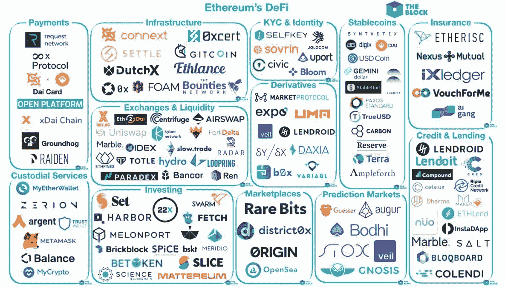
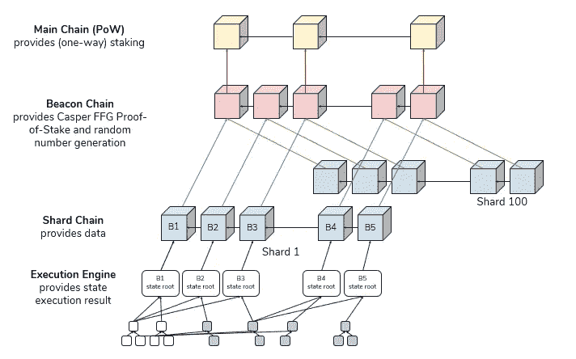
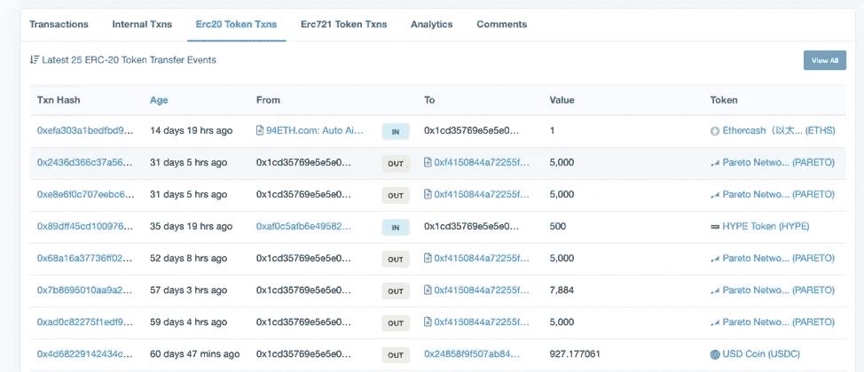

# 2019 年以太坊的一切都错了

> 原文：<https://medium.com/coinmonks/everything-wrong-with-ethereum-in-2019-774ad7a66a27?source=collection_archive---------0----------------------->

这份国情咨文的目的是批评以太坊项目的某些方面，并让人们意识到可以解决的问题，同时打击对加密货币和区块链的普遍无知。

以太坊是一个加密货币网络，它提供了一种新的货币“以太”，可以与比特币和美元等国家货币相媲美。与比特币有着相同的区块链根源，它的功能与那个家族一样，需要与众不同的品质才能脱颖而出，而这些与众不同的品质非常广泛，并独自开创了全新的行业，为政府工作。

以太坊是“世界计算机”，也是新的“去中心化金融”(“DeFi”)生态系统的支柱。要知道这些东西和它的原生货币“以太”关系不大。许多人希望通过购买以太从以太坊平台的成功或扩散中获利，希望更多的人想使用以太并将以更高的价格从他们那里购买以太。这不是从以太坊平台中获利或发表意见的方式。以太在扩展的特性集中几乎没有用处，只是需要帮助以太坊网络保持防篡改，它可以被忽略。鉴于公众有兴趣想象以太的需求受到以太坊网络使用的显著影响，我们可以在明年重新审视这一点，看看对话是否发生了变化。

“DeFi”离不开“世界计算机”，所以我们先来分解一下世界计算机特性。

# 2019 年以太坊的一切都错了。

**世界计算机**

以太坊是“世界计算机”，它由一种叫做以太的气体提供动力。要使用世界计算机，你必须提交以太来支持任何计算。这是两个创新的结合:第一个是一个由个人计算机组成的网络，所有的个人计算机都存储一条指令的相同结果，这样做有一个市场价格。

人类在报时时时就像一台世界计算机。几乎所有人都有一套规则和协议，他们用这些规则和协议来查看自己的模拟时钟，并得出相同的时间结果。没有心灵感应或任何其他类型的网络，人类知道现在是什么时间。以太坊的目标是给计算机同样的能力来进行更复杂的计算，同时记录所有的计算机，事实上，得出了同样的结果。显然，人类报时会与他们认为的时间略有偏差，在类似的人驱动的系统中，我们必须在记录中取平均答案。此外，我们还会开始听从某些人的意见，他们掌握着更具体的技术来判断时间。当然，计算机总是精确的——或者至少每次都会计算出相同的不变输入的乘积——所以这个网络的目的只是确保一台计算机不会引入坏数据并记录下来。在电影《少数派报告》(Minority Report)中，三个有心灵感应的人类“先知”一起工作，以确定犯罪是否即将发生，从而允许执法部门逮捕尚未做错事的人。情节的转折是，其中一个“先知”正在介绍虚假的未来事件，他们为此拍了一整部电影。以太坊网络防止错误的计算获得共识，记录共识是什么，并使记录防篡改。因此，以太坊网络不再相信微软或你的当地政府会永久保存记录，而是去做。

Photo by [Jonatan Pie](https://unsplash.com/@r3dmax?utm_source=medium&utm_medium=referral) on [Unsplash](https://unsplash.com?utm_source=medium&utm_medium=referral)

怎么了?实际上，这部分工作得非常好。突出的问题是一次可以进行多少计算，以及可以存储多少结果。2019 年，已经有其他几个拥有自己的加密货币的网络在做同样的事情，但更快，更便宜，适用于更大更复杂的计算——所以更好。它们都引入了不同的安全妥协来实现这一点，但也许市场可以简单地承受这一点。也许，微软或你的当地政府根本不需要一个完全防篡改的区块链网络来成为一家价值 1 万亿美元的公司或保持人们的信任。

世界计算机允许人们运行“分散应用程序”或“dapp”，发音为 de-apps(或 dapp)。这是尚未确定的术语和发音，就像在电子邮件这个概念作为电子邮件保留在词典中之前人们如何写电子邮件一样。dApps 通过将大量业务或服务卸载到以太坊网络的公共设施上，节省了开发者的时间和资源。有像 [Cryptokitties](https://www.cryptokitties.co/) 这样的游戏，其中数字收藏品是由实际稀缺而不是游戏开发商的承诺来强制执行的，还有像 [Pareto Network](https://pareto.network/) 这样的市场情报服务，其中市场变动信息可以匿名提交并透明支付。这些 dApps 的一个常见子集是分散金融或“DeFi”服务。

**DeFi**

分散的金融生态系统已经很大了。这些都旨在提供不受地区限制的更快捷的金融服务。这些是无国界的、全球化的、平等主义的金融服务。

在许多文化中，人们倾向于希望一些人无法进入金融系统。在某些情况下，他们将繁荣与道德联系起来，他们认为，因为有人不遵守他们想象的社会契约，他们就不应该被允许巩固资本。资本本身不能区分，考虑这些相关的事情是一种想象力的延伸，但影响可能是真实的。提供金融服务的私营企业任意取消与客户的关系。在其他情况下，这被解释为利用国家权力阻止某些群体进入金融系统。在美国，获得贷款买房——“美国梦”——一个在上个世纪曾短暂风靡许多人心灵的迷因——不是非欧洲人，特别是非洲裔人普遍拥有的梦想，直到 20 世纪末。几个世纪后，地主和投机者已经开拓了产业，控制了世代财富。在许多其它市场，无论导致这种结果的环境有多么微妙，你都会看到人们被挡在财富创造体系和全球资本市场之外。社会因经济增长和所有参与者的生产力而繁荣。DeFi 摧毁了一些参与者通过私营企业或国家限制其他人生产力的能力。在 DeFi 和区块链生态系统之外，人们和监管者实际上将“没有银行账户的人”视为受害者，他们需要银行账户。没有银行账户的人仍然更多，这种技术使他们能够跳过银行的整个概念，同时为投资者提供复杂的金融产品。

一个东道国宣布一个附属国家的所有居民都是没有公认国家身份的恐怖分子，并决定他们不应该获得银行服务，更不用说信贷和投资机会，这已经不再重要。它不再需要外交解决方案，因为国家在这方面的作用已经完全去中介化，而 DeFi 企业/服务没有能力区分人类参与者的属性。这在 2019 年是否有争议并不重要，唯一重要的是认识到国家对守门金融的垄断已经结束。它已经随着人类元素一起蒸发，被自治的以太坊网络所取代，它根本不关心人类试图强加给其他人的权力整合。一个短暂的机器赋予了这个星球一种公共资源，它不关心这个星球的历史，让人想起 2300 年前柏拉图描述的*以太*国家机器和元素。使用能源和资源使金融排斥永久化只会加速 DeFi 服务的增长，并破坏中央集权的现任者的预算(也很可笑，分裂了政府从中获得权力的人，继续下去)，到 2019 年，使用这些服务的人已经远远不止是边缘化的人。

DeFi 服务提供保险、股票交易、银行类服务等等。但是直到你看到这些服务之间的共性，你才知道为什么。提供 DeFi 服务的企业永远不会保管你的钱。当你使用股票交易所或银行时，你把钱存在那家公司。你必须信任公司，信任管理条例，以确保公司不会只是拿走你的钱。有时你还是会失望而归！你发现你不能取钱或使用你的钱，或者你发现你不能再使用服务，因为公司取消了与你的关系。另一方面，公司本身不得不在遵守银行法规、投资者法规、消费者保护法规等方面花费大量资金，这意味着昂贵的律师和人员，通常都是因为他们接受存款或保管客户的钱。当一个 DeFi 公司能够提供完全相同的服务，而不需要保管你的钱，他们可以免除许多规定，你也不需要担心企业拿走你的钱。DeFi 服务的上市时间也更短，因为它们不必申请监管机构的批准，也不必担心当地的法规，可以立即为全球提供服务。其他时候，DeFi 公司的监管豁免来自于没有已知的人来制裁。政府将需要关闭整个以太坊网络，以防止不符合/未经许可的 DeFi 服务无法访问，以太坊网络本身使这一尝试变得昂贵且有利可图。

如果以太是唯一的本地货币，而它只是天然气，DeFi services 让你交易和投资什么？嗯，作为市场上最热门的资产发行平台，以太坊用户已经在以太坊网络上制作了真实世界资产的数字表示，以及新的纯数字资产。甚至还有美元与实际美元一对一交易的竞争版本。以太坊社区和开发人员积极致力于各种标准和协议，以供世界计算机识别和计算。这些被称为 ERC“以太坊征求意见”和 EIP“以太坊改进协议”。其中最具纪念意义的是 ERC20，它指的是可替代的数字资产。这仅仅意味着这是以太坊上第 20 个被提出来征求意见的提案。(更严格地说，它并不意味着连续第 20 次，只是碰巧被标为#20 的那一次。推出 ERC20 资产或“代币”的公司开创了收入模式，撼动了现有公司，并引起了全球监管机构的关注。自 2017 年以来赚取了数十亿美元。DeFi 服务允许人们投资 ERC20 资产并管理风险。ERC20 作为一个概念已经作为一个形容词进入了词典，意思是“可替代的数字资产”，尽管该标准本身已经变得过时，有利于证券的 ERC777、ERC1404 和许多其他标准。在其他区块链上，例如 Tron，他们的令牌标准被称为 [TRC20，尽管它不是任何东西的第 20 个](https://developers.tron.network/docs/trc10-token)。对于可替代的数字资产来说，这是可以识别的。这种措辞是明年要重新审视的东西，看看它是否仍然存在于集体意识中，或者已经被其他东西所取代。

分散的交易所很受欢迎，但实际上开始自愿遵守法规，因为它们没有利用最分散的业务，可能会受到制裁。相反，许多交易所现在开始关注他们服务的“非托管”方面，而不是“没有企业主要扔进监狱”方面。让我们看看这种情况在未来一年将如何发展，监管机构一直在采取合作的方式，因为很明显，如果他们真的积极制裁，只会让技术发展得更快，并永远剥夺他们的权力。

DeFi 是一个有趣的增长市场，但由于用户体验的特殊性和复杂性，许多 dApps 并没有多大用处。以太坊的其他更快、更便宜的继任者也提供并行或竞争版本的 DeFi 产品。最后，如果它们真的有很大用处，那么它们会冒着由于[使用太多气体](https://ethgasstation.info/gasguzzlers.php)而导致以太坊网络拥塞的风险。记住，乙醚是气体。

**以太是气体**

credit: [district0x](https://education.district0x.io/general-topics/understanding-ethereum/what-is-gas/)

以太是以太坊网络的加密货币，也是基本单位。以太的命名很多，很难记。“Gwei”是以太的一个流行的次单位。

以太唯一的本地用途是作为以太坊计算机的付款，进行你的穿孔卡等级计算，并永久保存结果。参与的计算机在这个问题上没有真正的选择，所以在计算机耗尽燃料之前尽可能多地进行计算更合适。这是一个供应系统。

由于使用计算方面是非常复杂和违反直觉的，所以人们只是使用以太作为支付系统。人们用乙醚来换取商品和服务，以此来替代像美元这样的国家货币。人们拥有以太，并用它来投资项目，这些项目最终会给他们带来更多的以太。在这方面，它与人们使用比特币的方式没有什么不同，以太交易的速度更快。

鉴于这种常见的支付用例，当人们提到以太坊时，他们指的是加密货币以太。没人说以太。他们可能会简称为“eth”，把“EETH”读作不带“T”的“牙齿”，例如，“我发了 5 eth”。鉴于如此多的东西以 Eth 的面值定价，一些人可能会采用比特币社区的术语，加上一个形容词，并说“这花了 500 eth sats”。人们不再使用“500 gwei”这样的术语，而是更多地使用先前存在的比特币经济中的 satoshis 或 sats。

除此之外，市场上的乙醚远远超过需求。任何人在以太坊生态系统中通过购买以太来表达他们的热情可能会受到伤害。这可以通过查看[完整区块](https://etherscan.io/txs?block=8499799)来量化:在编写本报告时，区块的天然气限制为 8，000，000 天然气，平均天然气价格为 6 gwei。这意味着一个矿商找到了创建要添加到区块链的区块的特权，并且包括了等待包含在新区块中的未确认交易的最佳数量。最佳交易数量意味着确定可以从用户添加到其交易中的交易费用中赚取的最大份额——以便更快地被包括在一个块中。这个矿工从所有这些交易中赚了 0 . 13 乙醚。他们从创建该块中获得 2 以太，从交易中获得 0.13 以太。实际使用 2 个乙醚作为气体需要 15 个街区，而在这个过程中会产生 30 多个乙醚。乙醚不可能是稀缺资源。即使是使用以太网作为抵押品的 DeFi 应用程序也只取得了很小的进展，因为它们也接受其他数字资产作为抵押品。一个卡特尔是必要的，以保持足够的价值，让矿工保持激励，以发挥作用。(矿商有成本，通常会将其收益变现，这增加了任何工作证明加密货币的抛售压力)。

开发者也注意到以太坊网络实际上也不需要以太作为气体！有[提议](https://github.com/ethereum/EIPs/issues/865)通过 EIP 来规范矿工如何接受除乙醚以外的资产作为支付！

没有人需要推测量的乙醚。即使是最复杂的以太坊开发者也只需要一小部分以太坊，仅仅作为库存来支付他们的计算。

在 2019 年，甚至对冲基金也通过过度投机购买以太来表达他们对以太坊的热爱，这种兴趣的表达似乎缺乏经济现实，只是在等待更大的傻瓜，因为过去有更大的傻瓜，因为几年前以太的交易价格上涨了 800%。让我们明年再来讨论这个问题。甚至有加密指数基金仅仅投资于前 5、10 或 20 种最大的加密货币，希望它们最终会涨价。以太波动相当大，但仅基本面经济学不支持它，只有投机狂热——这在历史上是一种完全脱离经济现实的盈利策略，但随着市场成熟，现实将变得更加重要。

**乙醚作为必需品**

以太坊的防篡改安全模型确实依赖于矿工——运行计算机来寻找交易的人——作为找到交易的交换，他们赚取新创建的以太，他们还赚取用户进行交易时支付的以太交易费。乙醚的价格需要足够让矿商保持兴趣，同时对于恶意矿商——少数报告中的坏“预测”——来说又太贵，以免引入不正确的数据。只要 51%的矿工说的是实话，那么这个系统就能完美运行(见“51%的攻击”)。这与其他“工作证明”区块链网络相同。

以太坊仍然有一个过渡到“利益证明”(PoS)而不是“工作证明”的延伸目标。事实并非如此，因为利益证明并不是一个经过验证的安全模型，但工作证明在速度和可伸缩性方面有已知的限制。自 2014 年 Vitalik Buterin 推出以太坊以来，这一直是一个已知的问题和难题。五年后，维塔利科·布特林看起来更像是昙花一现，无解。这很好，只是他不能承认这一点，因为这对于很多相信以太坊在 Vitalik 的可行性的人来说是不好的。事实是，以太坊无论如何都会运行良好，如果你接受以太不是稀缺的，不是天生有价值的，并且没有什么理由让供应冲击使其更有价值。以太坊基金会和一些 DeFi 项目的目标是创造确保以太稀缺的环境，只是为了娱乐投机者和持有大量以太的人，包括他们自己。比如石油输出国组织。记住，乙醚是气体。

**扩展和未来增长**

以太坊主网络是其自身成功的潜在受害者。如果任何 DeFi 应用程序或任何游戏获得牵引力，以太坊网络就会被削弱，直到用户体验变得如此糟糕，以至于 DeFi 应用程序或游戏停止运行。更实际的是，这意味着在你之前会有很多交易，你可以通过支付更多的汽油来跳过这条线。它通过变得昂贵来自我调节。上一次这种自我监管发生在 2017 年底，许多计算机根本无法足够快地识别交易，因此这些交易只是被丢弃，从未被记录。这是一次可怕的用户体验，因为不清楚发生了什么。希望以太坊软件本身已经有所改进，能够更好地处理负载。

这个已知的问题是为什么股权证明在 2014 年被考虑，并被永久推迟，因为股权和安全性证明是一个矛盾，安全版本尚未发明。在股权证明网络中的交易可能比在工作证明网络中的交易更多。

但是最近，竞争对手已经尝试了不同的实验，其中一个被称为委托股权证明或 DPoS。基本上，人民选举代表是因为直接代表的安全模式在一个大的地理区域内崩溃了。我以前在哪里听过这个？所有的竞争对手，如 EOS、Tron、币安连锁店，甚至 Libra 都在使用 dpo，其代表被称为“验证者”。因此，现在不需要世界上大多数采矿计算机同意单一的真相来源，你只需要 10 或 20 或 100 台非采矿计算机同意单一的真相来源。这意味着他们可以以更低的成本更快地达成共识，并随后进行更复杂的计算。基本上，较大的文件(事务和块)是在少数已知的具有快速互联网连接的计算机之间传输的，而不是在世界范围内未知数量的具有不稳定互联网连接的计算机之间传输的。坏处呢？防篡改能力丧失。事实上，在 EOS 区块链上，它被称为不防篡改的功能！EOS 验证者在一个不透明的过程中逆转交易，他们试图重建仲裁和法庭，以增加人们对其制度的信心，从而创造出某种法治的表象。政府也可以很容易地参与这一进程。一个我们可能不同意的政府。这就是妥协。以太坊仍然是公认的最高效的世界计算机，所有其他试图更高效的系统都不得不在安全性上妥协，因此，观察以太坊如何试图提高其带宽是很有趣的。

由于以太坊主网从工作证明到利益证明的过渡已经连续推迟了 5 年，而且基本上是无限期的，Vitalik 勋爵等人提出了 Eth 2.0，即“信标链”，它基本上是一个作为侧链运行的独立区块链。如果你不能合理地过渡到股权证明，为什么不推出一个单独的区块链这是！这意味着一个备用的记录链，用户可以在其中卸载一些计算，以保持主以太坊链不那么拥挤。由于市场已经表明它可以忍受更快、更弱的安全模型，并有信心在这些模型上建立数十亿美元的业务，以太坊网络也可以为用户创造这些选择。

Only the main chain exists so far, and this whole editorial is about just that chain. Wait till Beacon comes out.

以太坊有几个扩展方案，包括侧链和碎片的混合。信标链似乎是这些提议中最新也是最严肃的。但是有人记得等离子吗？2017 年，Vitalik 推广等离子作为以太坊的分片和缩放解决方案。分片仅仅意味着小的非无限区块链被存储在相关的计算机中，只有多个记录的结果在将来的某个时候被世界上所有的计算机存储在主无限区块链上。所以让我们明年再来看看这个。

**行业**

以太坊的灵感来自比特币，但它与比特币有着不同的发展。维塔利克·布特林(Vitalik Buterin)试图为比特币做出贡献，被当时时期的比特币开发者推开。他的方法是建立一个能够处理复杂计算的区块链网络，而不仅仅是支付。他需要的复杂计算是能够发行资产，以太坊已经成为这一领域的市场领导者，而比特币却停滞不前。

还有其他从比特币演变而来的区块链网络，还有从以太坊演变而来的区块链网络。这两个没有共同的祖先。

除了竞争对手区块链，如创可用。也有被财富 500 强企业使用的许可区块链，他们正在以自己的方式积极开发以太坊生态系统。

通常，这些系统根本不使用天然气，并有自己的共识模型，迄今为止似乎对摩根大通和会计公司有效。

美妙之处在于，开发者可以使用相同的代码库在以太坊、Quorum 和 Tron 等平台上启动应用程序。对于寻找高增长技能的人来说，“以太坊发展”也是私营部门发现有用的东西！尽管目前，在以太坊主网上进行自我驱动的软件开发比替别人做更有利可图。要认识到，并不是科技公司在为 Solidity(以太坊的编程语言)和使用 Rust、Javascript 或 Web Assembly 的以太坊开发者招聘。金融和会计公司正在试验一个他们钟爱的项目，他们已经把他们的 It 员工当作一项支出，而不是一项投资。这个领域的初创公司也没有那么大。推出自己的数字资产或迎合其他人的想法要有利可图得多。你也不需要成为一名程序员来加入做这些事情的团队。明年再来重温一下劳务经济吧！

**使用以太坊**

以太坊的用户体验相当糟糕。这说明了很多，因为它可能是区块链和分布式账本领域最好的。以太坊应用程序可以做很多事情，但是帮助人们做这些事情的可视化界面实际上并不存在。

一个数字货币系统最起码需要的是一个允许人们发送和接收数字货币的应用程序。以太坊有这些，它们被称为钱包。加密货币爱好者和投机者为他们交易的任何加密货币寻找这些，在这种情况下，他们看到以太的价格移动，他们想要一个以太坊钱包。但当你想与 DeFi 生态系统互动时，只有少数钱包能做到这一点，你通常会牺牲便利性和熟悉度来使用这些钱包。所有的钱包应用程序也会随着时间而改变，就像任何试图改进自身和用户群的软件一样。

这让事情变得扑朔迷离。

当你想超越来回发送以太网，升级到使用像 PARETO 这样的 ERC20 令牌时，你会发现许多钱包都不会显示你甚至有一个 ERC20 令牌的余额。你的整个投资组合，看不见！存储以太坊资产最安全的方式是使用硬件钱包，如自带软件 Ledger Live 的 [Ledger Nano X](https://shop.ledger.com/pages/ledger-nano-x?r=2e81f072c735) 。ERC20 标准于 2015 年 11 月首次提出，开发者在 2017 年初开始为他们的业务创建资产并出售它们，ERC20 标准于 2017 年底获得批准。2019 年 9 月，Ledger Live wallet 开始让人们看到并转移他们的 ERC20 资产。🤦🏽‍♂️在最初提议四年后，批准两年后。这意味着在 2017 年和 2018 年臭名昭著的投机需求时期，几乎没有人能够安全地交易他们的以太坊资产。说你错过了那艘船很容易，但是想想那艘船当时真正的样子:在公海上摇摇晃晃的木筏。在臭名昭著的 2017 年牛市期间，你的投资组合更有可能被错误或黑客抹去，而不是你实际上从投机热潮中获利。

好消息是，大多数钱包都是兼容的。虽然你的硬件钱包的官方应用程序受到了不必要的阻碍，但你可以将你的硬件钱包与 Metamask 或 MyEtherWallet 或其他服务一起使用，在那里你可以看到你多年的 ERC20 余额。相比之下，当你使用配置不正确的钱包时，在比特币上发行的资产有可能被永久删除和擦除。以太坊上并不存在对这种情况的真正担忧(除非有人特意制作了一个恶意系统)。

在以太坊块浏览器上查看交易历史是很棘手的。他们试图展示交易链，但是对于一个帐户/地址来说，以太坊网络上有太多类型的交易和计算要展示。

View of an Ethereum address’ transaction record

以太扫描是一个块浏览器，以最全面的方式显示事务的历史。它主要尝试按资产类型区分交易:从一个人到另一个人的普通以太网交易、从智能合约到个人的以太网交易、ERC20 令牌的交易和 ERC721 令牌的交易(不可替代的令牌或收藏品)。它似乎没有办法将所有这些类别合并到一个列表中。

在以太扫描分崩离析的领域，其他公司已经开始了他们自己的块探索者。他们通常擅长一件事，以直观的方式揭示发生的记录，但从来没有完整到以直观的方式显示所有记录。

这里似乎有一些优秀的付费产品。让我们明年再来讨论这个问题。

所以，你想成为一个接受以太或基于以太的美元资产的在线或个人商家，同时遵循最佳实践并使用现成的开源代码获得良好的用户体验？运气不好！你必须使用受相同银行监管规定约束的支付处理器，这些规定加重了人们更熟悉的非加密货币产品的负担。让我们明年再来看看这个。

**监管**

比特币抢了风头，促使政府对其进行监管澄清，并对基于比特币的金融产品进行监管批准。1500 亿美元的市值对此有所帮助。以太坊第二名 180 亿美元的市值导致了不确定性。没有以太坊期货合约来管理以太气体的未来价格。股票市场上没有以太坊 ETF。我们很难从美国证券交易委员会(SEC)那里得到乙醚不是证券的观点(迄今为止，董事和委员们的评论并不是 SEC 本身的观点)，或者从 CFTC 那里得到乙醚是一种商品的观点，因为它与天然气有相似之处。CFTC 声称比特币是一种商品。

以太坊促使各国政府就使用以太坊平台发行资产的主题做出回应。ERC20 再次回到视野中，因为它加快了证券法政策和托管政策。至少可以说，这很有意思，但在许多相关司法管辖区的情况下仍未解决。这使得开展业务的成本高于现有的金融服务，尽管技术本身将成本降低到现有金融服务的一小部分。法律上的调整将改变这一点，美国国会委员会正在审议一些法案，如令牌分类法法案，该法案迄今因少数几个共同提案国而搁置。让我们明年临近国会会期结束时再来讨论这个问题。

这里的坏消息是，还没有那么多可写的。ERC 和 EIP 提出了几个提案，旨在使以太坊资产发行技术适应公共和私营部门的法规，并且世界各地都提出了更新法规本身的法律，以减少这种必要性和不必要。这一切都发生在 DeFi 服务增长的方式使得监管机构无法执行任何现有法律的时候。

**结论**

所以，任重而道远！关于无许可技术的伟大之处在于，你也不需要许可就可以做出贡献！我发现这些问题，并帮助事情向前发展，无论是个人还是通过我的公司 [Blockology](https://blockology.org/) (区块链开发公司 d/b/a Blockology)，我们在分布式账本和区块链空间建立公司并为其提供咨询， [Pareto Network](https://pareto.network/) ，我们在那里使用区块链技术进行信息交易，我还为其他人提供咨询。你也可以！解决这些问题使我所有的公司对更广泛的社区更有活力和有用！如果您需要导航密码空间的指导，请联系我们！

私营行业花费了过多的资源来寻找专家，并将具有广泛能力的人边缘化，但以太坊、区块链和加密空间在他们能够应用自己的情况下奖励*通才*。这种平行经济是真正的机会之地，我希望你能清楚地把它推向前进。

大家收工了！在未来的系列中，我计划强调整个加密空间的状态，以及 Monero 等其他加密网络，请务必阅读我关于比特币的另一篇[国情咨文](https://hackernoon.com/everything-wrong-with-bitcoin-in-2019-bl803xp9)。我们必须每年重温一次，看看是否有任何改进！

你可以在[推特](https://twitter.com/1blockologist)和[领英](https://www.linkedin.com/in/eric-lamison-white-749873112/)上关注我

如果你喜欢这篇文章，点击👏按钮，你可以在评论区随意提及不正确或有争议的方面。

> [直接在您的收件箱中获得最佳软件交易](https://coincodecap.com/?utm_source=coinmonks)

