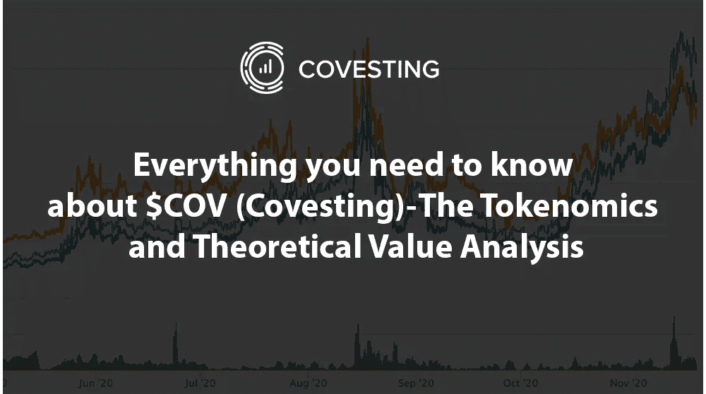
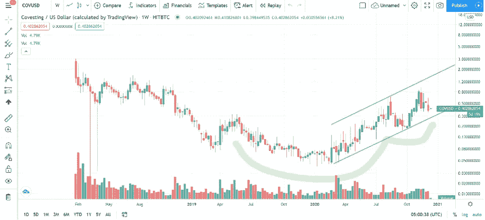
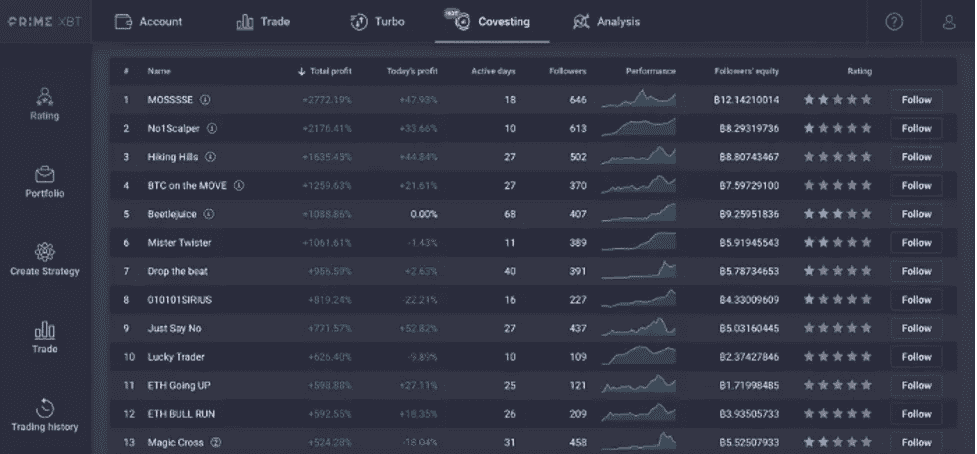
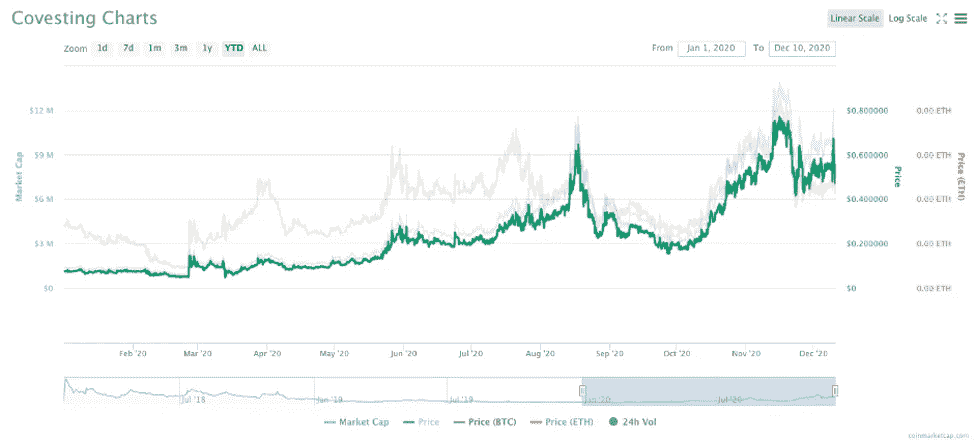
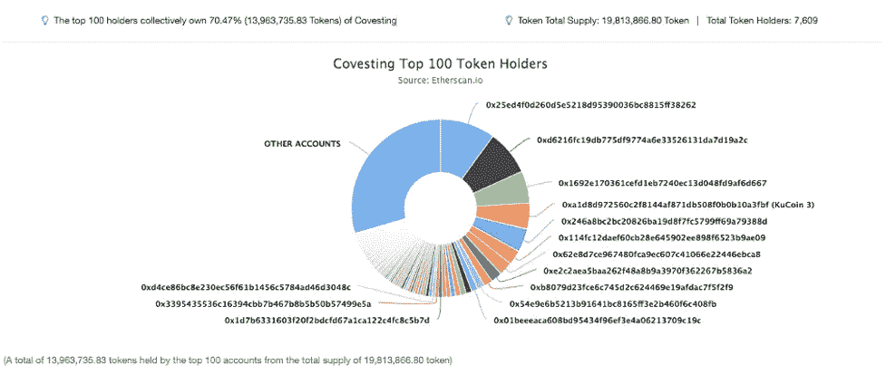
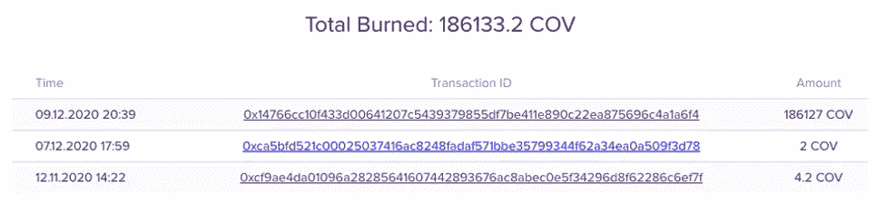
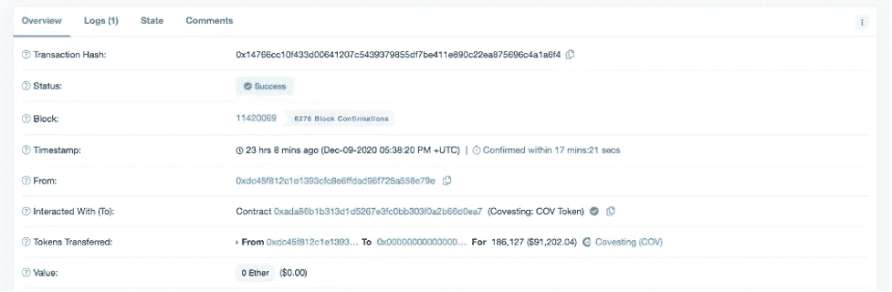
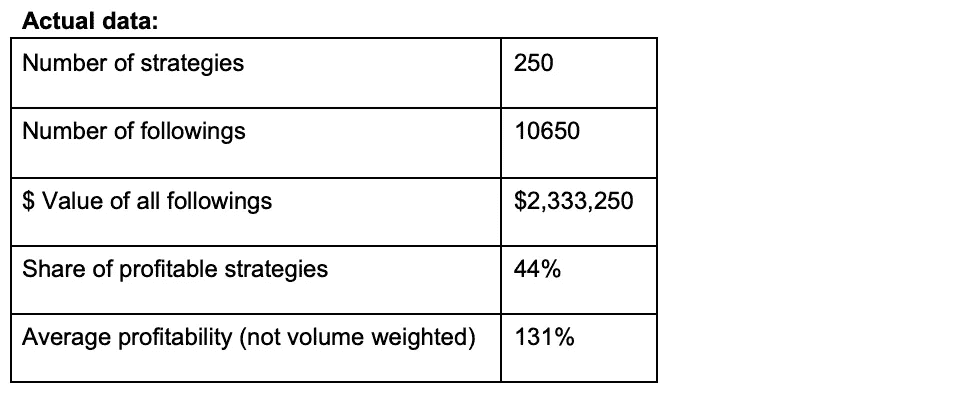
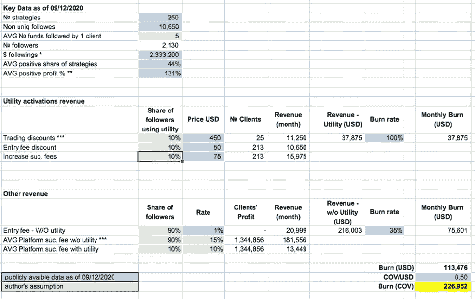
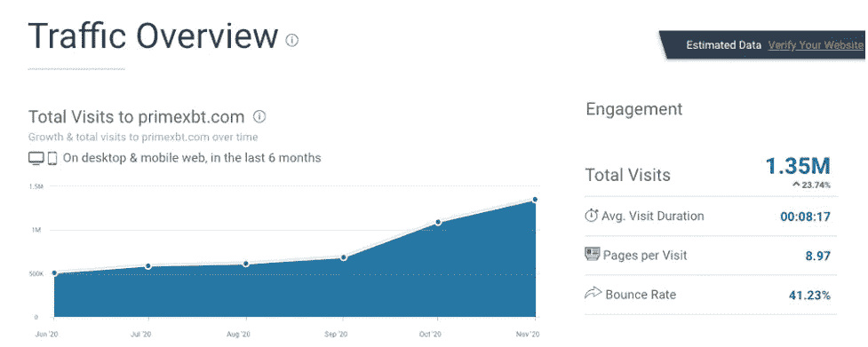

# 关于$COV，你需要知道的一切——记号经济学和理论价值分析

> 原文：<https://medium.com/coinmonks/everything-you-need-to-know-about-cov-covesting-the-tokenomics-and-theoretical-value-analysis-dee8f56c706b?source=collection_archive---------0----------------------->

我从 2016 年开始参与加密货币(主要是比特币)交易。我喜欢比特币交易想法的原因之一是，它的价格动态类似于其他流动性商品(如黄金、钯、银等)。

然而，除了供求分析和影响所有资产的美元货币供应和通货膨胀之外，很难对未来比特币价格进行任何基本面研究(同样，这类似于商品)。

当然，和许多人一样，我在 2017 年年中发现了 ico 和 altcoins，我喜欢这样的事实，即一些项目提供了有趣的价值主张，并且经常有实际的

代币价格与围绕代币构建基础架构的 DeFi 资产/应用程序/交易本身的健康状况之间的正相关关系。

从那以后，通过了解覆盖这一广阔市场的不同代币，我一直在寻找新的有前途的公司，以根据代币经济学来估计我的潜在投资回报率，并计算在所有代币实用程序实施后，或者一旦公司进入全球增长阶段，代币可能达到的潜在价格。

我在区块链和加密货币领域发现的一件大事是，这项技术有如此多的潜力和可能性，因此，与区块链建设项目相关的代币通常被视为成功的晴雨表。不仅如此，它们还经常被视为衡量一种新的区块链/投资/金融理念是否成功的标准，由于其未来的潜力，这种理念仍然是无限的。

# 寻找宝石

没有多少项目熬过了 2018 年的秘密冬天，事实上，在所有通过 [ICO](https://en.wikipedia.org/wiki/Initial_coin_offering#:~:text=Fewer%20than%20half%20of%20all,ICO%20from%20January%E2%80%93June%202018.) 机制筹集资金的项目中，只有大约 [10%的项目成功发布了可行的功能性产品。大多数人要么只是简单地骗走了筹集的资金，而其他人开发的产品要么与他们在白皮书中陈述的最初愿景完全不同，要么没有代币的经济用途(效用)。](https://enterpriseriskmag.com/why-90-of-initial-coin-offerings-icos-security-token-offerings-stos-fail-and-much-of-the-rest-may-follow/)

意识到在这样的计划中损失了多少资金是非常令人难过的。然而，这并不妨碍成功的公司证明，当业务管理得当时，令牌有适当的用例——它可以提供良好的回报。

推出的最著名或最成功的代币之一是币安的 BNB 硬币，这种代币今天仍在不断增加，并且用途越来越广，它是币安交易所的实用代币，也是 T2 的 erc20 代币。

如果用户使用 BNB 支付，他们可以在交易费用上获得折扣。BNB 的总供应量为 2 亿，有一个令牌燃烧机制，将燃烧其平台上产生的部分交易费用。在币安将其转化为币安链之前，BNB 的价格已经从 0.1 美元的发行价上涨到 40 美元的高点。它目前的交易价格仍为 30 美元。如果这不是一个令人印象深刻的回报，我不知道什么是。

[FTX 的](/coinmonks/ftx-crypto-exchange-review-53664ac1198f)代币 [FTT](https://ftx.com/en/ftt) 是另一个表现出良好增长的成功硬币的例子，尤其是就其市值而言。FTX 加密货币衍生品交易所于 2019 年 4 月推出，提供个人和一篮子加密资产的期货和杠杆代币，场外交易。

FTT 是为 FTX 加密货币衍生品交易所设计的本地令牌。它有许多用途，旨在使其用户受益并增加平台周围的网络效应。它以 4740 万美元的市值开始了它的旅程，但目前的市值为 4.76 亿美元，是那个数字的 10 倍以上。

就回报和潜力而言，另一个有趣的标志是 Tezos。像比特币和以太坊一样，Tezos 是一个利用区块链技术的分散式账本。像以太坊一样，Tezos 的设计也是为了利用智能合约。据开发商称，“Tezos”一词在古希腊语中是“智能合同”的意思。

在一个充满希望的开始和非常成功的初始 ICO 之后，Tezos 被无数的延迟和法律问题所困扰。然而，Tezos 在加密货币熊市中幸存下来，部分原因是其独特的股权证明机制。2019 年 10 月至 2020 年 2 月，技术开发区的价格上涨了两倍多，达到历史新高。截至 2020 年 2 月，Tezos 再次引起关注。

最后，我遇到了 [Covesting Token (COV)](https://covesting.io/cov-token) ，一个建立在以太坊区块链上的 erc20 令牌，它是在 [PrimeXBT 交易所](/coinmonks/primexbt-review-88e0815be858)上运行的 Covesting 平台的原生令牌。

Covesting 是一个[复制交易](/coinmonks/top-10-crypto-copy-trading-platforms-for-beginners-d0c37c7d698c)平台，允许没有时间也没有交易专业知识的个人通过跟踪或标记他们的账户到另一个交易者那里，从市场的变动中获益。

转让令牌在几个方面使持有者和[转让模块](http://primexbt.com/covesting)用户受益。

例如，策略经理可以减少他们的交易费用，追随者可以激活特定的 COV 令牌实用程序以消除入场费，此外，追随者从所有盈利交易中赚取的百分比分割可以以有利于追随者的方式增加。

像 BNB，一个主要加密交换的公用令牌，COV 有许多相似之处。例如，令牌的焚烧对 COV 具有重要意义，因为 COV 令牌的总供应量并不大。COV 代币的总发行量只有 2000 万张，目前的发行量为 1800 万张。事实证明，像 COV 这样的象征性政策对其价格有重大影响。

因此，购买这种代币可能是非常有利可图的投资。如果一个人错过了 BNB，你不会错过下一个令牌。与 BNB 的象征经济学相似，COV 是一个可能提供这种潜力的象征。

事实上，我敢推测 COV 价格上涨的潜力 ROI % wise 可能比 BNB 更大，因为 COV 的代币少得多，而 Covesting 的目标市场更大。币安还不允许他们的交易员客户通过让别人复制他们的交易来赚取额外收入。因此，Covesting 的用户增长潜力可能比币安这样的典型经纪公司更大。

随着时间的推移，越来越多的用户将使用 Covesting，随着越来越多的用户使用 COV 支付交易费用，越来越多的 COV 代币将被烧毁，从而减少其供应。随着越来越多的用户因 COV 提供的好处而购买它，可能会出现供不应求的情况，导致价格不可避免地飙升。

COV 的周线图也显示底部可能已经到位。在 2020 年初触及 0.05 的低点后，价格反弹了 7 倍，似乎形成了一个杯子和手柄看涨形态。

除此之外，价格也在上升趋势通道中移动，目前，0.34 美元附近的区域是趋势通道支撑，将是做多的好区域，因为它也是前阻力转向支撑，以及杯子和手柄的颈线。

这种支持似乎是持有，因为价格已经反弹到目前的 0.40 美元。当对颈线支撑的再次测试成立时，它应该确认看涨走势，目标在 0.80 美元到 1.20 美元之间，代表至少 250%的上涨潜力。

# 展望未来

我相信大多数前 100 名硬币不再有三位数的投资回报率(就像，币安的 BNB 硬币不太可能很快达到 200 亿美元的市值)。相反，我在寻找隐藏的宝石，这些宝石仍然在雷达下，但作为业务，他们要么接近完成开发并发布产品，要么他们最近发布了产品，并已经有了实际的用例，但只是没有足够的时间来获得必要的牵引力。

在这篇文章中，我想研究的是 COV。这是少数几个经历了加密货币价格快速下跌和加密相关服务需求大幅下降的艰难时期的项目之一。

继续开发其产品，同时削减(优化成本)并[将重点转向 b2b 服务，Covesting](/covesting/cov-token-utility-on-primexbt-is-now-live-dcb56c7cdcf1) 团队做得很好，满足了其在原始白皮书中的大部分承诺，并且在某种程度上超过了这些承诺。我也喜欢复制交易本身的概念，因为世界正在向 p2p 环境转变，而共同投资正好符合这一大趋势。

# 理解为什么 Covesting 是一种新的宝石

Covesting 是一家根据直布罗陀法律成立的全球金融科技公司，为全球零售和机构客户提供最广泛的软件解决方案。Covesting 已经成为世界上第一批[从直布罗陀等监管机构获得](https://covesting.io/)[分布式账本技术许可证(](/covesting/this-is-it-covesting-has-officially-received-their-dlt-providers-license-2dec58fded61) DLT)的公司之一。

[https://twitter.com/covesting/status/1316784210796056576?lang=en](https://twitter.com/covesting/status/1316784210796056576?lang=en)

看一下来自 Covesting 的信息就可以发现，一些[策略](https://www.forexbrokers.com/guides/social-copy-trading)在其平台上获得了近 2000%的回报。

观察一下会议团队，可以发现 Dmitri Pruglo 和 Timofej Voronin 是一个经验丰富的团队，他们都有在盛宝银行和其他投资公司和银行从事传统金融的经验。

Pruglo 在各种资产类别的交易方面拥有超过 12 年的经验:外汇、期权、期货、股票、商品、复杂的场外结构性产品和债券。他还对当今市场上的大多数交易平台有深入的了解，并参与了多种算法交易策略的开发。

沃罗宁是一名经验丰富的股票和衍生品交易员、企业家和加密货币的早期采用者。他第一次接触比特币始于 2012 年，当时他首次将加密货币纳入自己的私人投资组合。沃罗宁于 2008 年在 Argo Traders 开始了他的交易生涯，当时他是一名自营交易员，在那里他不断实施新的交易技术，并在市场历史上最动荡的时期在 LSE 和 XETRA 交易，成为一名专业人士。

有趣的是，Covesting 在 2020 年与流行交易所 PrimeXBT 建立了合作伙伴关系，允许在 PrimeXBT 上的 Covesting 副本交易模块上实现核心 COV 公用事业令牌功能。

PrimeXBT 是一个基于比特币的保证金交易平台，提供对 30 多种资产的即时访问，包括加密(比特币、以太坊、莱特币、Ripple、EOS)、外汇、大宗商品(金属、石油、天然气)和指数。

该交易所成立于 2018 年，目前为 150 多个国家的客户提供服务。该公司的日交易额超过 5 亿美元。在 2020 年 ADVFN 国际金融大奖中，公司获得最佳比特币保证金交易平台奖。

# 什么是 COV 代币

在其核心， [COV](https://covesting.io/cov-token) 是 Covesting 平台的一个实用令牌，旨在与许多第三方交易平台和交易所建立合作伙伴关系，以提供无缝的复制交易体验。每个集成都将包括 COV 令牌工具。COV 令牌将提供多种激励措施，如交易费折扣以及额外的独特功能和好处。

在撰写本文时，COV 的当前市值是 7，478，012 美元，过去 24 小时的日交易量为 41，508.90 美元。目前，流通的供应量是 2000 万份中的 1800 万份。

COV 目前也可以在 [KuCoin](https://trade.kucoin.com/COV-BTC) 和 [Uniswap](https://info.uniswap.org/pair/0x3098dA7aB4F8Ef73659a750E2F61cdDCEFdA21c2) 上使用，他们正在寻找更多的交易所加入，但这一领域并没有出现热潮，因为 Covesting 一直专注于公用事业。

今年 1 月 1 日，硬币的价格是 0.37 美元，随着年底的结束，价格已经上升到 0.41 美元。

Covesting 有一个相对活跃的 telegram 社区，追随者和交易者在这里讨论新的策略、市场趋势和最新的平台功能。

查看[传送电报组](https://t.me/covesting)。

**顶部支架**

有趣的是，与许多其他项目相比，Covesting 在前 100 名持有人中有很好的分布。这是一件积极的事情，因为价格不容易被操纵，而且分布良好，这是良好的加密货币增长和扩张的关键因素。

但由于代币工具刚刚推出，交易代币的现货交易所的交易量还没有增加。因此，由于订单薄，价格似乎仍然对较大订单敏感。

# 商业模式和 COV 令牌工具

Covesting 为使用 COV 令牌的用户提供了有吸引力的激励计划，旨在与许多第三方交易平台和交易所建立合作关系，以提供无缝的复制交易体验。对于它的第一个合作伙伴 PrimeXBT 来说，这个平台上已经有了很多实用程序。

激励方案被设计为尽可能地向代币提供更多的效用，并减少代币的流通供应量。但是，Covesting utility 必须是高度可扩展的，并且可以轻松地转移到其他第三方交易平台，其中 Covesting 平台是根据白标许可协议提供的。

# 系统性令牌烧录

除了 COV 提供的象征性公用事业，该公司的目标是进行系统的[象征性燃烧](https://www.investopedia.com/tech/cryptocurrency-burning-can-it-manage-inflation/)，这在上面已经解释过，并且已经被证明是创造通货紧缩性质的极其有效的工具。

有趣的是，即使 token utility 在 2020 年 12 月 9 日才推出，该公司在撰写本文时仍成功燃烧了 18，6133 COV，相当于 93，066 美元。似乎该公司在平台运营期间分配了一部分收取的费用，直到令牌被集成。

一次令牌烧毁交易，从供应中取走近 1%的令牌

# COV 令牌实用程序摘要

我们已经看到像 FTX BNB 这样的代币交易所是多么成功。即使有一个单一的公用事业-交易费折扣提供了一个惊人的价值主张的情况下，交易量在这样一个交易所逐渐增加。越多的用户在这样的交易所访问和交易——越多的人会使用这个工具来降低费用——对代币的需求就越大。

公用事业交易所代币已经开始被认为是交易所用户的必需品，因为它们的好处是被依赖的，而不仅仅是现在被欣赏。拥有具有功能的实用工具代币的好处在于，对其功能的依赖越多，硬币获得的价值就越大。

由于 Covesting 的目标是与 PrimeXBT 等多个交易平台合作——很明显，与每一个这样的合作伙伴合作——COV 令牌的使用将立即增加数倍，因为他们正在利用现有的用户群，这将立即有效地使用该产品以及 COV 的公用事业。

# COV Tokenomics —机会分析

由于手头数据有限(可公开获得)，我试图计算每月(30 天)潜在(理论上)COV 代币消耗**。请注意，这是一个理论分析，可能不会反映未来实际的代币刻录量。此外，即使在传统的金融世界中，股票并不代表股票的实际基本“账面价值”的情况也并不少见。**

因此，同样的情况也可能发生在目前的 Covesting 案例中。本研究和计算仅用于实验目的— **不要把这当成财务建议。**

在我的计算中，我将使用以下类型的数据:

-实际数据-这种类型的数据是公开的，我设法从 [Primexbt](/coinmonks/primexbt-review-88e0815be858) 网站上的 Covesting 模块中收集。

-假设-这些数据是我用来计算不同场景的纯假设。

用于以下计算的所有数据都是在 2020 年 9 月 12 日收集的。

**实际数据:**

**假设:**

-我们假设每个独特的追随者同时遵循至少 5 种不同的策略。因此，我们得到唯一关注者的数量 2130(通过将 10650 除以 3)。

-我们假设至少有 10%的交易者会使用交易折扣工具，也就是 25 (250 个策略 x 0.3)

-我们假设 10%的用户(关注者)将使用 1%的入场费工具。它激活了 213 个实用程序，而其他人将继续使用该平台而不激活这些实用程序

-我们假设 10%的用户(关注者)将使用 5%的成功费改进实用程序，而其他人将继续使用平台而不激活此类实用程序

-我们假设所有盈利交易的平均交易成功率为 15%(最高为 20%，最低为 5%)

-我们假设 Covesting 将烧掉根据 COV 公用事业激活收取的 100%费用，以及不含公用事业收取的所有其他费用的 35%。

**重要！**在根据报名费(1%)和平台成功率计算 Covesting 模块的收入时——我们仅使用了一次“所有关注的美元价值”的金额——交易者在月初开始关注，并在 30 天后结束。这意味着，如果交易者在此期间执行多次跟踪/不跟踪，费用(入门费和成功费)将会增加。然而，我已经决定坚持这种悲观的设想。

此外，值得注意的是，当前数据不包括我们在 11 月看到的极端情况，在 11 月，多个策略显示了 5000% — 10000%，同时为平台产生了巨额成功费用。此外，在比特币牛市期间，盈利策略与亏损策略的比例也更高，再次导致平台收取的费用更高。

如您所见，一旦我们包括了上述所有可用的数据和假设，我们得出每月的令牌消耗量为 226，952 COV。

现在让我们来看看增长统计数据。PrimeXBT 每月增长约 20%，这意味着 Covesting 模块用户的数量也应该以大致相同的速度增长。

如果我们将所有假设和数字保持在与上述计算中使用的相同的比率，我们会得出以下令牌烧毁场景。

**月 1 日:226952 COV**

**第二个月:226952 COV x 1.2 = 272342 COV**

**COV 月 3 日 326810**

**月 4 日:392172 COV**

**月 5 日:470606 COV**

**月 6 日:564728 COV**

如果这种代币燃烧将保持一致——毫无疑问，它将对 COV 代币价格本身产生积极影响。

# 结论

这是基于公开可用数据的实验计算。实际数字只有 Covesting 和 PrimeXBT 知道。考虑到 covesting 的目标是建立与 PrimeXBT 类似的新合作伙伴关系，并将保持一致的刻录计划，我相信 COV 令牌的未来非常光明。

我个人购买 COV 代币的首选是:

**库币**

[https://trade.kucoin.com/COV-BTC](https://trade.kucoin.com/COV-BTC)

**unis WAP**[https://info . unis WAP . org/pair/0x 3098 da 7 ab 4 f 8 ef 73659 a 750 e 2 f 61 cdcefda 21 c 2](https://info.uniswap.org/pair/0x3098dA7aB4F8Ef73659a750E2F61cdDCEFdA21c2)

这不是财务建议。请在做出任何投资决定之前做好自己的研究。

## 另外，阅读

*   [了解以太坊和网络 3](https://blog.coincodecap.com/go/learn)
*   [密码交易机器人](/coinmonks/crypto-trading-bot-c2ffce8acb2a)
*   [3 商业评论](/coinmonks/3commas-review-an-excellent-crypto-trading-bot-2020-1313a58bec92)
*   [AAX 交易所评论](/coinmonks/aax-exchange-review-2021-67c5ea09330c) |推荐代码、交易费用、利弊
*   [Deribit 审查](/coinmonks/deribit-review-options-fees-apis-and-testnet-2ca16c4bbdb2) |选项、费用、API 和 Testnet
*   [FTX 密码交易所评论](/coinmonks/ftx-crypto-exchange-review-53664ac1198f)
*   [n 零审核](/coinmonks/ngrave-zero-review-c465cf8307fc)
*   [Bybit 交换审查](/coinmonks/bybit-exchange-review-dbd570019b71)
*   [3Commas vs Cryptohopper](/coinmonks/cryptohopper-vs-3commas-vs-shrimpy-a2c16095b8fe)
*   最好的比特币[硬件钱包](/coinmonks/the-best-cryptocurrency-hardware-wallets-of-2020-e28b1c124069?source=friends_link&sk=324dd9ff8556ab578d71e7ad7658ad7c)
*   [密码本交易平台](/coinmonks/top-10-crypto-copy-trading-platforms-for-beginners-d0c37c7d698c)
*   最佳 [monero 钱包](https://blog.coincodecap.com/best-monero-wallets)
*   [莱杰 nano s vs x](https://blog.coincodecap.com/ledger-nano-s-vs-x)
*   [bits gap vs 3 commas vs quad ency](https://blog.coincodecap.com/bitsgap-3commas-quadency)
*   最好的[加密税务软件](/coinmonks/best-crypto-tax-tool-for-my-money-72d4b430816b)
*   [最佳加密交易平台](/coinmonks/the-best-crypto-trading-platforms-in-2020-the-definitive-guide-updated-c72f8b874555)
*   最佳[加密贷款平台](/coinmonks/top-5-crypto-lending-platforms-in-2020-that-you-need-to-know-a1b675cec3fa)
*   [莱杰纳米 S vs 特雷佐 one vs 特雷佐 T vs 莱杰纳米 X](https://blog.coincodecap.com/ledger-nano-s-vs-trezor-one-ledger-nano-x-trezor-t)
*   [block fi vs Celsius](/coinmonks/blockfi-vs-celsius-vs-hodlnaut-8a1cc8c26630)vs Hodlnaut
*   Bitsgap 评论——一个轻松赚钱的加密交易机器人
*   为专业人士设计的加密交易机器人
*   [PrimeXBT 审查](/coinmonks/primexbt-review-88e0815be858) |杠杆交易、费用和交易
*   [Altrady 审查](https://blog.coincodecap.com/altrady-reivew)
*   [埃利帕尔泰坦评论](/coinmonks/ellipal-titan-review-85e9071dd029)
*   [赛克斯·斯通评论](https://blog.coincodecap.com/secux-stone-hardware-wallet-review)
*   [区块链评论](/coinmonks/blockfi-review-53096053c097) |从您的密码中赚取高达 8.6%的利息
*   [Coinrule 评论](https://blog.coincodecap.com/coinrule-review-a-perfect-trading-bot)
*   [最佳区块链分析工具](https://bitquery.io/blog/best-blockchain-analysis-tools-and-software)
*   [加密套利](/coinmonks/crypto-arbitrage-guide-how-to-make-money-as-a-beginner-62bfe5c868f6)指南:新手如何赚钱
*   最佳[加密制图工具](/coinmonks/what-are-the-best-charting-platforms-for-cryptocurrency-trading-85aade584d80)
*   了解比特币的[最佳书籍有哪些？](/coinmonks/what-are-the-best-books-to-learn-bitcoin-409aeb9aff4b)

> [直接在您的收件箱中获得最佳软件交易](/coinmonks/newsletters/coinmonks)

