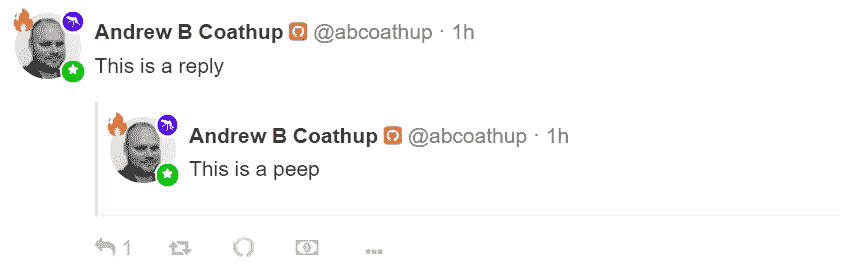
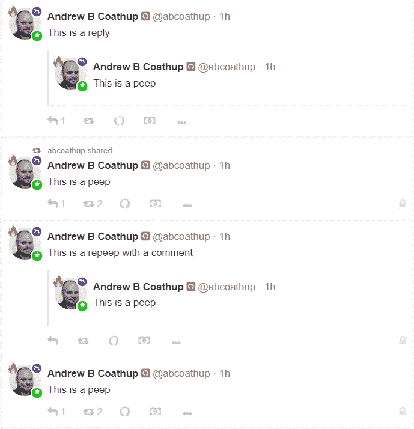

# 去中心化社交媒体的发展——回复不是重复

> 原文：<https://medium.com/coinmonks/evolution-of-decentralised-social-media-replies-are-not-repeeps-dccf2f6d814a?source=collection_archive---------2----------------------->

## 我的 Peepeth 系列的一部分。

## 背景

Peepeth 是一个微博平台(有灵魂)。用户创建显示在提要中的 peeps(帖子)。

目前，所有 peep 都显示在提要中，不管它们是 peep 还是对 peep 的回复。

我认为 feed 应该只包含 peeps 和 repeeps，而回复应该被排除在外。这样做应该会增加用户的参与度。

Peep, repeep with comment and repeep

## 反应

Peepeth 每天都有一个类似的反应，称为 Ens。用户也可以提示很棒的内容。虽然我喜欢这两个功能，但有些人只需要一个简单的反应。为此，可以在回复中使用 [#lkie](https://peepeth.com/t/lkie) 标签([由我创建](https://peepeth.com/abcoathup/peeps/QmQEvgHmMM2j8CDUxvAvuDAa8oQUT3NAxVCmz9QEu8cG5M)，对不起各位)。

用标签、评论甚至表情符号回复的问题在于，简单的回复反应会占据反馈。

如果反馈中不包含回复，我相信我们会看到更多简单的反应，这将导致用户创建更多帖子、获得更多反应、产生更多帖子的良性循环。

## 你好世界

当一个新的社区成员第一次偷看时，这应该是一个大事件，会有很多回复和反应。

尽管目前发生的情况是，一旦社区中的一个成员回复了第一个 peep，感觉就像向网络发送垃圾邮件来添加更多的回复。这意味着新用户错过了他们真正应得的欢迎。

Welcome replies to first peeps

## 早上好波

当我早上醒来时，我会通读隔夜的邮件，然后开始回复。可能会有很多回复。突然，feed 被我的回复取代了。无聊。

当我在当天晚些时候登记入住时，也会发生同样的事情。又一波还是回帖。

目前的选择是不回复，可悲的是，我相信这在很多情况下都会发生。

## 窥视风暴

偷窥风暴往往不会发生，当他们因为回复被包含而想要发送垃圾信息时。

我喜欢从 [#PhotoWalk](https://peepeth.com/t/photowalk) 偷窥照片，这将是偷窥风暴的完美用途(每次偷窥回复)。不幸的是，随着每个回复都显示在 feed 中，单独查看每张照片实际上感觉不那么垃圾了。结果就是提要被接管，劝阻别人偷窥。

## 热巧克力教育

Twitter 已经在教育用户如何使用微博上花了功夫。Twitter 有一个主页，显示推文和转发，但不显示回复。

Peepeth 已经并将继续与 Twitter 有所不同。如果这种差异没有给用户增加价值，那么 Peepeth 就错过了 Twitter 为用户提供的教育。

亚当·德雷珀描述了这种热巧克力教育:

 [## 热巧克力和大象。

### 有些早晨比其他的更容易写。我想他们称之为“作家街区”对我来说，这相当于尝试…

www.getrevue.co](https://www.getrevue.co/profile/adam-draper/issues/hot-chocolate-and-elephants-149594) 

## 穿线

Peepeth 目前不支持显示线程。线程将是首选，但答复两个深度可以显示。缺乏线索不应该成为继续在提要中显示回复的充分理由。

 [## Peepeth | abcoathup

### Peepeth 将数据(Peeps、follows、account info)写入区块链。每笔交易都要花费一点以太网的费用…

peepeth.com](https://peepeth.com/abcoathup/peeps/QmfRGPghCsM7JjihFuTMSHoHcipQmDLMFQNPWEpUqVdgAT) 

## 统计数字

在这一点上，提供关于有多少人得到反应的统计数据来说明这种情况是很好的。我还没有整理它们。在一个理想的世界中，每一个窥视都会得到一些回复或反应，尤其是在当前的社区规模下。

## 结论

回复不是重复的，应该区别对待。从主提要中排除回复应该会增加用户参与度。

(也许我可以把这个论点作为一个窥视)

## 关于我

我开始使用 Peepeth 是在一个测试网上(感谢@jrmoreau [在 twitter](https://twitter.com/jrmoreau/status/971194600806379521) 上验证)。我是主网上的[偷窥者#7](https://peepeth.com/7) 。

我对去中心化和在移动设备上使用的好处充满热情。