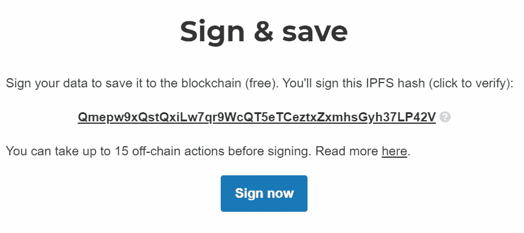

# 去中心化社交媒体的发展——淘汰用户批处理

> 原文：<https://medium.com/coinmonks/evolution-of-decentralised-social-media-retire-user-batching-722c425397e9?source=collection_archive---------2----------------------->

## 我的 Peepeth 系列的一部分。

## 背景

Leeroy (以太坊上最初的分散式社交网络)要求每个动作都有一个以太坊交易。这可能会很快变得昂贵，我认为这是执行任何行动的障碍(因为乙醚的价格上涨)。

站在巨人的肩膀上，Peepeth 2.0 增加了用户批量动作的能力，名义上设定为 15 个动作。这意味着平均操作更便宜，因此对用户体验来说是一个很大的改进。

用户分批仍有燃气市场的障碍。为了解决这个问题，一个平台可以创建包含所有用户行为的平台批次(参见我在[上发表的关于去中心化社交媒体发展的文章](/@abcoathup/evolution-of-decentralised-social-media-dfe567d23e54))。Peepeth 实现了[免费偷窥](https://peepeth.com/a/free)，最初是针对有资格的现有用户，然后是所有人。

除了平台批处理，Peepeth 还取消了创建账户的交易费要求。因此，用户不需要 Ether 来装载和使用 Peepeth。

## 用户批处理

Peepeth 用户批处理的工作方式如下:一个用户签署一条消息以登录到平台。动作以 JSON 的形式存储在 IPFS，每个动作的 IPFS 散列保存在一个集中的数据库中，直到用户达到 15 个动作(或决定更快地保存)，然后创建一批用户动作(存储在 IPFS 的 IPFS 散列的 JSON ),他们用存储在批中的用户签名进行签名。一旦用户批次被签名，平台就可以创建平台批次，平台可以将该平台批次保存为交易输入。

> 用户操作:[qmtaxcptb 3 Yb 9 geoskgqsmht 5 NP 3 uzu 4 WB 71 icwfxn 5 hre](https://gateway.ipfs.io/ipfs/QmTaXcptB3yB9gEoskgqsmht5nP3UzU4wb71iCWfxN5HrE/)
> 用户批量:[qmed n3 Zoe kz 7 wg4 BZ 7 eznalqf 79 pgh 2 dkdtydpuybanvm](https://gateway.ipfs.io/ipfs/Qmedn3zoEKZ7Wg4bZ7EZNALQf79pgh2DkDTYdPuiyBAnVm/)
> 平台批量:[qmzcv 2h 42 p 3 yuqzl 36 T3 ywtzry 1 GB 2 bcvbnhdbe 8 sc 4 GS](https://gateway.ipfs.io/ipfs/QmZCv2H42p3AYuqzL36t3yWTZry1gB2bcVBNhDbe8SC4gs/)
> 以太坊交易:

用户批处理有几个问题:

首先，用户批处理需要首先向用户解释为什么需要批处理(参见上面的背景)。用户不需要使用 Ether 来发帖，所以他们不应该必须了解天然气、天然气市场或去中心化社交媒体的发展史才能发帖。普通用户不会关心他们的社交媒体建立在什么技术之上，他们只关心他们得到的功能。

第二个问题是，在用户签署他们的批处理之前，他们的操作不会在区块链上锚定。它们只能在平台数据库中找到。(顺便说一下，任何锚定延迟都是第三方应用的障碍。我们需要一种机制，让其他应用程序可以尽快使用这些操作。尽管这超出了本文的范围。)如果用户从未签署批，则他们的动作从未被锚定。

## 停用用户批处理

用户批处理的替代方法是在执行操作时将用户操作添加到平台批处理中。

其影响是，这消除了用户必须签署批处理并理解批处理概念的复杂性，并减少了操作被锚定之前的时间。

要执行操作，用户需要登录。然后，他们应该能够执行任何允许的操作。

理想情况下，每个用户动作都应该被签名，尽管 dApp 浏览器的当前功能需要明确的签名过程，这将是动作的另一个障碍。未来的原生应用将能够在无需获得明确许可的情况下对每个用户操作进行用户签名(一旦登录)。

如果不对每个动作进行显式签名，IPFS/onchain 中就不会存储用户签名，所以没有证据表明用户执行了某个动作，所以对 Peepeth 有额外的信任。(用户登录可以被记录为一个动作)。虽然我认为这是一个短期问题，直到有本地应用程序可以签署每一个动作，dApp 浏览器支持预先批准的签名，同时登录。

## 保持简单

随着用户批处理的退出，另外两个功能也应该退出,“未登录时发布”和“立即锁定”。

Peepeth 允许用户通过区块链事务直接发布(IPFS 事务的散列被保存为区块链事务的输入)。这造成了复杂性，对于普通用户来说，也造成了困惑。任何可以在没有以太网的情况下完成的操作都不应该有在平台上使用以太网的替代选项，或者更简单，在没有登录的情况下不允许任何操作。(一个朋友去 Peepeth 上发帖，不明白为什么他们认为现在已经免费了还要付费才能发帖。我不得不解释说他们需要先签到)。

对于希望发布功能并将其直接锚定在链上的高级用户，他们可以直接发布到智能合约(或使用替代的 dApp)。虽然这些超级用户确实存在，但他们不是主要受众，所以主应用程序不应该为了支持他们而变得复杂。

Peepeth 还允许已登录的用户立即签署帖子(立即签署)以添加到平台批处理中。这又增加了复杂性，需要解释，所以如果用户批处理退出，现在也可以签名。

## 结论

复杂性是在社交媒体上采取行动的一个障碍。现在有了平台批处理，就不需要用户批处理的复杂性了。

## 关于我

我开始使用 Peepeth 是在一个测试网上(感谢@jrmoreau [在 twitter](https://twitter.com/jrmoreau/status/971194600806379521) 上验证)。我是主网上的[偷窥者#7](https://peepeth.com/7) 。

我对去中心化和在移动设备上使用的好处充满热情。

> [在您的收件箱中直接获得最佳软件交易](https://coincodecap.com/?utm_source=coinmonks)

