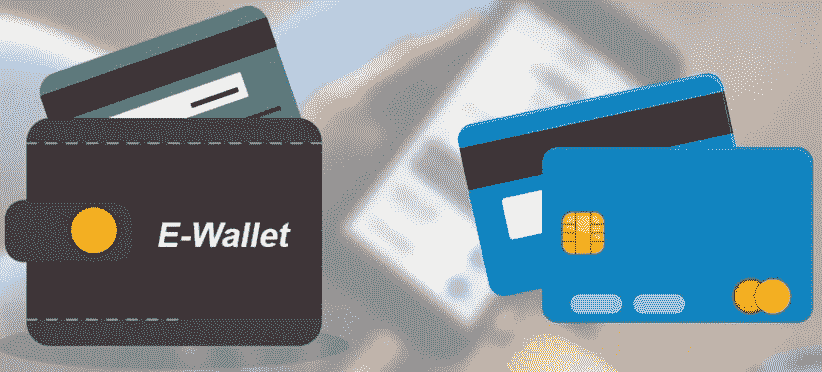
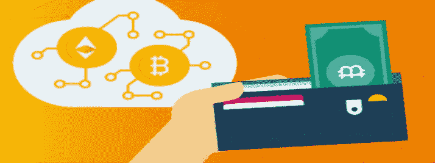

# 货币的演变:现金——签证——密码

> 原文：<https://medium.com/coinmonks/evolution-of-money-cash-visa-crypto-821341232eb0?source=collection_archive---------6----------------------->

## 新的支付手段

在法国，92%的购物是用卡支付的，在中国，甚至在偏远的村庄也接受二维码支付，一些年轻的瑞典人不再知道纸币是什么样子。哪个国家能最先放弃纸币和硬币，为什么人们更喜欢非现金支付。

## 无现金支付对每个人都有利

有几个原因。首先是打击犯罪和影子商业。现金比电子支付更难追踪，这就是为什么黑社会继续依赖纸币。

所有国家都头疼的一个问题是百元大钞。它是世界上最受欢迎的纸币，有超过 100 亿张本杰明·富兰克林纸币在流通。

> 与此同时，100 万美元的百元大钞仅重 10 公斤——这简化了每年以纸质形式在世界各地转移 2 万亿美元的犯罪分子的生活。

第二个原因是对民众金融交易的控制。如果现金交易难以追踪，那么电子支付就容易了。因此，各国更容易在账户上处理数字:这样你不仅可以了解公民如何花钱、在哪里花钱，还可以了解他们是否在用这些钱做一些非法的事情。

第三个原因是货币流通过程中的储蓄。瑞典还在现金服务流程上花费了约 10 亿欧元——从取款机的工作到现金收款服务。如果纸币消失了，这笔钱可以省下来。

## 现金已经是过去式了

纸币越来越不受欢迎，而且这种趋势一年比一年明显。

> 例如，**卫报**分析师估计，到 2022 年，80%的英国人将放弃现金。已经有 51%的年轻人不使用它们。

在南韩，因为疫情，钱被烧掉了，而在瑞典，他们干脆不碰它们，选择非现金。但是即使没有冠状病毒，瑞典实际上也不使用钞票:现金仅占 T4 GDP 的 1%。

例如，在欧元区，2020 年这个数字是 11%，在美国是 8.2%。顺便说一句，有些政治家-立法者正在宣传放弃 50 元和 100 元钞票的想法。

新加坡、韩国、澳大利亚、希腊、法国、土耳其、英国和中国也在打击现金。

总体而言，中国是非现金支付设备的市场领导者。

> 大多数 POS 终端，接受卡的设备，都是中国制造的。最常见的是，这个国家的居民使用二维码支付:2017 年， **5.5 万亿美元**通过中国智能手机支付——是美国的 50 倍。

## 转型中的困难

不使用互联网和智能手机的人面临风险。此外，提取现金将打击那些无法进入金融系统的人。他们没有银行账户，取消纸币会让他们一无所有。

此外，一个完全放弃现金的国家可能会成为网络攻击的持续目标。技术故障或过载会使整个系统瘫痪。在这种情况下，所有在纸币流通过程中节省下来的钱都将被转移到对数字纸币的保护中。

另外一点是民众对国家的信心。如果在普通世界里，你可以依赖一个包含战略现金储备的保险箱(床垫、衣柜)，那么在一个没有削减的世界里，所有的希望都将寄托在银行和政府身上。记住过去几年的世界危机，不是每个人都准备好了。

## 加密货币替代品

许多国家继续反对现金。同一个瑞典正计划在 2022 年前完全过渡到数字货币——实物克朗的替代品将是基于区块链的电子克朗。

数字硬币相对于法定货币的优势对所有市场参与者来说都是显而易见的。

突然发射是不可能的。国家或中央银行将无法以这种方式印刷货币，使货币贬值，并剥夺公民的购买力。

要使用加密资产，您不需要将它们委托给中介——银行、交易所或任何附属系统。

> 该系统基于**对等技术【P2P】**，网络可操作性
> 同时提供给所有网络用户，他们也是平等的，不再有“有分量”、“主要”、“第一”。这自然使得出于政治动机的审查无法禁止向任何人转移资金。

这个系统没有一个中心或组织者是国家可以用武力施加压力的。相对较高的交易速度，支付佣金和付款速度更快或免费的能力。

所有交易记录都是公开的。换句话说，所有的资金流动都可以被追踪。如果你想象用**比特币**缴税，那么你就能知道每个聪聪去了哪里。

创建账户不需要护照，也不用去任何地方。不能封锁钱包，不能拒绝向个人或组织提供服务。

没有人可以通过法院或向银行施压来查封账户。无限交易，在全世界有互联网的地方工作，无视任何边界和禁令。

与此同时，各国正在走一条混合道路，将现金和非现金支付结合起来。为了只在电脑或智能手机的帮助下进行支付，社会将不得不完成全球数字化。

**保持更新。**

 [## 区块链强化地位

### 积极趋势

digitaltime.medium.com](https://digitaltime.medium.com/blockchain-strengthens-position-536be4b321f5) 

> 加入 Coinmonks [电报频道](https://t.me/coincodecap)和 [Youtube 频道](https://www.youtube.com/c/coinmonks/videos)了解加密交易和投资

## 也阅读

 [## 最佳加密交易所| 2021 年十大加密货币交易所

### 编辑描述

blog.coincodecap.com](https://blog.coincodecap.com/crypto-exchange)  [## 2021 年 10 大最佳加密贷款平台| CoinCodeCap

### 编辑描述

blog.coincodecap.com](https://blog.coincodecap.com/crypto-lending)  [## 2021 年最佳免费加密交易机器人

### 2021 年币安、比特币基地、库币和其他密码交易所的最佳密码交易机器人。四进制，位间隙…

medium.com](/coinmonks/crypto-trading-bot-c2ffce8acb2a)  [## 最佳 4 个加密交易信号电报通道

### 这是乏味的找到正确的加密交易信号提供商。因此，在本文中，我们将讨论最好的…

medium.com](/coinmonks/best-crypto-signals-telegram-5785cdbc4b2b)  [## 5 个最佳社交交易平台[2021] | CoinCodeCap

### 编辑描述

blog.coincodecap.com](https://blog.coincodecap.com/best-social-trading-platforms)  [## BlockFi 评论 2021:利弊和利率| CoinCodeCap

### 编辑描述

blog.coincodecap.com](https://blog.coincodecap.com/blockfi-review)  [## 如何在印度购买比特币？2021 年购买比特币的 7 款最佳应用[手机版]

### 如何使用移动应用程序购买比特币印度

medium.com](/coinmonks/buy-bitcoin-in-india-feb50ddfef94)  [## 加密税务软件——五大最佳比特币税务计算器[2021]

### 不管你是刚接触加密还是已经在这个领域呆了一段时间，你都需要交税。

medium.com](/coinmonks/best-crypto-tax-tool-for-my-money-72d4b430816b)  [## 存储比特币的最佳加密硬件钱包[2021] | CoinCodeCap

### 编辑描述

blog.coincodecap.com](https://blog.coincodecap.com/best-hardware-wallet-bitcoin)  [## Pionex 评论 2021 |免费加密交易机器人和交换

### Pionex 是为交易自动化提供工具的后起之秀。Pionex 上提供了 9 个加密交易机器人…

medium.com](/coinmonks/pionex-review-exchange-with-crypto-trading-bot-1e459d0191ea)