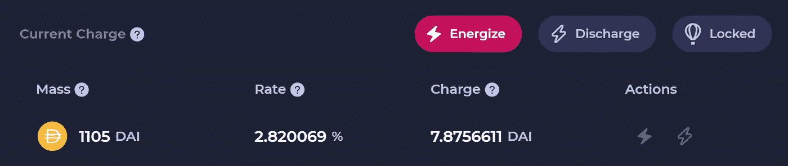
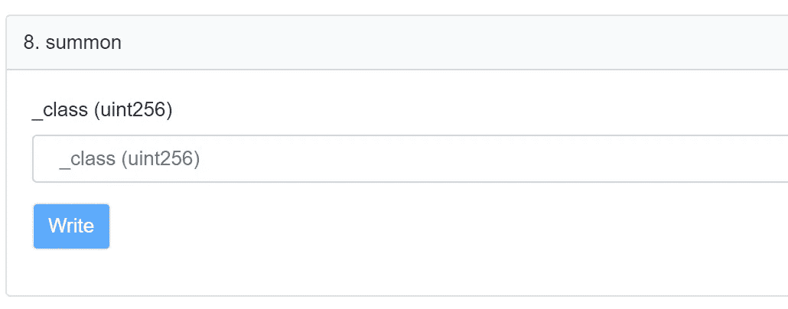
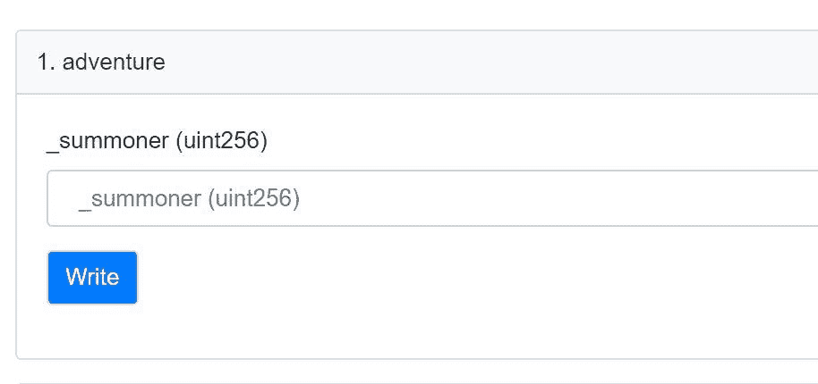
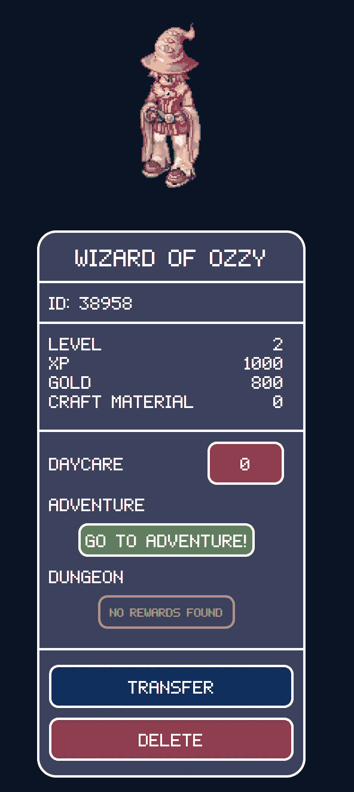

# 进化的 NFTs:带电粒子&稀有

> 原文：<https://medium.com/coinmonks/evolutionary-nfts-charged-particles-rarity-dcf828f6fc34?source=collection_archive---------2----------------------->

# 大肆宣传

NFTs 终于在 2021 年登上了主流媒体的头条。我原以为这一天会来得更早(见 2019 年的预测 5)——但最终我们还是来了。**每个人都在谈论他们。**有些**投资。然而，大多数人仍然不理解这项创新的意义。**

是的，我们见过艺术品卖到数百万美元。[隐朋克](https://opensea.io/collection/cryptopunks)和[无聊猿](https://opensea.io/collection/boredapeyachtclub)最近给 [>像](https://greatcoinnews.com/2021/09/11/after-a-massive-rise-in-august-openseas-nft-traffic-has-dropped-by-half/) [OpenSea](https://opensea.io) 这样的 NFT 市场带来了40 亿的销售额。但这只是表面。

目前，许多有趣的事情并行发展。这就是为什么我认为是时候重新开始写我最近的冒险和见解了。让我们更深入地了解一下“NFT 土地”。

Photo by [Hello I’m Nik](https://unsplash.com/@helloimnik?utm_source=unsplash&utm_medium=referral&utm_content=creditCopyText) on [Unsplash](https://unsplash.com/s/photos/lego?utm_source=unsplash&utm_medium=referral&utm_content=creditCopyText)

## 我们来自哪里

NFT 在技术上非常简单。ERC721 NFT 标准定义了 12 个简单的功能。人们可以想象你不能用它们做太多有趣的事情。这正是最初几年发生的事情。NFT 非常简单，主要由其媒体内容和通常定义其“稀有性”的几个属性来定义。大多数艺术家主要关注这些基本方面。然而，我们从其他技术(例如 Linux 操作系统)中知道，当以创造性的方式组合时，最简单的构建模块通常具有最大的杠杆作用。

> 越简单越好！

在这方面,“NFT 土地”的最新进展看起来很有希望。NFT 逐渐演变出有趣的特征，这是大多数专家没有预见到的。NFTs 将许多非加密人带到这个世界——自从许多艺术家进入这个空间，与加密人联手，给加密诗带来新的想法和观点以来，创造力正以前所未有的方式蓬勃发展。

## DeFi & NFTs

DeFi 和 NFTs 的结合是非常有趣的地形。早期，许多密码爱好者将他们刚收获的财富投资到早期的 NFT，如 cryptokitties。2020 年《DeFi summer》之后又发生了这样的事情。每次加密牛市似乎都会推动非功能性传输。

我们目前看到几个 **NFT-DeFi 交叉使用案例**，例如在 [NFTfi](https://nftfi.com) 等新借贷平台中使用有价值的**NFT 作为抵押品**。它是这样工作的:许多 NFT 所有者不打算出售他们的 NFT——他们宁愿投机价格上涨，更喜欢使用他们的 NFT 作为抵押品，并借用 crypto 来扩展他们的收藏。另一方面，这些市场的贷款人得到了有趣的激励(有时 40%或更多的 APY)。而且他们的意图不一定是赚钱。他们宁愿对借款人的违约进行投机，这样他们就可以获得被用作抵押品的珍贵 NFT 的所有权。听起来很疯狂？没错，你可能想听听 NFTfi 创始人史蒂芬·杨的这个有趣的播客。

我们现在还可以使用像 [Niftex](https://www.niftex.org/) 或 [Fractional](https://fractional.art/) 这样的平台来细分我们的 NFT(到其他可替换的 ERC20 令牌中)。你可能会问:我们为什么要这么做？嗯——我们可能是一个收藏家社区，联合起来购买一个昂贵的密码朋克，并希望将我们 NFT 的一部分传播给最活跃的社区用户。听起来很有趣？你可能想看看[please Dao](https://gallery.so/pleasrdao)或 [PartyDAO](https://party.mirror.xyz/) 来了解他们的动机。或者，我们可能只是想在 Uniswap 上为这些 NFT 股票创建一个专门的市场。顺便说一句——这也可以用 NFT 集合来完成，比如在 Niftex 上证明的 [R64X。](https://www.niftex.org/asset/details/0xf3110b27f481f9ac3c1ba3c54de542accb2d913c)

国家森林公园的集体所有权是存在的。不过，这多少有些静态:NFT 就是 NFT，有着它的原始属性。

## 走向“数字化”

有一些非常有趣的项目创造了“数字”NFT 体验:将实物商品与数字 NFT 结合起来创造增强现实体验——例如通过实物艺术中的 NFC 标签，这些标签可以链接回 NFT 的属性，如 id。像 [Lukso](https://www.lukso.network/) 这样的网络甚至针对这些用例建立了专用的(以太坊兼容的)区块链——与像[耐克和 Channel](https://coinscribble.com/if-you-miss-luksolyxe-you-will-miss-a-chance-to-enjoy-the-early-benefits-of-next-ethereum/39043/icos/51/) 这样的品牌合作。

## 元宇宙&虚拟时尚

这就把我们带到了元宇宙，那里的品牌开始以虚拟服装和配饰的形式销售他们的时尚——同样是通过 NFTs。深入像[去中心化](https://decentraland.org/)、[隐体素](https://www.cryptovoxels.com/)、[沙盒](https://www.sandbox.game/en/)或 [SomniumSpace](https://www.somniumspace.com/) 这样的平台，感受一下它的发展方向。各种各样的数字艺术与游戏和经济激励融合在一起，形成了一种去中心化、无许可的风气。

这太令人兴奋了。然而，这些非功能性测试中的大多数仍然被设计成“独立的”。通常一个地址拥有一个包含所有属性和组件的 NFT，这似乎有点限制。

> 最近，项目发现了有趣的新方法**为 NFT 创造动力和进化方面**。

我想介绍其中的两个:

## 充电 NFTs

现在，您可以用其他代币为您的 NFT“充电”,例如社交或治理代币——事实上，任何 ERC20 代币都可以。NFT 本身就成了一种钱包，当它的内容物升值时，它的价值就会逐渐增加。 [**带电粒子**](https://www.charged.fi/) 启用了这样的功能。该团队更进一步，与 DeFi 冠军 Aave 合作。当我们将$DAI 这样的稳定硬币放入我们的 NFT 时，这些$DAI 会自动被打包到$aDAI 中——Aave 的计息版$DAI。我们现在在 NFT 有一个储蓄账户，可以用来代替我们孩子的传统储蓄账户。

An NFT with $DAI inside — earning 2.8% interest

最后，我们可以用其他 NFT 对 NFT 收费。是的，这个概念是完全可组合的。我们可以多次这样做，并创建“俄罗斯娃娃 NFTs”——带电粒子社区最近在他们的[“传递粒子”](/charged-particles/pass-the-particle-an-experiment-in-decentralized-nft-creation-2ced9d947ace)中就是这样做的。该团队甚至考虑在 NFTs 中进行产量农业选择。

> DeFi 乐高积木满足 NFT 乐高积木。

一个好的方面是，不仅 NFT 所有者自己可以用自己的资产“激活”他们的 NFT，任何人都可以添加加密货币或 NFT。想象一下慈善机构举办某些活动，并使用这种可组合的 NFT 作为捐款的灵活目标。

但是如果你退后一步，就会发现更多的问题:这些可组合的 NFT 不再是简单和静态的。它们可能是用简单的属性创建的，但随着时间的推移，它们被赋予了价值。

> 他们突然“活过来”，可以进化。

你想知道这是怎么回事吗？嗯，我们的 NFT 拥有一个专用的智能合同，它反过来拥有我们嵌入到我们的 NFT 中的所有东西。所以基本上，我们可以用 NFT 的内容做任何智能合同能做的事情(锁定、产量耕作等)。)——更多疯狂的功能以用户友好的方式在 [https://charged.fi.](https://charged.fi.) 上实现只是时间问题

> 如果你愿意的话，带电粒子团队已经找到了一种优雅的方式，从内部用动力学**来丰富和发展 NFT。非常酷。**

大约两个星期以来，我们知道你也可以做相反的事情:
**从外部用逻辑扩展 NFTs**——带来一些真正革命性的效果。

向[安德烈·克罗涅](https://andrecronje.medium.com/)的**稀罕物**问好！

## 稀薄

Andre Cronje 是 DeFi 早期的英雄之一，也是[渴望金融](https://yearn.finance/dashboard)及其 [$YFI 代币](https://www.coingecko.com/en/coins/yearn-finance)的“父亲”。似乎他对游戏更感兴趣，正如他在[稀有的最初公告](https://andrecronje.medium.com/loot-rarity-d341faa4485c)中所描述的那样。

稀有在打劫项目后一周推出，该项目有一个相似但不同的“NFT 第一方法”来**建立一个基于区块链的自下而上的游戏**。

战利品 NFT 数量有限，而且很快就被铸造一空，在 OpenSea 的二级市场上以极高的价格交易。Andre 似乎也有非常相似的想法，并提出了一个更具包容性的方法——以及无限制的 NFT 供应。

事情是这样的:任何人都可以(现在仍然可以)加入并“召唤”几个稀有的“冒险者”。我们所要做的就是铸造一个特定冒险者类型/职业的 NFT。这个铸币是免费的。我们只需要支付汽油费——这相当低，因为游戏运行在 [**Fantom**](https://www.fantom.foundation/) 上——一个交易成本低的以太坊兼容区块链——这是像这样的游戏非常重要的要求(以及你可能知道的 [**Polygon**](https://polygon.technology/) 的类似特征)。

线索:游戏在发布时没有用户界面。用户必须进入 Fantom 的 block explorer[**ftm scan**](https://ftmscan.com/)并直接与 Andre 的智能合约进行交互，你可以在这里找到。这正是我所做的——因为我很好奇——就像其他许多赚了 100k(！)冒险者在游戏公布后的短短几个小时！

如果你第一次这样做，可能会感到有点害怕。这就是为什么我在 Twitter 上截取了一些截图并写了一些关于[最初步骤的说明。我只能建议尝试一下。](https://twitter.com/sgrasmann/status/1434513182526214146?s=20)

> 比起阅读 20 篇文章，你会学到更多关于区块链、智能合约和非功能性金融工具的知识。

Screenshot from FTMScan: Summon your adventurer of a certain class (1–11)

但是回到概念层面:是什么让稀有性和它的 NFTs 如此特别？好吧，稀有冒险者 NFT 非常简单。他们只有一个连续的 id 和 3 个属性:职业，等级和当前的经验。你可以通过“继续冒险”(用你的 id 调用智能合约功能“冒险”)每天提升你的 NFT 的 xp 一次。

Screenshot from FTMScan: Send your adventurer on an adventure

一旦你达到一定的经验值，你就可以“升级”到下一级。就是这样。

> 但是:一个人怎么能在这个最小的 NFT 上创造一个游戏呢？

真正精彩的部分来了！在接下来的几天里，Andre 发布了几个额外的智能合同——逐步扩展游戏理念和功能。这些功能都有自己的智能合同，并参考了冒险家 NFT。安德烈为[属性](https://andrecronje.medium.com/rarity-attributes-19ff3cd457c8)、[技能](https://andrecronje.medium.com/rarity-skills-7dded308a607)和[专长](https://andrecronje.medium.com/rarity-feats-84ae3b7b357)添加了智能合约——并解释了他的[“可组合的 NFT 建筑”](https://andrecronje.medium.com/rarity-composable-nft-architecture-5a76cbc85d58)。

社区变得疯狂。人们开始为稀有性创建用户界面，如稀有性游戏、稀有性可视化工具或稀有性扩展。这些用户界面也有助于自动化日常乏味的冒险呼叫。其他人接受了 Andre 的概念，并编写了他们自己的智能合同来扩展游戏——你突然可以为你的冒险者购买一个名字——但前提是你的 NFT 在 2 级，并以此来交换一些它的[黄金](https://andrecronje.medium.com/rarity-gold-with-a-twist-715f77051261)——新生的游戏内货币。仅仅两周之后，稀有的分散游戏生态系统已经很广泛了。如果你想更深入，你可能想从这里开始。

> Andre 的计划是在一个繁荣的社区的帮助下，围绕可扩展的 NFTs 创建一个可扩展的游戏 T21。

我们现在有了一个全新的方法来参与社区活动，并创建进化的 NFT。

## 摘要

我希望我没有被这件事冲昏头脑。但我认为，我们目前见证了一种全新的数字产品生态系统的发明——围绕 ERC20 和 ERC721 等令牌标准和智能合同构建。

这只是开始。它始于游戏——但是想象一下，当企业开始理解这些概念对于“严肃业务”的潜力时，这些构件和概念将为 B2B 场景做些什么。

潜在的用例是无限的、开放的、无权限的。这些是来自 web3 的技术成分，中小型公司需要这些成分来创建新的去中心化和包容性的生态系统，以便与我们从 web2 中了解的“大技术”竞争。我非常渴望进一步探索这个基于代币经济的勇敢新世界。

最后——向我的“奥兹巫师”问好——这真的很罕见！

Screenshot from [https://rarity.game/summoners](https://rarity.game/summoners)

***延伸阅读:*** *你可以在我的博客*[*publish 0x*](https://www.publish0x.com/sgrasmann/?a=46dBBylJd7)*和*[*Medium*](https://sgrasmann.medium.com/)*上找到更多关于区块链和 DeFi 的文章。*

***免责声明:*** *本文无意成为任何形式的投资建议。如果你打算投资本文提到的某个项目，自己做研究并寻求专业支持。*

> 加入 Coinmonks [电报频道](https://t.me/coincodecap)和 [Youtube 频道](https://www.youtube.com/channel/UCbyDhTbOiKh2iUMKBi4-4Zg)了解加密交易和投资

## 另外，阅读

*   [网格交易机器人](https://blog.coincodecap.com/grid-trading) | [Cryptohopper 审查](/coinmonks/cryptohopper-review-a388ff5bae88) | [Bexplus 审查](https://blog.coincodecap.com/bexplus-review)
*   [加密复制交易平台](/coinmonks/top-10-crypto-copy-trading-platforms-for-beginners-d0c37c7d698c) | [如何在 WazirX 上购买比特币](/coinmonks/buy-bitcoin-on-wazirx-2d12b7989af1)
*   [CoinLoan 评论](https://blog.coincodecap.com/coinloan-review)|【Crypto.com 评论】||[火币保证金交易](/coinmonks/huobi-margin-trading-b3b06cdc1519)
*   [Bookmap 评论](https://blog.coincodecap.com/bookmap-review-2021-best-trading-software) | [美国 5 大最佳加密交易所](https://blog.coincodecap.com/crypto-exchange-usa)
*   [新加坡十大最佳加密交易所](https://blog.coincodecap.com/crypto-exchange-in-singapore) | [收购 AXS](https://blog.coincodecap.com/buy-axs-token)
*   [投资印度的最佳加密软件](https://blog.coincodecap.com/best-crypto-to-invest-in-india-in-2021) | [WazirX P2P](https://blog.coincodecap.com/wazirx-p2p)
*   [加拿大最佳加密交易机器人](https://blog.coincodecap.com/5-best-crypto-trading-bots-in-canada) | [库币评论](https://blog.coincodecap.com/kucoin-review)
*   [火币加密交易信号](https://blog.coincodecap.com/huobi-crypto-trading-signals) | [HitBTC 审核](/coinmonks/hitbtc-review-c5143c5d53c2)
*   [如何在 FTX 交易所交易期货](https://blog.coincodecap.com/ftx-futures-trading) | [OKEx vs 币安](https://blog.coincodecap.com/okex-vs-binance)
*   [OKEx vs KuCoin](https://blog.coincodecap.com/okex-kucoin) | [摄氏替代品](https://blog.coincodecap.com/celsius-alternatives) | [如何购买 VeChain](https://blog.coincodecap.com/buy-vechain)
*   [币安期货交易](https://blog.coincodecap.com/binance-futures-trading)|[3 commas vs Mudrex vs eToro](https://blog.coincodecap.com/mudrex-3commas-etoro)
*   [如何购买 Monero](https://blog.coincodecap.com/buy-monero) | [IDEX 评论](https://blog.coincodecap.com/idex-review) | [BitKan 交易机器人](https://blog.coincodecap.com/bitkan-trading-bot)
*   [尤霍德勒 vs 科恩洛 vs 霍德诺特](/coinmonks/youhodler-vs-coinloan-vs-hodlnaut-b1050acde55a) | [Cryptohopper vs 哈斯博特](https://blog.coincodecap.com/cryptohopper-vs-haasbot)
*   [顶级付费加密货币和区块链课程](https://blog.coincodecap.com/blockchain-courses) | [币安评论](/coinmonks/binance-review-ee10d3bf3b6e)
*   [MXC 交易所评论](/coinmonks/mxc-exchange-review-3af0ec1cba8c) | [Pionex vs 币安](https://blog.coincodecap.com/pionex-vs-binance) | [Pionex 套利机器人](https://blog.coincodecap.com/pionex-arbitrage-bot)
*   [如何在印度购买比特币？](/coinmonks/buy-bitcoin-in-india-feb50ddfef94) | [WazirX 审核](/coinmonks/wazirx-review-5c811b074f5b) | [BitMEX 审核](https://blog.coincodecap.com/bitmex-review)
*   [印度的加密交易所](/coinmonks/bitcoin-exchange-in-india-7f1fe79715c9) | [比特币储蓄账户](/coinmonks/bitcoin-savings-account-e65b13f92451)
*   [币安费用](/coinmonks/binance-fees-8588ec17965) | [僵尸加密审查](/coinmonks/botcrypto-review-2021-build-your-own-trading-bot-coincodecap-6b8332d736c7) | [热点审查](/coinmonks/hotbit-review-cd5bec41dafb)
*   [我的密码交易经验](/coinmonks/my-experience-with-crypto-copy-trading-d6feb2ce3ac5) | [AAX 交易所评论](/coinmonks/aax-exchange-review-2021-67c5ea09330c)
*   [逐位融资融券交易](/coinmonks/bybit-margin-trading-e5071676244e) | [币安融资融券交易](/coinmonks/binance-margin-trading-c9eb5e9d2116) | [超位审核](/coinmonks/overbit-review-9446ed4f2188)
*   [有哪些交易信号？](https://blog.coincodecap.com/trading-signal) | [比特斯坦普 vs 比特币基地](https://blog.coincodecap.com/bitstamp-coinbase)
*   [ProfitFarmers 点评](https://blog.coincodecap.com/profitfarmers-review) | [如何使用 Cornix 交易机器人](https://blog.coincodecap.com/cornix-trading-bot)
*   [加密货币储蓄账户](/coinmonks/cryptocurrency-savings-accounts-be3bc0feffbf) | [YoBit 审核](/coinmonks/yobit-review-175464162c62) | [Bitbns 审核](/coinmonks/bitbns-review-38256a07e161)
*   [Botsfolio vs nap bots vs Mudrex](/coinmonks/botsfolio-vs-napbots-vs-mudrex-c81344970c02)|[gate . io 交流回顾](/coinmonks/gate-io-exchange-review-61bf87b7078f)
*   [CoinFLEX 评论](https://blog.coincodecap.com/coinflex-review) | [AEX 交易所评论](https://blog.coincodecap.com/aex-exchange-review) | [UPbit 评论](https://blog.coincodecap.com/upbit-review)
*   [AscendEx 保证金交易](https://blog.coincodecap.com/ascendex-margin-trading) | [Bitfinex 赌注](https://blog.coincodecap.com/bitfinex-staking) | [bitFlyer 点评](https://blog.coincodecap.com/bitflyer-review)
*   [Bitget 回顾](https://blog.coincodecap.com/bitget-review)|[Gemini vs block fi](https://blog.coincodecap.com/gemini-vs-blockfi)|[OKEx 期货交易](https://blog.coincodecap.com/okex-futures-trading)
*   [AscendEx Staking](https://blog.coincodecap.com/ascendex-staking)|[Bot Ocean Review](https://blog.coincodecap.com/bot-ocean-review)|[最佳比特币钱包](https://blog.coincodecap.com/bitcoin-wallets-india)
*   [霍比审核](https://blog.coincodecap.com/huobi-review) | [OKEx 保证金交易](https://blog.coincodecap.com/okex-margin-trading) | [期货交易](https://blog.coincodecap.com/futures-trading)
*   [麻雀交换评论](https://blog.coincodecap.com/sparrow-exchange-review) | [纳什交换评论](https://blog.coincodecap.com/nash-exchange-review)
*   [美国最佳加密交易机器人](https://blog.coincodecap.com/crypto-trading-bots-in-the-us) | [经常性回顾](https://blog.coincodecap.com/changelly-review)
*   [在印度利用加密套利赚取被动收入](https://blog.coincodecap.com/crypto-arbitrage-in-india)