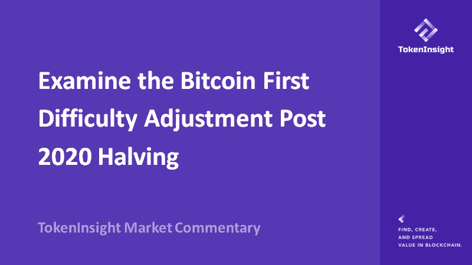
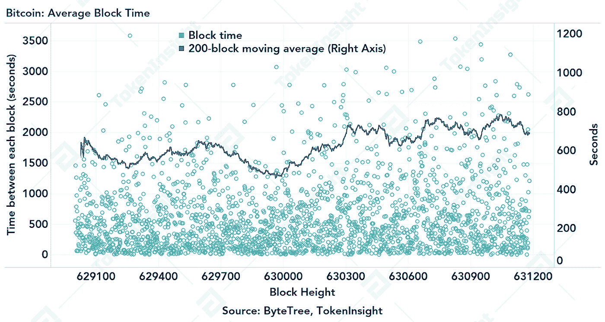
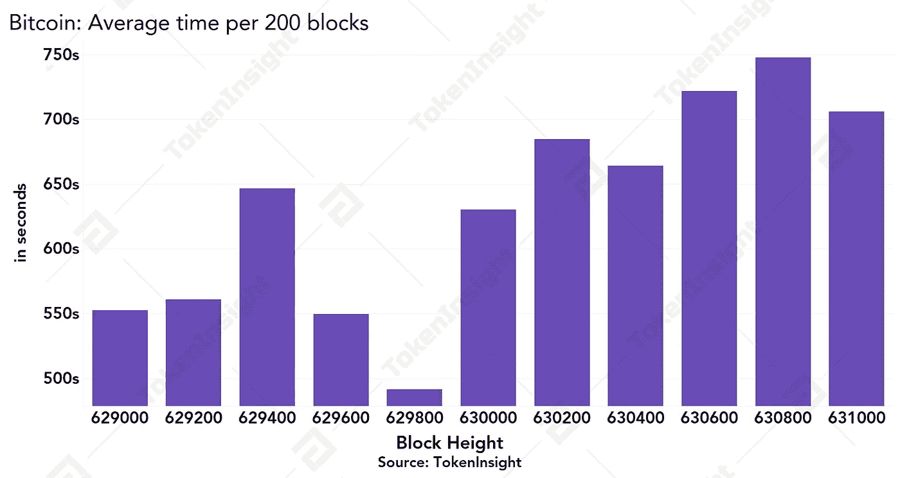
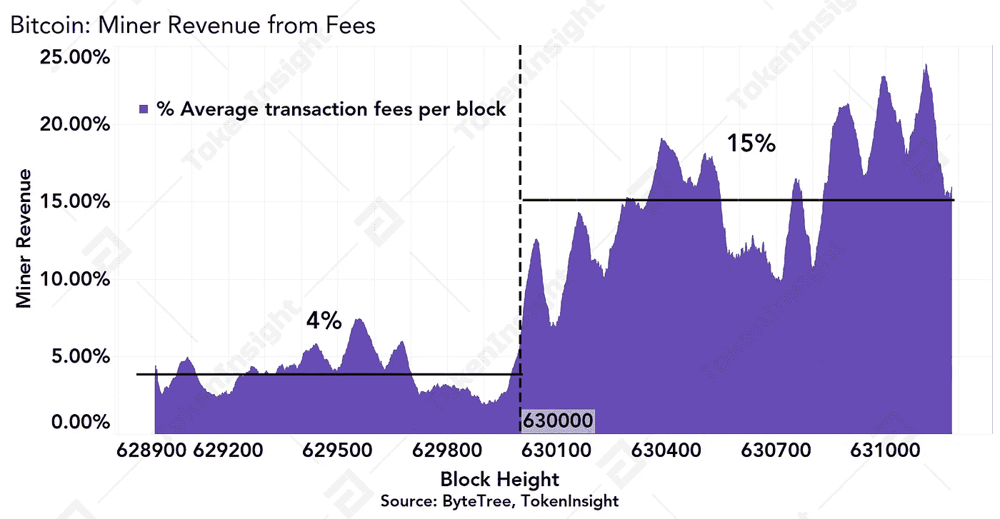
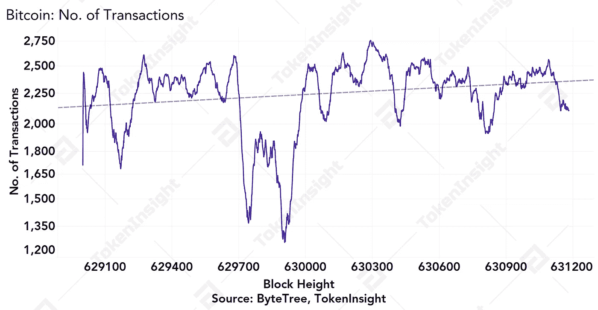
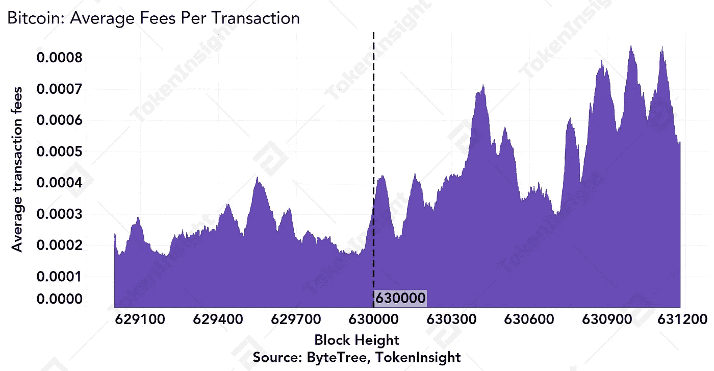
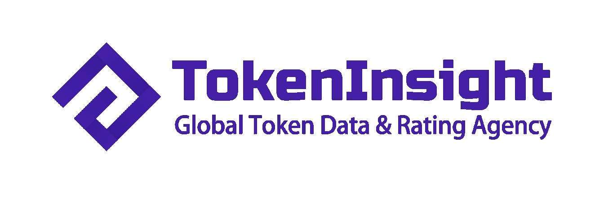

# 考察比特币第一难度调整后 2020 减半

> 原文：<https://medium.com/coinmonks/examine-the-bitcoin-first-difficulty-adjustment-post-2020-halving-43a62a4d5e6b?source=collection_archive---------1----------------------->

在比特币网络显示出一些健康增长之前，仍需要时间来稳定矿商的收费收入。

**—2020 年 5 月 25 日由**[**token insight Research**](https://tokeninsight.com/?utm_source=article&utm_medium=medium&utm_campaign=TI)

**作者:徐强森**

**电子邮件:johnson@tokeninsight.com**

# **概述**

第三次比特币减半已经尘埃落定，比特币网络刚刚经历了第三次减半后的第一次难度调整。难度从 16.1 万亿降低到 15.14 万亿，下调幅度约为 6%，给幸存至今的矿工提供了一定的缓解。

# **比特币网络杂凑率减半后大幅下降**

重要的是要认识到网络散列率不能直接观察到；而是需要从平均块制作时间和难度级别来计算。根据平均阻塞时间分析，[比特币网络](https://blog.coincodecap.com/a-candid-explanation-of-bitcoin/)在减半后经历了显著下降，减半前最后 1000 个块的平均阻塞时间为 560 秒，减半后降至每 1000 个块 689 秒——平均阻塞时间大约增加了 20%，表明 20%的网络散列率在此期间逐渐消失。

Bitcoin: Average Block Time, Source: [ByteTree](https://bytetree.com/), [TokenInsight](https://tokeninsight.com/?utm_source=article&utm_medium=medium&utm_campaign=TI)

自从 2020 年后减半的第一次难度调整开始以来，迄今为止的平均阻塞时间约为 706 秒，这表明网络仍在试图重新平衡自己，挤出低效的矿工。我们在比特币第三次减半之前也写过一篇文章，预测[减半后的网络会发生什么](/coinmonks/a-closer-look-to-bitcoin-on-chain-health-post-halving-f903ff1693b7?source=your_stories_page---------------------------)。

Bitcoin: Average time per 200 blocks, Source: [TokenInsight](https://tokeninsight.com/?utm_source=article&utm_medium=medium&utm_campaign=TI)

# **1000 块矿商的平均费用收入从减半前的 4%跃升至 15%左右**

1，000 块矿商的平均费用收入跃升至 15%左右，相比之下，减半前为 4%。由于大宗奖励减半，Miner 的费用收入在减半后立即增长了 200%，由于每笔交易的平均费用更高，该收入在当前峰值时缓慢增长至近 30%的更高水平。每个区块的平均交易数量保持相对稳定。

Bitcoin: Miner Revenue from Fees, Source: [ByteTree](https://bytetree.com/), [TokenInsight](https://tokeninsight.com/?utm_source=article&utm_medium=medium&utm_campaign=TI)

Bitcoin: No. of Transactions, Source: [ByteTree](https://bytetree.com/), [TokenInisight](https://tokeninsight.com/?utm_source=article&utm_medium=medium&utm_campaign=TI)

网络参与者现在支付更高的费用来补偿减半后更慢的块生产时间。仍需要时间来稳定矿商的收费收入，以反映比特币网络的健康增长。

Bitcoin: Average Fes Per Transaction, Source: [ByteTree](https://bytetree.com/), [TokenInsight](https://tokeninsight.com/?utm_source=article&utm_medium=medium&utm_campaign=TI)

# 杂碎率可能会进一步下降，但由于中国的雨季，预计中期会有所上升

第三次比特币网络减半第一次难度调整后的当前平均阻断时间仍然一致长于 600 秒的预期阻断时间。中国媒体一直在流传这样的消息:由于雨季的延迟，河流流量已经减少了大约 20%,预计夏季高峰时段的电力需求会更高。

雨季预计将为中国的矿商提供机会，利用更便宜的电价，因为暴雨推低了水电价格。

预计中国四川省的矿工将开始利用这一点，在雨季开始时将网络散列率推高，同时向客户实际交付最新一代 ASIC 矿工，如 Antminer S19。

在短期内，该网络仍将看到矿工的逐渐关闭，特别是使用老一代机器或成本非常高的矿工。在比特币价格减半之前，矿工们就开始为中国的雨季做准备，预计未来几个月将有来自其他地区的矿工涌入四川地区，以受益于较低的电费。

# 关于 TokenInsight

**成立于 2017 年，**[**token insight**](https://tokeninsight.com/?utm_source=article&utm_medium=medium&utm_campaign=TI)**是一家领先的数据&技术驱动的区块链金融机构。** TokenInsight 首创了完整的区块链行业分类体系，覆盖超过**1600 个项目，**发布超过 **300 份评级报告，**对 **10 大行业进行深入研究。**

TokenInsight 的数据、评级和研究报告可以访问全球 70 多个数据平台，包括 **Messari、Delta、币安信息、AICoin、火币信息、**等。，月 PV 超过 3000 万。TokenInsight 已正式加入由加密货币排名网站 CoinMarketCap 发起的数据问责与透明联盟(Data)。

# 如果您喜欢我们的评论，请关注我们:

💡官方网站:[https://www.tokeninsight.com](https://tokeninsight.com/?utm_source=article&utm_medium=medium&utm_campaign=TI)

📌领英官方页面:[https://www.linkedin.com/company/tokeninsight/](https://www.linkedin.com/company/tokeninsight/)

🔎电报:[https://t.me/TokenInsightOfficial](https://t.me/TokenInsightOfficial)

🗺推特:【https://www.twitter.com/tokenInsight 

📕https://www.reddit.com/r/TokenInsight/[Reddit](https://www.reddit.com/r/TokenInsight/)

> [直接在您的收件箱中获得最佳软件交易](https://coincodecap.com/?utm_source=coinmonks)

