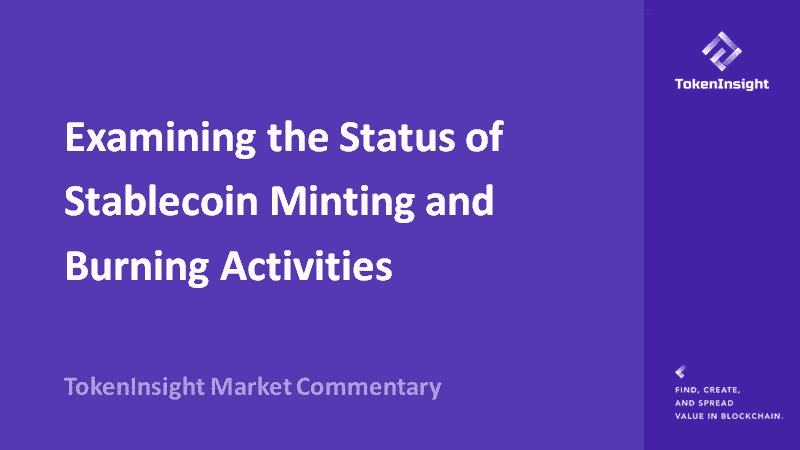
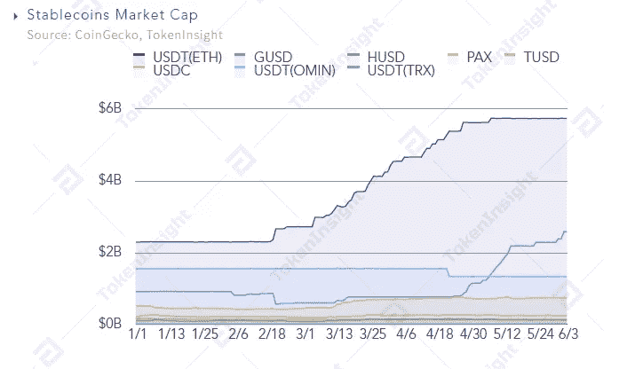
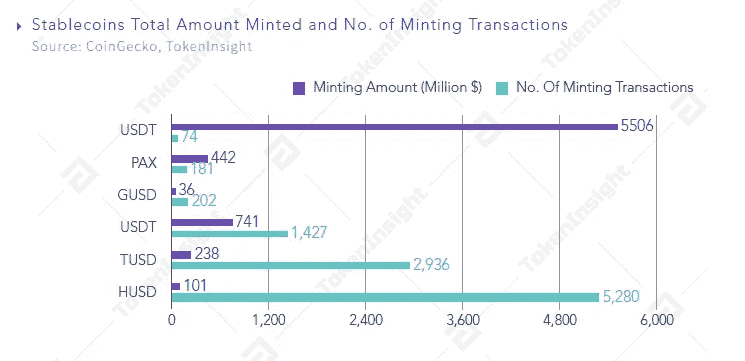
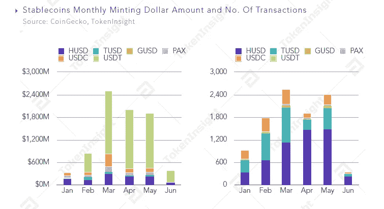
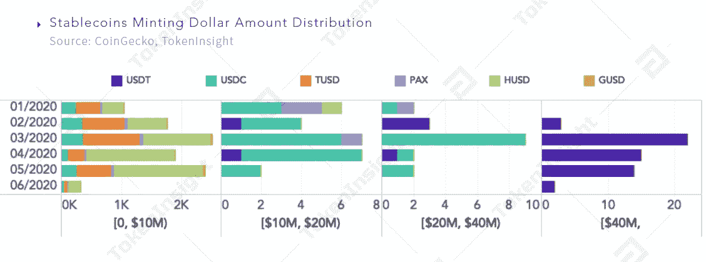
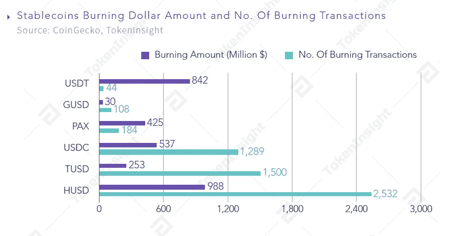
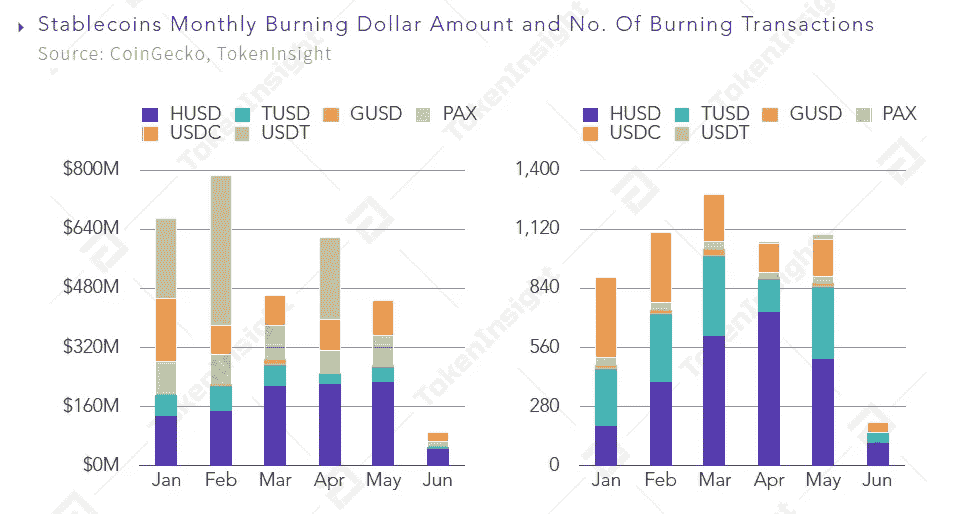
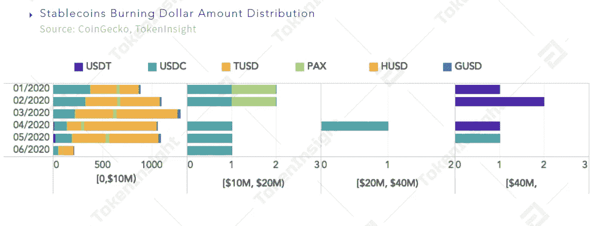

# 检查稳定铸币和焚烧活动的状态

> 原文：<https://medium.com/coinmonks/examining-the-status-of-stablecoin-minting-and-burning-activities-58a7cbdea86?source=collection_archive---------3----------------------->

## 我们有选择地分析了六个稳定的城市——USDT、GUSD、HUSD、帕克斯、TUSD 和 USDC——以揭示它们在 2020 年迄今为止的铸造和燃烧活动。

**作者:哈珀·李、约翰逊·徐**

【johnson@tokeninsight.com 电子邮件:

# 概观

截至 6 月 4 日，六种 stablecoin——Tether(USDT)、Gemini Dollar ( GUSD)、HUSD ( HUSD)、PAX Gold ( PAXG)、TrueUSD ( TUSD)和 USD Coin(USDC)——在 2020 年迄今为止已经进行了超过 10，000 次铸造交易，总额达 80 亿美元，USDT 在区块链以太坊发行的 stable Coin 占据了主导地位。主要稳定币在 3 月初开始爆发，并推动整个稳定币市场的市值上涨。截至 4 月底，其规模排名第三，仅次于比特币(BTC)和以太网(ETH)。其目前的市值约占 stablecoin 总市值的 85%。

Stablecoins Market Cap, Source: CoinGecko, TokenInsight

在最动荡的时期，即 2020 年 3 月，铸造和焚烧活动的数量达到高峰，新发行的代币的美元价值也达到最高点。

就焚烧活动而言，2020 年迄今已报告近 5600 起焚烧事件，破坏总价值超过 30 亿美元。

我们查看了 2017 年初以来的季度稳定硬币铸造和燃烧记录。2019 年第三季度烧造美元价值处于历史高位，2020 年第一季度烧造活动量达到历史高位。

根据这些数据，我们相信，如果这一趋势持续下去，Q2 2020 的铸造和焚烧活动数量将至少与 Q1 2020 持平。

Stablecoins Minting and Burning Historical Record, Source: CoinGecko, TokenInsight

# 铸造活动数量的显著差异

下图显示了 2020 年前五个月的铸造活动数量和铸造的稳定硬币的美元价值。

Stablecoins Total Amount Minted and No. of Minting Transactions, Source: CoinGecko, TokenInsight

在显示的稳定硬币中，HUSD 发起了 5，280 次铸造交易，使总市值增加了约 1.01 亿美元，平均每笔铸造交易 20 万美元。USDT 只发起了 74 笔铸造交易，但总市值因此增加了约 55 亿美元，平均每笔铸造交易为 7400 万美元，是 HUSD 铸造平均每笔交易价值的 370 倍。

我们还研究了美元价值和交易活动的稳定铸币数据。铸造活动在 3 月份达到顶峰，这也是 2020 年迄今为止铸造美元价值最高的月份。

Stablecoin monthly minting Dollar Amount and No. of Transactions, Source: CoinGecko, TokeInsight

此外，我们发现铸造的不同稳定硬币的美元价值不同。如下图所示，不同稳定硬币的铸币活动数量存在显著差异。

Stablecoins Minting Dollar Amount Distribution, Source: CoinGecko, TokenInsight

到目前为止，在 1000 万美元范围内，2020 年平均每月有 1800 次铸造活动，而对于更大的价值，平均每月不到 30 次铸造活动。

HUSD 是发行频率最高的 1000 万美元面值的硬币，其次是 TUSD。

USDT 与其他五个 stablecoins 有很大不同，是一个在单笔交易中创造了超过 4000 万美元的交易，这些交易也大多集中在 4000 万美元的桶中，到目前为止，2020 年共有超过 56 笔创造交易。在 1，000 万至 4，000 万美元的交易中，总共只有 6 笔铸造交易。

# 稳定的烧钱交易很少发生在重大价值，大多集中在 1000 万美元范围内

下图显示了焚烧交易的数量和销毁每枚稳定硬币的总美元价值的数据。HUSD 在焚烧交易的数量和破坏的美元价值方面排名第一。此外，虽然 USDT 的焚烧交易数量最少，但破坏价值排名第二。

Stablecoins Burning Dollar Amount and No. of Burning Transactions, Source: CoinGecko, TokenInsight

此外，我们观察到，如果我们排除 USDT 的数据，每月稳定硬币销毁的频率和美元价值相对平均，分别约为 1000 次和 5 亿美元。

USDT 破坏的特点是烧毁交易的频率较低，但每个交易的价值都很高。2020 年 2 月，USDT 的破坏价值达到总燃烧价值的 50%。

Stablecoins Monthly Burning Dollar Amount and No. of Buring Transactions, Source: CoinGecko, TokenInsight

破坏事件集中在 1000 万美元左右，很少有高价值的。只有 USDT 和 USDC 达到了大于或等于 4000 万美元/桶燃烧交易的标准。

Stablecoins Burning Dollar Amount Distribution, Source: CoinGecko, TokenInsight

值得注意的是，3 月份的烧钱活动仅每笔交易上限为 1000 万美元，迄今为止烧钱交易的最高数量发生在 2020 年。

# 最后的想法

稳定的增长是不可避免的。在这个动荡的平行金融宇宙中，该行业创造了无尽的可能性。它们不仅为生态系统带来了流动性，还推动了重大创新，创造了许多其他用例，以进一步推动加密货币行业。然而，该行业还有许多问题需要解决，例如稳定硬币行业的风险和问题。毫无疑问，加密行业将会看到 stablecoin 部门的持续强劲增长，从而推动有意义的采用。

# 关于 TokenInsight

**成立于 2017 年的**[**token insight**](https://tokeninsight.com/?utm_source=article&utm_medium=medium&utm_campaign=TI)**是一家领先的数据&技术驱动的区块链金融机构。** TokenInsight 首创了完整的区块链行业分类体系，覆盖了超过**1600 个项目，**发布了超过 **300 份评级报告，**并对 **10 个主要行业进行了深入研究。**

TokenInsight 的数据、评级和研究报告可以访问全球 70 多个数据平台，包括 **Messari、Delta、币安信息、AICoin、火币信息、**等。，月 PV 超过 3000 万。TokenInsight 已正式加入由加密货币排名网站 CoinMarketCap 发起的数据问责与透明联盟(Data)。

# 如果您喜欢我们的评论，请关注我们:

💡官方网站:[https://www.tokeninsight.com](https://tokeninsight.com/?utm_source=article&utm_medium=medium&utm_campaign=TI)

📌领英官方页面:[https://www.linkedin.com/company/tokeninsight/](https://www.linkedin.com/company/tokeninsight/)

🔎电报:[https://t.me/TokenInsightOfficial](https://t.me/TokenInsightOfficial)

🗺推特:[https://www.twitter.com/tokenInsight](https://www.twitter.com/tokenInsight)

📕https://www.reddit.com/r/TokenInsight/

> [直接在您的收件箱中获得最佳软件交易](https://coincodecap.com/?utm_source=coinmonks)

