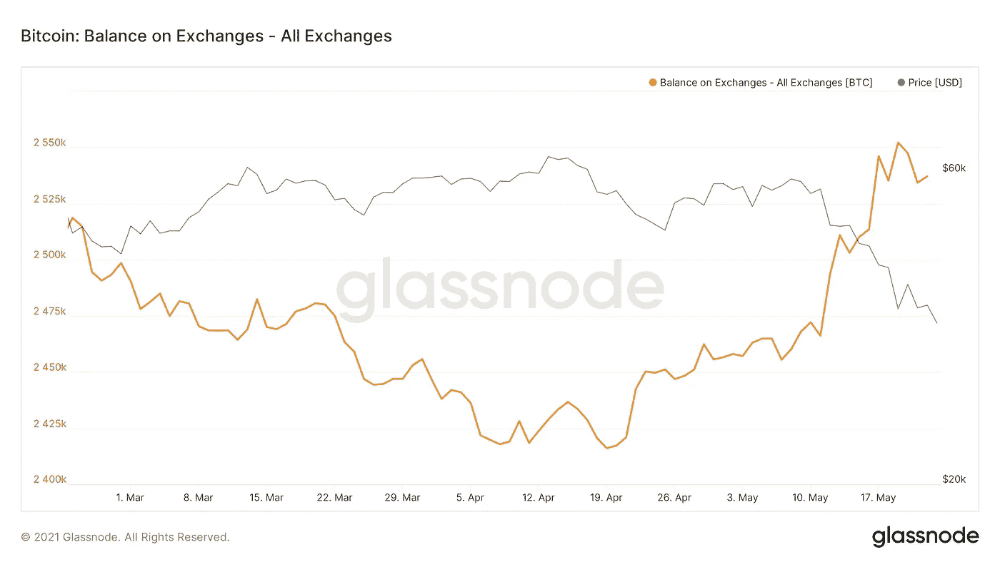
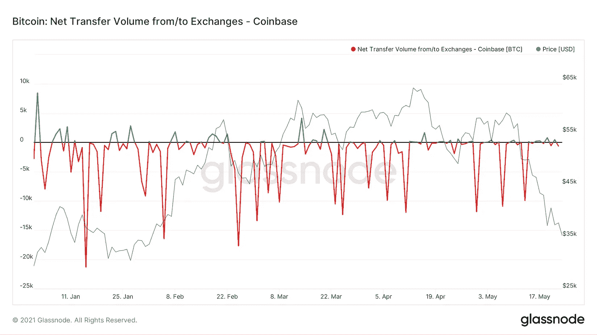
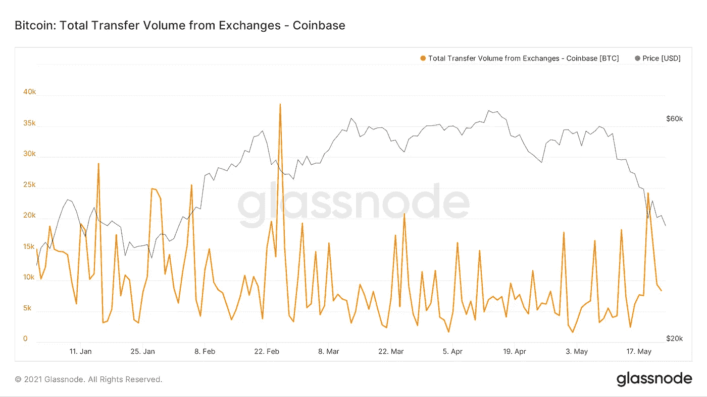
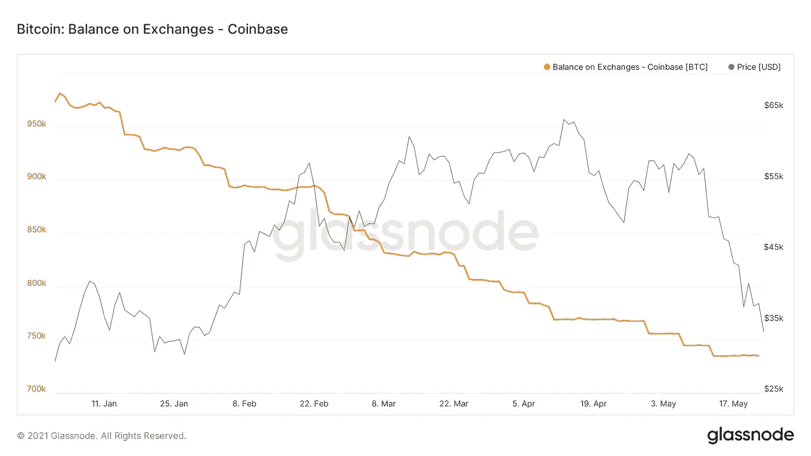

# 外汇余额和比特币价格的短期展望

> 原文：<https://medium.com/coinmonks/exchange-balances-and-a-short-term-outlook-on-bitcoins-price-fffca5e55630?source=collection_archive---------3----------------------->

## 为什么比特币的价格可能会遭遇更多的短期痛苦

在这篇文章中，我不会对比特币的中长期前景发表评论，在我看来，比特币仍然是看涨的，例如 [Will Clemente](https://pomp.substack.com/p/who-was-buying-and-selling-during) 在他最近的 Pomp Letter 中显示了这一点。相反，我将研究一些交易所的动态，以及为什么现在谈论交易所供应短缺的下降趋势还为时过早，以及为什么比特币的价格可能会经历更多的短期痛苦。

在过去几周大幅上涨后，交易所的比特币余额在周四和周五一直在下降(见图 1)。在昨天的[推特帖子](https://twitter.com/JanWues/status/1396037780023750660?s=20)中，我已经解释了为什么再次谈论下降趋势还为时过早。事实上，在经历了两天的下跌后，昨天还略有上涨。交易所似乎还没有一个明确的趋势。某一天，所有交易所持有的比特币余额可能由 Bitfinex 驱动，而另一天则由 Bitmex 或多个交易所驱动。某一天交易所显示净流入，而另一天则显示净流出。

Graph 1; Bitcoin Balance on Exchanges; Source: Glassnode

在能够谈论趋势之前，重要的是各个交易所开始再次建立更“正常”的模式，在这种模式下，一两个大流量不会主导净流量。只要这些巨大的流量决定了交易所持有的比特币总余额，谈论趋势还为时过早。

最重要的是，在过去几个月处于下跌趋势前沿的比特币基地交易所，在过去几天没有出现任何实质性的净流出(见图 2)。它甚至没有接近我们今年看到的任何红色尖峰。相反，它一直在略微积极和略微消极之间翻转。

Graph 2: Bitcoin Net Transfer Volume from/to Coinbase; Source: Glassnode

部分原因是资金流入抵消了资金流出。图 3 显示了比特币基地的总流出量。周三流出量激增。要想看到更大的日流出量，我们必须回到 2 月 25 日。可以说，周四的资金外流仍然很高，但没有什么异常。周五和昨日又出现了相当正常的资金外流。

Graph 3; Bitcoin Total Transfer Volume From Coinbase; Source: Glassnode

虽然有证据表明，鲸鱼数量一直在增加，并且在这次调整期间出现了新的鲸鱼，但与 1 月/2 月的流出量相比，过去几天的总流出量并没有那么大。

这可以证明:

1.  鲸鱼没有像 1 月/2 月那样大量买入(通常这种趋势在过去几周不太明显，比特币基地比特币余额的横向波动时间较长，如图 4 所示)和/或
2.  鲸鱼仍在等待更低的比特币价格买入。

尤其是如果 2。是真的，大型投资者出于任何原因都在等待更低的价格，比特币的短期价格可能会再次下调。

你可以在这里找到文章[的更新。](https://jan-wuestenfeld.medium.com/exchange-balances-and-a-short-term-outlook-on-bitcoins-price-update-987aceeb8219)

更多定期更新请在推特上关注我: [@JanWues](https://twitter.com/JanWues)

披露:上述文章引用了一种观点，仅供参考。它无意成为投资建议。

## 附录

Graph 4: Bitcoin balance held on Coinbase; Source: Glassnode

*   [比特币基地评论](/coinmonks/coinbase-review-6ef4e0f56064) | [德里比特评论](/coinmonks/deribit-review-options-fees-apis-and-testnet-2ca16c4bbdb2) | [FTX 交易所评论](/coinmonks/ftx-crypto-exchange-review-53664ac1198f)
*   [n 平均零点评审](/coinmonks/ngrave-zero-review-c465cf8307fc) | [Phemex 评审](/coinmonks/phemex-review-4cfba0b49e28) | [PrimeXBT 评审](/coinmonks/primexbt-review-88e0815be858)