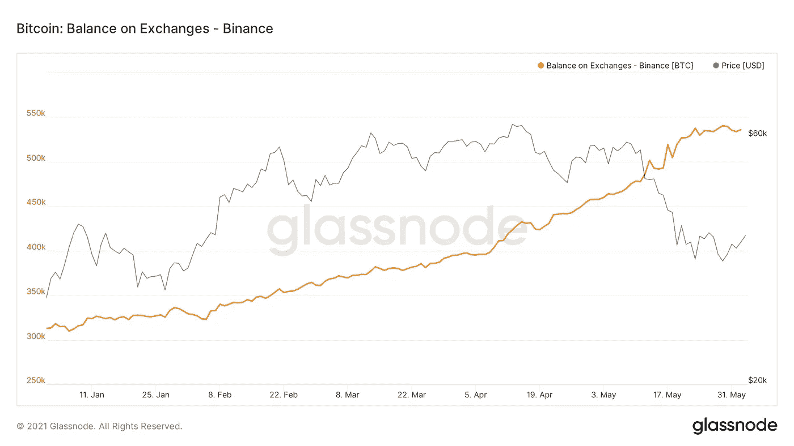

# 外汇余额和比特币价格的短期展望(更新)

> 原文：<https://medium.com/coinmonks/exchange-balances-and-a-short-term-outlook-on-bitcoins-price-update-987aceeb8219?source=collection_archive---------7----------------------->

在我 23 年 5 月的上一篇文章中，我解释了为什么比特币的价格可能会遭遇更多的短期痛苦。自那时以来已经过去了一段时间，我想简要介绍一下这方面的最新情况。截至本文撰写之时，比特币的价格约为 39.000 美元。根据 Coingecko 的数据，这高于 5 月 23 日比特币的收盘价 34.978 美元。随着比特币 2021 大会明天在迈阿密召开以及价格回升，根据今天来自 [Nik Patel](https://twitter.com/cointradernik/status/1400399694371643392) 的 Twitter 民意调查，人们的情绪似乎仍然存在分歧。

看起来人们不相信最近的价格回升。缩小最近的价格回升也不是那么令人印象深刻，价格仍然在 30，000 美元至 40，000 美元之间(见图 1)。我个人不是一个助教，但是 [CryptoYoda](https://medium.com/u/216664483275?source=post_page-----987aceeb8219--------------------------------) 的图表证实了这种混杂的情况。虽然他看到三角形价格的突破，但他也对这一举动持谨慎态度，并仍然认为下行风险很大。

谈到外汇平衡，情况也不明朗。虽然起初看起来余额可能会再次下降，但上周它们又开始上升了。值得注意的是，增加的外汇余额不一定是熊市。事实上，在过去的周期中，交易所的比特币余额随着价格上涨。

Graph 1: Bitcoin Balance on Exchanges; Source: Glassnode

比特币基地外汇净流量的情况仍然好坏参半(见图 2)。可以看出，它仍然在轻微的正值和负值之间变化。昨日，比特币基地出现强劲的资金净流出，逾 7100 万美元比特币流出该交易所。这是一个稍微积极的迹象，但需要谨慎，因为只有一天。

Graph 2: Bitcoin Net Transfer Volume from/to Coinbase; Source: Glassnode

关于外汇流动，币安也很有意思。虽然币安是过去几个月资金流入量最大的交易所之一，但这些大量资金流入在上周有所降温(见图 3)。

Graph 3: Bitcoin Net Transfer Volume from/to Coinbase; Source: Glassnode

正如[@稀释证据](https://twitter.com/dilutionproof)所指出的，交易所的资金流入主要是由衍生品交易所驱动的，并认为这是市场参与者风险偏好增加的一个迹象。

尽管短期前景仍是喜忧参半，但根据环比指标，本轮周期的牛市仍然完好无损。例如，[长期持有人](https://twitter.com/dilutionproof/status/1399819004718587910?s=20)一直在累积，[矿商的持股](https://twitter.com/dilutionproof/status/1399819009600655369?s=20)总体上一直在增加。相对于比特币的供应量，在过去的日子里，市场上从来没有像现在这样稳定的硬币。稳定的硬币供应比率处于历史最低点(见图表 4)。

Graph 4: Stable Coin Supply Ratio; Source: Glassnode

虽然这些资金也可能流入替代币或市场上的其他金融产品，但如果比特币和市场再次开始大幅波动，有很多干粉末在场外等待潜在的部署。

因此，总而言之，尽管短期前景可能略有改善，但短期调整的风险仍然很高。不过，总体而言，中长期前景依然乐观。

更多定期更新请在推特上关注我: [@JanWues](https://twitter.com/JanWues)

披露:上述文章引用了一种观点，仅供参考。它无意成为投资建议。

> 加入 [Coinmonks 电报小组](https://t.me/joinchat/uiLERCQL1fQ5ZjA1)并了解加密交易和投资

## 另外，阅读

*   [顶级付费加密货币和区块链课程](https://blog.coincodecap.com/blockchain-courses) | [币安评论](/coinmonks/binance-review-ee10d3bf3b6e)
*   [MXC 交易所评论](/coinmonks/mxc-exchange-review-3af0ec1cba8c) | [Pionex vs 币安](https://blog.coincodecap.com/pionex-vs-binance) | [Pionex 套利机器人](https://blog.coincodecap.com/pionex-arbitrage-bot)
*   [如何在印度购买比特币？](/coinmonks/buy-bitcoin-in-india-feb50ddfef94) | [WazirX 评论](/coinmonks/wazirx-review-5c811b074f5b) | [BitMEX 评论](https://blog.coincodecap.com/bitmex-review)
*   [印度比特币交易所](/coinmonks/bitcoin-exchange-in-india-7f1fe79715c9) | [比特币储蓄账户](/coinmonks/bitcoin-savings-account-e65b13f92451)
*   [币安费用](/coinmonks/binance-fees-8588ec17965) | [Botcrypto 审核](/coinmonks/botcrypto-review-2021-build-your-own-trading-bot-coincodecap-6b8332d736c7) | [Hotbit 审核](/coinmonks/hotbit-review-cd5bec41dafb) | [KuCoin 审核](https://blog.coincodecap.com/kucoin-review)
*   [我的加密副本交易经验](/coinmonks/my-experience-with-crypto-copy-trading-d6feb2ce3ac5) | [AAX 交易所评论](/coinmonks/aax-exchange-review-2021-67c5ea09330c)