# 2020 年 6 月 Exchange Token 估值报告| TokenInsight

> 原文：<https://medium.com/coinmonks/exchange-token-valuation-report-2020-june-tokeninsight-6574e0944589?source=collection_archive---------1----------------------->

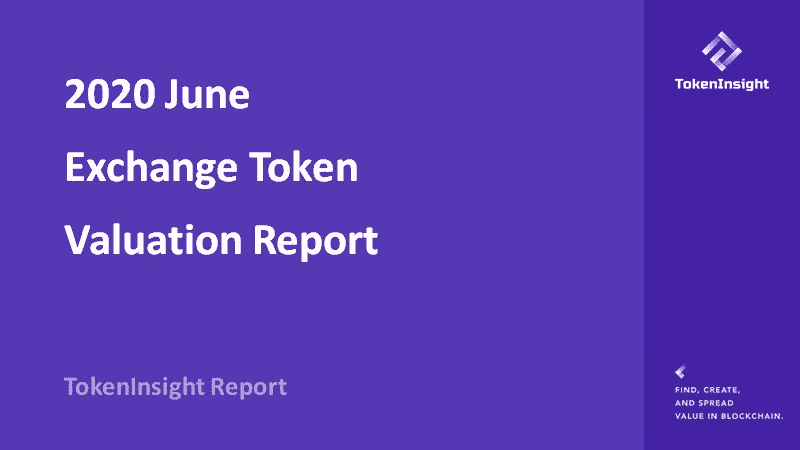

# 概观

在过去的 3 年里，加密货币行业经历了巨大的变化。在 2017 年之前，加密到加密的交易所是有限的，
但是我们已经看到在过去的三年里
加密货币交易所行业的增长，导致在这个
行业推出了数百个不同的交易所。

有几十家加密货币交易所发布平台
token(基于交易所的令牌)回馈社区利益。
加密货币领域的估值是一项艰巨的任务，既没有**行业标准也没有
可靠的估值方法来进行
适当的估值，以发现基于交易所的
令牌的公允价值，作为市场参与者对目标交易所进行
健康检查的参考点。**

对加密货币交易行业
进行适当而可靠的分析，可以提供该行业的直升机视图。根据 TokenInsight 的
数据，我们发现交易所的交易量与市场高度
相关，直接影响特定交易所的
收入。**我们利用基本和定量
方法来构建基于 TokenInsight 交换的令牌评估框架。**

对于此次估值发布，我们发现大多数交易所
代币被低估。这与黑色星期四暴跌以来的普遍
回升有很大关系。**大量
衍生品交易产品的出现，帮助很多交易所不再
单纯依赖现货市场带来的利润。**

比特币第三次减半也在支持
市场方面发挥了关键作用，但我们认为减半对市场的影响目前仅限于
市场情绪。市场仍需要时间
调整，并为新进入者创造机会来体验这个
创新和充满活力的新金融市场。

**借助 TokenInsight 交换令牌评估框架，我们现在可以
对基于交换的令牌进行标准化分析，以反映交换背后的真实价值。**

可以进行进一步分析，将这些令牌分类到基于特征的分类系统
中，例如大型、中型、小型股
和价值、增长。

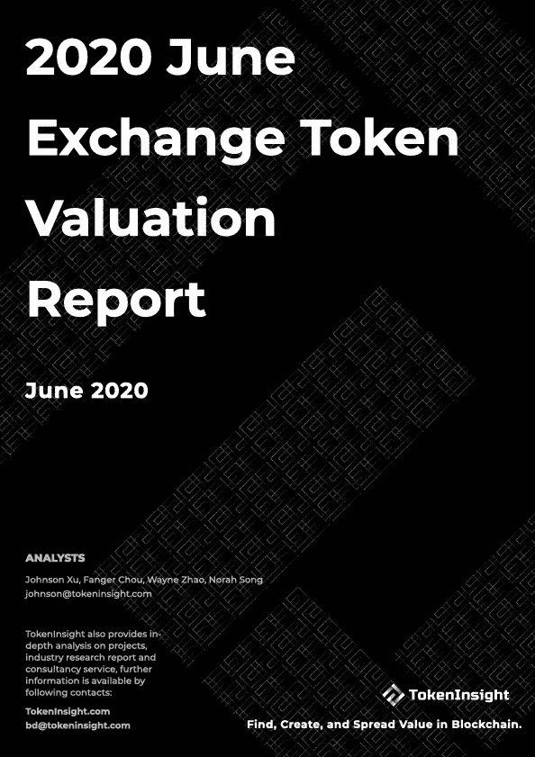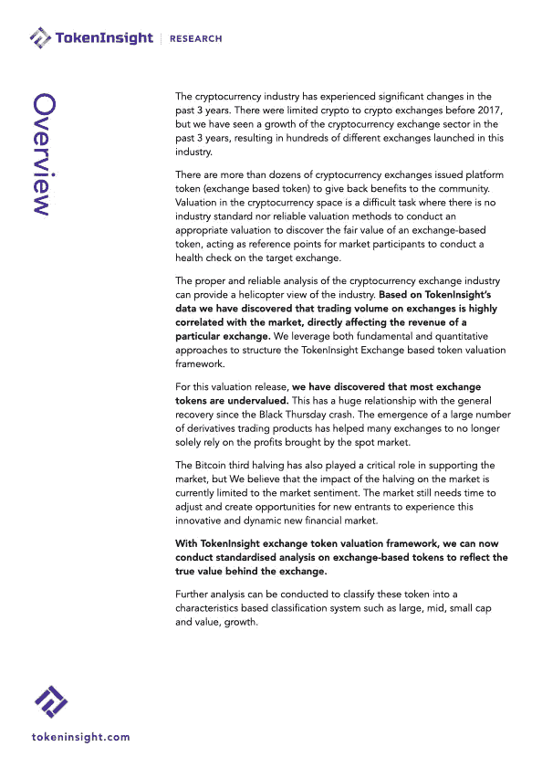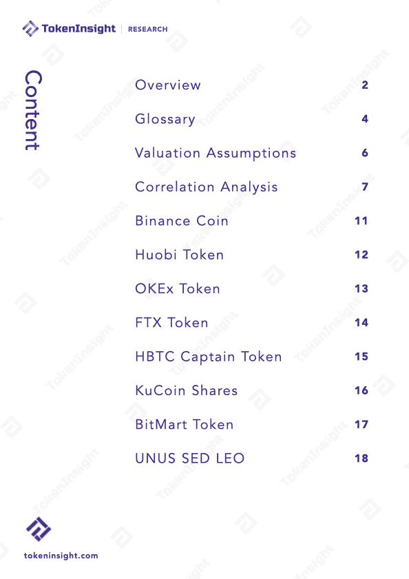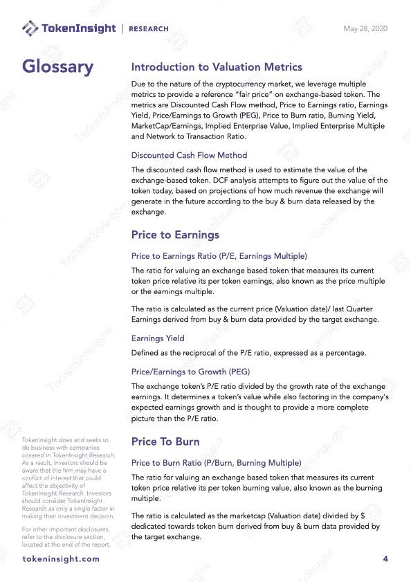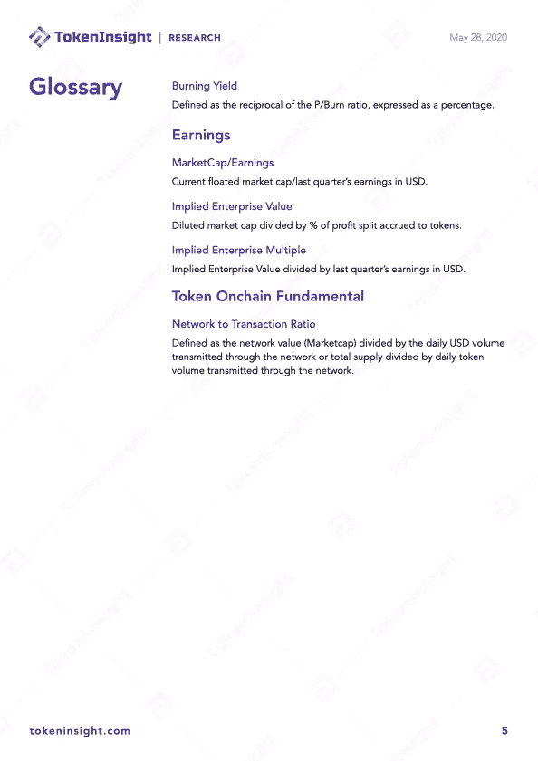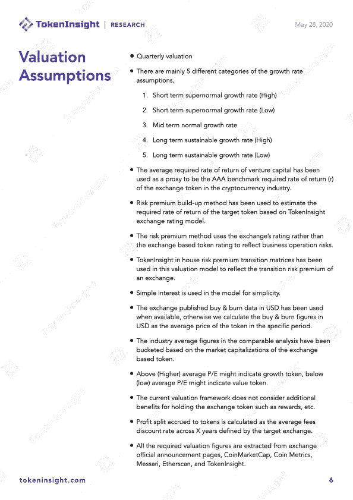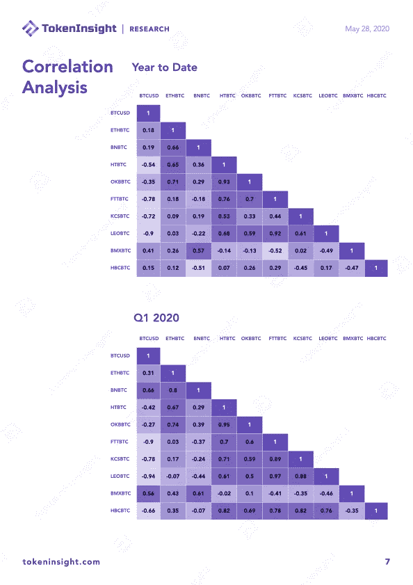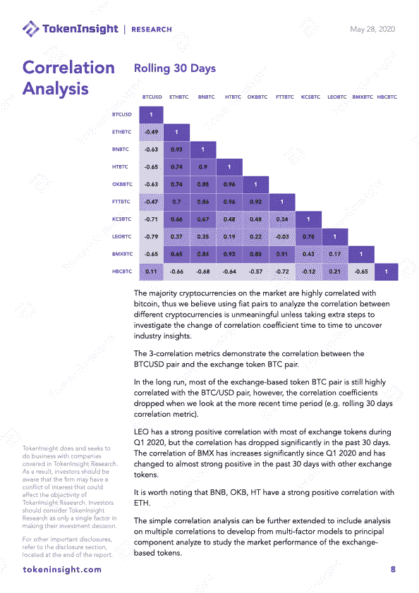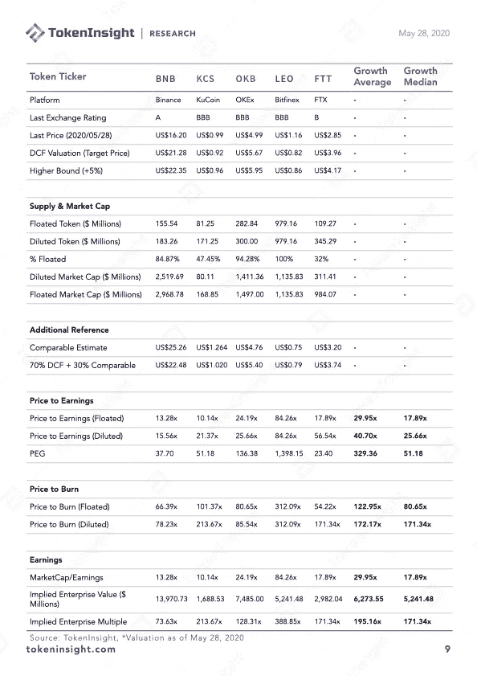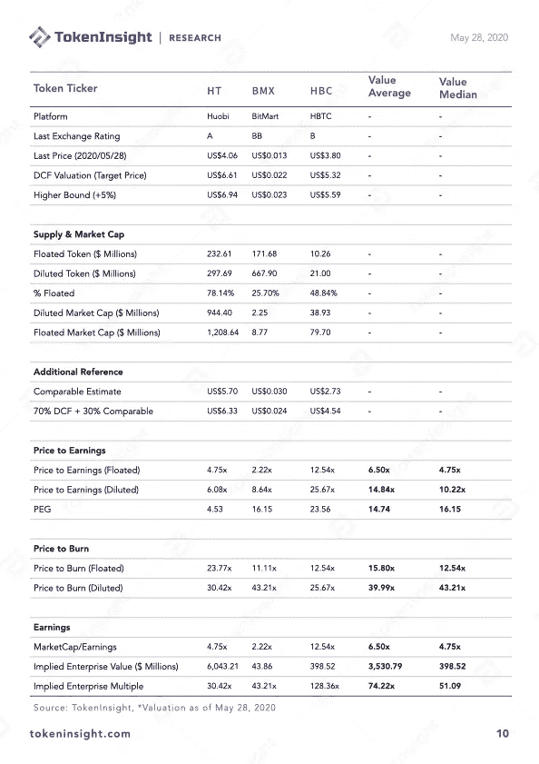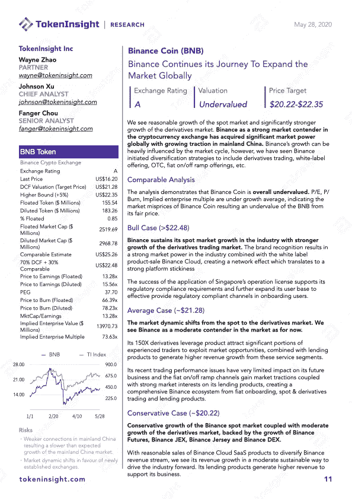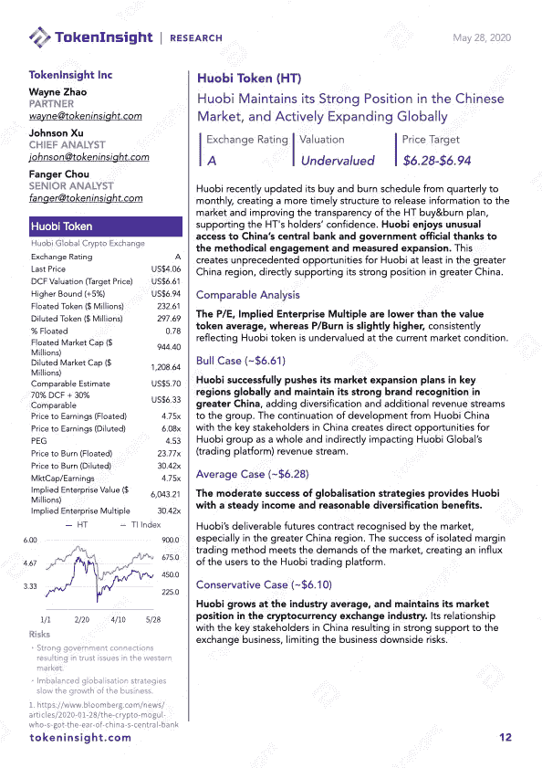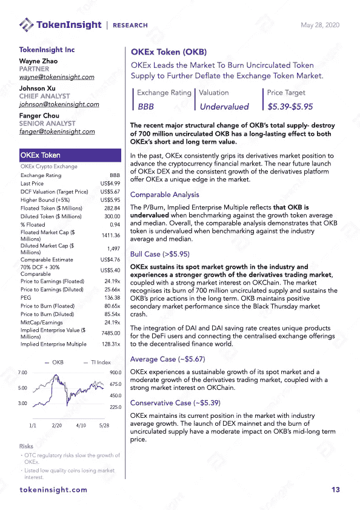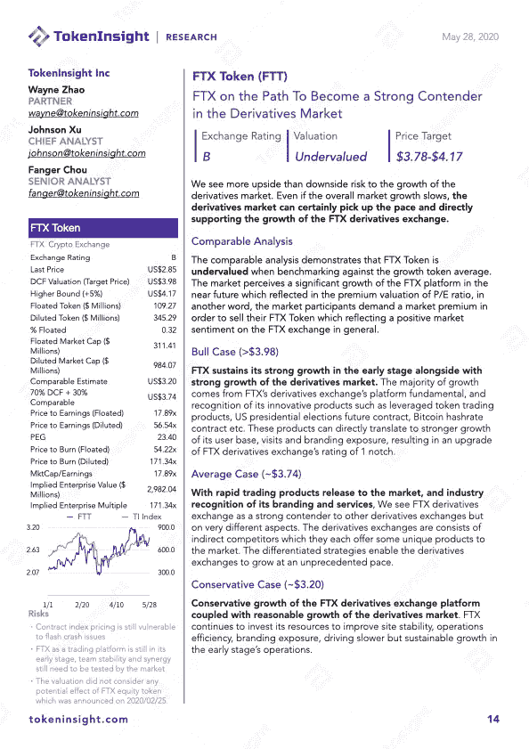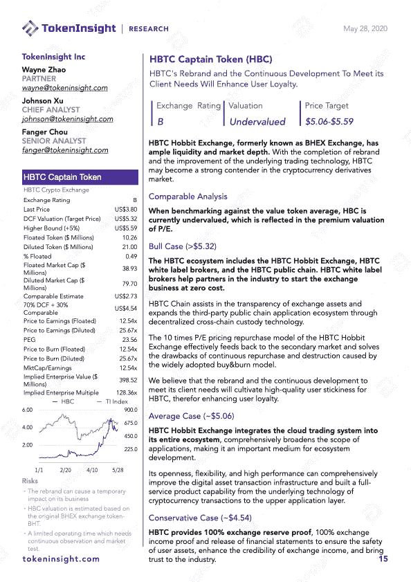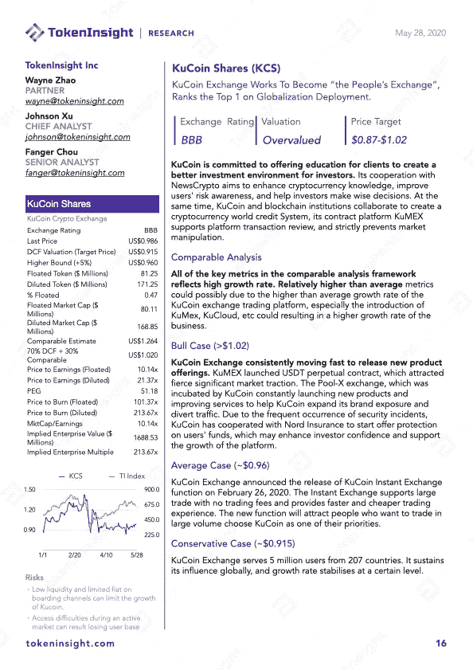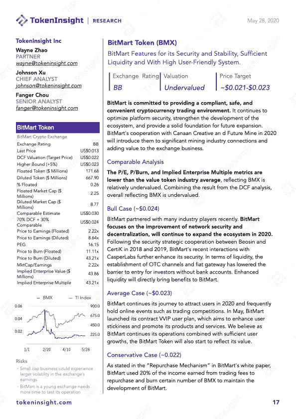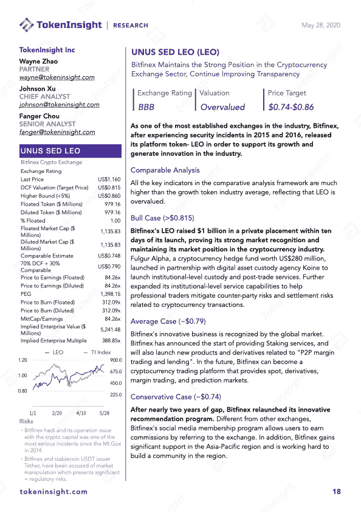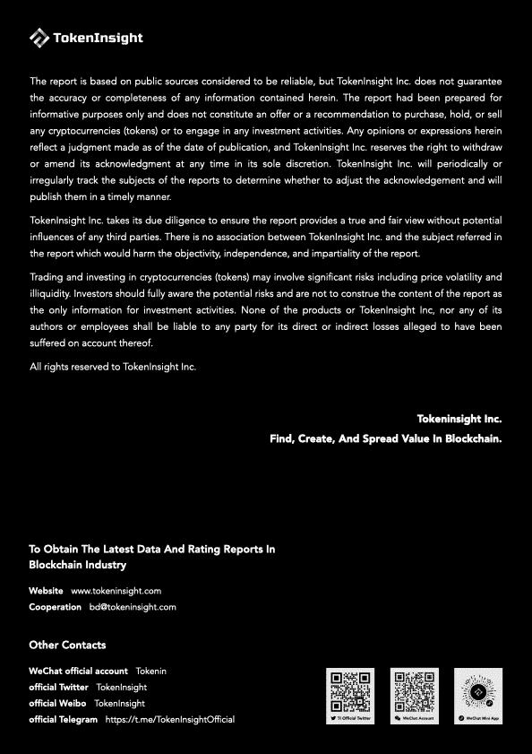

# 关于 TokenInsight

**成立于 2017 年的**[**token insight**](https://tokeninsight.com/?utm_source=article&utm_medium=medium&utm_campaign=TI)**是一家领先的数据&技术驱动的区块链金融机构。** TokenInsight 首创了完整的区块链行业分类体系，覆盖了超过**1600 个项目，**发布了超过 **300 份评级报告，**并对 **10 个主要行业进行了深入研究。**

TokenInsight 的数据、评级和研究报告可以访问全球 70 多个数据平台，包括 **Messari、Delta、币安信息、AICoin、火币信息、**等。，月 PV 超过 3000 万。TokenInsight 已正式加入由加密货币排名网站 CoinMarketCap 发起的数据问责与透明联盟(Data)。

# 如果您喜欢我们的评论，请关注我们:

💡官方网站:[https://www.tokeninsight.com](https://tokeninsight.com/?utm_source=article&utm_medium=medium&utm_campaign=TI)

📌领英官方页面:[https://www.linkedin.com/company/tokeninsight/](https://www.linkedin.com/company/tokeninsight/)

🔎电报:[https://t.me/TokenInsightOfficial](https://t.me/TokenInsightOfficial)

🗺推特:[https://www.twitter.com/tokenInsight](https://www.twitter.com/tokenInsight)

📕https://www.reddit.com/r/TokenInsight/

> [直接在您的收件箱中获得最佳软件交易](https://coincodecap.com/?utm_source=coinmonks)

