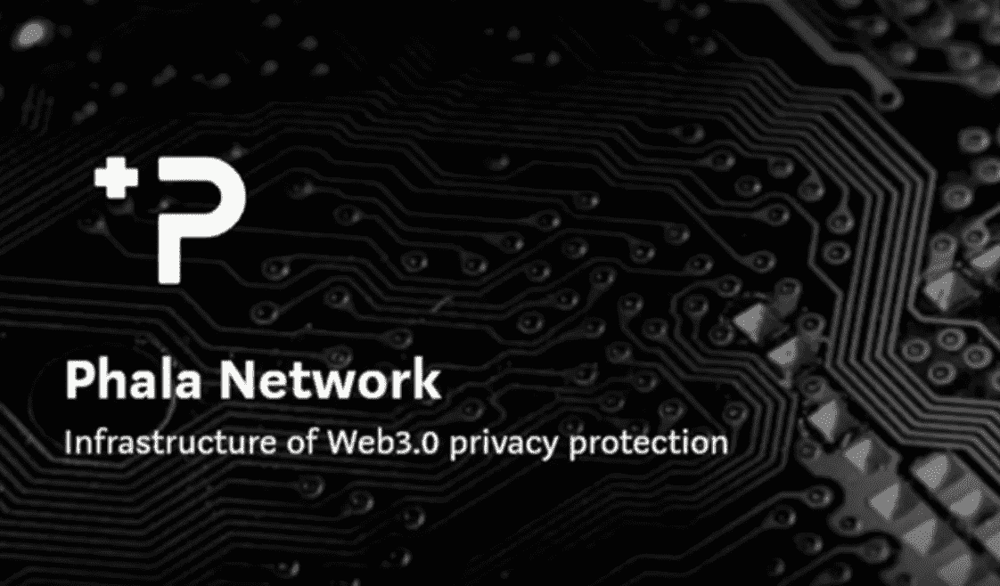

# 2021 年波尔卡多特最激动人心的项目

> 原文：<https://medium.com/coinmonks/exciting-projects-on-polkadot-in-2021-what-do-they-do-why-do-they-matter-8f35a8e14cbe?source=collection_archive---------7----------------------->

## 神奇的词是互操作性

The Polkadot Relay Chain

Polkadot 被设计成一个多链网络。它旨在联合和连接多个区块链(para 链)，同时允许它们之间的透明和跨链通信。

随着预计在 2021 年在 Polkadot 网络上推出中继链，以及区块链发展取得重大进展，许多人也热切期待其项目的后续推出。

截至撰写本文时，目前有超过 300 个项目正在使用[衬底](https://www.substrate.io/)或 [Polkadot](https://polkadot.network/) 构建(如果你想知道如何快速构建一个区块链，请到[这里](https://lukezyx.medium.com/how-to-build-a-blockchain-rapidly-e12bccc46a93))。因此，我在这里帮助你确定这些项目中哪些是更重要的，因为要找出哪些是值得你花时间去做的真的很难。

本文的主题是 ***互操作性，*** 这也是 Polkadot 的主题/主要目的，即连接链之间的点(双关语)。

## **月光:在波尔卡多特上提供以太坊兼容的智能合约**

> “未来是多链的”

[Moonbeam](https://moonbeam.network/) 是一个基于衬底的链，它的目标是让以太坊兼容的智能契约与 Polkadot 互操作。这意味着开发者可以通过使用 Moonbeam 在 Polkadot 上运行以太坊智能合约。

这是巨大的，因为它允许去中心化的应用程序从以太坊迁移到 Polkadot，Moonbeam 将自己标榜为多链的最简单的路径。

这是一个改变游戏规则的原因，因为将智能合约从以太坊迁移到另一个链(如 Polkadot)的一个(如果不是最大的)摩擦是需要重写所有 Solidity/Vyper 基础代码以符合迁移的链。这比重新学习一门全新语言的耗时需求更重要。

**使用 Moonbeam 将允许开发人员在 Solidity/Vyper 中进行开发，然后进入 Polkadot 网络，以使用其特定于链的功能，如链上治理和多链集成。**这有助于项目通过 Polkadot 的多链方法扩大其市场曝光度，从而向新用户扩展其覆盖范围和用例。

该项目于 2020 年推出了第一个测试网，预计将于 2021 年在 Q2 Polkadot 提供 para 链。与 Moonbeam 合作的第一批集成之一是 I [njective Protocol](/injective-labs/injective-integrates-with-polkadot-to-expand-its-decentralized-cross-chain-derivatives-trading-603afcda4bda/) ，这是一个第 2 层的分散式交换。Chainlink 和[海洋协议](https://www.purestake.com/news/moonbeam-and-ocean-protocol-partner-to-bring-a-new-data-economy-to-the-polkadot-ecosystem/)最近也宣布将他们的网络集成到 Moonbeam 测试网上。

## **阿卡拉网络:提供跨链稳定币平台**

今天，大多数分散金融(DeFi)项目都建立在以太网上。虽然这是目前最流行的方法，但是可伸缩性和事务吞吐量的问题已经限制了 DeFi 的进一步应用

Acala 网络是 Polkadot 上第一批 DeFi 项目之一，也是第一个稳定的硬币，Acala 美元(aUSD ),在网络上本地发行。它的主要目的是使通过波尔卡多区块链的金融交易更加容易，同时解决比特币和以太坊的吞吐量和可扩展性问题。这种稳定的硬币将允许跨应用程序的跨链流动性。

**Acala 实现跨链流动性的一个飞跃是宣布在以太坊虚拟机上支持 para 链。**

有了这个，在 Acala 上发生的任何交易都可以转移到以太坊，然后再转移回来。这方面的一个例子是在波尔卡多特和以太坊区块链上使用协议的本地澳元稳定硬币。这将允许用户在 Uniswap 上购买 ERC-20 代币，但也可以在 Polkadot 内使用相同的 aUSD 进行交易。

## **Phala Network:提供具有数据保密性的跨合同互操作性**

> “你能想象没有隐私的草间弥生吗？”

大多数基于隐私的区块链本质上是孤立的，因此不能彼此互操作。互操作性是现代智能合约的关键，因为它允许它们从其他智能合约读取信息和调用功能。

Phala Network 是一个基于基质的链，正在努力实现具有隐私的互操作智能合同。根据功能的不同，这一点很重要。身份信息或交易流程/合作伙伴等敏感数据不应公开，但在与其他区块链连接时仍应能够进行交易。

在技术方面，Phala 应用了可信环境执行(TEE)设计，允许机密数据在隔离的私有环境中运行，并在授权的情况下单独输出结果。

**这可以刺激更多的企业采用区块链**,因为这现在允许两个独立、不同的组织彼此共享敏感数据，而不用担心潜在的数据泄漏。