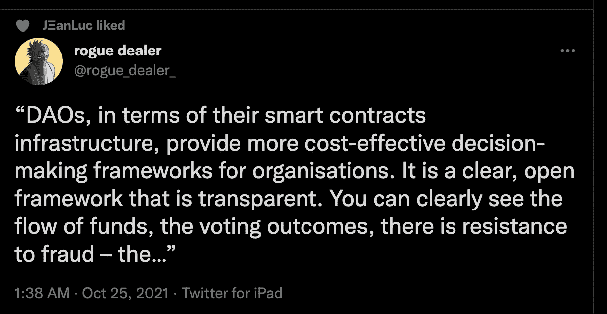

# 独家访问…什么？(国家森林公园和封闭社区)

> 原文：<https://medium.com/coinmonks/exclusive-access-to-what-nfts-and-gated-communities-4298d4eeee6d?source=collection_archive---------0----------------------->

## 了解价值从哪里开始，以及它可能的发展方向。

[Image Credit to Obits Official and Well…Me…I’m the HODLer](https://opensea.io/collection/obitsofficial)

是的，我的讣告又在标题图片里了。毕竟是阴森森的 Szn！随着 NFT 市场的持续增长，理解如何超越艺术，了解 NFT 如何围绕令人信服的愿景协调不同的个人，并推动他们创造独特的品牌，变得前所未有的重要。通过秘密朋克、无聊猿游艇俱乐部和讣告的例子，我的目的是绘制一条从 NFT 艺术向下的路径，到从它周围形成的社区中生长的东西，以及为什么这很重要。如果这吸引了你，那么继续读下去吧！

## 秘密朋克:秘密艺术的根源

> “我认为与众不同，与社会格格不入是世界上最伟大的事情。”—伊利亚·伍德

秘密艺术是一种运动，而秘密朋克是点燃火种的火花，并且仍然在保持火种的燃烧中发挥着关键作用。回到 2017 年 6 月，[两位创意技术专家和软件开发人员](https://www.larvalabs.com/about)，Matt Hall 和 John Watkinson 在区块链以太坊发起了一个艺术项目。那个生成艺术项目是 Crypto Punks，一个打破传统的，受赛博朋克启发的，反叛驱动的对 Crypto 根源的认可。而它的 10，000 个独特的朋克仅仅是用购买一个朋克的油费铸造的。是的，以太坊的汽油费现在已经达到了最高点，但在那个时候，它们通常是可以承受的，因为以太坊还处于早期阶段，ICO 时代还没有到来。总而言之，朋克是人们广泛关注的秘密艺术项目的第一个例子，尽管他们的真正潜力花了近四年时间才形成。

为什么，你可能想知道？

对我来说，这是对奢侈品的重新定义。2020 年夏天是 DeFi 的夏天，但 2020 年作为一个整体也标志着比特币作为宏观对冲的火箭和加密艺术空间的初步形成。然而，直到今年，这种羽翼未丰的创作运动才真正显示出它的“持久力”，这要归功于皮普尔[提供了加密之外的合法性证明](https://www.theverge.com/2021/3/11/22325054/beeple-christies-nft-sale-cost-everydays-69-million)，以及加密朋克在火烈鸟道[的推动下重新声名鹊起](https://www.coindesk.com/tech/2021/01/23/early-cryptopunk-digital-collectible-sells-for-762k-in-ether/)，并向世界展示了他们认为加密朋克理应拥有的经济价值。从那时起，Crypto 的 OG NFT 系列就更上一层楼，直到今天，仅在上周就公布了近 3950 万美元的销售额。

NFT 先锋能走得更远吗？只有时间会告诉我们，但现在，请记住，如果没有火烈鸟道和其他人的暴跌，今年可能会有所不同。

## 无聊猿游艇俱乐部:从艺术到激发创作潜力

猿跟着猿。猿帮猿展开创作生涯？

即使作为一个局外人，我也不禁对 Bored Ape 游艇俱乐部(BAYC)的崛起表示钦佩。最初是一系列反传统的猿类艺术和一个古怪的在线酒吧，任何人都可以在虚拟墙上留言，现在已经发展成为一个真正的创意之道。我在这里说“有创意”，因为我看到 Ape 社区在如此多的领域有如此多的潜力，我不想把它们放在一个盒子里，例如“街头服饰+艺术”。如果你想想他们的起源故事以及现在在社区内存在的巨大价值，无论是在金融还是人力资本方面，那么你就会开始明白我的意思了。虽然媒体试图将 BAYC 放在“NFT 俱乐部”的盒子里，那里的头像是人们渴望拥有的奢侈品，但它是 BAYC 的灵魂，加上加密朋克的灵魂和像 Beeple 这样的艺术家的成功，将加密艺术变成了今天的雪崩。

从一开始作为一个吸引“生活在边缘”的加密市场参与者的空间，BAYC 已经成为一个文化杰作，激发了一大群社区的创建。只需在 OpenSea 的探索页面上花几分钟时间，你就会看到今天有多少 NFT 俱乐部、帮派和帮派存在，在很大程度上，这是因为 BAYC 的例子。然而，他们中没有一个人在苏富比拍卖行以 2490 万美元的价格卖出了他们的 NFT，仅在一周内就使 T2 的销售额超过了 2700 万美元，或者像 BAYC 那样吸引了如此多的知名人士参与他们的事业。在我看来，只有加密朋克坐在更高的水平。

然而，在所有这些数字之上，还有更重要的东西。BAYC 和 Crypto 朋克都是 NFT 社区能够和应该成为什么样的概念的早期证明。前者指的是在现有技术、用户基础和整体采用情况下，现在可能发生的事情。后者指出了前方的道路，就像整个密码空间一样，绝对充满了千载难逢的机会。这取决于用户自己，五颜六色的，狂野的，免费的 PfPs 统治着 Twitter。这意味着要超越访问、商品、代币甚至艺术，想想一个多样化的、全球分布的、有着共同愿景的群体可以做的每一件可能的事情。换句话说，想象一家由所有利益相关者平等经营的公司，然后想象该公司可能涉足的所有业务领域。你会发现自己陷入了一个无休止的循环，这是必然的。NFT-如果做得好，社区可以成为道。事实上，只要社区协作将其使命、愿景和价值观转化为实际产品，并同意某种组织结构来实现这一点，他们就成为了 Dao。

考虑下面，这是我今天偶然发现的。

[Quote Credited to Rogue Dealer via Twitter](https://twitter.com/rogue_dealer_/status/1452419139813797890)

这句话概括了 DAOs 的力量。他们是透明的组织，拥有分散的领导、资金、投票权和由自动执行软件支持的整体管理。你在这个领域花的时间越多，你就越会发现这种功能组合有多么强大。BAYC 是 NFT 社区的第一个主要例子，这个社区已经是一个“道”,里面发生着各种各样的变化。目前，这些举动对我来说很大程度上是一个谜，但将 BAYC 置于一种自己的城市状态的保护伞下会产生一些清晰。随着时间的推移，我希望他们的代币的推出以及随后的风险投资能带来更多收益。

## 从道势到 NFT 道

DAOs 的力量现在已经分裂成两大阵营，一方用 crypto 来控制自己，另一方用 NFTs 来控制自己。尽管如此，对于“加密和 NFT 道”来说，访问只是第一个引爆点一旦获得了访问权限，就提供了什么，也就是说，就其“愿景”和当前/未来产品而言，社区内部存在什么才是最重要的。如果社区不团结起来创造超越艺术本身的东西，并为世界的一部分提供真正的价值，NFT 门的访问就什么都不是。

仅仅因为我们正在用所有这些技术建立一个新的、更好的世界，并不意味着所有永恒的商业原则已经过时。相反，他们还在那里。我把当前的加密空间称为元宇宙，因为对我来说，它是一个包罗万象的术语，涵盖了来自区块链、智能合约、加密货币、代币、NFT、VR、AI 和其他一切汇聚在这个美丽、巨大、社会转折点的东西，我们称之为家。

就职业选择而言，没有什么地方是我更想去的。如果你已经在这里，正在阅读这篇文章，那么你已经看到了 NFT 社区的最早的例子，这些社区已经或者至少可能变得更加强大。如果你对人们想要什么以及如何制造产品有所了解，那么你就能在我称之为“密码硅谷”的地方实现这一目标

NFT 是一种激励形式，它为现在和未来的 Dao 打开了大门，Dao 是世界上最具创新性的企业的试验场，也是我打算留下来的地方。

下一次，我们将通过“加密 Dao”进一步挖掘它们的潜力，然后在下一篇文章中将它们与 NFT Dao 联系在一起，然后继续讨论更多的突发想法。NFT 空间中存在无数充满希望的例子，但目前，我们正处于 2017 年 ICO 热潮中。许多人会失败，但也有许多人会成功。不言而喻，这样的陈述不是财务建议，而是我基于我的论文的信念，这是基于我在这里多年的经验。对每一个观点都要有所保留，并形成自己的工具集。

推测不统治。当一个创新区域开始形成时，这种声音就更大了。

在我们再次见面之前，请记住你可以并且应该随时在 Twitter 上与我联系，分享你对这篇文章以及我写的其他文章的想法。最后，如果你有兴趣让我的想法在每个周末通过电子邮件发送给你，[订阅我的免费时事通讯](https://www.getrevue.co/profile/blockdemiclab)，在那里我会分解元宇宙如何为每个人改善事情！注意安全，记住参与 NFT 社区通常就像发现他们的不和谐并表达你有兴趣帮助他们一样简单！

*免责声明:我确实有讣告。我不打算从我的努力中获得任何项目投资，任何人都不应该根据我写的东西做出任何投资决定。我所有的内容都是纯教育性的。不要把这篇文章当作购买任何 NFT 的诱因。在这个时代，你永远无法知道谁不是在抛售他们的个人投资组合，这是必须要说的。在你为任何事情投入任何财政资源之前，一定要做好自己的研究。*

我现在还为三家专注于 NFT 的公司/项目提供咨询，我一直希望听到更多的信息。如果你正在用 NFTs 创业，并且正在寻找战略/内容顾问，请发邮件给我:blockdemiclab @ proton mail . ch .

> 加入 Coinmonks [电报频道](https://t.me/coincodecap)和 [Youtube 频道](https://www.youtube.com/c/coinmonks/videos)了解加密交易和投资

## 也阅读

 [## 最佳加密交易所| 2021 年十大加密货币交易所

### ICON _ PLACEHOLDEREstimated 预计阅读时间:28 分钟加密货币交易所的加密交易需要知识…

blog.coincodecap.com](https://blog.coincodecap.com/crypto-exchange)  [## 2021 年 10 大最佳加密贷款平台| CoinCodeCap

### 当谈到加密货币贷款时，大量因素等同于良好的收入状况。此外，借款的一部分…

blog.coincodecap.com](https://blog.coincodecap.com/crypto-lending)  [## 2021 年最佳免费加密交易机器人

### 2021 年币安、比特币基地、库币和其他密码交易所的最佳密码交易机器人。四进制，位间隙…

medium.com](/coinmonks/crypto-trading-bot-c2ffce8acb2a)  [## 最佳 4 个加密交易信号电报通道

### 这是乏味的找到正确的加密交易信号提供商。因此，在本文中，我们将讨论最好的…

medium.com](/coinmonks/best-crypto-signals-telegram-5785cdbc4b2b)  [## BlockFi 评论 2021:利弊和利率| CoinCodeCap

### 今天，我们提出了一个全面的 BlockFi 评论，这是一个成立于 2017 年的加密贷款平台，拥有其…

blog.coincodecap.com](https://blog.coincodecap.com/blockfi-review)  [## 如何在印度购买比特币？2021 年购买比特币的 7 款最佳应用[手机版]

### 如何使用移动应用程序购买比特币印度

medium.com](/coinmonks/buy-bitcoin-in-india-feb50ddfef94)  [## 加密税务软件——五大最佳比特币税务计算器[2021]

### 不管你是刚接触加密还是已经在这个领域呆了一段时间，你都需要交税。

medium.com](/coinmonks/best-crypto-tax-tool-for-my-money-72d4b430816b)