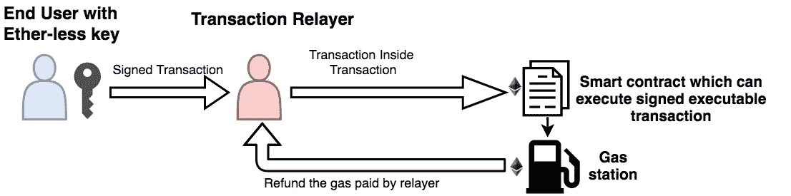

# 可执行事务:事务内部的事务(第 1 部分)

> 原文：<https://medium.com/coinmonks/executable-transactions-transaction-inside-transaction-part-1-96084c5119ca?source=collection_archive---------0----------------------->

以太坊区块链越来越受欢迎，吸引了许多企业将区块链用于他们现有的消费者应用。然而，企业面临的一个基本挑战是教育他们的消费者关于区块链、公-私密钥管理、汽油消耗等等！

想象一下，对于消费者在应用程序上执行的每个操作，他们需要使用 meta mask 签署一个交易，想想汽油消耗，想想支付汽油的帐户中的乙醚。

Blockchain end user be like

可执行事务，也称为无以太事务或内部事务，是简化用户与区块链交互的一种非常有效的方法。

可执行交易涉及的实体:
1。**无醚密钥终端用户**:终端用户有一个无醚密钥，用于签署交易。

2.**事务中继员**:事务中继员的工作是代表其他人在区块链上提交已签名的事务。交易继电器实际上为交易支付汽油。通常，交易被提交给执行可执行交易的智能合约。

3.**智能合约:**智能合约的职责是验证最终用户的签名，并执行 relayer 提交的可执行交易。它还计算交易的汽油消耗量，以便加油站可以在交易结束时将金额退还给继电器。

4.**加油站**:持有代币/eth 的智能合约。这些代币用于退还交易中继者为代表最终用户执行交易而支付的汽油费用。

**动作顺序:** 1。最终用户使用在智能合同中注册的无以太密钥签署交易。

2.最终用户将交易发送给中继器，以提交给区块链。

3.Relayer 创建一个新的事务(调用智能联系方法),包装最终用户的事务。

4.Relayer 将交易提交给区块链，并支付汽油费用。

5.智能合同验证最终用户的签名。

6.智能合同跟踪气体消耗并执行最终用户的交易。

7.智能合同要求加油站将消耗的汽油退还给经销商。

这种方法解决了主要的区块链 UX 问题，如:
1。用户不需要考虑以太。
2。用户不需要使用像元掩码这样的扩展来签署交易。用无以太密钥签名可以很容易地用 app 逻辑封装。

我将在本博客的第二部分中讨论这种方法的实现细节。敬请关注。🙌

快乐编码😇

[linkedin.com/in/jainsarvesh](https://www.linkedin.com/in/jainsarvesh/)
twitter.com/sarvesh_jain_T5[medium.com/@sarvesh.sgsits](/@sarvesh.sgsits)

参考资料:
[https://github . com/ether eum/EIPs/blob/master/EIPS/EIP-1077 . MD](https://github.com/ethereum/EIPs/blob/master/EIPS/eip-1077.md)
[https://ether eum-magicians . org/t/EIP-1077-executable-signed-message/405](https://ethereum-magicians.org/t/eip-1077-executable-signed-message/405)

> [直接在您的收件箱中获得最佳软件交易](https://coincodecap.com/?utm_source=coinmonks)

