# 无需块菌即可执行和访问智能合同

> 原文：<https://medium.com/coinmonks/executing-and-accessing-smart-contract-without-truffle-415f1e647d66?source=collection_archive---------1----------------------->

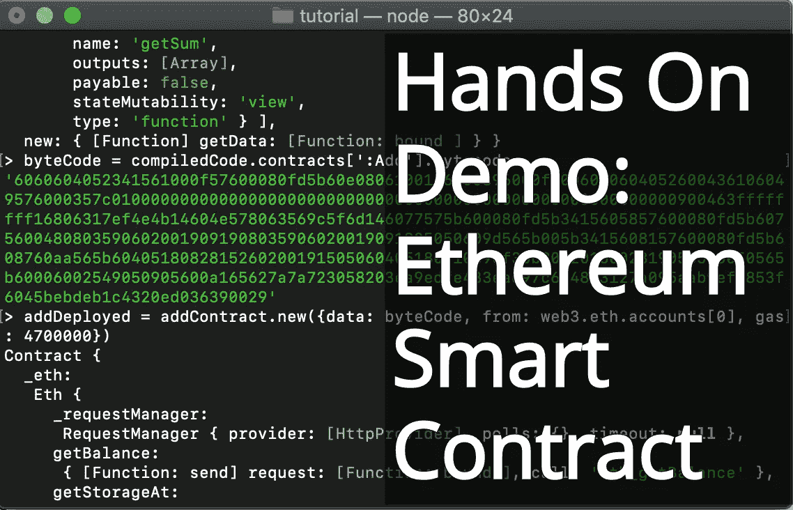

我知道，松露已经成为处理智能合约的标准，但从根本上透明地实践一切，才能让一切变得更加清晰。

在本教程中，我们将在 Solidity 中编写一个简单的智能契约，并通过 Web3 直接调用它。当然，这将比块菌法时间长，但这将是值得的。

我希望你喜欢它。

> 所以让我们开始吧。

# 设置环境

1.  任何文本编辑器(Vim 也许哈哈)
2.  NodeJS(最新版本)——[https://nodejs.org/en/](https://nodejs.org/en/)
3.  一键模拟区块链！——[https://truffleframework.com/ganache](https://truffleframework.com/ganache)
4.  愿意学习

# 步骤 1:撰写智能合同

由于本教程不是关于可靠性本身，我们将只写一个基本的智能合同。

打开文本编辑器，创建一个名为`Add.sol`的新文件。

```
pragma solidity ^0.4.18;contract Add {uint num1;uint num2;uint num3;function Sum (uint _num1, uint _num2) public {num3 = _num1 + _num2;}function getSum() public view returns (uint){return num3;}}
```

这个程序接受两个数字，将它们相加，然后返回总和。

# 第二步:启动 Ganache

确保 RPC 服务器是 [http://127.0.0.1:7545](http://localhost:7545) 。


# 步骤 3:使用 NPM 添加 Web3 和 Solc 包

打开您的终端，使用以下命令安装 Web3 和 Solc 包—

```
$ npm install web3 solc --save
```

⚠️ **确保将这些模块添加到智能合同所在的文件夹中。**

# 步骤 4:使用 NodeJS 控制台与契约交互

要进入 NodeJS 控制台，请在终端中写入`node`。

你应该会看到这样的东西—

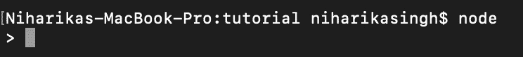

## 步骤 4.1:在控制台中加载 Web3 库。

```
> Web3 = require ('web3')
```

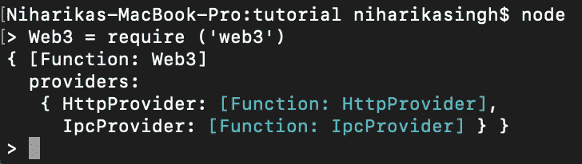

## 步骤 4.2:创建一个 HTTP 提供者(应该与 Ganache 相同)

```
> web3 = new Web3(new Web3.providers.HttpProvider("http://localhost:7545"))
```

该命令将确保我们已连接到 Ganache。

*这将生成一个长输出。*

## 步骤 4.3:使用 Web3 加载所有 10 个 Ganache 地址

因为我们已经在端口 7545 上连接到我们的 Ganache 本地区块链，所以让我们验证地址是否被正确加载。

```
> web3.eth.accounts
```

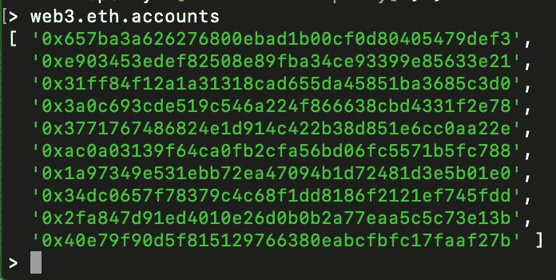

These ten addresses should be the same as in Ganache

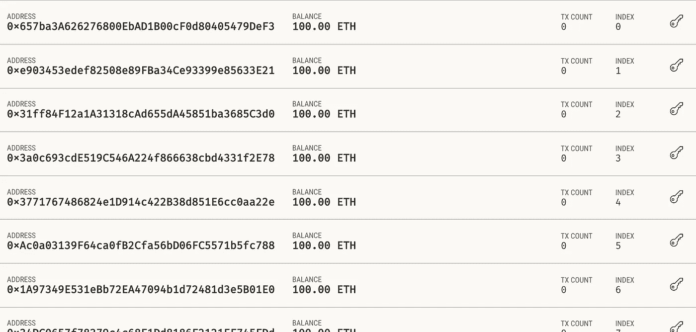

Ganache

## 步骤 4.4:加载 Solidity 编译器(Solc)

```
> solc = require ('solc')
```

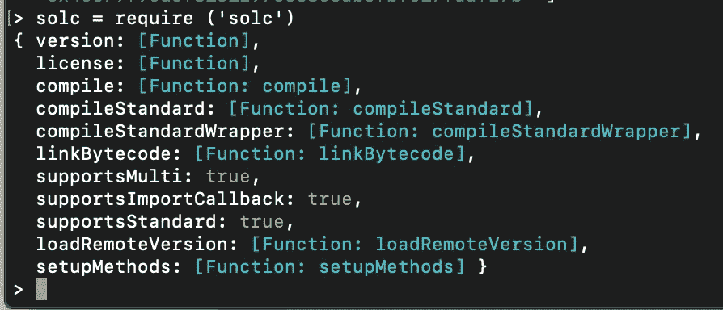

## 步骤 4.5:使用内置节点模块(FS)加载`Add.sol`源代码

```
> sourceCode = fs.readFileSync('Add.sol').toString()
```

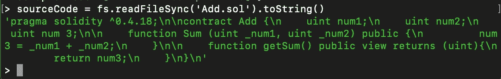

## 步骤 4.6:使用 Solc 编译代码

```
> compiledCode = solc.compile(sourceCode)
```

这将产生很多东西，但只有以下三个是必不可少的:

*   字节码
*   [计]元数据
*   操作码
*   连接

其中每一个都与一个基本的以太坊虚拟机(EVM)概念相关联。[https://ethereum.github.io/yellowpaper/paper.pdf](https://ethereum.github.io/yellowpaper/paper.pdf)

## 步骤 4.7:确定智能合同 ABI

```
> contractABI = JSON.parse(compiledCode.contracts[':Add'].interface)
```

需要应用程序二进制接口(ABI)来访问合同的字节码。它包含 JSON 格式的所有函数和参数的列表。我们将利用它来签订合同。

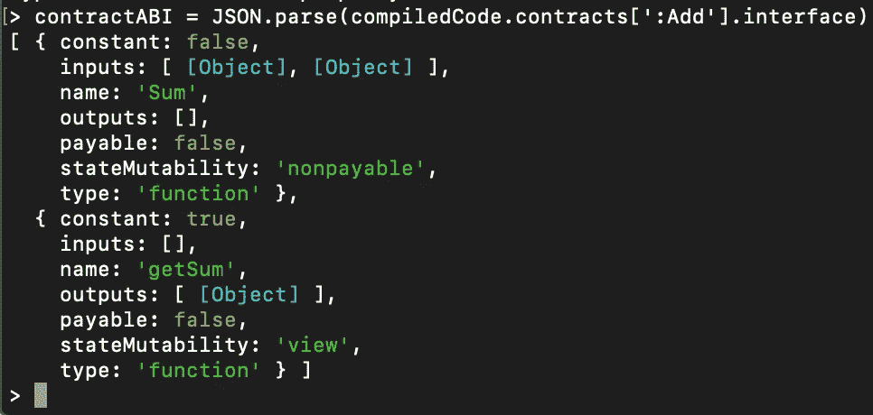

```
> addContract = web3.eth.contract(contractABI)
```

*这将生成一个长输出。*

## 步骤 4.8:识别字节码

```
> byteCode = compiledCode.contracts[':Add'].bytecode
```

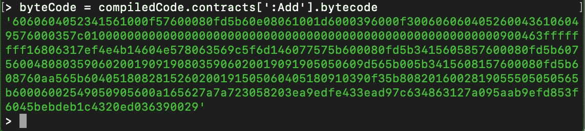

## 步骤 4.9:在 Ganache 上部署契约

```
> addDeployed = addContract.new({data: byteCode, from: web3.eth.accounts[0], gas: 4700000})
```

用 4700000 魏气的第一个 Ganache 账号，我们来部署字节码。

⚠️ **记住，向区块链写任何东西都需要一些费用。在这一步中，我们将智能合同写入区块链。**

这将为我们提供一个事务哈希，您可以在 Ganache 的“Transactions”选项卡上查看该事务。

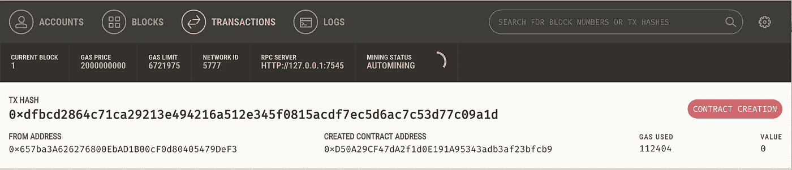

## 步骤 4.10:创建一个实例来使用契约

```
> app = addContract.at(addDeployed.address)
```

`addDeployed.address`是区块链上部署合同的地址。

## 第 4.11 步:让我们使用我们的合同添加 4 和 8。

```
> app.Sum(4, 8, {from: web3.eth.accounts[0]})
```

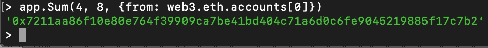

由于这个`Sum`函数写入区块链，我们必须支付一些汽油费，这些汽油费是由我们使用`accounts[0]`后在加纳切的第一个账户支付的。

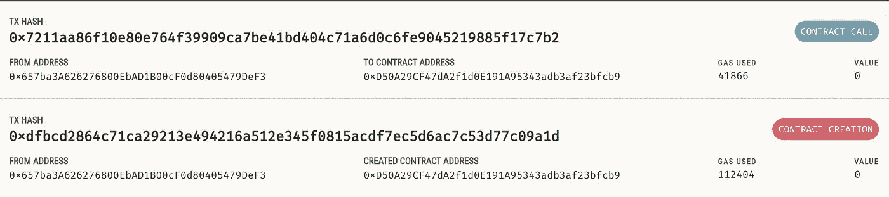

在 Ganache 上可以看到合同呼叫。

为了得到总和，让我们调用`getSum`函数。

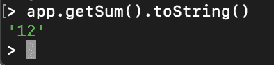

由于 JavaScript 无法读取`uint256`，我们转换结果`toString()`。

因为`getSum`函数不向区块链写任何东西，所以它不会导致任何事务。

这就是我们如何使用 JavaScript 控制台与智能合约进行交互。

我希望你能找到这些信息。如果有，请为文章鼓掌赞赏。:)

## **同样，阅读**

*   [最佳加密交易机器人](/coinmonks/whats-the-best-crypto-trading-bot-in-2020-top-8-bitcoin-trading-bot-c16adeb13317)
*   最好的比特币[硬件钱包](/coinmonks/the-best-cryptocurrency-hardware-wallets-of-2020-e28b1c124069?source=friends_link&sk=324dd9ff8556ab578d71e7ad7658ad7c)
*   最好的[加密税务软件](/coinmonks/best-crypto-tax-tool-for-my-money-72d4b430816b)
*   [最佳加密交易平台](/coinmonks/the-best-crypto-trading-platforms-in-2020-the-definitive-guide-updated-c72f8b874555)
*   [unis WAP 最佳钱包](/coinmonks/best-wallets-to-use-uniswap-e91a6385d9e8)
*   最佳[加密贷款平台](/coinmonks/top-5-crypto-lending-platforms-in-2020-that-you-need-to-know-a1b675cec3fa)
*   Bitsgap 评论——一个轻松赚钱的加密交易机器人
*   为专业人士设计的加密交易机器人
*   [3commas Review](https://blog.coincodecap.com/3commas-review-an-excellent-crypto-trading-bot) |一款优秀的密码交易机器人
*   [3Commas vs Cryptohopper](/coinmonks/cryptohopper-vs-3commas-vs-shrimpy-a2c16095b8fe)
*   Bitmex 上的[保证金交易的白痴指南](/coinmonks/the-idiots-guide-to-margin-trading-on-bitmex-dbbd7742c6fc?source=friends_link&sk=7bfa99d2a181142510c8442c8ddb0786)
*   加密摇摆交易的权威指南
*   [Bitmex 高级保证金交易指南](/coinmonks/bitmex-advanced-margin-trading-guide-2270c195ce25?source=friends_link&sk=1d986cca731f5084b9a2db4a4bc4a7ad)
*   [面向开发人员的最佳加密 API](/coinmonks/best-crypto-apis-for-developers-5efe3a597a9f)
*   [加密套利](/coinmonks/crypto-arbitrage-guide-how-to-make-money-as-a-beginner-62bfe5c868f6)指南:新手如何赚钱
*   顶级[比特币节点](https://blog.coincodecap.com/bitcoin-node-solutions)提供商
*   最佳[加密制图工具](/coinmonks/what-are-the-best-charting-platforms-for-cryptocurrency-trading-85aade584d80)

> [直接在您的收件箱中获得最佳软件交易](https://coincodecap.com?utm_source=coinmonks)

[](https://coincodecap.com?utm_source=coinmonks)