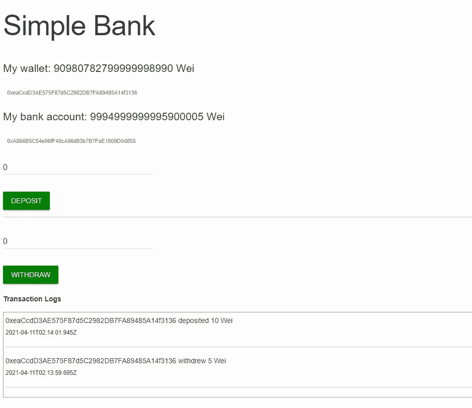
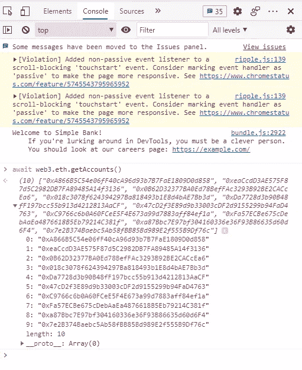

# 使用 Truffle、Ganache、Browserify 和 Web3 在浏览器中执行智能合同

> 原文：<https://medium.com/coinmonks/executing-smart-contracts-in-your-browser-using-truffle-ganache-browserify-and-web3-200574d13064?source=collection_archive---------0----------------------->

这里陈述的观点是我个人的，而不是我公司的。

有各种各样的工具来构建一个基于区块链的 web 应用程序。例如，您可以在下面看到一个简单的银行应用程序:



Simple Bank on the web, with deposit/withdraw smart contracts

这些合同用 [Solidity](https://docs.soliditylang.org/en/v0.8.3/) 写成，通过 [Truffle](https://www.trufflesuite.com/) 执行。虽然我可以验证它们的工作，但让它们在浏览器环境中运行是很困难的。事实上，基本上没有关于这些技术集成的文档。

这篇博客文章为你提供了所有的设置，但是没有深入到建立一个简单银行的细节。相反，这将是一个更一般的例子。

# 松露

假设你已经有了你的`MyContract.sol`可靠性合同。使用松露部署到您的区块链网络。就我而言，我使用的是 Ganache。这在本地运行(在端口`7545`上)。

当您运行`truffle migrate`命令时，请注意输出的几个属性。

```
$ truffle deploy

   Replacing 'MyContract'
   ----------------------
   > transaction hash:    0x562f463faa3666e948a08ea96f96ae239aff9f48298f6096ecbd09404903027e
   > Blocks: 0            Seconds: 0 **> contract address:    0x941F4963540B1df054343d115767B9cb3E3cDc3D** > block number:        3
   > block timestamp:     1617929065
   **> account:             0xA866B5C54e06fF40cA96d93b7B7FaE1809D0d858** > balance:             99.98373884
   > gas used:            390433 (0x5f521)
   > gas price:           20 gwei
   > value sent:          0 ETH
   > total cost:          0.00780866 ETH > Saving migration to chain.
   > Saving artifacts
   -------------------------------------
   > Total cost:          0.01626116 ETH
```

保存合同地址和账户地址。因为我们将使用网络浏览器，所以创建一个新的`index.js`文件并将它们保存为常量:

在我们的根项目目录中创建一个`package.json`文件来安装我们的依赖项。NPM 可以使用[包文件](https://docs.npmjs.com/about-packages-and-modules)来定义你的项目和它需要什么。它允许我们在单个文件中定义依赖项和构建脚本，以获得更大的便利。该文件在行业中使用。

一定要运行`npm install`下载一切。

注意，当松露建立你的合同时，会创建一个`build/contracts/MyContract.json`。记下这个文件，我们以后会用到它。

# 设置网站 3

[Web3](https://web3js.readthedocs.io/en/v1.3.4/index.html) 本质上是 [Ganache 测试网络](https://www.trufflesuite.com/ganache)和你的智能合约之间的绑定。它允许您在节点环境中访问您的帐户和执行合同。

请注意，尽管节点环境和浏览器环境都运行 JavaScript，但它们在细微但重要的方面有所不同。我们可以使用类似于[browser ify](http://browserify.org/)to*trans file*our`index.js`into a`bundle.js`可以在浏览器中运行。

这就是`package.json`中`scripts.build`字段的含义。当你运行`npm run build`时，我们执行那个命令。

为了连接到我们的 Ganache 网络，我们可以向我们的`index.js`添加一行代码:

为了帮助调试，我建议也在你的`index.js`中设置`window.web3 = web3`。这将让您在浏览器开发工具中更有效地调试和执行命令。



You can execute commands directly in DevTools to get a feel for them

我们怎么知道这有用呢？让我们添加一个元素，用一个`index.html`文件显示我们的账户和余额:

用事件监听器更新我们的`index.js`文件。当页面加载时，执行`updateBalance`功能。通过将它提取到一个单独的函数中，我们可以调用它来响应契约的执行。

现在重新生成`bundle.js`并在浏览器中打开`index.html`。你应该看到地址和余额自动出现在屏幕上。

如果你做到了这一点，你就成功地设置了 Web3。

# 设置合同

现在我们已经连接到 Web3，让我们连接到合同本身。这就是我们之前创建的 JSON 文件的用处。

请注意，我们再次将对象绑定到窗口(JavaScript 中的对象是[按引用传递](/nodesimplified/javascript-pass-by-value-and-pass-by-reference-in-javascript-fcf10305aa9c))来帮助调试控制台中的命令。

Web3 契约实例化需要契约 ABI，它是更大的 JSON 包的一部分。我们还传入之前获得的合同地址:

注意，我完全确定我在这里使用的`[defaultAccount](https://web3js.readthedocs.io/en/v1.3.4/web3-eth-contract.html#defaultaccount)`是准确的。但是我的代码确实有效，所以我不会抱怨。

现在我们的合同应该在我们的执行环境中，所以我们可以开始执行合同。

# 执行智能合同

通常有两种智能合约命令:调用和发送。在 Solidity 中，一个调用通常映射到一个`view`:一个不涉及事务的方法。这可能被视为“吸气剂”。Sends 实际上创建了一个事务并改变了契约状态，就像 Solidity `payable`。

我们可以在合同中看到其中的一些。首先，让我们在网页上添加一个按钮和一个响应标签:

您可以在按钮上的 click 事件监听器中看到整个过程。我们还在执行过程中禁用它，作为一种去抖的方式。

我们发送一个带有我们的帐户和硬编码值的事件。稍后我们可以调用第二个方法来读取余额并显示在页面上。

这里有许多异步操作。阅读 Mozilla 的[承诺指南将会提供一个很好的背景。](https://developer.mozilla.org/en-US/docs/Web/JavaScript/Reference/Global_Objects/Promise)

# 解决纷争

在我的开发过程中，当我试图用我的合同做任何事情时，我遇到了一个模糊的错误:

> 错误:返回值无效，是汽油用完了吗？如果您没有为从中检索数据的合同使用正确的 ABI，从不存在的块号请求数据，或者查询未完全同步的节点，也可能会看到此错误。

我花了一些时间才弄清楚为什么会发生这种事。谷歌搜索错误没有提供一个单一的答案。原来我的合同地址是错的。我需要用松露的地址，而不是加纳切的钱包地址。

我希望这个指南至少能帮助你开始。由于这种编程环境是新的，所以资源不足。虽然有些工具可能有自己的文档，但集成指南并不多。

这是我从自己的经验和开发中得到的，而不是任何工具上的任何内部消息。当然，在快速发展的速度下，这个职位可能会很快过时。

> 加入 [Coinmonks 电报频道](https://t.me/coincodecap)，了解加密交易和投资

## 另外，阅读

*   [网格交易机器人](https://blog.coincodecap.com/grid-trading) | [加密交易机器人](/coinmonks/cryptohopper-review-a388ff5bae88) | [加密交易机器人](https://blog.coincodecap.com/best-crypto-trading-bots)
*   [加密复制交易平台](/coinmonks/top-10-crypto-copy-trading-platforms-for-beginners-d0c37c7d698c) | [如何在 WazirX 上购买比特币](/coinmonks/buy-bitcoin-on-wazirx-2d12b7989af1)
*   [CoinLoan 点评](/coinmonks/coinloan-review-18128b9badc4)|【Crypto.com】点评 | [火币保证金交易](/coinmonks/huobi-margin-trading-b3b06cdc1519)
*   [尤霍德勒 vs 科恩洛 vs 霍德诺特](/coinmonks/youhodler-vs-coinloan-vs-hodlnaut-b1050acde55a) | [Cryptohopper vs 哈斯博特](https://blog.coincodecap.com/cryptohopper-vs-haasbot)
*   [顶级付费加密货币和区块链课程](https://blog.coincodecap.com/blockchain-courses) | [币安评论](/coinmonks/binance-review-ee10d3bf3b6e)
*   [MXC 交易所评论](/coinmonks/mxc-exchange-review-3af0ec1cba8c) | [Pionex vs 币安](https://blog.coincodecap.com/pionex-vs-binance) | [Pionex 套利机器人](https://blog.coincodecap.com/pionex-arbitrage-bot)
*   [如何在印度购买比特币？](/coinmonks/buy-bitcoin-in-india-feb50ddfef94) | [WazirX 评论](/coinmonks/wazirx-review-5c811b074f5b) | [BitMEX 评论](https://blog.coincodecap.com/bitmex-review)
*   [印度比特币交易所](/coinmonks/bitcoin-exchange-in-india-7f1fe79715c9) | [比特币储蓄账户](/coinmonks/bitcoin-savings-account-e65b13f92451) | [HitBTC 审核](/coinmonks/hitbtc-review-c5143c5d53c2)