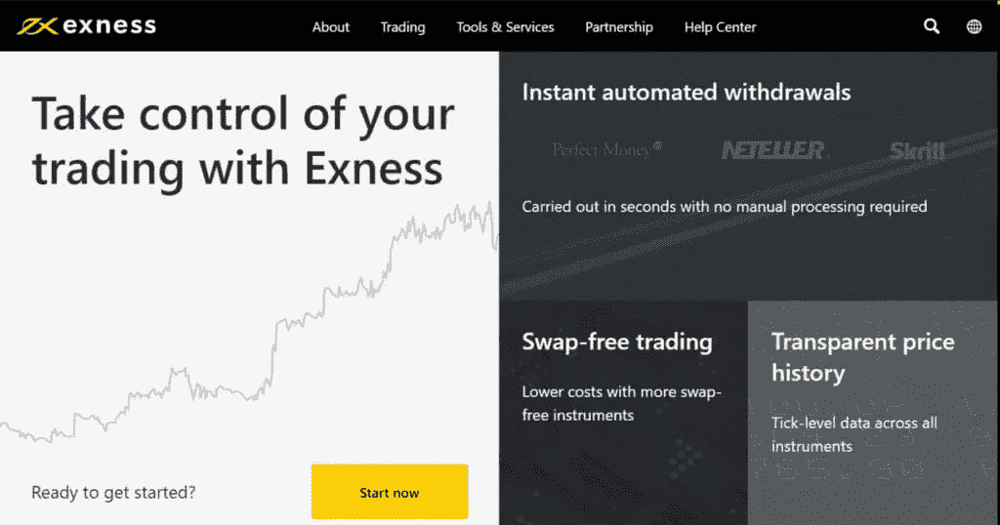
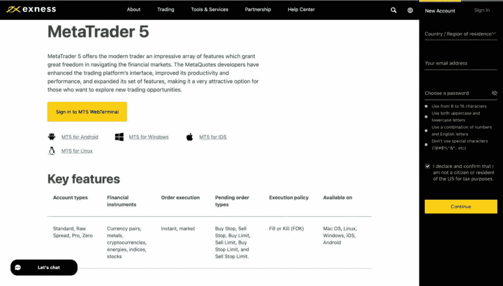
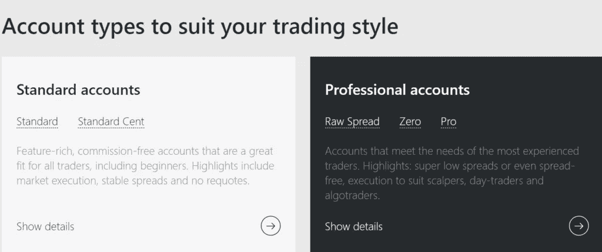
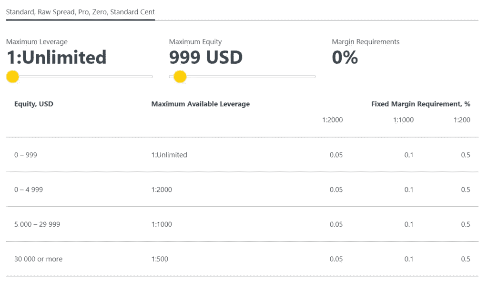
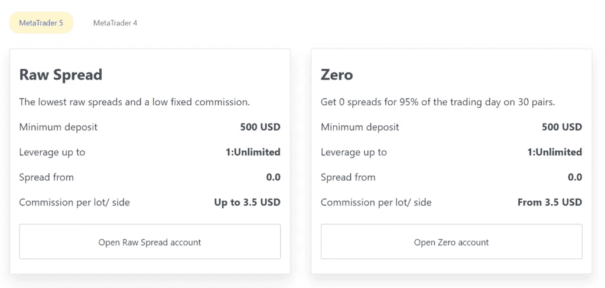
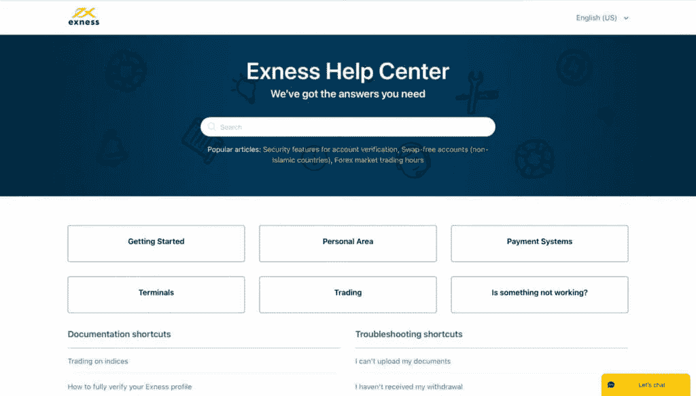
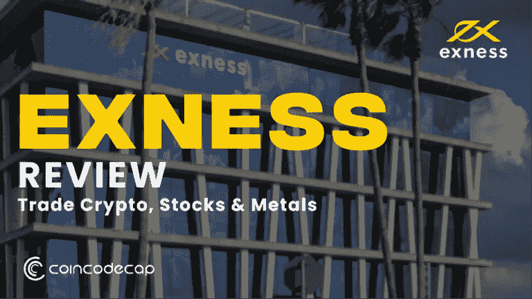

# Exness 评论-贸易密码、股票和金属

> 原文：<https://medium.com/coinmonks/exness-review-e25a7afc94ac?source=collection_archive---------11----------------------->

Exness 为全球贸易商开展业务创造了有利条件。平台的稳定性和可靠性充分证明了客户对经纪人的高度信任。此外，这份 Exness 评论是围绕完美的外汇交易环境进行的深入研究，旨在帮助那些想要练习积极交易技巧的人。

此外，该平台提供了各种平台、资产和交易工具，一个方便的资金补充和提取系统，任何货币的存款，以及一个完美的移动应用程序。用户被授予一个有清晰界面的账户，大量的交易分析和其他有用的资料。

加盟计划不仅是与 [**Exness**](https://one.exness.link/a/c_8p5ntoljhm) 交易的普通用户的终极选择，也是寻找值得信赖的经纪人帮助他们建立投资组合并在外汇交易中取得成功的新客户的终极选择。

# Exness 是什么？

[**Exness**](https://one.exness.link/a/c_8p5ntoljhm) 是一家国际[外汇](https://en.wikipedia.org/wiki/Foreign_exchange_market)和[差价合约(CFD)](https://coincodecap.com/what-is-bitcoin-cfd-trading) 经纪公司，自 2008 年初以来一直代理外汇股票市场。今天，该经纪公司是世界上最受尊敬和安全的在线外汇交易平台之一，公司每月的交易总额接近 3260 亿美元。

此外，该经纪商目前提供货币和加密货币的差价合约，总共超过 120 对，以及股票、能源和贵金属。Exness 为客户提供了有利的交易条件:低佣金、订单即时执行、资金回笼。一个真正慷慨的杠杆比率使得小额存款有可能赚取高达 1000 美元。此外，交易者可以根据自己的财务状况和目标，从几个开户选项中进行选择。还有一个演示培训账户，无论是初级客户还是专业交易者都会觉得非常有用。

Exness

# Exness 评论:工具和平台

Exness 的主要优势之一是它提供的产品种类繁多。交易的资产范围非常广泛，包括货币、加密货币、贵金属、股票、能源和指数。

Exness 提供 MetaTrader 4 (MT4)和 MetaTrader 5 (MT5)交易平台，这两个平台都可以在桌面和移动设备上使用。网上交易选项也可以在浏览器上直接访问。此外，该平台提供了 MT4 多终端，交易者可以使用它来同时管理多个账户。

此外，Exness 还可以在任何移动设备上运行，其 swift 应用程序允许客户开立账户、存款和取款、分析交易以及交易该公司提供的任何资产。

Exness tools

# Exness 审查:可用账户类型

Exness 提供两种主要类型的账户:标准账户和专业账户。标准帐户包含两个版本:标准和标准分。标准账户不收取任何费用。标准美分是入门级交易者的最佳选择，因为它支持微量交易，最大杠杆比率为 1:2000。专业账户收取每笔交易 3.5 美元的最低佣金，是高级客户的理想选择。

Exness Review: Available Account types

# Exness 的杠杆作用

Exness 可能是在线股票市场上最慷慨的杠杆之一。尽管高杠杆率可能更有利可图，但它也让交易员面临风险，以防交易对他们不利。这就是为什么一些主要的欧洲和澳大利亚监管机构将杠杆率限制在最高 1:30 的原因。

由于 Exness 公司不向欧洲提供服务，它当然可以提供业内最大的优势。其标准账户的最大杠杆率为 1:2000！

Leverage at Exness

# Exness 费用和佣金

[Exness](https://one.exness.link/a/c_8p5ntoljhm) 展示了其最低余额和佣金的完全灵活的结构。例如，交易者可以开立一个经典账户，要求最低余额为 2000 美元，没有佣金和从 0.1 美元开始的利差。那些想存多少就存多少的用户可能会选择迷你账户，这种账户设定了 1 美元的最低存款额，但有 0.3 美元起的更大利差支持。那些寻求更快订单执行和更高流动性的人可能希望在 ECN 银行间网络中交易，并将遇到每 100 万美元交易量收取 50 美元的费用。

Exness Commission for MetaTrader5

# 研究和教育

选择一个以高质量研究和教育选择为特色的平台肯定会给你的交易业务带来优势。

在教育和培训方面，Exness 有自己的在线学院课程，包括组织良好的视频和书面内容，从初级到专业水平，有英语、越南语、巴哈萨语、阿拉伯语和泰语版本。值得注意的是，交易者可以在参加课程时跟踪自己的进度。

作为其教育活动的一部分，该经纪商提供定期的网络研讨会，公司内部专家与初级客户讨论各种话题，帮助他们了解在线交易的所有细微差别。

# Exness 评论:附属计划

另一个收入来源是会员计划，Exness 鼓励其交易商参与并吸引新客户。作为 Exness 客户，交易商只需将经纪人的注册链接放在他们的社交媒体或任何其他资源上。对于每个点击链接并创建账户的客户，交易者将获得现金奖励。一个操盘手只要在平台上保持活跃，也能获得最多 40%的被吸引用户操作数。此外，Exness 还定期举办独特的抽奖活动，根据交易者达到的财务指标和总交易量，他们可以赢得一辆超级跑车。

# Exness 客户支持

最后，如果客户服务支持远非完美，没有一家提供经纪服务的公司可以声称自己是可靠的。事实证明，Exness 在这一类别中得分很高。交易商注意到 Exness 的高水平技术支持，这有助于他们在交易业务中取得巨大成就。有任何疑问或帐户问题的客户可以通过实时聊天、电子邮件或电话联系客户支持团队，全天候使用英语或 13 种受支持语言中的任何一种。

Exness help centre

# Exness 安全吗？

是的，使用 Exness 是安全的，因为在与经纪人交易之前，必须确保您想要合作的经纪人受到可信机构的监督，以防止与诈骗平台交易。

有了 Exness，用户可以对其交易环境的可靠性充满信心，因为经纪人的活动得到了 7 个不同管辖区的许可，包括 CySEC、FCA 和 FSA 的法规。Exness 确保其交易空间始终稳定和安全，因此对于那些不容忍任何在线交易中断或停机的人来说，这是一个完美的选择。

# 结论

因此，从外汇交易开始，通过 Exness 及其优质服务进一步提高您的技能。你可以充分利用他们添加的工具和服务，让你的体验变得清晰。Exness 的客户支持中心随时为您提供帮助，绝不会让您失望。立即加入 Exness，开始新的旅程！

> 加入 Coinmonks [电报频道](https://t.me/coincodecap)和 [Youtube 频道](https://www.youtube.com/c/coinmonks/videos)了解加密交易和投资

## 另外，阅读

*   [Blockfi vs 比特币基地](https://coincodecap.com/blockfi-vs-coinbase) | [BitKan 点评](https://coincodecap.com/bitkan-review) | [期货交易机器人](/coinmonks/futures-trading-bots-5a282ccee3f5)
*   [南非的加密交易所](https://coincodecap.com/crypto-exchanges-in-south-africa) | [BitMEX 加密信号](https://coincodecap.com/bitmex-crypto-signals)
*   [如何在 WazirX 上购买柴犬(SHIB)币？](https://coincodecap.com/buy-shiba-wazirx)
*   [MoonXBT 副本交易](https://coincodecap.com/moonxbt-copy-trading) | [阿联酋的加密钱包](https://coincodecap.com/crypto-wallets-in-uae)
*   [MoonXBT vs Bybit vs 币安](https://coincodecap.com/bybit-binance-moonxbt) | [硬件钱包](/coinmonks/hardware-wallets-dfa1211730c6)
*   [雷米塔诺评论](https://coincodecap.com/remitano-review)|[1 英寸协议指南](https://coincodecap.com/1inch)
*   [十大最佳加密货币博客](https://coincodecap.com/best-cryptocurrency-blogs) | [YouHodler 评论](https://coincodecap.com/youhodler-review)