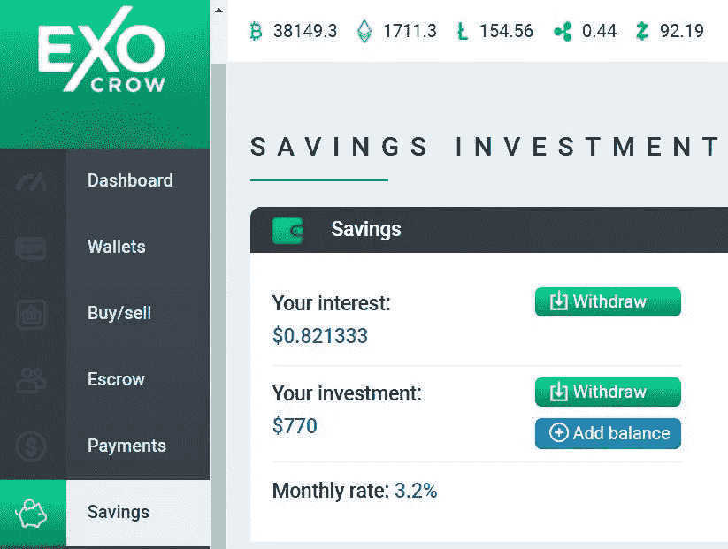

# 海外储蓄账户

> 原文：<https://medium.com/coinmonks/exocrow-saving-account-5214fe39705d?source=collection_archive---------3----------------------->

将您的加密货币存放在 [ExoCrow](https://exocrow.com/) 银行，并在所有支持的代币([比特币](https://bitcoin.org/en/)、[以太坊](https://ethereum.org/en/)、 [Zcash](https://z.cash/) 、[莱特币](https://litecoin.org/)和 [Ripple](https://ripple.com/) )上赚取市场领先的 3.2%月息。利息将在每月的 1 号和 15 号以您原始存款货币的相同面额记入您的账户。平台对你的原始投资有 3 个月的锁定期。使用我们的支付网关( [Swift](https://www.swift.com/) 、 [SEPA](https://en.wikipedia.org/wiki/Single_Euro_Payments_Area) )解决方案，每月轻松向您的银行账户提款。提款会在 24 小时内处理。SEPA 最多需要 2 天才能完成欧盟交易。对于非欧盟国家，SWIFT 交易最多需要 3 个工作日。

该平台的一些显著特征包括:

●最高利率:所有受支持代币的月息为 3.2%

●固定利率。不受市场波动的影响

●完全可审计。用户将收到该平台上所有交易的发票号码

●从同一个地方管理支付、托管、商家、经纪人解决方案的高级集成仪表板

●不处罚，不清算资金

●不需要最低余额阈值

●全天候客户支持

用 ExoCrow 投资是一个简单的过程:

1.  登录 ExoCrow 帐户

2.转到'**钱包**'。在**钱包操作**下，从下拉菜单中选择您要存入的货币。使用二维码或地址存款。

3.点击'**储蓄所**'选项卡。您将看到显示月利率的仪表板

4.点击“**添加余额**，将金额从您的主钱包转移至储蓄产品。

5.您可以在“**您的利息**”部分看到您获得的利息。

您可以分别提取您的利息金额和原始投资额。一旦锁定期结束，每月可以提取本金(或部分本金)。

6.您将在“**我的历史记录**”下找到您的所有交易。

ExoCrow Savings 以及集成的托管和商户解决方案是一个强大的工具，将改变我们在日常零售和业务运营中转移价值的方式。

**常见问题解答**

**问题:【ExoCrow 将以哪种货币支付利息？**

**答:** ExoCrow 将以与您存款货币相同的货币支付利息(例如，如果您充值 LTC，您将获得 LTC 利息)

**问题:**如何激活‘储蓄’以获得更高的利息？

**回答:**请遵循以下步骤:

1.登录 ExoCrow 帐户

2.转到'**钱包**'。在**钱包操作**下，从下拉菜单中选择您要存入的货币。使用二维码或地址存款。

3.点击'**储蓄**选项卡。

4.点击'**添加余额**，将金额从您的主钱包转入储蓄产品。

5.您可以在“**您的利息**”部分看到您获得的利息。

问题:如何计算你的存款收益？

**答案:** ExoCrow 对所有支持的代币(比特币、以太坊、Zcash、莱特币、Ripple)提供 3.2%的月息。并且利息会在每个月的 1 号和 15 号以和你原来存款货币相同的面额打入用户账户。

现在假设用户在储蓄方案中投资了价值 500 美元的 LTC 代币。

所以，500 * 0.032 = 16 美元(月利润)

并且，＄16 * 12 = 192(年利润)

用户可以使用支付网关(Swift、SEPA)解决方案轻松地将资金提取到他们的银行账户。提款会在 24 小时内处理。SEPA 最多需要 2 天才能完成欧盟交易。对于非欧盟国家，SWIFT 交易最多需要 3 个工作日。

令人兴奋的是，象征性的价格波动不会对利息产生影响。这意味着您将继续获得与代币市值上涨/下跌前相同的利息。

**问题:**我可以在哪里查看我的活动存款的利息？

**答:**您可以在“**您的利息**”下看到您账户中的存款累计利息，您可以提取。用户兴趣详情可从**历史**选项卡中查看。

**问题:**利息以什么频率入账？

**答:**您将在每月 1 日、15 日收到与您原存款币种相同面额的利息。

**问题:**投资金额有锁定期吗？

**回答:**是的，平台对你的原始投资有 3 个月的锁定期。

**社交场合**

[推特](https://twitter.com/exocrow_finance) — [电报](https://t.me/ExoCrowFinance) — [Instagram](https://www.instagram.com/exocrow_finance/) — [媒体](https://medium.com/exocrow) — [脸书](https://www.facebook.com/exocrow.crypto.bank)

> 加入 coin monks[Telegram group](https://t.me/joinchat/EPmjKpNYwRMsBI4p)学习加密交易和投资

## 另外，阅读

*   什么是[闪贷](https://blog.coincodecap.com/what-are-flash-loans-on-ethereum)？
*   最好的[密码交易机器人](/coinmonks/crypto-trading-bot-c2ffce8acb2a) | [网格交易](https://blog.coincodecap.com/grid-trading)
*   [3 商业评论](/coinmonks/3commas-review-an-excellent-crypto-trading-bot-2020-1313a58bec92) | [Pionex 评论](/coinmonks/pionex-review-exchange-with-crypto-trading-bot-1e459d0191ea) | [Coinrule 评论](https://blog.coincodecap.com/coinrule-review-a-perfect-trading-bot)
*   [AAX 交易所评论](/coinmonks/aax-exchange-review-2021-67c5ea09330c) | [德里比特评论](/coinmonks/deribit-review-options-fees-apis-and-testnet-2ca16c4bbdb2) | [FTX 密码交易所评论](/coinmonks/ftx-crypto-exchange-review-53664ac1198f)
*   [n 零审核](/coinmonks/ngrave-zero-review-c465cf8307fc)
*   [Bybit Exchange 审查](/coinmonks/bybit-exchange-review-dbd570019b71) | [Bityard 审查](https://blog.coincodecap.com/bityard-reivew) | [CoinSpot 审查](https://blog.coincodecap.com/coinspot-review)
*   [3Commas vs Cryptohopper](/coinmonks/3commas-vs-pionex-vs-cryptohopper-best-crypto-bot-6a98d2baa203)
*   最好的比特币[硬件钱包](/coinmonks/the-best-cryptocurrency-hardware-wallets-of-2020-e28b1c124069?source=friends_link&sk=324dd9ff8556ab578d71e7ad7658ad7c) | [BitBox02 回顾](/coinmonks/bitbox02-review-your-swiss-bitcoin-hardware-wallet-c36c88fff29)
*   [莱杰 vs n rave](https://blog.coincodecap.com/ngrave-vs-ledger)|[莱杰 nano s vs x](https://blog.coincodecap.com/ledger-nano-s-vs-x)
*   [加密拷贝交易平台](/coinmonks/top-10-crypto-copy-trading-platforms-for-beginners-d0c37c7d698c) | [比特码拷贝交易](https://blog.coincodecap.com/bityard-copy-trading)
*   [Vauld Review](https://blog.coincodecap.com/vauld-review)|[you hodler Review](/coinmonks/youhodler-4-easy-ways-to-make-money-98969b9689f2)|[BlockFi Review](/coinmonks/blockfi-review-53096053c097)
*   最好的[加密税务软件](/coinmonks/best-crypto-tax-tool-for-my-money-72d4b430816b) | [硬币追踪评论](/coinmonks/cointracking-review-a-reliable-cryptocurrency-tax-software-5114e3eb5737)
*   最佳[加密贷款平台](/coinmonks/top-5-crypto-lending-platforms-in-2020-that-you-need-to-know-a1b675cec3fa)
*   [莱杰纳米 S vs 特雷佐 one vs 特雷佐 T vs 莱杰纳米 X](https://blog.coincodecap.com/ledger-nano-s-vs-trezor-one-ledger-nano-x-trezor-t)
*   [block fi vs Celsius](/coinmonks/blockfi-vs-celsius-vs-hodlnaut-8a1cc8c26630)|[Hodlnaut Review](https://blog.coincodecap.com/hodlnaut-review)
*   [Bitsgap 审查](/coinmonks/bitsgap-review-a-crypto-trading-bot-that-makes-easy-money-a5d88a336df2) | [Quadency 审查](/coinmonks/quadency-review-a-crypto-trading-automation-platform-3068eaa374e1)
*   [埃利帕尔泰坦评论](/coinmonks/ellipal-titan-review-85e9071dd029) | [赛克斯斯通评论](https://blog.coincodecap.com/secux-stone-hardware-wallet-review)
*   [DEX Explorer](https://explorer.bitquery.io/ethereum/dex) | [区块链 API](https://explorer.bitquery.io/graphql)|[local bitcoins 审核](https://blog.coincodecap.com/localbitcoins-review)
*   [最佳区块链分析工具](https://bitquery.io/blog/best-blockchain-analysis-tools-and-software)
*   [加密套利](/coinmonks/crypto-arbitrage-guide-how-to-make-money-as-a-beginner-62bfe5c868f6)指南:新手如何赚钱
*   最佳[加密制图工具](/coinmonks/what-are-the-best-charting-platforms-for-cryptocurrency-trading-85aade584d80) | [最佳加密交易所](https://blog.coincodecap.com/crypto-exchange)
*   了解比特币最好的[书籍有哪些？](/coinmonks/what-are-the-best-books-to-learn-bitcoin-409aeb9aff4b)

> [直接在您的收件箱中获得最佳软件交易](/coinmonks/newsletters/coinmonks)

