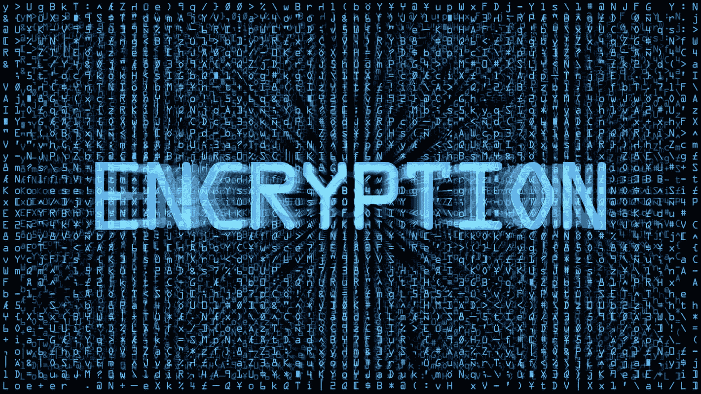

# 解释哈希、加密、编码、公钥加密

> 原文：<https://medium.com/coinmonks/explaining-hashing-encryption-encoding-public-key-encryption-eed8ac9bfccc?source=collection_archive---------6----------------------->

[source](https://ecdn1.heidi.ie/wp-content/uploads/2016/02/encryption.jpeg)

你走进一家杂货店，你会看到很多通道，比如蔬菜、水果、早餐等等。每件产品都放在各自的通道上。这样，如果你想买麦片，你可以直接进入早餐区，而不是浏览整个商店。如果该行中没有该谷物，则意味着该产品在商店中不可用。通过根据产品的一些属性对它们进行分类和分组，我们设法减少了搜索时间。搜索时间可以进一步减少，这取决于您想要分类的深度。

这就是**哈希**的本质。

用计算机的语言来说，Hash a 是一个固定长度的字符串**为 a 数据生成**。这个生成的字符串就是**哈希。**你不能从这个字符串(hash)生成回数据。

生成 hash 的算法有很多，像 **MD5，SHA-1** 。

对于相同的数据，哈希将是相同的，但相同的哈希并不意味着数据相同。

就像两个相同的产品将属于商店的同一通道，但两个产品在同一通道并不意味着产品是相同的。

哈希用于区块链、布隆过滤器、索引。

**编码**

如果你想把你的床搬到另一个城市，你要做的就是把床拆开，用衬垫、塑料包装好，然后发货。一旦包裹到达目的地，它就被组装成原来的样子。

这就是**编码**是什么。

将数据转换成另一种形式，以便其他系统可以安全地使用。编码的目的不是安全。编码数据可以很容易地转换回其原始形式。

HTTP 协议中使用编码，如 json 编码、url 编码。

**加密**

加密是电影中黑客试图破解的东西。加密是间谍交流的语言。

加密是用一些秘密密钥来转换数据，除了有秘密密钥的人之外，没有人能在中间解密。

你把财宝锁在一个只有拥有钥匙的人才能打开的盒子里。

**AES** 是流行的加密算法之一。

**公钥私钥加密**

这是一种非常有趣且广泛用于安全通信的技术。HTTPS，安全壳，区块链使用这一进程。

这有两个组成部分，公钥和私钥。私钥是秘密的，由所有者拥有，公钥很容易获得。

所以你用公钥加密数据，只有拥有私钥的人才能解密数据，其他人不能。

例如，HTTPS。浏览器有公钥，服务器有私钥。来自浏览器的请求将使用站点的公钥加密。所有的浏览器、客户端都有站点的公钥可用。中间人无法解密加密的消息，因为他们没有可用的私钥。

有私钥的服务器可以解密这个消息，从而使通信变得非常安全和容易。