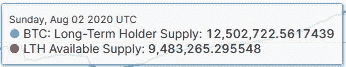

# 探索比特币在长期持有者中的有效供给

> 原文：<https://medium.com/coinmonks/exploring-bitcoin-available-supply-among-long-term-holders-f056a97e45fc?source=collection_archive---------0----------------------->

自从 Glassnode 发表了[这篇文章](https://insights.glassnode.com/quantifying-bitcoin-hodler-supply/)以来，我们一直在研究长期持有人和短期持有人的供应，这给了我们新的方法来将市场参与者分成新的、可能更弱的手和组成比特币基础的老经验丰富的霍德尔之间的群体。


Courtesy of [glassnode](https://studio.glassnode.com/metrics?a=BTC&category=&m=supply.LthSum)

根据 Glassnode 的分析定义，长期持有者是指持有 155 天或以上的任何硬币，而短期持有者是指任何比这更新的硬币。上面的两条线本质上是相反的。在我看来，这有一个缺陷——它忽略了丢失的硬币。

## **这有什么关系？**

就可买卖的商品而言，这很重要。在比较新旧市场参与者时，在某些情况下，忽略当前结算中未涉及的硬币是有意义的。否则，我们可能会过分重视跟踪长期持有人群体的指标变化。据估计，有 600 万到 700 万枚硬币永久退出流通。那么，我们为什么要把这些人算作长期持有者呢？输入新的可能性:

## **一种新的切片方式**

在 [Glassnode workbench](https://studio.glassnode.com/workbench) (强烈推荐)中，我创建了一个名为**长期持有者可用供应(LTH 供应)**的新指标。公式是:

```
**Long-Term Holder Supply - (Circulating Supply - Adjusted Supply)**
```

我们使用 Glassnode 内置的[调整供应](https://studio.glassnode.com/metrics?a=BTC&category=&m=supply.CurrentAdjusted)指标来计算丢失的硬币，然后从长期持有者供应中消除这一差异。

作为一名 2 级 Glassnode 订户，我所能看到的长期持有者供应的最新日期是 2020 年 8 月 2 日，当时供应占总数的 75.8%(12，502，722 枚硬币中的 9，483，265 枚)，远远少于今天统计的数量。



## **让我们做一些餐巾纸数学**

我们可以做一些假设性的数学计算，来了解 LTH 的可用供应量可能会如何改变其他指标，以此来代替目前的日追踪。由于比特币已经处于长达十年的上升趋势，*我们假设所有损失的硬币都是 100%盈利*。在此基础上，我们可以使用利润中的长期持有人供应来计算货币中实际有多少可用供应。

下面我们将使用 2020 年 8 月 2 日起以 BTC 计价的数据。为简单起见，我们的新指标 Available Supply 将在下面写成**as Supply**。

LTH 供货:**12502722**
LTH 供货盈利:**11505965**(供货的 92.0%)
LTH 供货亏损:**996757**(供货的 8.0%)

LTH 供货:**9483265**(供货的 75.8%)
LTH 供货盈利:**8486608**(供货的 67.9%**供货的 89.5%**)
LTH 供货亏损:**996657**(供货的 8.0%)

丢失的硬币:**3019457 枚**(占总数的 24.2%)

通过从长期持有人供给中移除损失的硬币来创造 LTH 供给，我们得知 LTH 供给的 89.5%在 2020 年 8 月初是盈利的。这比今天使用的全进制计算方法低 2.5 个基点，但仍然证明了长期持有的硬币中有 90%是在货币中。

然而，当我们排除丢失的硬币时，LTH 的利润份额比 LTH 的少 24%(下降到 67.9%对 92%),这描绘了这个群体相关规模的一个非常不同的画面。


[Live workbench chart](https://studio.glassnode.com/workbench/e7557a7c-04f3-4a9f-4c61-02e76db1fb34)

当通过可用供应的透镜来看时，短期群体相对于长期群体的优势就变得清晰了(见上图)。长期持有人可用供应(红色)不仅是 LTH 总供应(蓝色)的一个子集，而且就在 2018 年井喷顶部，短期持有人供应(绿色)也接近潜在的翻转。

为了进行规模比较，考虑一下这个——目前 LTH 的供应量与某物的供应量之比为 4.12:1，比例为 4:1。当我们去除丢失的硬币以获得更真实的表示时，LTH 对某物的供给下降到 3.13:1，三比一的系数。这是一个显著的减少。

## 我们在哪里可以利用 LTH 现有的供应？

我相信这在诸如[净未实现利润/损失(NUPL)](/@adamant_capital/a-primer-on-bitcoin-investor-sentiment-and-changes-in-saving-behavior-a5fb70109d32) 、[利润中的长期持有人供应](https://studio.glassnode.com/metrics?a=BTC&category=&m=supply.LthProfitSum)、[长期持有人 MVRV](https://insights.glassnode.com/sth-lth-sopr-mvrv/) 等指标中是有用的。目前，我们为 LTH 做的唯一调整是用[实体调整的 LTH-NUPL 法](https://studio.glassnode.com/metrics?a=BTC&category=&m=indicators.NuplMore155AccountBased)，它过滤掉假定的“自我”转移，但包括其他一切。给予活跃的长期持有人更公平的权重，可能会给市场情绪的变化和硬币的搅动提供更清晰的信号。

## **下一步**

今天使用 LTH 可用供应的一个障碍是，我们不能简单地根据其他现有的 GN 指标进行数学计算，以随着时间的推移获得这一群体的严密视图。对于真正的跟踪，这可能需要在 UTXO 级别进行标记，以确定硬币是否是长期持有者，在利润/损失、*和*中，如果它满足丢失的标准。除了这种详细程度，我们只能对这些群体的名义硬币大小进行比较。

也许我们会在 Glassnode 的未来更新中看到这种跟踪的版本。如果我们这样做了，就需要进一步的分析来确定去除丢失的硬币会如何影响长期持有人的行为。

特别感谢 Glassnode 的[将军会](https://medium.com/u/5280ca5bd9c9?source=post_page-----f056a97e45fc--------------------------------)对我的数学进行全面检查。

> 加入 [Coinmonks 电报频道](https://t.me/coincodecap)，了解加密交易和投资

[](https://blog.coincodecap.com/crypto-exchange) [## 最佳加密交易所| 2021 年十大加密货币交易所

### 加密货币交易所的加密交易需要了解市场，这可以帮助你获得利润…

blog.coincodecap.com](https://blog.coincodecap.com/crypto-exchange) [](https://blog.coincodecap.com/crypto-lending) [## 2021 年 9 大最佳加密借贷平台

### 当谈到加密货币贷款时，大量因素等同于良好的收入状况。此外，借款的一部分…

blog.coincodecap.com](https://blog.coincodecap.com/crypto-lending)