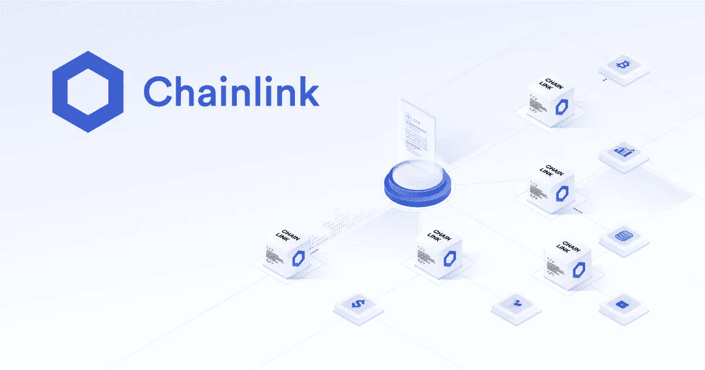
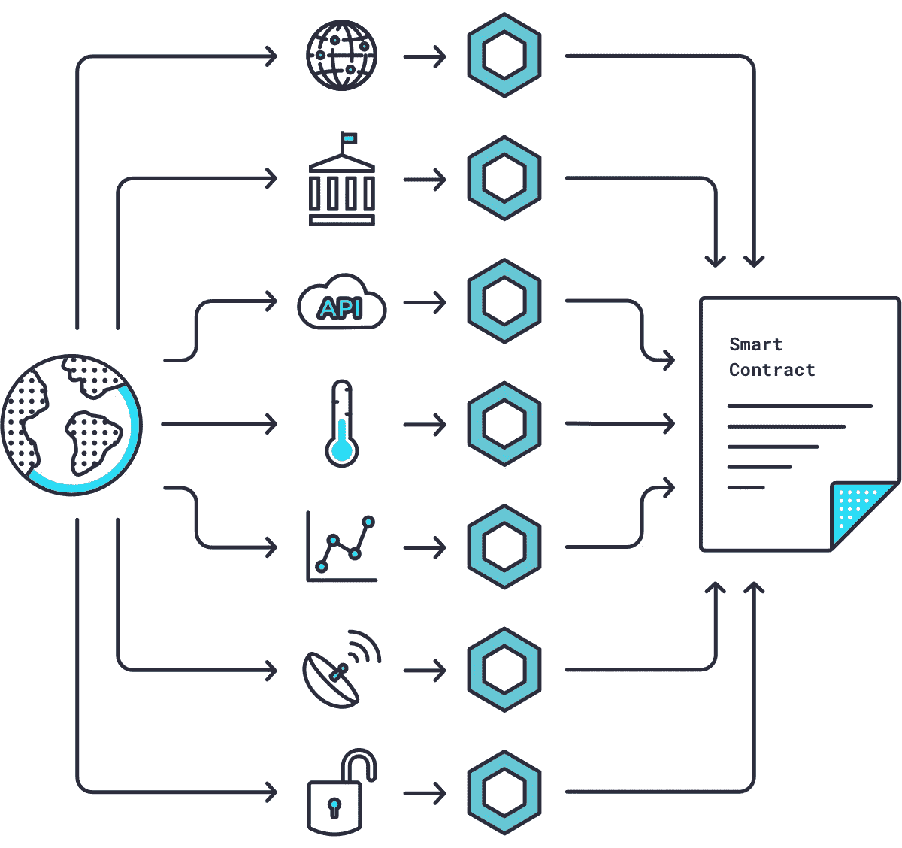

# 探索 Chainlink:连接区块链和真实世界

> 原文：<https://medium.com/coinmonks/exploring-chainlink-connecting-blockchains-to-the-real-world-27db2c0d6256?source=collection_archive---------3----------------------->

([Source](https://chain.link/))

在这篇文章中，我的第一篇加密思想文章，我将深入研究 Chainlink 什么是 Chainlink，它如何融入加密生态系统，以及它在未来的发展方向。这篇文章的目的和我在这篇博客中的所有文章的目的是一样的，就是了解加密生态系统的具体方面，并在这样做的过程中产生对你也有价值的内容。

鉴于传统的加密学习曲线从比特币开始，并倾向于通向以太坊，Chainlink 似乎是一个奇怪的起点。正是因为这个原因，我决定从 Chainlink 开始。一年多来，我一直在学习更广阔的数字资产空间，我发现区块链上的内容非常丰富，但像 Chainlink 这样的甲骨文公司的内容却很少。我相信神谕和 Chainlink 与理解比特币和以太坊一样重要。

# God 协议简介

在深入研究 Chainlink 到底是什么之前，我认为有必要概述一下密码朋克和加密货币先驱 Nick Szabo 在 1997 年提出的一个概念:God Protocols。

Nick Szabo, Cypherpunk ([Source](https://blockchain.uark.edu/nick-szabo/))

God 协议被设想为涉及两个或多个独立方之间的价值交换的过程的完美第三方。为了被认为是完美的，他们将通过用基于数学的执行者来取代他们，彻底消除与基于人类的执行者相关的低效率和交易对手风险。更重要的是，这些完美的第三方可以被所有人访问，没有妥协或偏见，不会将敏感信息泄露给非预期的实体，并且不会受到操纵。在所述过程中的价值交换将根据预先确定的和相互同意的规则来执行，并被记录和在逻辑上可追踪。最后，God 协议将只提取支付执行此类行为的成本所需的价值，从而将交易方的成本降至最低。

当被提出时，God 协议似乎代表了不可能实现的理想主义，尽管今天开发的技术正以加速的速度将我们推向 Szabo 的愿景。这些技术可以分为三个核心类别:(1)区块链，(2)智能合同，以及(3)甲骨文。每个类别对 Szabo 的愿景都至关重要，并且结合起来有可能在几乎每个主要行业(金融服务、保险、游戏等)彻底改变我们今天所知道的第三方。).

1.  区块链

在分解所需的每个类别时，我将假设您对区块链技术有一些基本的了解，因此这一部分将保持简短。区块链是一个由独立计算机组成的分散式网络，这些计算机同时验证区块链上的交易，并维护同一交易分类账(记录簿)的持续不变的副本。这个软件对大多数区块链人来说是开源的，这意味着它可以被任何人仔细检查和审计，以确定它做了它所说的事情。此外，大多数区块链还公布他们的账目，让每个人都可以看到，使他们 100%透明。如果你想更深入地探索区块链是如何做到这一点的，请查看这篇文章。

Centralised Authority vs. Decentralised Blockchain ([Source](https://timesofmalta.com/articles/view/What-on-earth-is-Blockchain.675774))

因此，区块链为 God 协议提供了完美的第一层。他们需要一个值得信赖的、无偏见的第三方，区块链通过去中心化(即没有一个对其流程有权力或影响力的中央管理者)来实现这一点。他们还需要明确证明基于数学的计算是正确执行的，这一点区块链通过在任何人都可以验证的不可变账本上公布记录的交易来实现。

很好，这是拼图的第一部分。

2.智能合同

God 协议难题的第二部分需要理解逻辑和触发动作的软件。如果你的职业是程序员，这对你来说完全有意义。如果你不是，考虑 Excel 函数(如果 x 事件发生，执行动作 y)。我们只是在讨论规则以及与这些规则相关的后续操作。

([Source](/security-token-offering/a-detailed-explanation-of-smart-contracts-8af012a3c165))

需要这些逻辑和动作工作流来处理用户发送给区块链的指令，并使这些完美的第三方能够识别和执行他们想要的动作。

比特币在技术上推出了第一批智能合约，开发了[多重签名功能](https://en.bitcoin.it/wiki/Multi-signature)和[时间锁定合约](https://en.bitcoin.it/wiki/Timelock#:~:text=A)，但以太坊开发了可编程智能合约的第一个功能。

可编程智能合约遵循与传统合约相同的逻辑；它是双方或多方之间的协议，概述了逻辑和行动，只是可编程智能合同是用代码编写的，并在区块链上执行。这意味着它们利用区块链的安全性、可靠性和可访问性，同时提供复杂的对等功能。此外，智能合约是透明的，可以公开验证，这意味着任何利益相关方都可以确切地看到智能合约遵循的逻辑。

具有智能合约能力的区块链网络中的每台计算机(或“节点”)存储现有智能合约及其当前状态的副本以及区块链和交易数据。当智能合约从用户那里收到资金时，它的代码由网络中的这些节点执行，以便就结果和最终的价值流达成共识。这使得智能合约可以在没有任何中央机构的情况下安全运行，即使用户正在与未知实体进行复杂的金融交易。

太神奇了。因此，我们现在不仅有一个安全、可信和公正的第三方，而且有能力执行协议，同时利用底层区块链无与伦比的安全性和可靠性。

3.神谕

虽然看起来第一和第二块拼图解决了萨伯的视觉，但还有最后一块拼图将使它完整。剩下的问题是，尽管智能合约在本地区块链上表现出色，但它们与外部世界脱节。这是因为区块链本质上是封闭的系统，这意味着它们没有与外部系统交互和交换数据的内置功能，因为这样做会对它们的网络共识构成威胁。

Connecting the Real World to Smart Contracts via Oracles ([Source](https://www.gemini.com/cryptopedia/what-is-chainlink-and-how-does-it-work))

因此，第三个也是最后一个难题是，智能合约要意识到它们运行的本地区块链之外的系统，并与之交互。这既指链外交互，即单个区块链与链外系统如英国气象局(英国的天气数据和预报服务)通信，也指跨区块链交互，即以太坊与 Solana 通信。

oracle 解决了区块链的这一局限性:

> “代表智能合同运作的外部实体，通过执行区块链本身不可能或不切实际的操作。”
> 
> - [ChainLinkGod](https://medium.com/u/38e761f6bcb8?source=post_page-----27db2c0d6256--------------------------------) ， [SmartContent](https://medium.com/u/f8e8fee4a404?source=post_page-----27db2c0d6256--------------------------------)

oracles 执行的两个主要功能是:(1)使用来自本地区块链之外的数据来确定链上的动作，以及(2)将命令从本地区块链传递到外部系统以供它们执行动作。oracles 还有其他各种功能，我将在后面深入解释，但现在，这是要考虑的两个主要功能。

现在你可能会想，拥有一个非本地区块链数据的集中来源肯定会完全损害区块链努力实现的安全性和可靠性吗？你是对的。为了实现 Szabo 的愿景，甲骨文本身，就像区块链一样，不能由一个单独的实体来运营，而是必须去中心化和聚合。

如果我们能够破解分散和聚合的神谕，我们将比以往任何时候都更接近于实现上帝协议，并在世界主要行业的第三方革命的道路上前进。好消息是，Chainlink 提供了我们需要的 oracle 解决方案。

# Chainlink 简介

([Source](/@framework_v/https-medium-com-signal-capital-our-investment-in-chainlink-15ab90ee9c02))

Chainlink 于 2017 年推出，是世界上第一个去中心化的 oracle 网络，为 Szabo 的愿景提供了最后一块拼图。它通过提供智能合约来实现这一点，智能合约提供了一种与区块链以外的任何软件进行交互的安全可靠的方式，最终使它能够克服 oracle 的问题。自开发以来，Chainlink 已发展成为连接区块链和区块链以外地区的领先和最广泛采用的解决方案。

由于其底层技术和网络、市场采用和网络效应、令牌经济及其开发社区，Chainlink 目前是 oracle 行业的领导者。我将深入探讨这些方面，以评估 Chainlink 为什么是世界领先的 oracle 网络，以及哪些因素将证明对塑造 chain link 的未来至关重要。

## 链环网络

Chainlink 实际上不是一个单一的网络，在这个网络中，每个 oracle 都参与智能合同请求的每个 oracle 作业，这很像区块链。相反，Chainlink 是一个异构的 oracle 网络，这意味着它由许多专注于特定 oracle 服务的独立 oracle 网络组成，这些网络可以同时构建和运行。这些独立网络之间的相似之处在于，它们都由运行底层 Chainlink 软件的节点组成。

Chainlinks Heterogenous Oracle Network ([Source](https://smartcontentpublication.medium.com/chainlink-low-level-infrastructure-for-inter-oracle-competition-f3d0f327b458))

因此，您可以将 Chainlink 视为一个网络的网络，网络用户可以自由选择如何构建他们的网络。这需要收集数据的方式(例如，选择各种数据源、数据汇总策略、更新频率等。)而且通过设置各种最低要求(例如，担保金额、节点的信誉阈值、历史节点性能等),降低到选择单个节点的粒度级别，主要是为了安全措施。).

这在节点和网络之间呈现出一种竞争的元素，这些节点和网络相互竞争工作，这取决于它们所擅长的工作。因此，对于这些 oracle 节点和网络来说，更广泛的 Chainlink 网络有点像自由市场经济。这对 Chainlink 的用户来说是理想的，因为竞争迫使参与者最大限度地提高质量标准。不仅如此，Chainlink 内单个节点和网络的专业化使 Chainlink 能够支持任何和所有类型的数据或链外计算请求，而不需要整个 Chainlink 网络中的每个节点都兼容，这对于可扩展性至关重要。

The Chainlink Network Architecture ([Source](https://smartcontentpublication.medium.com/completing-the-god-protocols-a-comprehensive-overview-of-chainlink-in-2021-746220a0e45))

链环网络的另一个关键因素是它是区块链不可知论者。考虑到不存在“赢家通吃”的区块链的可能性，这一点非常重要。在过去的几年里，我们看到了新区块链的崛起，所有这些都集中在一系列专业化特征上，如去中心化、速度和隐私。鉴于 Chainlink 与各种区块链兼容，它本身就是为我们未来与多个区块链共存的场景做准备。

## 安全性和可靠性

所以，我们现在明白了网络是如何组合在一起的，但是如果网络不安全、不可靠，智能合约就没有用了。因此，为了确保安全性和可靠性，了解 Chainlink 网络利用的六个功能非常重要:

*   分散
*   数据签名
*   声誉系统
*   $链接令牌组学
*   隐私
*   可量测性

1.  分散

去中心化就是要确保链外系统和链上系统之间的数据流是准确的，不会被操纵。这可以在三个层面上实现，以确保最大程度的权力下放。

让我们来看一个智能合约的案例研究，它需要 LINK/USD 对的价格数据。第一级去中心化将发生在独立的数据提供者身上，他们与 Chainlink 无关，专门收集来自多个来源的数据。在我们的案例研究中，这将需要独立的数据提供商从数百个加密交易所收集和汇总价格数据，以获得单一的价格数据点。第二层是从多个独立数据源收集数据的特定 oracle 网络中的链接节点。因此，在我们的案例研究中，Chainlink 将使用第一级中讨论的多个独立数据源，并聚合它们的数据，以找到每个节点认为是 LINK/USD 对价格的准确表示。

最后一级是提供 oracle 服务的网络利用许多 Chainlink 节点操作符来获取和检索数据，如第二层所述。所提供的多个数据点然后通过取中值、去除异常值来聚合，以创建智能合同使用的单个数据点。下图很好地说明了我们案例研究中的这三个级别，第一级是交换的集合，第二级是数据提供者，第三级是链接节点。

Chainlink Network Aggregation Levels ([Source](https://chainlinktoday.com/an-introduction-to-the-broad-diversity-of-chainlinks-decentralized-services/))

这三层聚合的结果是在流程的任何阶段都消除了对单个实体的依赖，从而完全消除了对恶意参与者的脆弱性。结合智能合约去中心化本身，在每个级别上聚合意味着智能合约的端到端去中心化。

2.数据签名

数据签名是一个存在于整个区块链生态系统中的概念，是一种可信的安全来源。在链式网络中，每次一条数据被传送到区块链时，都会被加密签名，以证明它来自特定的节点运营商。一旦它被签名并存储在区块链上，它就受区块链安全性的约束，这意味着这个签名是不可改变的。

这些签名使得智能合约能够确保它们从正确的来源接收数据，并且没有恶意的第三方劫持数据流。这在自动化流程中至关重要，因为它消除了手动检查这些元素的需要。

3.声誉系统

第三个安全性和可靠性特性直接依赖于我们的数据签名特性。它使每个单独的节点能够记录它已经执行的所有作业，并且这可以通过不可变的签名来证明。因此，每个节点本质上都有一个历史性能日志，可以进行逻辑验证。

这些历史性能日志可以在信誉系统中被跟踪和参考，由 Chainlink 网络的预期用户使用。它们用于根据特定的性能阈值，有选择地筛选 oracle 服务所依赖的节点。这代表了一种促进节点竞争的机制，这种机制奖励表现良好的节点，但更重要的是，识别并关闭操作节点的恶意参与者。你可以点击[这个](https://reputation.link/)链接来查看一个主要的节点信誉系统。

Reputation Logo ([Source](https://reputation.link/))

4.$链接令牌组学

$LINK 是 Chainlink 网络使用的本机令牌，现在可以在 exchanges 上购买。我将很快更详细地讨论$LINK 令牌，但是现在我将集中讨论它如何有助于 Chainlink 网络的安全性。

另一个可以与历史性能相结合来确定依赖哪些节点的因素是作为抵押品的$LINK 令牌的数量。每个运营节点都需要将$LINK 作为抵押品，如果该节点有恶意行为，将扣除该抵押品(称为‘stage slashing’)。这代表了“游戏中的皮肤”，并为节点运营商维护链式网络提供了财务激励。因此，当考虑依赖哪些节点时，潜在的 Chainlink 用户可以设置金融“游戏中的皮肤”的最小阈值。

([Source](https://honestcrypto.io/chainlink-staking-guide/))

除此之外，当一个节点执行一项工作时，它们会得到$LINK 令牌的经济补偿。这激励节点确保它们维护和保护链式网络，因为这与$LINK 令牌的值直接相关。如果他们恶意行为，链式链接网络的声誉以及$LINK 令牌的价值将会降低，从而降低$LINK 的价值以及未来的$LINK 收益。

有人可能会说，链接赚取的美元可以简单地转换成另一种代币或法定货币，节点运营商可能不希望中长期的未来链接工作。这可以说是减少了恶意行为的抑制因素。然而，赌注的$链接令牌，以及削减股份的前景行动，以清除任何恶意演员谁遵循这一配置文件。

5.隐私

增加隐私显著增加了智能合同的使用案例。这主要是由于隐私和数据许可法阻止在区块链上使用特定的数据，而没有实施安全的隐私机制。Chainlink 使用的隐私机制很复杂，远远超出了本文的范围，尽管我在下面提供了每个机制的简要概述，以及相关文章的链接，如果您想深入了解的话:

*   [DECO](https://arxiv.org/pdf/1909.00938.pdf) —一种通过让用户登录 web 会话(比如，他们的在线银行账户)来证明数据事实的方法。没有数据离开 web 会话，除了需要查看的特定数据之外，oracle 无法查看任何其他内容(例如，该银行帐户是否至少有 5000 英镑)。
*   [Mixicles](https://blog.chain.link/breaking-down-mixicles-and-its-potential-to-unlock-enterprise-demand-for-defi-applications-on-public-blockchains/)——一种在区块链上生成交易隐私的方式，将智能合约的逻辑与智能合约的最终结算完全分离。这防止了反向计算逻辑来确定智能合约输入和逻辑。
*   [Town Crier](https://blog.chain.link/town-crier-and-chainlink/) —智能合约的一种运作方式，不会透露智能合约的计算信息以及其中处理的数据。这是通过利用作为黑盒计算环境的可信第三方硬件(穿戴“可信执行环境”)来实现的。

6.可量测性

我要谈到的最后一个特性只适用于可靠性，而不是安全性。这个特性的技术细节超出了本文的范围，所以如果你想深入了解，我在这里包含了 Chainlink 的官方文档[。作为一个简要的概述，Chainlink 在引入链外报告(OCR)后极大地提高了它的性能和可伸缩性。OCR 协议使 Chainlink 节点能够在链外(与链上相反)将其观察结果汇总成一份报告。这指的是分散化功能中讨论的最后一级(第三级)。不是每个节点都向区块链发布他们的观察结果(在讨论去中心化时，我使用了 LINK/USD 价格馈送的例子)，OCR 允许他们离线“发布”并在上线前汇总这个级别。](https://docs.chain.link/docs/off-chain-reporting/)

([Source](https://blog.chain.link/off-chain-reporting-live-on-mainnet/))

Chainlink 官方文档使用的类比是在网上订购十个项目。以前，这些物品会被单独包装和邮寄，使用 OCR，它们被包装到一个包裹中，然后一起邮寄。自实施以来，结果是 OCR 将数据交付吞吐量提高了 10 倍，将链上气体成本降低了 90%。

## 提供的服务

既然我们已经介绍了 Chainlink 网络如何运行，以及它如何确保网络安全可靠，现在是我们研究网络提供的服务的时候了。

我将介绍五个突出的服务，尽管值得注意的是，由 Chainlink 提供并在安全文章中引用的 DECO(零知识证明)从技术上来说可以被视为 Chainlink 提供的一项服务，在确保谨慎的同时将敏感数据带到链上。

*   市场和数据馈送
*   储量证明
*   可证实的随机性
*   任何 API
*   管理人

1.  市场和数据馈送

市场和数据馈送是当今 oracle 服务的主要用例，也是 Chainlink 网络提供的最广泛采用的分散式服务。这些市场和数据馈送(如价格馈送)在参考合同中聚合，以便为智能合同消费提供可靠和安全的数据。这些参考合同实时更新。

Chainlink 目前为区块链的各种市场和资产提供超过 350 种参考合约，主要用于 DeFi 智能合约。如今 DeFi 锁定的价值超过 1000 亿美元，因此这是 Chainlinks 最常用的服务也就不足为奇了。

2.储量证明

([Source](https://chain.link/proof-of-reserve))

储量证明是一个相当自我解释的服务，其中 Chainlink 提供了一种验证个人储量的智能合约。Chainlink 通过使用安全部分中讨论的一些安全方法验证储备金额本身来实现这一点，然后在链上发布这些储备的数据，以供智能合同实时审计。

这是一项特别相关的服务，因为在过去的一年里，我们不仅看到了法定支持的稳定货币和数字货币的巨大增长，也看到了真实世界资产支持的稳定货币和数字货币的巨大增长。这包括美元支持的稳定货币，如[、](https://www.circle.com/en/usdc)(市值 325.3 亿美元)和[、戴](https://makerdao.com/en/)(市值 64.7 亿美元)，以及碳支持的算法数字货币，如[、Klima](https://www.klimadao.finance/) (市值 11 亿美元)。这项服务对这些产品至关重要，因为它提供了支持这些令牌的链外抵押品的链内透明度。

3.可证实的随机性

这项服务解决了我在了解 Chainlink 时才意识到的困境。在编写智能合同时，随机性是一个比你想象的更需要的特性。无论是在[pool together](https://pooltogether.com/)pool 中随机选择赢家的能力(这是一种无损失的彩票，用户从他们的抵押资产中集体赚取收益，这些资产随机提供给一个池参与者)，还是基于随机属性生成程序性 NFT 艺术所需的随机性。

区块链以及智能合约被设计为安全的，但是由于这些设计特征，不提供生成链上防篡改随机性的方法。更重要的是，链外随机性从定义上来说是不可篡改的，因为它不是分散的，并且假随机性看起来与没有链上证明的真实随机性一样。

链环 VRF 产生随机数据链，随着加密证明。这种随机性是以一种分散的方式产生的，通过利用加密证据，意味着智能合同可以确保它没有被篡改。关于这是如何实现的技术细节，请查看这篇文章。

([Source](https://chain.link/chainlink-vrf))

4.任何 API

虽然市场和数据馈送处理 DeFi 中所需的大部分数据，但还有其他实际应用可以更有效地实现。天气预报服务和传统支付系统等现实系统利用 API(应用编程接口)软件来分发数据。

Chainlink 提供了将来自这些链外 API 的数据带上链的服务，供智能合约使用。这既适用于公共 API，也适用于受密码保护的私有 API。

我认为 API 连接服务对于开发智能契约协议特别重要，超越了它们今天的一般用例。它们代表了扩大保险、赌博和更多连锁协议的机会。

5.管理人

与普遍看法相反，尽管智能合约是自主的，但它们并不总是“开启”的。他们基本上处于睡眠模式，直到用户通过向合同发送一些数字资产来与所述智能合同进行交互。当这种交互发生时，它们将“醒来”并开始执行它们预先确定的功能。

然而，许多智能合约需要在没有任何交互的情况下执行功能。这可能是稳定币的定期再平衡，每隔一段时间发生一次，或为产量聚合器收获产量。

Chainlink 提供“管理员”服务，当它需要通过实时监控预先确定的事件来唤醒时，它将与智能合同进行交互。

Chainlink Keepers Functionality ([Source](https://chain.link/keepers))

## $LINK 令牌

除了保护 Chainlink 网络之外，$LINK 令牌还用于向 oracle 服务的 Chainlink 节点支付费用，这是他们接受的唯一支付方式。这意味着，从理论上讲，随着对 Chainlink oracle 服务的需求增加，市场力量将导致$LINK 令牌的价格上涨。

当我今天写这篇文章的时候，LINK token 的价格在 31 美元左右，市值 146.6 亿美元。这相当于 4.61 亿美元流通环节的供应量。这里需要指出的是，link 的最大供应量实际上是 10 亿个令牌，所以我们目前的令牌发行还不到一半。新的$LINK 供应分配给节点运营商，以补偿他们保护链式网络和提供服务，然后他们可以选择持有令牌，或通过交易所将令牌分配到市场。

Chainlink Price February 2018 — October 2021 ([Source](https://studio.glassnode.com/metrics?a=LINK&category=Market&m=market.PriceUsdClose))

令牌持有者的总数目前约为 605，000 个地址，自 2020 年初以来，这一数字惊人地增加了约 525，000 个，增幅高达约 756%。有趣的是，最近几个月 Chainlink whales(拥有 10 万到 100 万美元链接令牌的地址)一直在积累美元链接令牌，现在拥有目前供应量的 25%。这通常是价格变动的一个令人鼓舞的迹象，因为它限制了代币的流通供应，产生了供应挤压效应，理论上应该会推动价格上涨。

$LINK 令牌可用于推测对 Chainlink 服务的需求，以及它在未来几年的市场主导地位。如果对 oracle 服务的需求率超过了 Chainlink 令牌的发行率，并且 Chainlink 保持其市场主导地位，链接价格将会上涨。增长的幅度完全取决于对 Chainlink oracle 服务的需求增长率。

## 网络效应

迄今为止，Chainlinks 的增长在很大程度上可以归功于其先发优势，以及其充满活力的开发人员社区开发的一流技术。但这并不是促成其市场主导地位的仅有的两个因素。与比特币和以太坊一样，Chainlink 网络极大地受益于网络效应。

([Source](https://www.researchgate.net/figure/Value-for-the-User-according-to-Metcalfes-Law_fig8_333017873))

网络效应最好用手机来比喻:如果世界上有一部手机，它就一文不值；如果有两部，如果你想和那个人说话，它就有价值；如果世界上每个人都有一部手机，它就非常有价值。一旦一个网络因为你增加了大量的人而变得有价值，你就可以开始在这个网络之上建立增值功能(例如，互联网作为一个允许建立互联网业务的网络，如亚马逊)。因此，网络的价值呈指数增长，这是梅特卡夫定律创造的，他指出，网络的价值与连接用户数量的平方成正比。

将这一概念应用于 Chainlink，我们可以看到类似的模式。例如，价格数据馈送就建立在共享成本模型的基础上。这意味着，每个用户不必为这个价格组合构建一个全新的 oracle 网络，他们可以共同为一个单一的通用 oracle 网络出资。

在这种共享成本模式中，oracle networks 价格源的每个额外用户都会增加网络的总收入，但每个用户的收入会减少。这对网络用户有两个增值部分:(1)每个单独用户要求这种价格馈送的成本随着每个新付费用户而减少，(2)网络的安全预算(与其收入成正比)随着每个新付费用户而增加。然后，安全预算将用于前面讨论的六个安全功能中的任何一个，例如为节点提供更多的链接激励，或者增加节点数量，从而提高去中心化。

从本质上讲，随着每个网络的发展，它对用户来说变得更加经济高效，并且作为一个网络更加安全，以指数级的速度提高其价值。这不仅有助于 Chainlink 作为一个整体的附加值，但作为一个重要的障碍进入 Chainlink 的竞争对手。他们正在与 oracle 网络竞争，随着用户的增加，oracle 网络变得越来越便宜、越来越安全，而且 Oracle 网络已经主导了 Oracle 市场。

# 链环的未来

好了，现在我已经带您了解了 oracle 是什么，Chainlink oracle 网络是如何设置和保护的，以及 Chainlink 提供的具体服务是什么。我希望到现在为止，我们都大致了解什么是今天的链环！下一个合乎逻辑的步骤是向前看，Chainlink 的未来是什么样的？

## CCIP

CCIP 代表跨链互操作性协议，该协议在 Chainlink 社区中备受期待，它将允许服务和应用程序跨各种区块链发送消息、执行令牌传输和发起动作。该协议将基本上实现多链生态系统，其中用户可以在区块链之间无缝切换。

([Source](https://chain.link/cross-chain))

这实际上与当今互联网的运作方式极其相似。并不是所有的网站都托管在同一个云计算平台上，它们在市场领导者之间，如 AWS、微软 Azure、谷歌云等。因此，当我们访问互联网并在各种网站之间切换或互动时，我们很可能会在云计算平台提供商之间切换，甚至不会意识到这一点。

未来，当我们访问由智能合约支持的去中心化应用并与之交互时，我们可能会无意中在由几个不同的区块链支持的服务之间切换。

这是链家随着 CCIP 的发展而准备的未来。如今开发跨链应用程序实际上是可能的，但只能通过开发定制代码来实现。CCIP 旨在通过创建开发安全的跨链应用程序和服务的标准来减少工作量。

如果你想了解更多关于 CCIP 及其运作的技术细节，请查看这个页面。

## 潜在市场总量

鉴于 Chainlink 为智能合约提供服务，其潜在市场总量与智能合约市场的总规模同步变动。这包括智能合约行业的所有元素，因为 Chainlinks 服务非常广泛，并且通常是大多数智能合约用例所需要的。

目前，智能合同的主要用例是 DeFi(去中心化金融)，你可以在这里了解[。DeFi 锁定的总价值目前略高于 1010 亿美元，自 2020 年末以来一直在快速增长。](https://newsletter.banklesshq.com/p/defi-is-eating-finance)

Total Value Locked (USD) in DeFi August 2017 — October 2021 ([Source](https://defipulse.com/))

DeFi 的使命最终是分散金融世界，鉴于全球股票和债券市场的市值超过 250 万亿美元([来源 1](https://www.sifma.org/resources/research/research-quarterly-equities/) ，[来源 2](https://www.icmagroup.org/Regulatory-Policy-and-Market-Practice/Secondary-Markets/bond-market-size/#:~:text=As%20of%20August%202020,%20ICMA,tn%20corporate%20bonds%20(32%25).)) )，DeFi 可以被视为处于早期阶段。可以说，DeFi 目前拥有 2475 倍的总潜在市场(TAM ),理论上将导致区块链 oracle 行业的需求增长 2475 倍。

我一分钟都没有暗示 DeFi 会吃掉整个传统金融界的午餐。很明显，几乎不可能预测 DeFi 将获得多大的潜在市场份额，更不可能从额外获得的价值中为 Chainlink 和更广泛的区块链 oracle 服务行业带来潜在的好处。我只是让您对潜在市场有个概念，DeFi 有多小，因此与这个潜在市场相比，它目前对 oracle 服务的需求有多大。

当然，这只是考虑了 DeFi。然后，我们有可能将智能合约扩展到保险、博彩、供应链物流等市场。这些都是巨大的市场，智能合同几乎没有触及其表面，每个市场都将产生对区块链甲骨文提供商服务的巨大需求。

我试图传达的总体思想是，智能合同是当今世界存在的一些严重低效和瓶颈的优秀解决方案。因此，它们无疑会扰乱许多主要行业，并在未来 5 到 10 年内通过这样做获取丰厚的价值。这样，对区块链甲骨文服务的需求将相应增加，这对 Chainlink 这样的网络来说是一个非常令人兴奋的前景。

# 结束语

唷。如果你刚刚通读了整篇文章，你现在可能需要休息一下，我不怪你！我们刚刚详细介绍了 Chainlink。然而，如果你想真正理解整个区块链生态系统是如何结合在一起的，这是至关重要的信息。

如果你想了解更多，或者了解 Chainlink 网络及其进展(尤其是 CCIP 即将发布)，我建议你在 Twitter 上关注这些人:

*   [@Chainlinkgod](https://twitter.com/ChainLinkGod)
*   [@Crypto___Oracle](https://twitter.com/Crypto___Oracle)
*   [@ChainlinkBull](https://twitter.com/ChainlinkBull)
*   [@LinkGeneraI](https://twitter.com/LinkGeneraI)
*   [@TheLinkMarine1](https://twitter.com/TheLinkMarine1)

为了跟上更广阔的区块链生态系统，我建议做以下事情:

*   在 [Spotify](https://open.spotify.com/show/41TNnXSv5ExcQSzEGLlGhy) 或苹果[播客](https://podcasts.apple.com/us/podcast/bankless/id1499409058)上收听无银行播客
*   查看[真实视觉加密](https://www.realvision.com/videos/crypto)

当然，我会每两周在 Medium 上发布一次内容，并定期在我的 Twitter 账户 [@benharvey_10](https://twitter.com/benharvey_10) 上发布。给我一个关注或订阅这份时事通讯，以了解最新情况。谢谢，两周后见。瓦格米。

> 加入 Coinmonks [电报频道](https://t.me/coincodecap)和 [Youtube 频道](https://www.youtube.com/c/coinmonks/videos)了解加密交易和投资

## 另外，阅读

*   [CoinLoan 点评](https://blog.coincodecap.com/coinloan-review)|[Crypto.com 点评](/coinmonks/crypto-com-review-f143dca1f74c) | [火币保证金交易](/coinmonks/huobi-margin-trading-b3b06cdc1519)
*   [Bookmap 评论](https://blog.coincodecap.com/bookmap-review-2021-best-trading-software) | [美国 5 大最佳加密交易所](https://blog.coincodecap.com/crypto-exchange-usa)
*   最佳加密[硬件钱包](/coinmonks/hardware-wallets-dfa1211730c6) | [Bitbns 评论](/coinmonks/bitbns-review-38256a07e161)
*   [新加坡十大最佳加密交易所](https://blog.coincodecap.com/crypto-exchange-in-singapore) | [购买 AXS](https://blog.coincodecap.com/buy-axs-token)
*   [投资印度的最佳密码](https://blog.coincodecap.com/best-crypto-to-invest-in-india-in-2021)|[WazirX P2P](https://blog.coincodecap.com/wazirx-p2p)|[Hi Dollar Review](https://blog.coincodecap.com/hi-dollar-review)
*   [加拿大最佳加密交易机器人](https://blog.coincodecap.com/5-best-crypto-trading-bots-in-canada) | [KuCoin 评论](https://blog.coincodecap.com/kucoin-review)
*   [火币加密交易信号](https://blog.coincodecap.com/huobi-crypto-trading-signals) | [HitBTC 审核](/coinmonks/hitbtc-review-c5143c5d53c2)
*   [如何在 FTX 交易所交易期货](https://blog.coincodecap.com/ftx-futures-trading) | [OKEx vs 币安](https://blog.coincodecap.com/okex-vs-binance)
*   [OKEx vs KuCoin](https://blog.coincodecap.com/okex-kucoin) | [摄氏替代品](https://blog.coincodecap.com/celsius-alternatives) | [如何购买 VeChain](https://blog.coincodecap.com/buy-vechain)
*   [币安期货交易](https://blog.coincodecap.com/binance-futures-trading)|[3 commas vs Mudrex vs eToro](https://blog.coincodecap.com/mudrex-3commas-etoro)
*   [如何购买 Monero](https://blog.coincodecap.com/buy-monero) | [IDEX 评论](https://blog.coincodecap.com/idex-review) | [BitKan 交易机器人](https://blog.coincodecap.com/bitkan-trading-bot)
*   [尤霍德勒 vs 科恩洛 vs 霍德诺特](/coinmonks/youhodler-vs-coinloan-vs-hodlnaut-b1050acde55a) | [Cryptohopper vs 哈斯博特](https://blog.coincodecap.com/cryptohopper-vs-haasbot)
*   [顶级付费加密货币和区块链课程](https://blog.coincodecap.com/blockchain-courses) | [币安评论](/coinmonks/binance-review-ee10d3bf3b6e)
*   [MXC 交易所评论](/coinmonks/mxc-exchange-review-3af0ec1cba8c) | [Pionex vs 币安](https://blog.coincodecap.com/pionex-vs-binance) | [Pionex 套利机器人](https://blog.coincodecap.com/pionex-arbitrage-bot)
*   [如何在印度购买比特币？](/coinmonks/buy-bitcoin-in-india-feb50ddfef94) | [WazirX 评论](/coinmonks/wazirx-review-5c811b074f5b) | [BitMEX 评论](https://blog.coincodecap.com/bitmex-review)
*   [印度的加密交易所](/coinmonks/bitcoin-exchange-in-india-7f1fe79715c9) | [比特币储蓄账户](/coinmonks/bitcoin-savings-account-e65b13f92451)