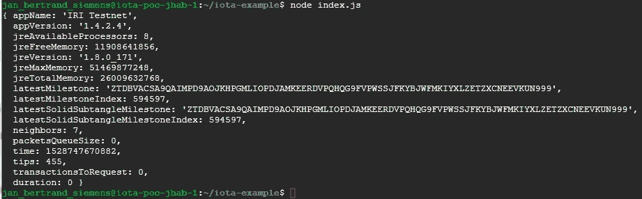

# 探索 IOTA # 1——在 google cloud 上获得一个 linux 终端并发送一个事务

> 原文：<https://medium.com/coinmonks/exploring-iota-1-getting-a-linux-terminal-on-cloud-google-com-and-sending-a-transaction-d7b9f1ce100a?source=collection_archive---------2----------------------->

## 不管您的工具和硬件如何，这篇文章都应该让您获得 IOTA 协议的第一手交易…


当我在 2014 年买下我的前两个比特币时，我感觉自己被宰了。当钱从我的银行账户转到卖家的银行账户后，我想我再也见不到那 400€了。
总之，我不知何故忘记了这个职位，只是在 2017 年年中左右，当炒作无处不在时，才意识到这枚硬币的小幅上涨。

我从未拥有过钱包，从未挖掘过任何密码，一直在交易所持有这两枚比特币，幸运的是，它们的价格都在上涨。

这是我开始意识到这个地方已经发生了巨大的变化，出现了许多新的密码、硬币等——经过一些研究，我发现 IOTA 项目是我眼中最有趣的项目。

我喜欢探索 IOTA，我想我需要开始查看代码并亲自尝试，以真正理解其中的含义和可能性。
这篇文章(也许是系列)并不打算覆盖深层背景，但我用它来记录我的小步骤。

所以在我阅读了 IOTA 官方网站的大部分内容后

[](https://www.iota.org/) [## 下一代分布式账本技术

### IOTA 协议是由 IOTA 基金会开发的分布式分类帐技术。这是下一代…

www.iota.org](https://www.iota.org/) 

可能已经忘记了大部分…我发现了这个孤独的教程，不幸的是它告诉你(在其他事情中)你需要一个

*   终端访问

 [## 第一笔交易- IOTA 文档

### 恭喜🎊。您刚刚发送了您的第一笔 IOTA 交易。现在，我们只需要去找回它。这将是…

docs.iota.org](https://docs.iota.org/introduction/tutorials/first-transaction) 

你也许可以使用 MAC 终端，但由于我在 windows 机器上，我想我可能会尝试获得一个 linux 云实例——令人惊讶的是，它甚至是免费的。

我想自从 12 年前我第一次在一台废弃的备用电脑上安装 redhat linux 发行版以来，已经发生了很多变化。回到以前，你需要对硬盘进行分区，以便有一个双重引导，能够有两个操作系统可用。现在似乎一切都在云端，所以我试着去 cloud.google.com

## 获得您的云计算机

[](https://console.cloud.google.com/freetrial) [## 谷歌云平台

### Google 云平台让您可以在同一基础设施上构建、部署和扩展应用程序、网站和服务…

console.cloud.google.com](https://console.cloud.google.com/freetrial) 

您需要有一个谷歌帐户设置，并开始您的免费试用。不要担心我们的需要，我们甚至不需要动用 300 美元的津贴，你可以在接下来的 12 个月里使用。

填写下面的详细信息并提交


cloud.google.com account confirmation (1/2)

接下来你需要选择账户类型，你可以使用个人账户。填写您的详细信息，是的，您需要填写信用卡详细信息。你可能会问为什么我需要添加我的信用卡信息才能免费试用？答案太简单了:如果你选择创建大型虚拟机或使用任何其他昂贵的云产品，他们每个月都会向你收费…不用担心，我们的小型云 linux 实例不会——即使在试用期后也是免费的。


cloud.google.com account confirmation (2/2)


cloud.google.com confirmation screen

祝贺你的新云平台账户

我们接下来要做的就是建立一个虚拟机器——它只不过是一台在谷歌云农场内的服务器上具有特定硬件架构的计算机。我们将使用我们的 webbrowser(最好是 chrome)来访问这台机器，它为您提供了终端访问权限，这就是我们第一步需要的全部内容——至少这勾选了教程中要求的一个框。

所以让我们一步一步来。

## 设置云实例

如前所述，我们继续使用免费架构——第一次尝试时，我不知道有免费的，所以我设置了一个非常强大的机器，最终支付了一天 1 美元的基本 idl 工作——然后我删除了它，并发现了这一点:

[https://cloud.google.com/compute/pricing](https://cloud.google.com/compute/pricing)

如果你选择 f1micro 放在美国除了北弗吉尼亚，我们现在很好。如果你出色地创造了一个野兽般的机器，你还有 300 美元可以花…

## 创建您的第一个项目

您可以创建一个新项目，我们可以在其中启动和配置我们的微实例


它说你需要花费大约。5 美元，但如果你进一步挖掘，你会在这里看到这个:


所以我们这样配置:

选择微型(1 个共享)..美国除了北弗吉尼亚以外的一些地方。


给自己弄杯咖啡或饮料，需要几秒钟，给你..您通过点击 SSH 进入一个基于 web 的 bash/shell…


现在好戏开始了。如果你熟悉这些命令，就开始黑客攻击，但如果不熟悉，谷歌是真正的答案…

 [## ubuntu linux 最有用的命令-谷歌搜索

### ubuntu linux 最有用的命令

www.google.de](https://www.google.de/search?q=ubuntu+linux+most+usefull+commands&rlz=1C1CHBD_deDE710DE711&oq=ubuntu+linux+most+usefull+commands&aqs=chrome..69i57.7307j1j7&sourceid=chrome&ie=UTF-8) 

让我们试着从 iota.docs 中的第一个也是唯一的教程开始安装。


所以我们需要 node.js 8+..

你可以在这里做很多错误的事情，我自己就是这样做的，没有安装 node.js 的正确 repo 确保它是 8+,否则你会遇到很多编译错误，没有真正的帮助。

好的，首先更新整个机器

> sudo apt-get 更新


无论如何，这只是为了展示——显然我们需要通过一个命令和 curl 将 8+存储库加载到我们的虚拟机器上。

> https://deb.nodesource.com/setup_8.x| sudo-E bash-


如前所述，现在我们可以通过以下命令安装存储库。

> sudo apt-get install -y 节点


名单上的下一位是国家预防机制经理


要验证是否安装了 npm，只需使用

> npm -v


ok 应该不错。


太简单了，我们已经安装了 vim，这是我们最喜欢的 bash 编辑器

> sudo vim test.txt

不要忘记按 TAB 和 I 来插入文本，然后按 ESC 和+ : + q +！你会喜欢这个编辑器的:-)


好了，现在我们差不多到了——我想一次回答两个问题是没问题的。我们以前需要终端，也需要互联网…完成


从这里开始，它应该是一个小舞蹈——遵循 iota docs 官方网站上的教程。


如果你已经掌握了 vim 的技巧和陷阱，你就会看到这个



因此，进一步遵循 IOTA，你将在 tangle 上完成你的第一笔交易。


**故障排除(编辑 24.06.2018):** 如果您在发送交易(基本上只接收节点信息)时遇到问题，请尝试禁用使用 PoW(工作证明)箱(powbox)来外包此计算任务。在这个例子中，我们的节点服务器有可能在调用 API 时为您做工作证明(虽然不是每个节点都启用了这个功能)

```
//const remoteCurl = require("@iota/curl-remote")
//remoteCurl(iota, "https://powbox.testnet.iota.org", 500)
```

我想补充的第二个信息是，服务器已经从 testnet 重命名为 devnet。这意味着 tesnet 被废除，devnet 是新的正确命名

因此，您也可以将服务器名称更改为

```
const iota = new IOTA({ provider: "https://nodes.devnet.iota.org:443" })
```

因为我们是在 tesnet (devnet)上，你可以在这里通过搜索捆绑包、散列、事务…

 [## 测试网交易…

### 编辑描述

testnet.thetangle.org](https://testnet.thetangle.org/transaction/CNBZCND9UXDHQPLCQXSFJNPM9AIKHTTAROWVMVBYSTGKKOCVEDQQMPKOMJCSB9VV9LCOAECKNY9LEB999) 

恭喜你！

截至撰写本文时，testnet health 非常出色，但当我两个月前第一次尝试时，它并不那么容易——希望你喜欢本教程并期待转发。你的评论，当然还有对 IOTA 及其可能性的更多探索。

干杯，简

[**下一篇文章:探索 IOTA #2，检索您的交易并创建您的“钱包”**](/coinmonks/exploring-iota-2-retrieve-your-transaction-and-create-your-wallet-bc8e8c91fec9)

****已编辑(24.06.2018):** 远程 PoW 不成功导致 sendTransaction 不工作时的故障排除**