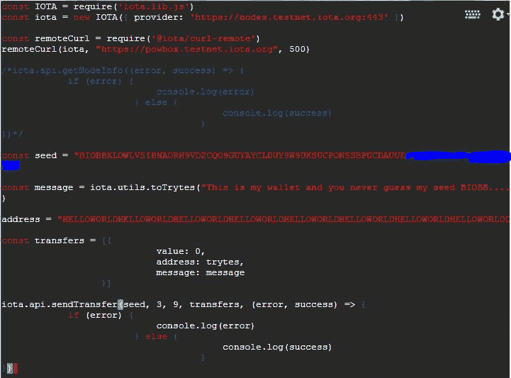

# 探索 IOTA #2，检索您的交易并创建您的“钱包”

> 原文：<https://medium.com/coinmonks/exploring-iota-2-retrieve-your-transaction-and-create-your-wallet-bc8e8c91fec9?source=collection_archive---------3----------------------->

## 在本文中，我将向您展示如何从混乱中检索信息，并阐明如何用自己的种子/密码准备自己的第一个“钱包”地址。

在上一篇文章([探索 IOTA #1](/coinmonks/exploring-iota-1-getting-a-linux-terminal-on-cloud-google-com-and-sending-a-transaction-d7b9f1ce100a) )中，我展示了如何在云 Linux 实例上通过 node.js 与 IOTA **testnet** (现在称为 **devnet** )进行交互。上一次，我们以向 devnet 发送零值事务结束，并能够通过 tangle explorer 找到该事务。

 [## 测试网交易…

### 编辑描述

testnet.thetangle.org](https://testnet.thetangle.org/transaction/CNBZCND9UXDHQPLCQXSFJNPM9AIKHTTAROWVMVBYSTGKKOCVEDQQMPKOMJCSB9VV9LCOAECKNY9LEB999) 

在本章中，我们将检索已发送的交易，此外，更改代码以便

*   创建您的**种子(您的钱包密码——如果丢失，您将失去所有资金连接到此种子/密码)**
*   从您的种子创建您的地址
*   获得一些测试令牌
*   发送非零值交易记录

> [发现并查看最佳加密钱包](https://coincodecap.com/category/wallets)

## 消息、零值交易和快照

如果有一件关于“区块链”的事情总是被提及，那就是他们向你保证这个账本中的数据不会被篡改。
这意味着我们已经发送的交易(对我来说是几天前)不应该被更改。

对于 IOTA 也是如此，但仅对一个快照内的**消息**有效。为了减少节点上的数据库大小(在参与 IOTA 分类帐并存储所有事务的服务器上的参考实现)，历史数据会不时地被删减——在 IOTA 中，他们称之为快照。在这一步中，只有地址上的正确平衡在节点网络上检索共识，所有消息和零值地址被清除(至少这是我对它的理解)。

此步骤确保本地节点数据库的大小减小，性能提高，磁盘需求降低。但是在快照之后，我用我的零值事务传输的不可变消息发生了什么——它不再能从混乱中恢复。

有永久节点的概念，最终可以保存所有的历史信息(或者至少是一个公司或个人在所有历史中需要的信息——也许我们试图在本探索的最后一章创建这样一个永久节点),但是我还没有在 devnet 上看到任何提供的服务。不要担心，在我们的例子中，我们应该在一个快照中，并且能够检索我们的消息。

此外，我认为 IOTA 是一种协议，它可以为每个人/所有事物实现不可变的安全数据传输/流(无许可分类帐)。您可以免费发送零价值交易，并安全地交换价值。数据的存储可以以各种方式实现为第二或第三层协议，或者在 IOTA 参考实现 IRI 中是可选的。

对于我们的文章，这也意味着当你在快照后阅读这篇文章时，请使用你的捆绑包 id，因为我的 id 可能已经不存在了。

## 正在检索交易

再次回到编码。找出我们可以使用哪个函数来检索消息的最佳方式是寻找官方的 **github** iota.lib.js 存储库。

[](https://github.com/iotaledger/iota.lib.js#iotaapi) [## iotaledger/iota.lib.js

### iota.lib.js — IOTA Javascript 库

github.com](https://github.com/iotaledger/iota.lib.js#iotaapi) 

在阅读完自述文件后，我看到了这个函数——让我们试着实现它。


让您的代码始终保持最新并向社区开放的最简单方法是在命令行上使用 git，并将您更改的代码发布到您的 github repro。

这是很好的第一步:

 [## 开始在命令行上使用 line | GitLab

### GitLab 社区版、GitLab 企业版、Omnibus GitLab 和 GitLab Runner 的文档。

docs.gitlab.com](https://docs.gitlab.com/ee/gitlab-basics/start-using-git.html) 

```
228  git clone [https://github.com/jhab82/exploring-iota.git](https://github.com/jhab82/exploring-iota.git)
240  cd exploring-iota/
243  vim recieve.js
242  git checkout master
245  git diff
246  git status
252  git commit -m "bla bla done"
254  git push origin
```

这是我用来克隆项目、更改 recieve.js、检查差异和状态并提交更改的命令，最终将它推送到 github 上的主服务器。

我已经实现了 *findTransactions* 函数(上面是引入的 *findTransactionObjects* 函数，它充当这个函数的包装器),只传递了一个包 id。嵌套在那里，我使用 *getBundle* 调用从包(包含我们的消息)中只提取 *signatureMessageFragment* 。

执行

> 节点 recieve.js

会给你以下内容:


第一行给你的是从原始文本转换来的文本信息！

等一下，为什么我们要把这条信息切成片…我的意思是，为什么我们需要减少一个 9。

```
message = success2[0].signatureMessageFragment;                                        **message = message.split("9").join("");       **                                 console.log(iota.utils.fromTrytes(message));
```

如果你不这样做，它会给你“空”。不要介意这里报道的一个问题:[https://github.com/iotaledger/iota.lib.js/issues/96](https://github.com/iotaledger/iota.lib.js/issues/96)。

解释是来自 Trytes 的*需要偶数个值。我相信你可以把它正常化，比分割和连接更好…如果你执行下面的，你会得到空值。*

```
message = success2[0].signatureMessageFragment;                                                                         console.log(iota.utils.fromTrytes(message));
```


他们可能会在未来的实现中改变这一点，如果 trytes 的数量无法通过*从 Trytes* 传递，他们会抛出一个错误。

## 创造你自己的种子

如果有一件事你应该注意，如果你在加密/区块链，把你的私钥，种子，密码认真保密！

你现在是你自己的银行——没有人或团体充当你和安全地带之间的纽带——你要负责。

这就是为什么在不了解原因、内容和方式的情况下，不应该使用任何种子生成器。

就我们的目的而言，我们可以坚持让老朋友 Linux 为我们生成一个可以接受的种子，它应该是 81 个字符长，应该只有大写字母和数字 9——请以随机的方式…

```
**cat /dev/urandom |tr -dc A-Z9|head -c${1:-81}**
```


你可能会想简怎么了？他只是告诉我，我不应该暴露它，他几乎 fu** …粘贴在这里…

是的，我没有(虽然最后一个字母被厚厚的红色油漆覆盖),但如果你想尝试——这是一个挑战:任何人获得我的钱包上的 devnet 令牌(如何获得 devnet 令牌，我稍后会告诉你)将获得一个特殊的奖励。它只是猜测大约 9-10 个字符，或者你可能想暴力破解它。

这里最好的学习是如果你能理解暴露你的种子是疯狂的，即使只有 9-10 个字母很难猜出你的种子，但不是不可能。如果你认为你能猜出 81 这个字符，请看这个

为了使它更容易，这里是用于复制和粘贴的暴露种子部分(没有 9-10 个字符)

```
**BIOBBXLOWLVSIBNAORH9VDZCQO9GUYAYCLDUY9W9UKSUCPONSSBPUCDAUUEOZIUXSBTEC9RI**
```

因此，如果你破解了最后一个字母，你就可以控制钱包(因为这是在 devnet 上——反正你不会发财)

我们真的应该重复我们之前和第一篇文章中做过的所有内容，以理解什么是种子钱包。地址~信息/价值的临时存储，以及如何获得令牌…

现在，我们只是改变我们的传递函数，以用于我们的种子，并再次发送零值交易:



这将在执行时给我们


**故障排除:**由于我遇到了远程 PoW 的问题，请执行上面的代码，不要使用下面的两行代码(以便让 PoW 由节点而不是 powbox 执行)

```
//const remoteCurl = require("@iota/curl-remote")
//remoteCurl(iota, "https://powbox.testnet.iota.org", 500)
```

好的，这意味着我们已经从种子(现在是私有的)通过测试网向非常流行的地址 HELLOWORLDHELLOWORLD 发送了一个零值交易。

但是，如果我发送一个非零值的事务(我想将 devnet 令牌发送到这个地址)，会发生什么呢？

## 创建您自己的第一个地址

让我们开始吧。创建一个只有你——种子持有者——可以控制的地址。

只需创建一个新的小文件并将其命名为 genNewAdress.js，然后将种子复制为 const，命令如下所示

```
const seed = "***PasteYourSeedHere***"iota.api.getNewAddress (seed,  (error, success) => {
        if(error){
                console.log(error)
        }else {
                console.log(success)
        }
})
```

执行后，你会得到类似的东西(你的地址是唯一的，显然看起来不同于我的)


```
FBTICMZPRTLDFYZZSMBABZTBULMWZVRKZPXTFJEIOPUJLFQDIOPWHKCXKIBPYBGXBSHZIBRYUBMYCRGHA
```

这个地址的特别之处在于，它属于我，只有我能够使用我的种子从这个地址向另一个地址发送值。

## 获取您的 devnet 令牌

所以让我们在这里得到 devnet 令牌:

[](https://faucet.testnet.iota.org/) [## 欢迎来到 IOTA 水龙头

### 编辑描述

faucet.testnet.iota.org](https://faucet.testnet.iota.org/) 

我只需将我新创建的地址粘贴到这个小应用程序中，我就会得到一个接收令牌的预计时间


酷——我应该有代币，但我不知道怎么检查它们。来吧，让我们通过命令行检查我们的平衡。

## 获取您的地址余额

您可能只看了一下那个特定的地址，但进一步探索 IOTA 将向我们显示，每次我从这个地址花费时，所有剩余的资金都将被转移到从这个种子生成的下一个地址。这意味着我们希望从该种子创建的所有现有地址中获得平衡。

我通过将 getBalance 命令嵌套到 getNewAddress 命令 ***中来实现这一点(为了更好的可视性，我修改了操作符= >以包含函数表达式)***

```
const seed = "...."var addresses = new Set()
var allAddressesiota.api.getNewAddress(seed, {'returnAll':true}, function(error, allAddresses) {
        if(error) {
                console.log(error)
        } else {
                allAddresses.forEach(function(addr) { addresses.add(addr)})
                console.log(allAddresse)
                iota.api.getBalances(allAddresses, 10, function(error, success) {
                        if(error) {
                                console.log(error)
                        }else {
                                console.log(success)
                     }
                })
        }
})
```


恭喜你收到了 1000 分！

## 发送非零值交易

现在，我们可以向流行的地址“hello world…”发送一些信息——因为我们可以。只需复制 send.js 并使用您的种子创建一个 send_fromWallet.js 脚本，并将值从 0i 更改为 1i。

```
const seed = "**PasteYourSeedHere**"
const message = iota.utils.toTrytes("I will send you 1i for just because i can....")address = "HELLOWORLDHELLOWORLDHELLOWORLDHELLOWORLDHELLOWORLDHELLOWORLDHELLOWORLDHELLOWORLDD"const transfers = [{
                         **   value: 1,**
                            address: address,
                            message: message
                  }]iota.api.sendTransfer(seed, 3, 9, transfers, (error, success) => {
            if (error) {
                            console.log(error)
                        } else {
                                        console.log(success)
                                    }
})
```

执行此脚本后，您将收到大量信息:

```
[ { hash: 'GIXQQGFCBHMHXFSG9ABJKXHB9ZZALWGEYLWFRULFFBOSBFXFNJJQYPHPHJ9ONQMKEDNUJTTHEZSEPE999',
    signatureMessageFragment: 'SBEAKDXC9D9DEAGDTCBDSCEAMDCDIDEAVAXCEAUCCDFDEAYCIDGDHDEAQCTCRCPCIDGDTCEAXCEARCPCBDSASASASA999999999999999999999999999999999999999999999999999999999999999999999999999999999999999999999999999999999999999999999999999999999999999999999999999999999999999999999999999999999999999999999999999999999999999999999999999999999999999999999999999999999999999999999999999999999999999999999999999999999999999999999999999999999999999999999999999999999999999999999999999999999999999999999999999999999999999999999999999999999999999999999999999999999999999999999999999999999999999999999999999999999999999999999999999999999999999999999999999999999999999999999999999999999999999999999999999999999999999999999999999999999999999999999999999999999999999999999999999999999999999999999999999999999999999999999999999999999999999999999999999999999999999999999999999999999999999999999999999999999999999999999999999999999999999999999999999999999999999999999999999999999999999999999999999999999999999999999999999999999999999999999999999999999999999999999999999999999999999999999999999999999999999999999999999999999999999999999999999999999999999999999999999999999999999999999999999999999999999999999999999999999999999999999999999999999999999999999999999999999999999999999999999999999999999999999999999999999999999999999999999999999999999999999999999999999999999999999999999999999999999999999999999999999999999999999999999999999999999999999999999999999999999999999999999999999999999999999999999999999999999999999999999999999999999999999999999999999999999999999999999999999999999999999999999999999999999999999999999999999999999999999999999999999999999999999999999999999999999999999999999999999999999999999999999999999999999999999999999999999999999999999999999999999999999999999999999999999999999999999999999999999999999999999999999999999999999999999999999999999999999999999999999999999999999999999999999999999999999999999999999999999999999999999999999999999999999999999999999999999999999999999999999999999999999999999999999999999999999999999999999999999999999999999999999999999999999999999999999999999999999999999999999999999999999999999999999999999999999999999999999999999999999999999999999999999999999999999999999999999',
    address: 'HELLOWORLDHELLOWORLDHELLOWORLDHELLOWORLDHELLOWORLDHELLOWORLDHELLOWORLDHELLOWORLDD',
    value: 1,
    obsoleteTag: 'LG9999999999999999999999999',
    timestamp: 1529851449,
    currentIndex: 0,
    lastIndex: 3,
    bundle: 'AIYWAEBHLFZYDYO9KULNOSRBCZSDYJVIYHTXCFVDEOGSRFJESGLEZVJXYOSYKJENFUVBOAZGHGJHYREBY',
    trunkTransaction: 'HJLAJVBGJCCC9XRMLYOIJTPLBOELQMS9LMYGFYR9XDNWHUZYQDCZIQGNIFVXEMRBMCLEXVGKCXSUYV999',
    branchTransaction: 'SAAGHDVRNZFGBUNKUCPAW9UYZKSZBKYEWVBTGGOQMPWTOPSMWIWIEQXHFGN9WLEIDUAVQB9E9ECO99999',
    tag: 'LG9999999999999999999999999',
    attachmentTimestamp: 1529851456551,
    attachmentTimestampLowerBound: 0,
    attachmentTimestampUpperBound: 3812798742493,
    nonce: 'EMDIGCYYFVNXFJMWXPOMDWRUCCE' },
  { hash: 'HJLAJVBGJCCC9XRMLYOIJTPLBOELQMS9LMYGFYR9XDNWHUZYQDCZIQGNIFVXEMRBMCLEXVGKCXSUYV999',
    signatureMessageFragment: 'XOFC99XBKNCJXFNLIHWBELHVHEWZPHYQ9PSMRNJKLUQE9KTPHDKPPZCDJ9IUTBANQIKFKQYREIKRBCVHYSBRAVOXZSZNOEBIBUEBDIIVYCHYXNWFALAFFZ9NCVZMIZDBRDQIHWJWSGIDCOGIX9XEBJLGJMGMLVVX9A9AMJDPENVBGFQUENEJUAEPJEKGTKVWVITGMWSDJZZSOBEEEXQLGMW9VGCYNYBCVHASOMNPFEEZ9RMFGBXNAXMESQLNVWTKYLTQBOKZZRWGDZMS9OWKJEVXNYJGXKLEHVHJQHLQKGJQBJRETKNPLQIHZLMGDAGPSEGWSYKLWKMWZXNZIDZISEYCDFTHDMTRMKY9X9FOAWNBKZNMVRMXZYVGHELCSENGSPZVVJVZLPPGCJWOBNEZDJPFYJXVDRGNOVAWHXQBAEGKENTDXVTNEGOVLKQXOCNQINCSYMVLEYRA9KZDGWUSOJLUYPHEAASGOZEXAWCNVFBGBAUSIXNKHITQWJSPLIMGUZEFNHHSBG99C9SKEMAYHRROWVFKBZTOUZFYBASHVQSXXIAJCBIKPRDGXSMZOIYCF9DNYCSSHWEXWHVAPRFLAFTJDDAHAHQIADDKEIARGR9VTK9FBNWLITPRQYQQKTAYHVFOXV9DVKLGZRNEKOOXDABDMYZRMXVTRTOHBDZZNFMGQOVIASMILNMTBYBHDUHCIFIHREI9GCEFAAFFSOLBTWFXZ9AMEOYFUREX9RBAWDBRJZLZVVBMHRZUJKQKNPT9LEEOLVVD9TLF9GVRDPYURGRVNDMRRDTVYCBDSBP9UBLBDHBZUAHUBUMSSBXSTKCBLXLKPDCAONYITBFECEMPXJVQRXNTBPKFOCFDMMGLNNERPX9BSVLWUN9PO9WOORMUEI9GLMUBERAFMND9VJIMDGAOAWUCQUTRDBEZKWLDJFXWBSEDQSDLPNJNDOTDFSUMVHMADSXMVZWCBPFASEOLOWYHUEIHWSEZ9RIKWEPCOQJZMZEECHKLTZCTUDMWOO9ALYKVYYVXQAQFZRCD9LGVAWUEJDF9ZPWUDJHQHEEVJGPESMIGEAWMRGS9OWTJHORIQJVSRNIKTJWIQRALGSKMXKGGKYJKPJGUQPMAVLHRLESZYDKUVQYRLWGR9LRNL9TUQWYEHDWGLJUBATGJRVHFLOKMZEYXIHAYJJMEMOQGCOFSPKYGVQPHSCMFCVDGSJXB9RIGXPCRONJWFZVJ9SHURDAGZHOWASTAHBUDZORPHMNFBVGYVEDRSWVVPKEJJTJAKVWVTXLRQYNNQO9WSLJSJLQNUNIJDN9YFJ9FAEAAECXXKEZEQFLZJLUAN9ESAIBNJFJDBQWONAFBMUJJBLJZLKTOS9GZZVFGXDTOQLYQVQPJ9XNCWAWAQATQZBEAZSTNN9YIYOEPMFQEKNKWYZJRLBBSQTQFVRWYWNGYVYSGQWCVYPFEOWMUZN9KJFQTKNIACQUVRCIGDXZ9YEYZDISDHCZGXPZWW9GHTNANGDZISFAYZKEY9TDCJNCWBBC9ARXOVTXNRGCH9HEU9T9XZQHULGAFPMWGNM9ORSLKSHRGTUCSUXCPIGIJLKYVARPQYTQXTXE9PSXTVDSLLDBLYGH9NB9CUSPAPL9PP9UDOYMOUKGGYHBKQGUPKPBUNSXDTVPSLGEPYAQKA99SIV9KJXMYHCOUPOSQHUKNTVDPDJBNWSKSURQCZRLZCVHBPKVNXVYMHZRWMPWTA9RQACNOSATNEMGKJWXITWZJJLLHUBN9ZMNDSMWOHG9ZECEPUSOZLVGMGPWJCJDKKTHTSONIUGISFHY99NGNAOYWQO9KOCHJDAWAGWP9TRASYYSQWDLTDIJMOVACUV9CUZYDNXSBNJGDYOVHAIJZMLKHFWHXRFRUTCWDJKYHYORLYSN9VRSTLJVWKWB9LANRDFYZZJKSFKF9IQFWPRJWDKGEJALFXLS9ISCSMVYLMXCVNLESVJAGXUBMOLXQZGPR9IACTCJROR9ANHKBHMJGOMTR9SFJYXOJWIMRISIEHSFAPTEXNOOJDOAVCCNMWLKQE9DDBZVFOXCBPYOV9CGNPRTAHXWQZ9MWVWTERZ9ZKTOEXLAPPWBDQVTBIKTXRKWK9FRDEYXLHUKKIP9TEMJFZ9PG9GXUUNALJQJQNSLOSG9BLPMF9RLXCCCOPCBKAZO9GYW',
    address: 'FBTICMZPRTLDFYZZSMBABZTBULMWZVRKZPXTFJEIOPUJLFQDIOPWHKCXKIBPYBGXBSHZIBRYUBMYCRGHA',
    value: -1000,
    obsoleteTag: '999999999999999999999999999',
    timestamp: 1529851453,
    currentIndex: 1,
    lastIndex: 3,
    bundle: 'AIYWAEBHLFZYDYO9KULNOSRBCZSDYJVIYHTXCFVDEOGSRFJESGLEZVJXYOSYKJENFUVBOAZGHGJHYREBY',
    trunkTransaction: 'GKNBKDZM9XOEEDYWHLFLYGTW9YCEWQFZGC9FWRTRRLIBIBADFSITNOZAQBWKG9OTTJOKGNSQLJHVMZ999',
    branchTransaction: 'SAAGHDVRNZFGBUNKUCPAW9UYZKSZBKYEWVBTGGOQMPWTOPSMWIWIEQXHFGN9WLEIDUAVQB9E9ECO99999',
    tag: '999999999999999999999999999',
    attachmentTimestamp: 1529851456539,
    attachmentTimestampLowerBound: 0,
    attachmentTimestampUpperBound: 3812798742493,
    nonce: 'SFDLLPLZQ9GVBGPFHKVBCHPZ9W9' },
  { hash: 'GKNBKDZM9XOEEDYWHLFLYGTW9YCEWQFZGC9FWRTRRLIBIBADFSITNOZAQBWKG9OTTJOKGNSQLJHVMZ999',
    signatureMessageFragment: 'DMYOLFZUNASYKIVELBBALIJWLITJTTAHPAGKCHMQNGWENOYWESBIMLRMKEHRCWWZCREVIYKTCDWBZYVKXZKXLZUCIAE9KNZMISVDLHEVSMKCAVUJ9ABTM9TQZXKPMRNRL9WLHPMHCFBPBHDPEQ9RANDVPAWPPFIWOYJAETGDCTYDSLDBYTB9BAS9GDPBWRHLQNGLJFFOJGJPFYNGFDAJVKVMVZXQSL9XCWUVZMKYIRKGQBBCQUWZNDWGBIMYHHIU9DMLH9STGQLGSANRYDOAAHLVLUBHEWOS9YDANVSIIXNCADJMWEZLDYNZLHTQ9CSBPZWWUBKGZIARYOHUHKKOEALUDJTBMZAWYMLSCBIASZUFHBRDLDCSSMAANAGNKUFEMYQLJCZDJQXHZGDTRKETCVJF9UACUZPUNBCZPGRPMUEVPNCUAMTTGWTAC9MXPSMESRFFRYOBOU9IXOLJCXHGOHUHLKIEDRJIXSFFSXAWGAZ9Z9HAKVXWMNMPAWOUALDOSGNHCPBSAGLWSBLSMJDFZJOMPQDWNJXXROJQYWYQAPMTZYDVCKBOFI9UMAZUCBUAOYRYCKPZZTNIVC9QLHZRLWYAMIUMSUIZQZUBQRVZQXBWC9QNDUIUGV9YEZRJXKJSJNOB9NGZLFDEOJ9WGOC9N9CNJBSHCPXNCGNMUPWUWSVD9CNFTHKCRIIBXYVIPQSIYYGCXZOHWCWNUJXXUMNSXTGE9NSXTIHAHNWAPIVE9BDELWOTLLJHAACOEBCWMNQPQD9W9BNQFETNRCZPMUGUSIVSXJTONUUAUYHNAYHDVX9SJMPOUDG9FLZ9RUPFXROSQCLDWSUKCHHNZPKGPPZTMDDOKMP9QESVLTDMUNFGCRARGYIJAREEFOCUNT9ISAVMLRUACRMETNRXRK9OQALVETPSOCBWZRTMJCTEHQQ9OYTQUMEN9NGDHOGPXAP9DFTACICAPFUYEZNXQOKDBUDYRLNIFFDKKCWAHQBJLJ9ZRJXWZD99DLOCEVOPXP9QIKJRVCVVDHSOKEDTRUMPETUHIFIRAESLBR9CYCRTQHWHC9GIMJQ9NMSAGBFHWFKWUDLJLWUPVKYOSLEEWLFBPMEMBLEEYLYMYQUYZUYNCRRDITMFGBRCTGWCPWDNDAFXXAEYKDDBYVQHNCFWCOLWCGUOESFRBFQVPYKQ9TLAUFTEASHGLWORCFJZZBXIMVFVVHDJJCAHQWKMMWDNHDVCZXSLBMPXSPTZIZPNZCSDEHXNFAOY9HOWCUXEEKRSI9DUGOGYEUPSXTLT9WILQENYDOKKAMELMESWOUNBCFFBOGEZXKCGZZSPFCARQRNFBXOPAJQIISJLJSSKLJLWDAYIUWNSAJQEAYQOTW9ADV9TUHULTQHAYBOFEADTAFPHBSCESQDON9I99JFALZMOARKQYTNICNJKDLWZXORODSKJOZZFLSYGFXIMOZRXDUHPOCSTPNW9VBMSSKJQXMLQIXHSYJITC9ISEBSCUWKO99BQQUTPDMIEKGUVXIIHBOVQLGGHSDVBYDDEBCWBRYGNARRFYSWK9EEKLRIICHKFNSCRASANBIAHXDMVPPWMWXXNWLQZIPBEDYRDOHIGH9DZYIEPQTLZCRENBRXPZWEAXQHIEJTKHKXBLEBCOV9RLWRSUSPYIWINYDDTWWJXRERDTYPVEEXSUZWOGCO9IEDCZIWRBLNEPLWSPZNEMGTEYQLVKKJYMQDMSPHUFLUWBZZDMPXXLHNZH9ZGFZUXJXQWJYNXKJSSMHUNEQLFAVUNRXOJRRHGRBMZUSURCJERGEIRVZLUJVUURGXYAYQHSOCNPSSCHXNJGRRAKRMO9DZVHDKYORNZXWQVBQWXATDMWJDVBEP9COVCGJRTQLMXEXYBOKPVXUYUIWLKA9CWFFSFHXQXNXCJKGXGFYHTJFIAIMMLBY9OHUZAYXCCSSUQBL9PRXUCBQMQWDAJHFPWMG9UQNZAWEMKCUMSHIXXHRFCASPIPBW9HVPVNPSIJ9QJXKIRGKYQWLYEDHOZNEYUAJACHEX9MDWKDZJPDDSIGAFALGBPQYHSMDBVGSUUMHXFBDVDRSOMINLGMETXWQBVJVKBWPZEHWRFCU9MYMDAWAOHRQXIZFAMYOXO99MSTEOQSEBPNNMBFWKGLHWVLGIBIL9O9EVTJRLWBDQHQQCVIEYUZ9D',
    address: 'FBTICMZPRTLDFYZZSMBABZTBULMWZVRKZPXTFJEIOPUJLFQDIOPWHKCXKIBPYBGXBSHZIBRYUBMYCRGHA',
    value: 0,
    obsoleteTag: '999999999999999999999999999',
    timestamp: 1529851453,
    currentIndex: 2,
    lastIndex: 3,
    bundle: 'AIYWAEBHLFZYDYO9KULNOSRBCZSDYJVIYHTXCFVDEOGSRFJESGLEZVJXYOSYKJENFUVBOAZGHGJHYREBY',
    trunkTransaction: 'VMJL9UVXBAPERHWIVGOMPNEHJBCTL9ABSGSMEKXCHNUW9NRAFSIVCKJFWXUDBFOMNQJHQEWZPPDRRG999',
    branchTransaction: 'SAAGHDVRNZFGBUNKUCPAW9UYZKSZBKYEWVBTGGOQMPWTOPSMWIWIEQXHFGN9WLEIDUAVQB9E9ECO99999',
    tag: '999999999999999999999999999',
    attachmentTimestamp: 1529851456532,
    attachmentTimestampLowerBound: 0,
    attachmentTimestampUpperBound: 3812798742493,
    nonce: 'DFLBUPZRIRIBODBQ9RKGIEANSBH' },
  { hash: 'VMJL9UVXBAPERHWIVGOMPNEHJBCTL9ABSGSMEKXCHNUW9NRAFSIVCKJFWXUDBFOMNQJHQEWZPPDRRG999',
    signatureMessageFragment: '999999999999999999999999999999999999999999999999999999999999999999999999999999999999999999999999999999999999999999999999999999999999999999999999999999999999999999999999999999999999999999999999999999999999999999999999999999999999999999999999999999999999999999999999999999999999999999999999999999999999999999999999999999999999999999999999999999999999999999999999999999999999999999999999999999999999999999999999999999999999999999999999999999999999999999999999999999999999999999999999999999999999999999999999999999999999999999999999999999999999999999999999999999999999999999999999999999999999999999999999999999999999999999999999999999999999999999999999999999999999999999999999999999999999999999999999999999999999999999999999999999999999999999999999999999999999999999999999999999999999999999999999999999999999999999999999999999999999999999999999999999999999999999999999999999999999999999999999999999999999999999999999999999999999999999999999999999999999999999999999999999999999999999999999999999999999999999999999999999999999999999999999999999999999999999999999999999999999999999999999999999999999999999999999999999999999999999999999999999999999999999999999999999999999999999999999999999999999999999999999999999999999999999999999999999999999999999999999999999999999999999999999999999999999999999999999999999999999999999999999999999999999999999999999999999999999999999999999999999999999999999999999999999999999999999999999999999999999999999999999999999999999999999999999999999999999999999999999999999999999999999999999999999999999999999999999999999999999999999999999999999999999999999999999999999999999999999999999999999999999999999999999999999999999999999999999999999999999999999999999999999999999999999999999999999999999999999999999999999999999999999999999999999999999999999999999999999999999999999999999999999999999999999999999999999999999999999999999999999999999999999999999999999999999999999999999999999999999999999999999999999999999999999999999999999999999999999999999999999999999999999999999999999999999999999999999999999999999999999999999999999999999999999999999999999999999999999999999999999999999999999999999999999999999999999999999999999999999999999999999999999999999999999999999999',
    address: 'QWQLOWHRQCBFJTNVPKMHBISERXKEIFAQQIEFURQPQOXUMMXQIAHBYTT9LWEILYCTROE9FMCDZPFAZDGNZ',
    value: 999,
    obsoleteTag: '999999999999999999999999999',
    timestamp: 1529851455,
    currentIndex: 3,
    lastIndex: 3,
    bundle: 'AIYWAEBHLFZYDYO9KULNOSRBCZSDYJVIYHTXCFVDEOGSRFJESGLEZVJXYOSYKJENFUVBOAZGHGJHYREBY',
    trunkTransaction: 'SAAGHDVRNZFGBUNKUCPAW9UYZKSZBKYEWVBTGGOQMPWTOPSMWIWIEQXHFGN9WLEIDUAVQB9E9ECO99999',
    branchTransaction: 'SAAGHDVRNZFGBUNKUCPAW9UYZKSZBKYEWVBTGGOQMPWTOPSMWIWIEQXHFGN9WLEIDUAVQB9E9ECO99999',
    tag: '999999999999999999999999999',
    attachmentTimestamp: 1529851456523,
    attachmentTimestampLowerBound: 0,
    attachmentTimestampUpperBound: 3812798742493,
    nonce: 'OIFJOUHQAYDBO9ZGCHATJUZ9CQM' } ]
```

让我们首先通过执行 showBalances.js 来确保从我们的地址中扣除 1i


看起来很好。接下来，我们可以使用 tangle explorer 来检查我们的 1i 是否已经被这个地址接收到。


恭喜你！你现在有了

*   你的地址有 1000 个 devnet IOTAs。
*   您已经执行了代币交易，并且
*   您现在知道了如何检索交易信息。
*   最重要的是，你知道当你暴露你的种子时会发生什么。

在下一篇文章中，我将向您展示当我们将 1i 转移到“HELLOWORLD…”地址时，在后台发生了什么。我想对 iota.lib.js 存储库中可能的命令进行更多的探索，并激发一些用例。

如果你很纠结，有推荐或者只是想改变什么，请回来找我。

干杯，
陈安

本系列的第一篇文章:[探索 IOTA #1](/coinmonks/exploring-iota-1-getting-a-linux-terminal-on-cloud-google-com-and-sending-a-transaction-d7b9f1ce100a)

故障排除:

*   通过在我们的脚本中注释 remoteCurl 部分来禁用远程工作证明(PoW)
*   IOTA 将 testnet 改为不推荐使用，并将其重命名为 devnet。请更改您的节点服务器

```
[https://nodes.**dev**net.iota.org:443](https://nodes.testnet.iota.org:443)
```