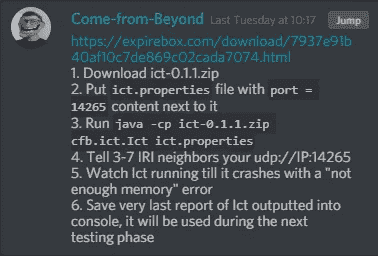
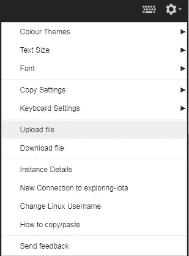
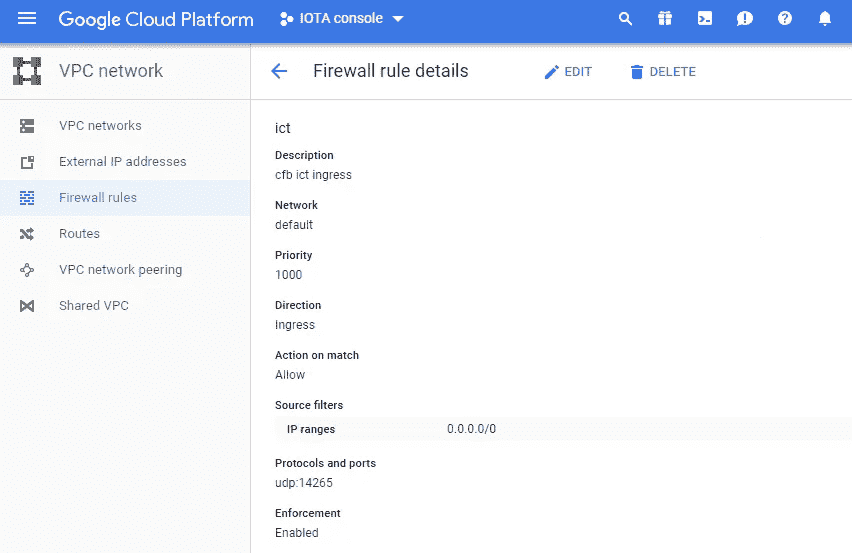
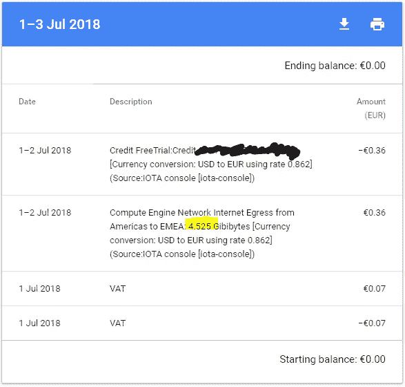
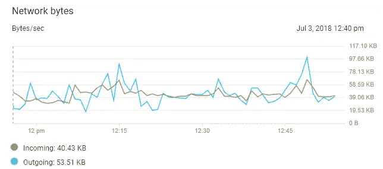

# 探索 IOTA #ICT-1，在云计算机上测试 ICT

> 原文：<https://medium.com/coinmonks/exploring-iota-ict-1-running-ict-on-a-cloud-computer-bc3d96b246ea?source=collection_archive---------9----------------------->

## **I** OTA **C** 控阿根 **T (ICT)已经在官方 discord 渠道放出测试。我将向您展示如何在 f1-micro(小型计算机)云实例上运行它。**

我在这里不讨论 ICT 应该解决什么，或者在它最终实现中做什么。因为我不能-这是阿尔法测试前。有一些关于它的猜测，但在我没有看到它并理解其潜在的机制之前，这只是猜测或谈论某人谈论的一些事情。目前，我只是让它运行:-)

**Come-from-Beyond** 解释了如何设置他的小 java 程序。



Screenshot from CFB steps for this test

还有进一步的沟通，该测试的最佳硬件应该是 raspberry Pi-1。我有一个树莓 Pi 3b+，并成功地设置了它，但我的组合调制解调器/路由器不允许我转发。必要的端口，所以我忽略了“一点点”CFBs 的建议(“仅更好的 Raspi 对不起——在一个**V**I virtual**P**rivate**S**server VPS 上运行程序，你可以如何调用我在谷歌服务器农场上的小计算机(名称:f1-micro)。

如果你想遵循这个教程，请给自己弄一个 VPS——这里我解释了如何给自己弄一个 f1-micro cloud 实例。 [**探索 IOTA #1**](/coinmonks/exploring-iota-1-getting-a-linux-terminal-on-cloud-google-com-and-sending-a-transaction-d7b9f1ce100a)

让我们获取一些关于我们刚刚创建的硬件的信息。从您的网络浏览器打开 SSH 网络终端，并键入:

```
:~$ cat/proc/meminfo
**MemTotal:         606684 kB**
....
```

也就是说我们有 606MB 的内存。现在我们得到了 cpu 信息

```
:**~**$ cat /proc/cpuinfo
processor       : 0
vendor_id       : GenuineIntel
cpu family      : 6
model           : 63
model name      : Intel(R) Xeon(R) CPU @ 2.30GHz
```

怎么能有 0 处理器呢？

经过一番研究，f1-micro 实际上拥有一个超过 0.2 个虚拟 CPU 的共享内核(虚拟 CPU 是英特尔至强 E5 上的单个硬件线程)

如需更多详细信息:

[](https://www.opsdash.com/blog/google-cloud-f1-micro.html) [## 探索谷歌云 f1-微实例- OpsDash

### 看看谷歌云平台的 f1-micro 实例能做什么。

www.opsdash.com](https://www.opsdash.com/blog/google-cloud-f1-micro.html) 

我们可以检查哪个 linux 发行版。我们的系统上有

```
:**~**$ cat /etc/issue
Debian GNU/Linux 9 \n \l
```

## 下载 zip 文件

**Edit 30.06.2018** :现在这个文件已经不可用了——我担心镜像它会干扰测试——你可能想等待下一个测试阶段(并加入中间的[官方不和谐频道](https://www.google.de/search?rlz=1C1CHBD_deDE710DE711&ei=ol03W9DmE4rosAeT3bm4DA&q=official+IOTA+discord+chat&oq=official+IOTA+discord+chat&gs_l=psy-ab.3..0i71k1l8.0.0.0.1689.0.0.0.0.0.0.0.0..0.0....0...1..64.psy-ab..0.0.0....0.2f-ADx97m0c)以获得#ICT 频道的新消息)

您可以使用 SSH 或 SSH web 浏览器功能导入 zip 文件



这会将文件上传到您的主目录，因此您可能希望将它们移动到一个单独的新建文件夹中

```
:~$mkdir iota-ict
:~$mv ict-0.1.1.zip iota-ict
:~$cd iota-ict
~/iota-ict$ ls
**ict-0.1.1.zip**
```

## 创建文件 ict.properties

```
**~/iota-ict**$ vim ict.properties
port = 14265
```

为了保存你在这个文件中编辑过的一行，你需要在 vim 中使用(:wq)——你不知道我有多喜欢这个编辑器:-)

```
~/iota-ict$ ls
**ict-0.1.1.zip**  **ict.properties**
```

你的两个文件已经准备好执行了

## 运行 java

为了运行 java，首先你需要得到。

你可以得到 **J** ava **R** 直到**E**nverimentjre(大约需要 480MB 的磁盘空间)

```
sudo apt-get update
sudo apt-get install default-jre
```

只是简单检查一下什么是违约

```
java -version
**openjdk version "1.8.0_171"
OpenJDK Runtime Environment (build 1.8.0_171-8u171-b11-1~deb9u1-b11)
OpenJDK 64-Bit Server VM (build 25.171-b11, mixed mode)**
```

最后启动程序

```
java -cp ict-0.1.1.zip cfb.ict.Ict ict.properties
```

其中-cp 指示了类的名称，我们可以在

```
$ java -help
java [-options] class [args...]
...
Where options include:
 -cp <class search path of directories and **zip**/jar files>
```

这意味着我们在 cfb.ict.Ict 中指定主类，并将主类交给文件 ict.properties(在这里定义了我们的 UDP 端口)

正确执行后，您应该会看到以下内容

```
[2018-06-29T11:36:58.620] Ict 0.1.1
2018-06-29T11:36:58.725
Number of transactions = 0
Number of missing transactions = 0
```

程序没有终止，也没有打印任何其他内容—让我们继续下一步

**告诉 3-4 个 IRI 邻居您的 UDP/IP**

**U**ser**D**atagram**P**rotocol UDP 是不太为人所知的通过互联网发送位包的协议。众所周知，TCP/IP 代表“让我们使用” **T** 传输 **C** 控制 **P** 协议而不是 **I** 互联网 **P** 协议，没有人会把 UDP/IP 扔在房间里。据我所知，UDP 并没有太多的控制——意味着接收者并不检查是否收到了包——它基本上把所有的错误检查都扔了。

回到 CFBs 任务—将其分解为

*   我的 VPS IP 被世人所知是什么？

```
$ curl ipecho.net/plain
**12.123.123.123** 
```

*   其他人可以通过端口 14265 上的 UDP 访问我的 IP 吗？

我们可以使用下面的命令从 google cloud 外部进行检查

```
nc -v -u -z -w 3 **12.123.123.123** 14265
**MySecondInstanceIP** [**12.123.123.123**] 14265 (?) : Connection refused
```

该命令将 UDP 数据包发送到 12.123.123.123 的端口 14265，并在 3 秒钟后报告没有收到 ICMP 数据包。

我们可能需要给我们的防火墙增加一条规则。谷歌云中有一个 VPC 网络标签，你可以在那里将这些规则添加到现有规则中



VPC network tab with the rule for allowing UDP traffic on port:14265 fow all IPs

执行上述规则后，现在应该可以工作了，并按照上面的概述再次与 netcat 进行检查

*   告诉 3–7 个 IRI 完整节点添加您的 IP

首先确保您已经重新启动了 ICT。您可能希望在后台运行它，并将输出记录在一个文件(ict.log)中。此外，当您退出控制台或关闭笔记本电脑(nohup)时，它不应该停止

```
~/iota-ict$ **nohup** java -cp ict-0.1.1.zip cfb.ict.Ict ict.properties > ~/**ict.log 2>&1 &**[1] 27870
```

一旦执行了这个操作，就可以获得一个进程 ID PID (27814 ),您可以使用

```
$ top -p 27870
```

一旦你将 ict.log 作为“实时流”打开

```
~$ tail -f ict.log
**nohup: ignoring input
[2018-06-29T12:55:31.521] Ict 0.1.1
2018-06-29T12:55:31.626
Number of transactions = 0
Number of missing transactions = 0**
```

在你发现 IRI 节点加入你之前，不会有太多事情发生

这是棘手的部分——你需要加入 discord chat，并在专用的 ICT 频道中询问是否有人愿意添加你。我终于设法让三个邻居添加了我的 IP，我想再次感谢你帮我找出所有这些小陷阱。

一旦他们成功添加您，您将获得

```
Number of transactions = 114
Number of missing transactions = 1
2018-06-29T12:59:13.162
/**IPaddressFromNode1**:14600: 874 / 43 / 1 / 0 / 43
/**IPaddressFromNode2**:14600: 12 / 1 / 0 / 0 / 1
Number of transactions = 44
Number of missing transactions = 0
```

有些人反编译了 zip 文件夹中的类文件，我也跟着做了——一旦反编译，可能会有以下对数字的解释。但这是猜测，因为我没有理解的代码。也许下一篇#ICT-2 文章

```
/**IPaddressFromNode1**:14600: 874 / 43 / 1 / 0 / 43
```

> 874 = numberOfAllTransactions
> 
> 43 = numberOfNewTransactions
> 
> 1 = numberOfInvalidTransactions
> 
> 0 = number of requested transactions
> 
> 43 = numberOfSharedTransaction

**编辑 03.07.2018** :在 f1-micro cloud 实例上运行，一旦你的免费试用时间或配额用完，你就要花钱。

我的 ICT 与 4 个邻居一起运行了两天，从美国到 EMEA 有 4.5 GiB 的出站流量(这意味着邻居在 EMEA)



Billing of google cloud account — 4.5 GB outbound

***如果你不再使用你的实例，请确保将其切换，否则你将被收费。***



Incoming and outgoing traffic of ICT node

让我们假设平均 50–60KB/s 的输出流量等于 4–5gb/天

```
{50, 60}KB/s * 60s * 60min/h * 24h/day = **{4.3, 5.2} GiB/day**
```

假设我在美洲有两个邻居(不收费)，在 EMEA 有两个邻居(收费)。

在本文中，我们在 f1-micro google cloud 实例上执行了 ICT java 应用程序。我们还没有涉及 ICT 正在做什么，或者它有什么好处。

这是探索 IOTA #ICT 侧面探索的下一集。在这里，我想看看反编译的代码，并了解这个预 alpha 版本实际上在做什么。重点在于尝试——这可能会有点尴尬，因为我的 java 经验很少(也许很有趣)..从那里我们可以推测它可能打算解决或做什么，纠结和它的愿景——至少我可以再次尝试。

我很乐意看到你的问题，疑问或更正

干杯，简

如果您对使用 IOTA 感兴趣并通过探索了解它，您可以从这里开始:

[探索 IOTA #1](/coinmonks/exploring-iota-1-getting-a-linux-terminal-on-cloud-google-com-and-sending-a-transaction-d7b9f1ce100a)