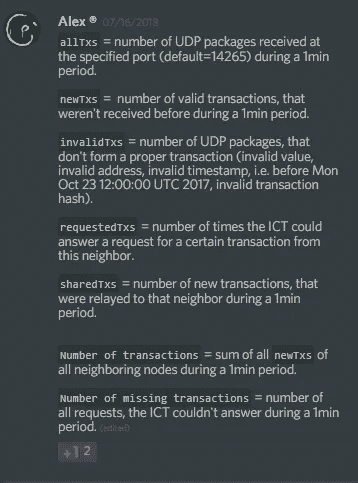

# 探索 IOTA #ICT-2，逆向工程代码第 1 部分

> 原文：<https://medium.com/coinmonks/exploring-iota-ict-2-reverse-engineering-the-code-1-ecda56d4908?source=collection_archive---------5----------------------->

## 我们探索如何在公开的基于 web 的 java 反编译程序的帮助下反编译 java 源代码。然后使用标准的 java 编译器重新编译它。更改代码以确认收到 UDP 数据包。由此开始理解 ICT 的代码😄

也许这对我来说有点太复杂了，试图通过查看代码来理解 IOTA 受控代理(ICT)的潜在目的。主要原因:

*   我的职业不是程序员
*   我对群体逻辑没有经验
*   我第一次接触 Java 可以追溯到学生时代，但那是在 90 年代初。
*   …

不管怎样——我们就这么做吧。

*我仍然在我的谷歌云实例(f1-micro)上测试这个。我的文本编辑器是 vim(我已经对它有了一种又恨又爱的关系)——如果你想自己设置这个环境，请看看我的其他文章。*

[](/coinmonks/exploring-iota-1-getting-a-linux-terminal-on-cloud-google-com-and-sending-a-transaction-d7b9f1ce100a) [## 探索 IOTA # 1——在 google cloud 上获得一个 linux 终端并发送一个事务

### 这篇文章应该给你，不管你的工具和硬件，获得第一手的交易…

medium.com](/coinmonks/exploring-iota-1-getting-a-linux-terminal-on-cloud-google-com-and-sending-a-transaction-d7b9f1ce100a) [](/coinmonks/exploring-iota-ict-1-running-ict-on-a-cloud-computer-bc3d96b246ea) [## 探索 IOTA #ICT-1，在云计算机上测试 ICT

### IOTA 受控代理(ICT)已在官方 discord 渠道发布测试。我会告诉你如何运行…

medium.com](/coinmonks/exploring-iota-ict-1-running-ict-on-a-cloud-computer-bc3d96b246ea) 

本文无意伤害或干扰 ICT 的测试阶段。它记录了我通过查看代码库来理解 ICT 的底层机制的尝试(目前除此之外没有太多其他的东西——没有文档)。我已经要求 discord #ICT 频道的“来自更远的地方”发布这个小步骤。

此外，我的发现可能完全错误😄

## *反编译类文件*

如果你是能够从 ICT (0.1.1)下载第一个 pre-alpha 版本的幸运儿之一(在官方 IOTA discord 频道)，你可以跟进所有后续步骤。如果没有，那么也许在 0.1.2 版本上会有下一次机会。**来自超越**在 discord 上提到，他很快就会发布重构后的代码。

`*.class`文件(编译的`*.java` 代码)被压缩隐藏在那个小 zip 文件中。在你解压文件后，你可以使用可用的在线反编译程序，它试图通过使用不同的策略来反编译。我用了这个网站

[http://www.javadecompilers.com/](http://www.javadecompilers.com/)

在上传类文件时，可以选择这些不同的策略。我首先尝试了 **CFR** 但是没有成功——代码不完全可读，更重要的是它不能被再次编译。我用 **Procycon** 策略取得的最好成绩。

*   用 Procycon 反编译 zip 文件夹中的所有类文件，并存储生成的 java 文件。

我们可以使用任何文本编辑器来浏览代码。

有五个文件需要查看

*   **Ict.java**—主类文件，保存完整的时间表和主要功能。
*   **Transaction.java**—分析收到的 IOTA 事务并在无效时返回错误的类
*   **Converter.java**—将接收到的事务从字节转换为 trits 和 trytes(这些转换传递函数是基于字符串的)
*   **Curl.java**—臭名昭著的哈希函数，重新计算本次交易的哈希，并确认所谓 nonce 的有效性。
*   **Neighbor.java**—仅将传入/传出交易记录到组中(所有、新、无效、已请求、共享)

## 重新编译 java 文件

我的意思是，反编译类文件后，我对代码毫无头绪。但是我知道我需要以某种方式检查如何再次编译这些 java 文件，以便最终再次启动应用程序。

首先，您需要有可用的命令来编译这些类。这意味着您可能需要从 Java 运行时环境 JRE 转向开发儿童 JDK，只需要比前者多 50MB 的内存。

```
~$ sudo apt-get update
~$ sudo apt-get install default-jdk
```

接下来，我们将编译所有的 java 文件，并将它们移动到 java 文件中指定的专用类路径中。假设我们已经创建了一个子文件夹 IOTA

```
~/IOTA$ javac *.java
~/IOTA$ mkdir cfb && cd cfb
~/IOTA/cfb$ mkdir ict
~/IOTA$ mv *.class cfb/ict/
```

类文件需要放在相对于应用程序启动位置的路径中，否则我们需要在环境路径变量中添加它们的位置。查看我们反编译的`Ict.java` 文件的第一行，可以看出 java 期望在`cfb.ict` *中找到包和类。*

```
// 
// Decompiled by Procyon v0.5.30
// 

**package cfb.ict**;

import **cfb.ict.**Converter;
import cfb.ict.Neighbor;
import cfb.ict.Transaction;

import java.util.HashMap;
import java.net.SocketAddress;
```

其他类如 HashMap 和 SocketAddress 是从 java 中已知的库中导入的。

这样我们就可以开始重新编译的 java 程序了。我们只需要在我们的 IOTA 文件夹中放置一个文件 **ict.properties** (只有一行 **port= *11111*** )。从这里，我们可以用下面的命令启动程序

🔥请不要把重新编译的 ICT 用于主网上真正的 IRI 邻居。这就是我使用不同端口(11111)的原因。我们不知道程序是否正常运行，也不想打扰测试。此外，如果你的邻居添加了你，他们很可能是因为他们希望你有一个正常的 ICT，如果你将他们用作自己的测试设备，他们可能会不太高兴👊

```
~/IOTA$ java cfb.ict.Ict ict.properties
```

我们已经指定了要在`cfb.ict`中调用的主类`ICT`，并提交了文件`ict.properties.` ，输出并不是那么壮观，因为我们还没有输入流量。

```
[2018-07-22T11:28:30.883] Ict 0.1.1
2018-07-22T11:28:31.049
Number of transactions = 0
Number of missing transactions = 0
```

接下来，我们将从另一个 f1-micro 实例通过 UDP 向 ICT 发送消息。这意味着只需建立另一个云 f1-micro 实例或使用任何其他连接到互联网且未被您的 ICT 客户端阻止的 linux 发行版。

我发现向您的 ICT 客户端发送 UDP 数据包的最简单方法是这样的

```
$echo "Hello ICT" > /dev/udp/YOUR_ICT_IP/11111
```

这导致您的 ICT 端(一旦一分钟过去)立即得到令人厌烦的响应

```
[2018-07-22T11:28:30.883] Ict 0.1.1
2018-07-22T11:28:31.049
Number of transactions = 0
Number of missing transactions = 0

**2018-07-22T11:30:11.848
Number of transactions = 0
Number of missing transactions = 0**
```

为了确保我们收到数据包，让我们重写打印我们传输的 UDP 消息的代码。在`byte[] data = datagramPacket.getData();`之后，我们添加以下内容，以便打印输入的数据包。

```
String string = new String(data, 0, datagramPacket.getLength());
System.out.println(string);
System.out.println("----");
```

此外，我们希望看到发件人的 IP 地址，我们在`final SocketAddress socketAddress = datagramPacket.getSocketAddress();`之后添加了以下代码来打印地址

```
System.out.println("SocketAddress =" + socketAddress);
```

在编译了`ICT.java`并将`*.class`文件移动到`cfb/ict/`之后，我们可以重新运行我们重新编译和更改的 ICT。一旦我们再次发送四次相同的消息，我们得到这个结果(留出一分钟时间来得到最后几行):

```
[2018-07-22T11:46:39.484] Ict 0.1.1
2018-07-22T11:46:39.585
Number of transactions = 0
Number of missing transactions = 0
Hello ICT
----
Hello ICT
----
Hello ICT
----
Hello ICT
----
2018-07-22T11:47:44.403
Number of transactions = 0
Number of missing transactions = 0
```

我们收到消息，但没有关于 IP 地址的信息。重温由于没有通过该语句而导致的代码:

```
if (datagramPacket.getLength() != 1650) {
       datagramPacket.setLength(1650);
}  else {
```

用 linux 构建一个 1650 个字符的消息应该很容易，我们甚至可以使用种子生成函数，并扩展到 1650 个字符，以便获得大写字母`A...Z9`

```
cat /dev/urandom |tr -dc A-Z9|head -c${1:-1650} > **test.tx**
```

我们不能在这里使用我们的`echo`命令，因为它将我们的 1650 长度的消息分解成更小的消息。但是我们可以在我们的非 ict 实例上做以下事情

```
cat **test.tx** > /dev/udp/10.142.0.4/11111
```

结果实际上不会打印完整的消息，但我们会得到更多

```
{deleted: content of test.tx 1650 chars long}
----
SocketAddress =/IP:39025
2018-07-22T11:59:59.169
**/IP:39025: 2 / 0 / 1 / 0 / 0**
Number of transactions = 0
Number of missing transactions = 0
```

上面 ICT 报告中的粗体标记行是新的，需要理解——查看来自官方开发者 Discord 的代码 Alex 做了彻底的总结。我们刚刚证明了那些陈述中的哪一个



Description of ICT logs by Alex

*   `allTxs`= 1 分钟内指定端口(默认为 14265)接收的 UDP 数据包数量。
*   `newTxs`= 1 分钟内未收到的有效交易数量。
*   `invalidTxs` =不构成适当交易的 UDP 包的数量(无效值、无效地址、无效时间戳，即在 2017 年 10 月 23 日 12:00:00 UTC 之前，无效交易散列)。
*   `requestedTxs`= ICT 能够响应来自该邻居的特定交易请求的次数。
*   `sharedTxs` =在 1 分钟内中继到该邻居的新事务的数量。
*   `Number of transactions`= 1 分钟内所有相邻节点的所有`newTxs`之和。
*   `Number of missing transactions`= ICT 在 1 分钟内无法响应的所有请求的数量。

我们可以通过观察来扩展这个陈述。`invalidTxs`的数量不会增加超过一个。正如你在上面看到的，我已经发送了两次`test.tx`无效交易，计数器停在了一次。这很可能是因为在该时期(1 分钟)内没有再次输入交易验证代码。一旦发现无效交易。

总结一下:我们使用在线反编译器来查看 ICT java 代码，然后使用标准 java 编译器重新编译，并让它再次运行。我们将 UDP 数据包发送到我们重新编译的 ICT，并通过它分析代码的前几行。

*在下一章中，我计划(尝试)更深入地探讨 ICT 的逻辑，并向您展示我们如何识别无效交易，以及理解为什么它们目前通过了 IRI 和 ICT。*

**我很乐意看到您的问题、疑问或更正**

干杯，
陈安