# 探索 IOTA #ICT-3，逆向工程代码第 2 部分

> 原文：<https://medium.com/coinmonks/exploring-iota-ict-reverse-engineering-the-code-part-2-bfa3cc1fba88?source=collection_archive---------4----------------------->

## 深入探究 ICT (IOTA 控制的代理)的这个小小的代码库。试图找出无效事务通过 ICT 和 IRI 的原因(IOTA 参考实施)。最后讨论 ICT 测试阶段的下一步是什么。

**ICT** 测试阶段 0.1.1 被**CfB**(**C**ome-**f**rom-**B**eyond)停止一周，要求参与者将其 **ICT** 客户端从主网络及其连接的节点断开。在一个多星期的时间里，你可以跟踪一些测试人员，确认大约一个月前在七月下旬发生的不一致。但是 ***为什么*** 和 ***接下来的*** 是什么将在后面讨论。
现在，我们深入探究为什么 **ICT** 在 0.1.1 测试阶段会随着时间的推移表现不佳，原因是无效的事务，这些事务本不应该被 **ICT** 或**IRI**(OTA**R**reference**I**implementation 是保存分布式纠结的节点软件)。

重新编译的 ict-0.1.1 的源代码可以在这里找到(不用担心 CfB 说我们可以在他即将发布时公开代码…因为有新的测试阶段进入，下一个版本可能会有很大的变化)。

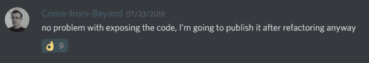

Come-from-Beyond statement exposing the code base

[](https://github.com/jhab82/ict-0.1.1_jhab82) [## jhab82/ict-0.1.1_jhab82

### ict-0.1.1_jhab82 -用 CFR 在线 java 反编译器反编译 ict-0.1.1

github.com](https://github.com/jhab82/ict-0.1.1_jhab82) 

当我们开始对 **ICT** 0.1.1 进行 alpha 测试时，虽然我的 **ICT** 至少连接了 4 个邻居 **IRI** 节点，但在某些阶段它并没有真正处于活动状态。我说的主动是指我的 ICT 几乎不会对邻居说闲话。

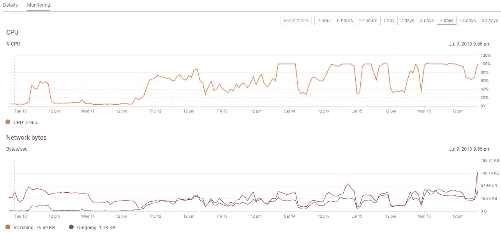

7 days ICT performing on the f1-micro cloud instance. The first 2–3 days almost no outbound Tx as of invalid transaction getting gossiped.

为了分析原因，我们需要了解 **ICT** 逻辑停止向其邻居发送**UDP**(**U**ser**D**atagram**P**rotocol)数据包的原因。

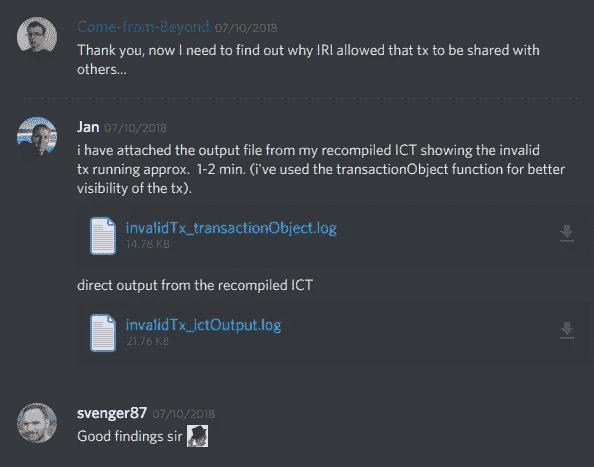

Sharing the analysis on DISCORD #ICT channel

我发现无效发送计数器在每个时期都是活动的(在 **ICT** 复位并重新开始之前的每分钟处理)。检查逻辑 **IRI** 节点( **ICT** 连接到)被忽略，一旦 **ICT** 发现无效 Tx，则进一步共享其 Tx。

这意味着根据识别出无效 Tx 的时间，不发送 Tx。在我们的例子中，在一个时期中已经过了几秒钟之后，出现无效的 Tx。这导致几乎没有出站流量

在重新编译了`Trasaction.java` 并在该类中添加了一些允许我检查 Tx 为什么无效的行之后，我得出结论，所有的无效都是由比

通过使用下面的命令，我们获得了人类可读格式的时间戳。

```
$date -d @1508760000
**Mon Oct 23 12:00:00 UTC 2017**
```

我在下面的命令上面添加了一个`if`语句

```
System.out.println(Converter.trytes(trits,0,8019));
```

并且能够检索到无效的 Tx，这使得 **ICT** 停止了闲聊。原来这一次臭名昭著的`FPS`捆绑包让 **ICT** 停止了八卦

```
BUNDLE: FPSJJPZO9LGRIZLLHTNCBEELJHKJSPXJDXLFGKPTTTXZMAZZNKIXHQTTOPURGGVLKNZVAS9FTCUFUIMB9
```

 [## 捆绑包 fpsjjpzo 9 lgrizllhtncbeeljhkjspxjdxlfgkptttxzmazznkixhqttopurggvlknzvas 9 ftcuuimb 9

### 编辑描述

thetangle.org](https://thetangle.org/bundle/FPSJJPZO9LGRIZLLHTNCBEELJHKJSPXJDXLFGKPTTTXZMAZZNKIXHQTTOPURGGVLKNZVAS9FTCUFUIMB9) 

查看事务对象(您可以通过使用`iota.utils.transactionObject(TxInTrytes)`将 trytes 转换为下面的表示来更好地了解事务)

```
{ hash: 'ZQNFEEIHXB9LEHAUDYMEDQCKA9CGYHIYORBYJTZ9XUDULKWAE9KDBXG9DVQEHPMFWZRUEKDVXJLCA9999',
  signatureMessageFragment: 'KTCNPN...(shortened)...UOZ',
  address: 'JNYEGRFRQQNYQNMJV9YRPRWMEGBZYLNHURIGEGQWF9AISLMQEUZOEBDBQYETETKEBLUQNGVAOGWXHQKEY',
  value: 0,
  obsoleteTag: '999999999999999999999999999',
 ** timestamp: 1507219591,**
  currentIndex: 2,
  lastIndex: 3,
  bundle: 'FPSJJPZO9LGRIZLLHTNCBEELJHKJSPXJDXLFGKPTTTXZMAZZNKIXHQTTOPURGGVLKNZVAS9FTCUFUIMB9',
  trunkTransaction: 'NEJKMDKIPBRISDEXICIXGMNCGTV9NGKLMPNIOUWESVIIUQFOEQQHZEENBWFWLAIFREZBYRNJWOISZ9999',
  branchTransaction: 'SIQJAMJKQISZGI9J9JAKFSGVLAPLMMBVJEXLSQLLEZQTIKQPQTBZ9JFIARRFKRMLMXZNQUVEFJYEA9999',
  tag: '999999999999999999999999999',
  attachmentTimestamp: 1531119376226,
  attachmentTimestampLowerBound: 0,
  attachmentTimestampUpperBound: 12,
  nonce: 'BFA999GC99IPA99999999999999' }
```

如上所述，此 Tx 的时间戳在允许的时间戳之前，允许的时间戳会抛出错误并从那一刻起忽略此节点。

```
$ date -d @1507219591
Thu Oct  5 16:06:31 UTC 2017
```

这是通过检查邻居的无效事务计数器是否超过零来实现的。如果是这种情况，则再次进入 while 循环(由`continue;`实现)

```
101  if (neighbor2.numberOfInvalidTransactions != 0) {
102      continue;
103  }
```

并且这是计数器增加到 1 的地方(计数器不会超过 1，因为循环像上面的语句一样被中断。)

Snippet of ICT.java where neighbors with invalid Tx got ignored in the epoch

看一下`FPS`包，它显然是在 10 月 5 日发行的，直到现在仍然有重新连接。在某个点上，捆绑包停止重新连接，并且 **ICT** 无效 Tx 计数器保持为 0，网络再次变得健康。

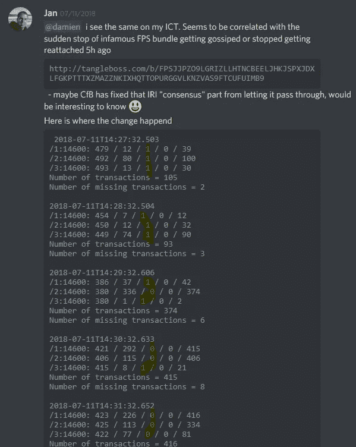

Yellow marked the invalid Tx counter getting 0 again after the FPS stopped getting reattached

这就给我们留下了疑问，为什么 **IRI** 首先会通过那些无效的 Tx。在我看来，这些问题的答案应该在 IRI 的源代码中找到。

前往[https://github.com/iotaledger/iri](https://github.com/iotaledger/iri)并在代码库中搜索`Timestamp`——我们希望找出 **IRI** 根据时间戳决定忽略事务的地方。

经过一些尝试(目前没有可用的代码文档)，我找到了类`TransactionValidator.java`。下面是布尔函数`hasInvalidTimestamp(TransactionViewModel transactionViewModel)`一旦交易时间戳满足列出的标准，返回 true，其中之一是它需要大于`snapshotTimestampMs`

```
**return transactionViewModel.getAttachmentTimestamp() < snapshotTimestampMs**                || transactionViewModel.getAttachmentTimestamp() > System.currentTimeMillis() + MAX_TIMESTAMP_FUTURE_MS;
```

哪个是根据`IOTA.java`

```
long snapshotTimestamp = configuration.longNum(Configuration.DefaultConfSettings.SNAPSHOT_TIME);
```

而`Configuration.java`此刻

```
public static final String GLOBAL_SNAPSHOT_TIME = "1531148400";
```

但是这并没有告诉我们所有时间戳较低的事务都应该被 IRI 忽略。

我们在`Node.java`中找到一个函数`preProcessReceivedData(...)`，它应该预处理来自其邻居的输入事务。它循环通过所有邻居 IP，并且仅在发送者的 IP 地址`senderAddress`匹配邻居的 IP 时才继续。该步骤实际上忽略了来自其他 IP 的所有要进一步处理的传入数据包。然后是一些随机丢弃的交易——还不知道目的。

在那之后的`try {}` 声明

*   从事务消息中创建散列
*   检查交易最近是否被看过`recentSeenBytes`

只有当事务没有被缓存时，事务才会被验证。对象`TransactionModel`被创建，然后进入验证运行，一旦事务的时间戳早于`GLOBAL_SNAPSHOT_TIME`，我们之前的异常将被抛出。这个例外状况会被拦截

```
} catch (final TransactionValidator.StaleTimestampException e) {
```

并增加该邻居的`numberOfInvalidTransaction++`。

[](https://github.com/iotaledger/iri/blob/d59de9fbaa2432a7123d9a4d65a1555241fcd934/src/main/java/com/iota/iri/network/Node.java) [## iota 分类账/iri

### 参考实现

github.com](https://github.com/iotaledger/iri/blob/d59de9fbaa2432a7123d9a4d65a1555241fcd934/src/main/java/com/iota/iri/network/Node.java) 

整个验证和预处理是通过实际事务的散列来处理的。当`runValidation`抛出时间戳异常时，该事务应该从事务队列中删除，以便进一步处理:

```
transactionRequester.clearTransactionRequest(receivedTransactionHash);
```

显然，Tx 首先不应该被发送，这通过 **IRI** 中的实现是显而易见的。我仍然不知道这个 bug 在哪里。这可能有许多原因，但一个可能的解释是错误的交易没有从队列中删除，因此被进一步处理。另一种可能是`preProcessReceiveData`被绕过。

由于我仍然没有完整的节点积极参与到这个问题中，所以我无法调试这种情况。我想我会把这个问题留到下次——也许在下一个 **IRI** 版本中已经解决了，或者它实际上不是一个 bug 而是一个特性😅

**总结一下:**我已经看过了 **ICT** 和 **IRI** java 代码，对这两种实现的机制有了更多的理解——特别是在识别无效交易方面。

当 **ICT** 向其邻居闲聊有效事务时，它会在 60 年代的剩余时间里忽略具有无效事务的邻居。这导致 **ICT** 在测试阶段 0.1.1 的一段时间内表现很差(就不八卦 Tx 而言),因为事务一直通过带有无效时间戳的 **IRI** 。

CfB 本人证实，那些 Tx 不应该被 **IRI** 分享，我在上面的文章中试图找到原因。不幸的是，我不能完全找出原因，但概述了问题，并深入到代码中应该排除它的地方。

## ICT 的下一步是什么

如前所述，ict-0.1.1 的测试已经停止，第二个测试阶段也随之宣布。

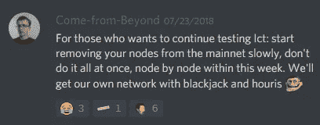

Screen from Discord

第二测试阶段显然不应有任何与信通技术相连的 IRI 节点，而应只有与信通技术相连的信通技术。交易结构将会改变，只有验证该结构的 ICT 参与者才能参与。这听起来像是我们在测试经济整合的概念。这里，网络参与者处于独立于 ICT 的集群中，但仍通过互联网处理他们的交易。

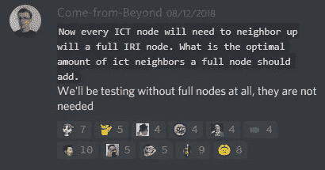

什么时候？目前还不是很清楚。首先需要调整最终 IOTA Tx 结构，然后需要更改 ICT 代码，特别是`Transaction.java`。

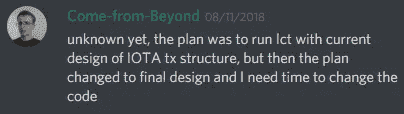

除了新的 Tx 结构，CfB 还想测试垃圾邮件发送者对网络的干扰。他将提供一个 java 垃圾邮件发送器，然后用于扰乱网络(甚至 FPGA F **现场可编程门阵列**家伙也应该加入聚会。)

最后是一些建议，哪些攻击交易最有可能通过 ICT 的保护。**非常期待前进。要了解 CfB 在这里谈论的是哪种保护👌**

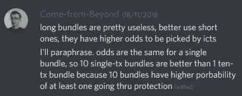

最初，我猜想 ICT 的第二测试阶段应该在主网上继续进行，但是对于 Roman Semko 的流行节点软件(Hercules)的自动共享功能(Nelson)是否会潜在地干扰网络性能存在争议。

如果我没理解错的话，罗曼想出了一个解决方案，他四处打听邻居，想把 Node 连接到哪里。

*对于每个人来说，运行自己的节点来手动设置邻居是一个更大的难题。如果没有邻居，你就无法接收网络的交易，也根本无法支持这种纠结。罗曼很早就明白了这种麻烦，他实现了一种自动功能，让邻居按照一定的标准进行轮换。最重要的是，你不必知道其他节点运营商，也不需要 disrupt，只需要在#nodesharing 下问一问，谁想把你添加为邻居。*

为什么这个功能不是设计意图在正式的 IOTA 常见问题解答中解释。

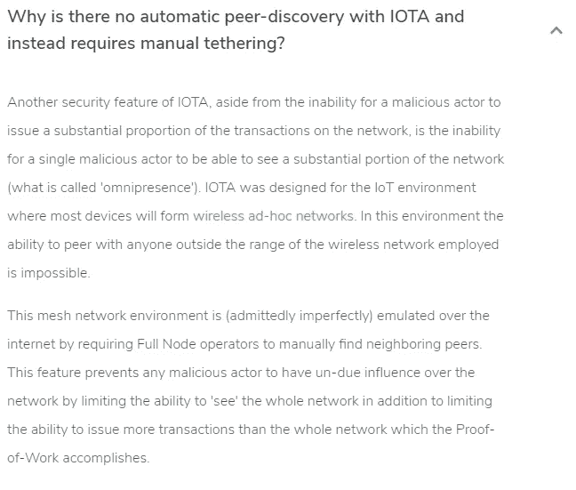

Screen from IOTA official FAQ

注意，IOTA 本身已经在 2016 年尝试了自动共享(对等点发现)，但由于相同的已解释的缺点而终止

[](https://forum.iota.org/t/discussion-removing-peer-discovery/939) [## 讨论:删除对等发现

### 过去几周，我们推出了 Peer Discovery，旨在让 IOTA 更易于人类使用。现在……

forum.iota.org](https://forum.iota.org/t/discussion-removing-peer-discovery/939) 

说到 ICT，我猜 CfB 喜欢启用一个限制流入 Txs 的功能。

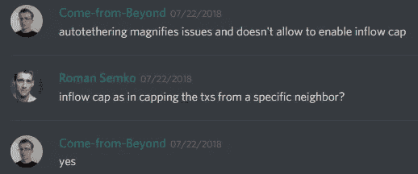

由于一篇有趣的复杂论文，有一些关于网络拓扑在无线网络设置中应该是什么样子的证明(我试图阅读并理解这篇论文证明了什么，但我无法通过第一张图片)。据我所知，他们已经研究了*平均一致性算法*——如果网络拓扑保持不变且简单，离散数量的测量节点会更好地收敛于关于其平均测量值的一致性。


[https://www3.nd.edu/~mhaenggi/pubs/jstsp11.pdf](https://www3.nd.edu/~mhaenggi/pubs/jstsp11.pdf)

看来罗曼的对等点发现应用短期内不会停止，而且大部分网络参与者都是通过互联网上的自动共享来连接的，这样一来，tangle main net——ICT 的第二个测试阶段就转移到了它自己的网络上。

为了排除自动共享**带来的任何干扰，ICT** 需要自己的网络，而这个网络应该是未来物联网世界的最佳代表。该网络将基于唯一的交易模型结构，其将排除任何主网络 Tx。

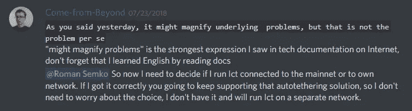

此外，对于**EC(E**economic**C**光彩)和无线自组织网络，也有一些看法，因为后者将有 **NBPoW (N** 网络 **B** 环绕 **P** 屋顶 **W** 工作)来保护它。在物联网环境中，只有无线网络覆盖范围内的设备才能进行对等通信。

如果你继续关注 CfB 过去的对话以及他对这个 PoW *的实现，“一个节点在某个时间间隔内占据某个范围的 EM 频谱的能力就是一种反 Sybil 措施。频谱是非常稀缺的资源(@FCC 可以确认)……”*

**ICT** 的目的和功能变得更加明确了。

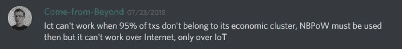

这里的前两篇文章是 **ICT** side exploration:

[](/coinmonks/exploring-iota-ict-1-running-ict-on-a-cloud-computer-bc3d96b246ea) [## 探索 IOTA #ICT-1，在云计算机上测试 ICT

### IOTA 受控代理(ICT)已在官方 discord 渠道发布测试。我会告诉你如何运行…

medium.com](/coinmonks/exploring-iota-ict-1-running-ict-on-a-cloud-computer-bc3d96b246ea) [](/coinmonks/exploring-iota-ict-2-reverse-engineering-the-code-1-ecda56d4908) [## 探索 IOTA ICT，逆向工程代码第 1 部分

### 我们探索如何在公开的基于 web 的 java 反编译程序的帮助下反编译 java 源代码。然后…

medium.com](/coinmonks/exploring-iota-ict-2-reverse-engineering-the-code-1-ecda56d4908) 

如果你喜欢自己探索 IOTA，你可以从这里开始你的第一笔自助交易。

[](/coinmonks/exploring-iota-1-getting-a-linux-terminal-on-cloud-google-com-and-sending-a-transaction-d7b9f1ce100a) [## 探索 IOTA # 1——在 google cloud 上获得一个 linux 终端并发送一个事务

### 这篇文章应该给你，不管你的工具和硬件，获得第一手的交易…

medium.com](/coinmonks/exploring-iota-1-getting-a-linux-terminal-on-cloud-google-com-and-sending-a-transaction-d7b9f1ce100a) 

期待大家的评论、质疑和指正👍

干杯，
陈安

> [在您的收件箱中直接获得最佳软件交易](https://coincodecap.com/?utm_source=coinmonks)

[](https://coincodecap.com/?utm_source=coinmonks)