# 用 Zeppelin 库(ERC721)探索不可替换令牌

> 原文：<https://medium.com/coinmonks/exploring-non-fungible-token-with-zeppelin-library-erc721-399cb180cfaf?source=collection_archive---------0----------------------->

# 概观

代币大体上可以分为两类:可替代代币和不可替代代币。有很多好文章都在讲区别。这里我只是用简单的例子。我们可以把**代用币**看作日常使用的硬币。如果我昨天向你借了一块钱，今天还给你一块钱，并不要求是同一个硬币，你也很高兴拿回一块钱，没有检查它实际上是你给我的硬币。它是可替换的令牌。对于**不可替代代币**，每个代币都有其独特的特征(颜色、大小、重量、序列号，或者只是一个描述)。一个很好的例子是，如果我们把一只宠物当作纪念品，你不会接受取回一只与我昨天向你借的宠物不同的宠物。每只宠物都是独一无二的。

我最近读了一篇由 CipherZ ( [链接](/coinmonks/a-simple-erc-721-example-c3f72b5aa19))发表的好文章，展示了一个简单的 ERC-721 例子。在本文中，有一个使用 Zeppelin 库的简单令牌契约 *MyERC721.sol* 。我采用本文的第一部分，并且不使用本文中的测试步骤。相反，我使用 Go Ethereum (geth)客户端与部署的契约进行交互，并观察这些函数是如何被调用的。

这个部署是通过 Truffle 框架和一个运行在本地主机上的以太坊模拟器来完成的。包含两部分:**部署 MyERC721 令牌契约**和**与 MyERC721 令牌**交互。

# 部署 MyERC721 令牌协定

这包括以下步骤

*   构建松露环境和契约代码
*   启动以太坊模拟器(ganache-cli)
*   部署 MyERC721 合同
*   设置 Geth 控制台以访问已部署的合同

## 构建松露环境和契约代码

遵循原始文档中显示的说明。

步骤 1:创建一个项目目录并初始化 Truffle 环境。创建目录结构。

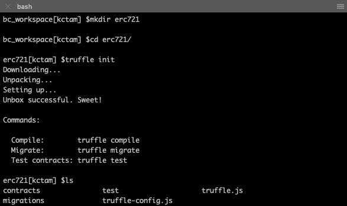

步骤 2:初始 npm 和安装 zeppelin 依赖项(已截断)

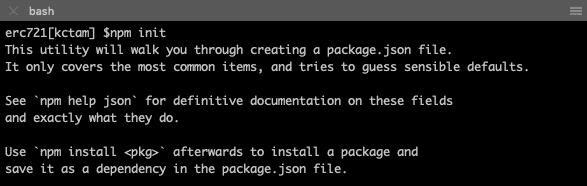

接受所有默认答案，在 npm init 之后，我们看到一个文件 *package.json* 。

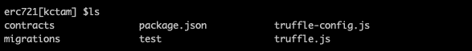

安装 Zeppelin 库。安装后，我们看到一个新的目录 *node_modules* 和 *zeppelin-solidity* 已经安装好了。

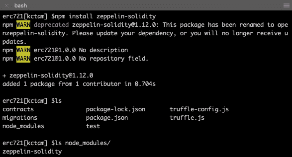

第三步:修改 *truffle.js* 以包含本地主机以太坊模拟器。

```
module.exports = {
  networks: {
   development: {
    host: '127.0.0.1',
    port: 8545,
    network_id: '*'
   }
  }
};
```

第四步:在 */migrations* 目录下添加 *2_erc721_migration.js* 。

```
const MyERC721 = artifacts.require("./MyERC721.sol");module.exports = async function(deployer) {
  await deployer.deploy(MyERC721, "MyERC721 Token", "MyERC721")
  const erc721 = await MyERC721.deployed()
};
```

请注意，这是我们稍后运行 **truffle migrate** 时的实际部署。构造函数(我们稍后会看到)需要两个参数:名称和符号。原文章中使用了相同的名称。在这里，我修改它，使名称和符号是不一样的。

第五步:在/contracts 目录下添加 *MyERC721.sol* 契约。

```
pragma solidity ^0.4.23;import "../node_modules/zeppelin-solidity/contracts/token/ERC721/ERC721Token.sol";contract MyERC721 is ERC721Token {
    constructor (string _name, string _symbol) public
        ERC721Token(_name, _symbol)
    {
    }/**
    * Custom accessor to create a unique token
    */
    function mintUniqueTokenTo(
        address _to,
        uint256 _tokenId,
        string  _tokenURI
    ) public
    {
        super._mint(_to, _tokenId);
        super._setTokenURI(_tokenId, _tokenURI);
    }
}
```

合同代码的快速注释:

*   合同 *MyERC721* 正在使用 *ERC721Token*
*   *MyERC721* 的构造函数需要两个参数:名称和符号
*   一个新的函数是 *mintUniqueTokenTo()* 被定义在 *ERC721Token* 的库之上。需要三个参数:将拥有这个新生成的令牌的帐户地址、这个令牌的标识符(记住这是不可替换的令牌，它有一个唯一的令牌 ID)和一个关于这个令牌的描述字符串(URI)。
*   执行 *mintUniqueTokenTo()* 时调用两个函数。它们是内部函数: *_mint()* 创建一个新的令牌，以及 *_setTokenURI()* 为这个令牌设置 TokenURI。
*   虽然我们可以根据用例添加更多有意义的函数，但目前 *mintUniqueTokenTo()* 对于演示公共函数已经足够好了。

## 启动以太坊模拟器(ganache-cli)

步骤 6:这里我们使用 *ganache-cli* 。其他的 ganache 也可以，只要 RPC 在 [http://localhost:8545](http://localhost:8545) 上，这个我们之前在 *truffle.js* 里设置过。

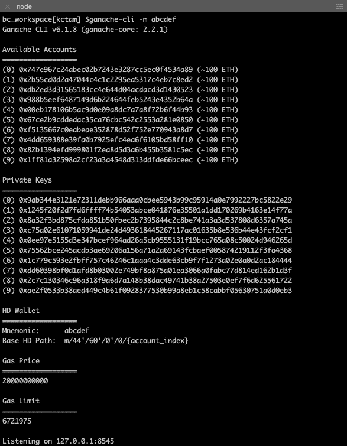

请注意，启动 ganache-cli 时使用了助记符。这只是为了保持相同的 10 个帐户。它可以用任何助记符或不用助记符。

## 部署 MyERC721 令牌协定

第七步:先用 Truffle Compile 编译 MyERC721 契约。

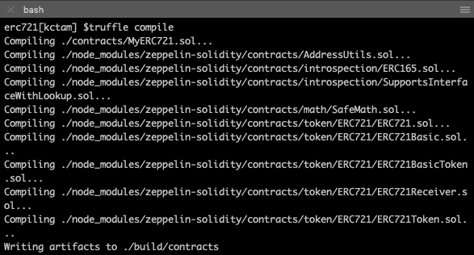

我们得到一些想法，ERC721Token 是建立在许多其他 ERC721 合同之上的。一些包含函数的定义，而另一些实现函数。

步骤 8:使用 Truffle Migrate 部署(或迁移)MyERC721 契约。

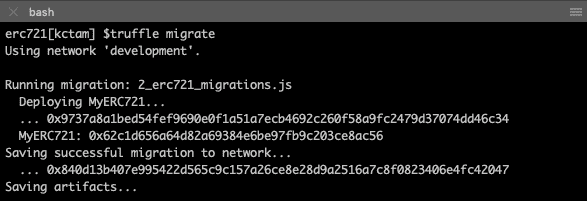

注意，我们现在已经在以太坊模拟器中部署了 MyERC721 契约**。合同地址为 0x 62 C1 d 656 a 64d 82 a 69384 E6 be 97 fb9 c 203 ce 8 AC 56。我们将在与这个已部署的契约交互时使用它。**

## **设置 Geth 控制台以访问已部署的合同**

**与部署的 MyERC721 的交互是通过 Go Ethereum (geth)控制台完成的。**

**步骤 9:使用 geth attach 通过 RPC 访问以太坊模拟器。**

**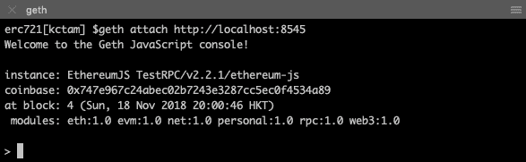**

**为了访问这个部署的契约，需要两条信息:应用程序二进制接口(ABI)和契约地址。在上一步中我们有后者。ABI 可以在文件*/build/contracts/myerc 721 . JSON*里面获得。这是字符串格式的 ABI。**

```
[ { "constant": true, "inputs": [ { "name": "_interfaceId", "type": "bytes4" } ], "name": "supportsInterface", "outputs": [ { "name": "", "type": "bool" } ], "payable": false, "stateMutability": "view", "type": "function" }, { "constant": true, "inputs": [], "name": "name", "outputs": [ { "name": "", "type": "string" } ], "payable": false, "stateMutability": "view", "type": "function" }, { "constant": true, "inputs": [ { "name": "_tokenId", "type": "uint256" } ], "name": "getApproved", "outputs": [ { "name": "", "type": "address" } ], "payable": false, "stateMutability": "view", "type": "function" }, { "constant": false, "inputs": [ { "name": "_to", "type": "address" }, { "name": "_tokenId", "type": "uint256" } ], "name": "approve", "outputs": [], "payable": false, "stateMutability": "nonpayable", "type": "function" }, { "constant": true, "inputs": [], "name": "totalSupply", "outputs": [ { "name": "", "type": "uint256" } ], "payable": false, "stateMutability": "view", "type": "function" }, { "constant": true, "inputs": [], "name": "InterfaceId_ERC165", "outputs": [ { "name": "", "type": "bytes4" } ], "payable": false, "stateMutability": "view", "type": "function" }, { "constant": false, "inputs": [ { "name": "_from", "type": "address" }, { "name": "_to", "type": "address" }, { "name": "_tokenId", "type": "uint256" } ], "name": "transferFrom", "outputs": [], "payable": false, "stateMutability": "nonpayable", "type": "function" }, { "constant": true, "inputs": [ { "name": "_owner", "type": "address" }, { "name": "_index", "type": "uint256" } ], "name": "tokenOfOwnerByIndex", "outputs": [ { "name": "", "type": "uint256" } ], "payable": false, "stateMutability": "view", "type": "function" }, { "constant": false, "inputs": [ { "name": "_from", "type": "address" }, { "name": "_to", "type": "address" }, { "name": "_tokenId", "type": "uint256" } ], "name": "safeTransferFrom", "outputs": [], "payable": false, "stateMutability": "nonpayable", "type": "function" }, { "constant": true, "inputs": [ { "name": "_tokenId", "type": "uint256" } ], "name": "exists", "outputs": [ { "name": "", "type": "bool" } ], "payable": false, "stateMutability": "view", "type": "function" }, { "constant": true, "inputs": [ { "name": "_index", "type": "uint256" } ], "name": "tokenByIndex", "outputs": [ { "name": "", "type": "uint256" } ], "payable": false, "stateMutability": "view", "type": "function" }, { "constant": true, "inputs": [ { "name": "_tokenId", "type": "uint256" } ], "name": "ownerOf", "outputs": [ { "name": "", "type": "address" } ], "payable": false, "stateMutability": "view", "type": "function" }, { "constant": true, "inputs": [ { "name": "_owner", "type": "address" } ], "name": "balanceOf", "outputs": [ { "name": "", "type": "uint256" } ], "payable": false, "stateMutability": "view", "type": "function" }, { "constant": true, "inputs": [], "name": "symbol", "outputs": [ { "name": "", "type": "string" } ], "payable": false, "stateMutability": "view", "type": "function" }, { "constant": false, "inputs": [ { "name": "_to", "type": "address" }, { "name": "_approved", "type": "bool" } ], "name": "setApprovalForAll", "outputs": [], "payable": false, "stateMutability": "nonpayable", "type": "function" }, { "constant": false, "inputs": [ { "name": "_from", "type": "address" }, { "name": "_to", "type": "address" }, { "name": "_tokenId", "type": "uint256" }, { "name": "_data", "type": "bytes" } ], "name": "safeTransferFrom", "outputs": [], "payable": false, "stateMutability": "nonpayable", "type": "function" }, { "constant": true, "inputs": [ { "name": "_tokenId", "type": "uint256" } ], "name": "tokenURI", "outputs": [ { "name": "", "type": "string" } ], "payable": false, "stateMutability": "view", "type": "function" }, { "constant": true, "inputs": [ { "name": "_owner", "type": "address" }, { "name": "_operator", "type": "address" } ], "name": "isApprovedForAll", "outputs": [ { "name": "", "type": "bool" } ], "payable": false, "stateMutability": "view", "type": "function" }, { "inputs": [ { "name": "_name", "type": "string" }, { "name": "_symbol", "type": "string" } ], "payable": false, "stateMutability": "nonpayable", "type": "constructor" }, { "anonymous": false, "inputs": [ { "indexed": true, "name": "_from", "type": "address" }, { "indexed": true, "name": "_to", "type": "address" }, { "indexed": true, "name": "_tokenId", "type": "uint256" } ], "name": "Transfer", "type": "event" }, { "anonymous": false, "inputs": [ { "indexed": true, "name": "_owner", "type": "address" }, { "indexed": true, "name": "_approved", "type": "address" }, { "indexed": true, "name": "_tokenId", "type": "uint256" } ], "name": "Approval", "type": "event" }, { "anonymous": false, "inputs": [ { "indexed": true, "name": "_owner", "type": "address" }, { "indexed": true, "name": "_operator", "type": "address" }, { "indexed": false, "name": "_approved", "type": "bool" } ], "name": "ApprovalForAll", "type": "event" }, { "constant": false, "inputs": [ { "name": "_to", "type": "address" }, { "name": "_tokenId", "type": "uint256" }, { "name": "_tokenURI", "type": "string" } ], "name": "mintUniqueTokenTo", "outputs": [], "payable": false, "stateMutability": "nonpayable", "type": "function" } ]
```

**步骤 10:定义变量 abi(截断)**

**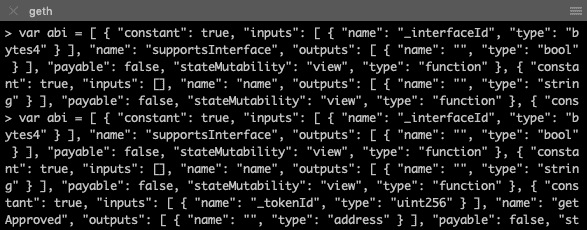**

**步骤 11:访问已部署的合同**

**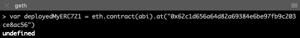**

**现在我们有了对象 *deployedMyERC721* ，这是已部署的契约。当我们查看它包含的内容时，只需键入 *deployedMyERC721* ，它包含 ABI、地址，最重要的是， *deployedMyERC721* 可以访问的许多函数(或方法)。**

**这里是 *deployedMyERC721* 的底部，我们可以看到功能。**

**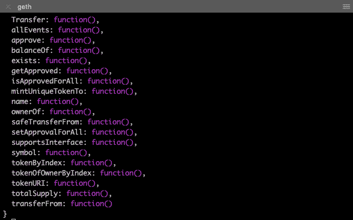**

# **与 MyERC721 令牌交互**

**我们首先创建一个初始状态。它可以是任何东西，所以我们只是创建这个简单的场景。**

***以太坊账户的作用***

**Ganache-cli 自带 10 个以太坊账号。这里 eth.accounts[0]是部署 MyERC721 的帐户。当新令牌被“铸造”时，它被发送到其他帐户(例如，eth.accounts[1]、eth.accounts[2]等)。)**

***令牌表***

**我们最初铸造了三个令牌，令牌 ID #1、#2 和#3，每个令牌都有一个 URI 作为描述。令牌#1 和#2 被分配给 eth.accounts[1]，而令牌#3 被分配给 eth.accounts[2]。**

**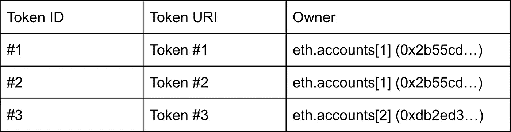**

**我们将完成以下步骤**

*   **检查已部署合同的信息(创建前)**
*   **铸造代币并分配给所有者**
*   **令牌生成后检查信息**
*   **简单令牌传输**
*   **高级令牌传输:批准**

## **检查已部署合同的信息(创建前)**

**步骤 12:检查名称和符号。请注意，名称和符号是在部署(迁移)合同时给出的。**

**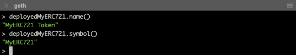**

**步骤 13:检查是否有代币发行，即代币的总供应量**

**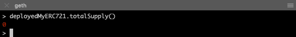**

## **铸造令牌并分配给所有者**

**我们调用的函数是 mintUniqueTokenTo()，给出所有者、令牌 ID 和令牌 URI。该命令是从 eth.accounts[0]发出的。**

**步骤 14:根据我们的设计发行三个代币。**

**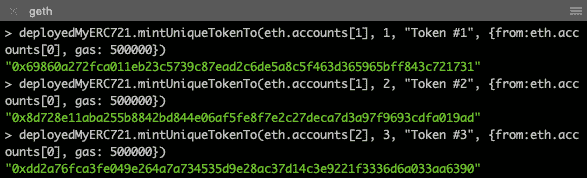**

## **令牌生成后检查信息**

**我们可以调用几个函数来观察当前状态。**

**步骤 15:检查令牌的总供应量**

**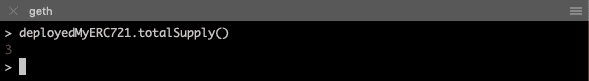**

**正如所料，我们现在有三个令牌。**

**步骤 16:根据令牌 ID 检查令牌的详细信息。我们将首先检查令牌是否存在。**

**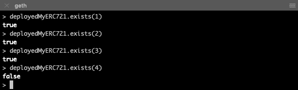**

**对于那些尚未生成的令牌 ID(例如令牌 ID 4)，该函数返回 false。**

**步骤 17:检查这些令牌的 URI**

**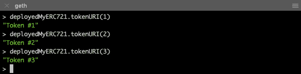**

**步骤 18:检查这些令牌的所有权**

**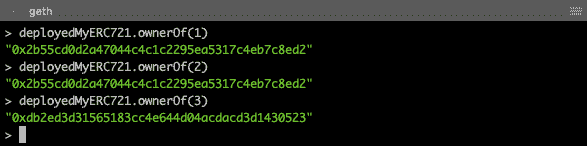**

**步骤 19:检查每个账户的余额**

**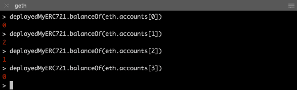**

**这里我们看到只有 eth.accounts[1]和[2]收到了令牌。**

## **简单令牌传输**

**我们将执行一个简单的令牌转移:令牌所有者将令牌转移到另一个帐户。在我们的示例中，eth.accounts[1]将令牌#2 转移到 eth.accounts[2]。**

**步骤 20:再次检查令牌#2 的所有权，以及 eth.accounts[1]和 eth.accounts[2]的余额**

**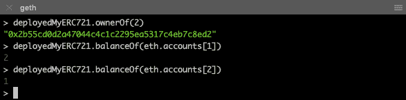**

**第 21 步:使用函数 *transferFrom()* 传递令牌。注意，这个函数是从 eth.accounts[1]调用的，它是令牌#2 的当前所有者。需要三个参数: *from* 、 *to* 和*token ID*。**

**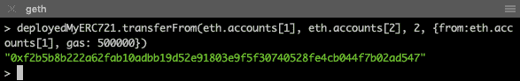**

**步骤 22:现在再次检查令牌#2 的所有者和两个帐户的余额。**

**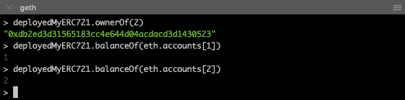**

**我们看到令牌已成功转移，帐户余额信息正确。**

**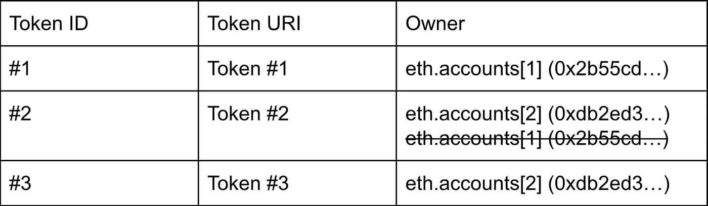**

## **高级令牌传输:批准**

**在前面的简单传输案例中，transferFrom()由令牌的所有者调用。存在第三方帐户调用函数 transferFrom()的情况。在这种情况下，在第三方帐户可以调用该功能之前，需要令牌所有者的批准。**

**假设在我们的例子中，eth.accounts[1]将批准 eth.accounts[0]将令牌#1 转移到 eth.accounts[2]。**

**第二十三步:不允许未审批的转账。在任何批准之前，eth.accounts[0]尝试调用 *transferFrom()* 来转移令牌#1(当前由 eth.accounts[1]拥有)，调用失败。**

**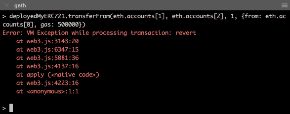**

**步骤 24:现在 eth.accounts[1]批准 eth.accounts[0]使令牌#1 可从 eth.accounts[0]转移。我们首先查看令牌#1 中是否有任何具有 *getApproved()* 的批准者。调用函数 *approve()* 后，我们再次检查。**

**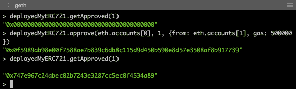**

**第 25 步:我们重复第 23 步。这次转移成功了。**

**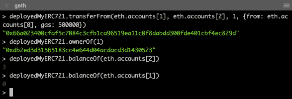******

# **摘要**

**Zeppelin 为创建不可替换的令牌(ERC721)提供了很好的库。在本文中，我们基于 Zeppelin 部署了一个非常简单的令牌，并观察了令牌是如何记录在契约中的，令牌是如何通过契约函数调用进行传输的，以及之后会发生什么。**

**还有一些功能可用。您可以使用此设置来探索它们。**

**再次感谢 CipherZ，我的工作建立在他的文章之上。以下是文章原文([链接](/coinmonks/a-simple-erc-721-example-c3f72b5aa19))。**

> **[直接在您的收件箱中获得最佳软件交易](https://coincodecap.com/?utm_source=coinmonks)**

**[](https://coincodecap.com/?utm_source=coinmonks)**