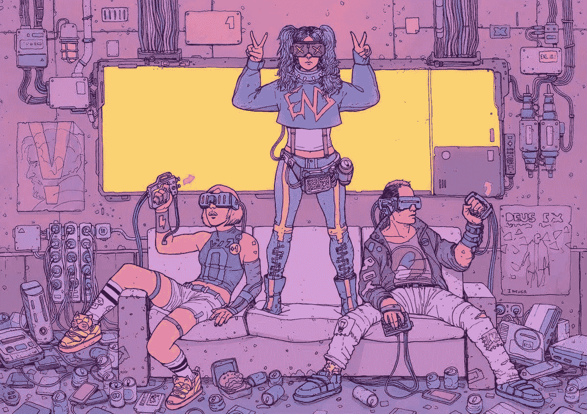
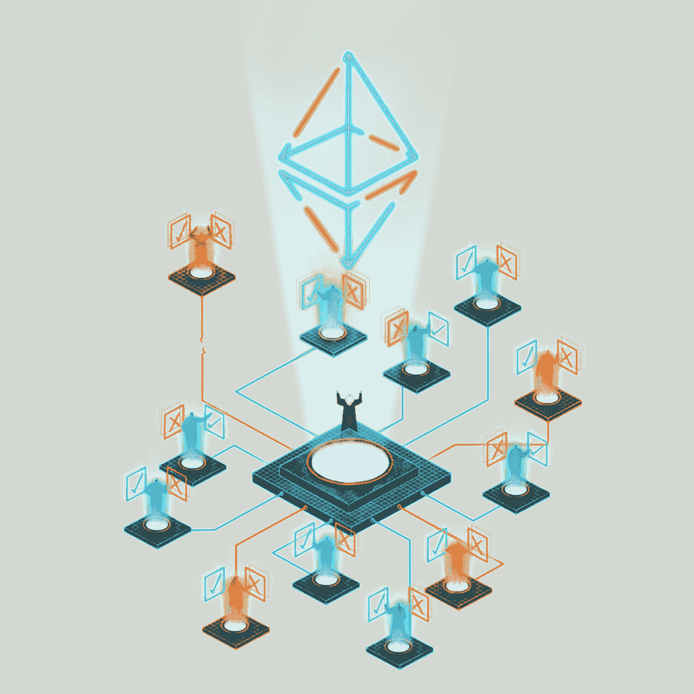

# 🚀探索 Web 3.0 —什么是 Dao(去中心化自治组织)？第一部分

> 原文：<https://medium.com/coinmonks/exploring-web-3-0-what-are-daos-decentralized-autonomous-organizations-part-1-8a7984e4eae3?source=collection_archive---------1----------------------->

Y O U T H I N T R O U B L E — deathburger || [https://www.reddit.com/r/Cyberpunk/comments/8qr1ww/y_o_u_t_h_i_n_t_r_o_u_b_l_e_deathburger/](https://www.reddit.com/r/Cyberpunk/comments/8qr1ww/y_o_u_t_h_i_n_t_r_o_u_b_l_e_deathburger/)

# 有一个新的互联网，它被称为“Web 3.0”

互联网是一种非常有趣的生物，我把它描述为一种生物，因为它一直在进化。首先是 Web 1(1990-2000)，标准网页。然后是 Web 2(2000-2010)，它给了我们社交媒体和亚马逊。现在我们在 Web 3 (2010 年至今)，它给我们带来了 NFTs 和分散自治组织(Dao)。

> 订阅 [**Coinmonks Youtube 频道**](https://www.youtube.com/c/coinmonks/videos) 获取每日加密新闻。

# D.答:Os

owned by: [https://ethereum.org/en/dao/](https://ethereum.org/en/dao/)

## 分解东西

你听说过没有 CEO 的公司/组织吗？那么，欢迎来到道斯的世界。

分散自治组织是一个由社区成员拥有和运营的集体实体**。资金存储在他们自己的金库中，并由智能合约管理，这意味着 Dao 不必依赖银行来存储他们的资金。该组织内没有核心权威人物。决策通过提案和投票来执行，这确保了所有者之间的公平和平等。允许每个人在道内都有发言权。**

## 当今流行的例子🔥

*   **无银行** —无银行 DAO 是一个分散的社区，通过媒体、文化和教育推动以太坊、比特币和 DeFi 等无银行货币系统的采用和认知。[https://www . bank less . community](https://www.bankless.community)
*   **MakerDao** —一个基于以太坊的协议，发行戴稳定币，并在没有中介的情况下促进抵押品支持的贷款(不需要银行和一堆法律东西的贷款)。[https://makerdao.com/en/](https://makerdao.com/en/)
*   **KilmaDao —** 碳支持的数字货币和算法气候协议(基本上是对抗气候变化)。[https://klimadao . finance](https://klimadao.finance)
*   在以太坊区块链上运行的一组协议，允许用户通过借贷和交易服务优化他们在加密资产上的收益。[https://向往.金融](https://yearn.finance)

# 那么这些东西是如何工作的呢？🤨

Dao 建立在所谓的**“智能契约”**之上。从根本上说，智能合约是一个运行在区块链上的计算机程序，一旦满足预定条件，它就会执行。将智能合同视为组织的章程。智能合同中设置的规则将管理实体。这就是为什么不需要管理委员会或第三方来促进信任和执行决策。

**DAOs 的一些优点**

*   它没有必要将资金存放在传统银行。这意味着他们可以避开任何阻碍他们开设银行账户的繁文缛节和监管，因为他们已经有了自己的银行(财政部)。
*   影响组织的决策不仅仅是由一小群人执行的。集体中的每个成员都有机会提出能够塑造整个组织的决策。

## **你如何加入一个？👀**

加入道一点都不难，其实谁都可以。我建议你在登机前准备好以下物品:

**Web3 钱包**—web 3 钱包是一种用于访问 web 3 Dapps(分散式应用程序)的工具。我建议您获取行业标准，即 MetaMask (https://metamask.io)

**Discord —** Discord 是一个流行的在线社区平台。你可以进行视频通话、音频通话以及所有基本的社交媒体活动。我建议您获取它，因为大多数 Dao 通常都是在平台上构建的。

如果你真的想深入事物，我推荐你加入无银行道。请直接访问他们的网站寻求指导

感谢阅读我的文章！😁✨.欢迎在下面我的 twitter 帖子上发表任何想法或问题。

> 加入 Coinmonks [电报频道](https://t.me/coincodecap)和 [Youtube 频道](https://www.youtube.com/c/coinmonks/videos)了解加密交易和投资

## 另外，阅读

*   [尤霍德勒 vs 科恩洛 vs 霍德诺特](/coinmonks/youhodler-vs-coinloan-vs-hodlnaut-b1050acde55a) | [Cryptohopper vs 哈斯博特](https://blog.coincodecap.com/cryptohopper-vs-haasbot)
*   [如何匿名购买比特币](https://blog.coincodecap.com/buy-bitcoin-anonymously) | [比特币现金钱包](https://blog.coincodecap.com/bitcoin-cash-wallets)
*   [AscendEx Staking](https://blog.coincodecap.com/ascendex-staking)|[Bot Ocean Review](https://blog.coincodecap.com/bot-ocean-review)|[最佳比特币钱包](https://blog.coincodecap.com/bitcoin-wallets-india)
*   [霍比审核](https://blog.coincodecap.com/huobi-review) | [OKEx 保证金交易](https://blog.coincodecap.com/okex-margin-trading) | [期货交易](https://blog.coincodecap.com/futures-trading)