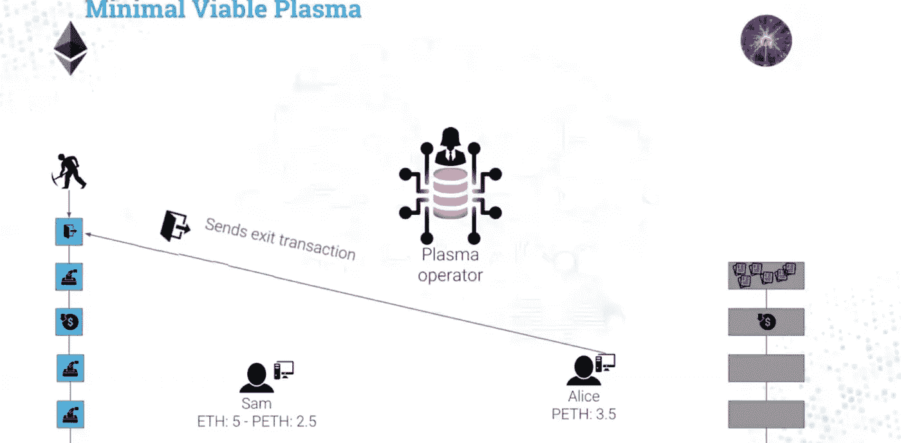

# 将血浆 MVP 表示为 Javascript —简单撤回

> 原文：<https://medium.com/coinmonks/express-plasma-mvp-as-javascript-simple-withdrawal-53f59bcced3?source=collection_archive---------2----------------------->

为了更好地理解我的研究，我将血浆 MVP 表示为 Javascript。MVP 是最小可行血浆，最初由 Vbuterin 提出，旨在以非常简化的方式提供血浆的基本安全属性。

基于这一提议， [OmiseGo 实施了 MVP](https://github.com/omisego/plasma-mvp) ，用于旨在未来使用等离子体的研究。我主要以这个实现作为参考。实际上，等离子提案的[白皮书](https://plasma.io/plasma.pdf)仍然是高度概述，还没有提到具体实施。我还参考了弗罗施的 youtube 视频。这是一个很好的了解等离子概述的视频。如果你还没看，我强烈推荐你看。

GitHub:[tak 1827/plasma-tx-flow](https://github.com/tak1827/plasma-tx-flow/tree/simple-withdrawal)

请注意，OmiseGo-MVP 与我的实现有 2 个不同之处。首先，出于简化的原因，我没有在子链中使用令牌。第二，某子连锁经营者以交易费作为激励。

## 分成 5 个步骤

我把整个过程分成几个步骤。

1.  *部署根链*
2.  *操作创建子链*
3.  *将乙醚沉积到根链上*
4.  *花费 UTXO*
5.  *撤回 UTXO*

## 1.部署根链


根 chin 是一个智能合同，因此它被部署到以太网。根链有 5 个主要功能。其中 4 个由 Vbuterin 定义为血浆的最小实现。请从[这里的](https://ethresear.ch/t/minimal-viable-plasma/426)检查各个功能的作用。(即使没有定义“finalizeExits ”,撤回资金也很重要)

```
operator.run(function() { // Rootchain
  // This is smart contract deployed to Ether main net.
  rootChain = new RootChain();
});class RootChain { constructor() {
    this.plasmaBlockHeaders = {}; // Child chain's block header.
    this.exits = {}; // List of withdraw tx
    this.value = 0; // Deposited ether
    ...
  } submitBlock(root) { ... } deposit() { ... } startExit(utxoPos, txBytes, proof, sigs) { ... } challengeExit(
    exitId, plasmaBlockNum, txindex, 
    oindex, tx, proof, confirmSig
  ) { ... } finalizeExits() { ... }
}
```

## 2.操作创建子链


操作员创建仅由该操作员操作的子链，因此该链是授权证明(POA)链。此链信任操作员的参与者。

当然，如果经营者进行任何恶意行为，每个参与者都可以提取他们存放的资金，经营者将受到惩罚。

根链有一个主要功能，即“添加块”。该函数将块添加到子链中。运营商的操作只是在这篇博文中添加了一个区块。

```
operator.run(function() { // Create child chain specifying operator as myself
  childChain = new ChildChain(this.address, rootChain);
});class ChildChain { constructor(operator, rootChain) {
    this.operator = operator;
    this.rootChain = rootChain;
    this.blocks = {}; // All blocks consisting child chain
    ...
  } addBlock(number, block, isDeposit) { ... }
}
```

本质上，血浆子链是一个树状结构。由于这种结构，等离子体链实现了极大的可扩展性。等离子可以非常快速和便宜地处理成千上万笔交易。但是树结构非常复杂，所以我将 child chain 描述为没有分支的单链。


## 3.将乙醚沉积到根链上


首先，Sam 构建了一个输出属于他自己的事务。数量为 5 乙醚。请注意，此事务将包含在子链中，以便 Sam 不会将此事务发送到根链。

出于可伸缩性的原因，根链只保存子链的头。标题包含两个项目，它们是块内事务的 merkle 根和时间戳。

在存款情况下，包括一个事务，因此 merkle 根等于事务散列。

在 Plasma 中，像 Ether 这样的基金资产被存储为 UTXO 模型(未用事务输出模型)。这不同于以太坊主网络，在以太坊主网络中，资产被存储为状态模型。UTXO 模型和比特币的闪电网一样。

UTXO 表示为以下格式。

> 块数* 1000000000 +交易指数* 10000 +产出指数

```
// Create transaction for child chain
sam.withdraw(5);
const tx1 = new Transaction(
  0, 0, 0, // No input
  0, 0, 0, // No input
  sam.address, 5, // Send 5Ether to himself
  0, 0,
  null, null,// No signature
  0.1 // Fee
);sam.run(function() {
  msg.value = tx1.amount1; // Confirm deposite target block
  const depositBlock = rootChain.deposit(); // Utxo for sam
  sam.utxos.push(encodeUtxoPos(depositBlock, 0, 0));
}); /************ Root Chian ************/deposit() {
  ... const tx = new Transaction(
    ... msg.sender, msg.value, ...); const root = tx.hash().toString('hex');
  const timestamp = Math.floor((new Date()).getTime()/1000);
  const depositBlock = this.getDepositBlock(); this.plasmaBlockHeaders[depositBlock.toString()] = 
    new PlasmaBlockHeader(root,timestamp); ... return depositBlock;
}class PlasmaBlockHeader {
  constructor(root, timestamp) {
    this.root = root;
    this.timestamp = timestamp;
  }
}
```


接下来，子链的操作者立即创建一个块来反映来自 Sam 的存放乙醚。运营商在加块过程中收取费用作为奖励。

```
operator.run(function() { // Tx1 is included this block
  let block = new Block([tx1]); block.sign(operator.privateKey);

  childChain.addBlock(childChain.getDepositBlock(), block, true);
}); /************ Child Chian ************/addBlock(number, block, isDeposit) {
  ... // Collect fee as incentive for operator
  this.accumulatedFee += this.collectFee(block.txs); this.blocks[number] = block;
  ...
}class Block {
  constructor(txs) {
    this.txs = txs;
    this.sig = null;
  }
}
```

## 4.消费 UTXO


Sam 构建了一个输出属于 Alice 的事务。请注意，这个事务输入是 Sam 的 UTXO。

```
// Use utxo of sam as transaction input
const sutxo = decodeUtxoPos(sam.utxos[0]);
sam.utxos.shift();let tx2 = new Transaction(
  sutxo.blknum, sutxo.txindex, sutxo.oindex,
  0, 0, 0,
  alice.address, // To alice
  tx1.amount1-tx1.fee, // Decrement amount by fee
  0, 0,
  null, null,
  1
);tx2.sign1(sam.privateKey);
```


接下来，操作员将包含 Sam 事务的块添加到子链中。

此时，Alice 不能使用该事务的输出。因为这个事务还没有包含到根链中。

```
operator.run(function() { sblock = new Block([tx2]);  sblock.sign(operator.privateKey); childChain.addBlock(childChain.nextChildBlock, sblock, false);

});
```


操作员将块提交给根链。根哈希是根据块内部的事务计算的。

```
// Merkle root
const tx2root = sblock.merkle()[0][0];// Operator submit block to root chain
operator.run(function() {
  tx2blknum = rootChain.submitBlock(tx2root);
});
```


Sam 注意到该事务包含在根链中。然后，他给爱丽丝发送确认签名。从现在起，爱丽丝可以使用收到的 UTXO。需要这份确认签字来提取她资金。

```
// Sam create confirmation sig
// And send to Alice
const confirmSigs = confirm(
  tx2.hash().toString('hex'), 
  tx2root,
  [sam.privateKey]
);// Utxo for alice
const tx2Index = 0;
const tx2Pos = encodeUtxoPos(tx2blknum, tx2Index, 0);
alice.utxos.push(tx2Pos);
```

## 5.撤回 UTXO



Alice 构建“sig”来证明“utxoIncludedTx”由包含来自 Sam 的确认签名的发送者确认。她构建“证据”来证明“utxoIncludedTx”包含在根链中。

她向根链发送退出事务。

```
alice.run(function() { // Build sigs to attest that tx is confirmed by sender
  const sigs = { 
    sig1: tx2.sig1,
    sig2: tx2.sig2,
    confirmSig1: confirmSigs[0],// Confirm sig from Sam
    confirmSig2: typeof confirmSigs[1] !== 'undefined' 
      ? confirmSigs[1] 
      : null
  }; // Build proof to attest that tx is included in root chain
  const levels = childChain.getBlock(tx2blknum).merkle();
  const proof = createMembershipProof(levels, tx2Index); // This transaction contain utxo for Alice
  const utxoIncludedTx = tx2.encoded(); this.utxos.shift();

  rootChain.startExit(tx2Pos, utxoIncludedTx, proof, sigs);});/************ Root Chian ************/startExit(utxoPos, txBytes, proof, sigs) {
  ... Assert(this.checkSigs(txHash, root, hasSig2, sigs), 
    "Signatures must match."); Assert(checkMembership(root, txHash.toString('hex'), proof),
    "Transaction Merkle proof is invalid.");
  ... this.addExitToQueue(utxoPos, msg.sender, 
    amount1 + amount2 - fee, createdAt);
}
```

在这种情况下，Alice 不接收退出的 UTXO。这个退出请求至少会被关注两周。在这 2 周内，有人会挑战这个出口。如果爱丽丝是恶意的，这个退出是欺诈，挑战者赢了，爱丽丝输了这个 UTXO。

```
addExitToQueue(utxoPos, exitor, amount, createdAt) {
  ... // Exit request is locked at least for 2 week.
  const exitableAt = Math.max(createdAt + w2, now + w1); this.exits[utxoPos] = new Exit(exitor, amount, exitableAt);
}
```

在退出时间锁定到期之后，如果 Alice 向根链发送退出完成事务，则她最终接收到 UTXO。

Alice 收到 3 份乙醚(5 份来自 Sam，2 份给操作员)

```
alice.run(function() {
   rootChain.finalizeExits();
});/************ Root Chian ************/finalizeExits() {
  ... // Alice receive Ether  
  user.transfer(Number(this.exits[nexKey].amount)); // Decliment deposited ether
  this.value -= exitAmount;
  ...
}
```

> [在您的收件箱中直接获得最佳软件交易](https://coincodecap.com/?utm_source=coinmonks)

[](https://coincodecap.com/?utm_source=coinmonks)