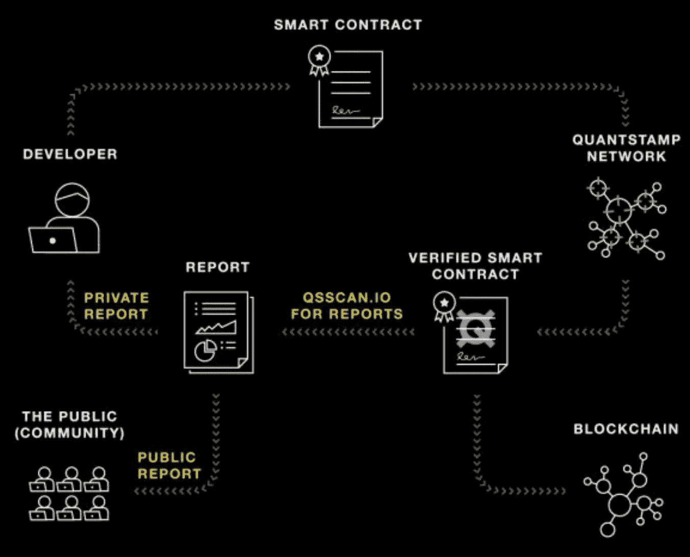
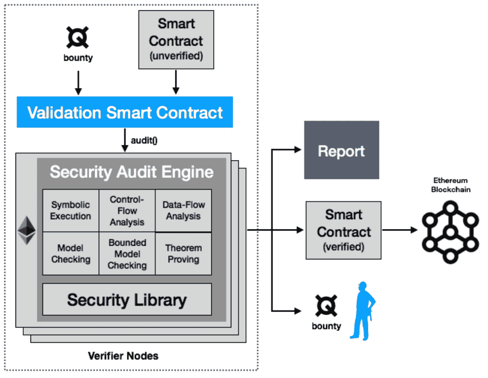
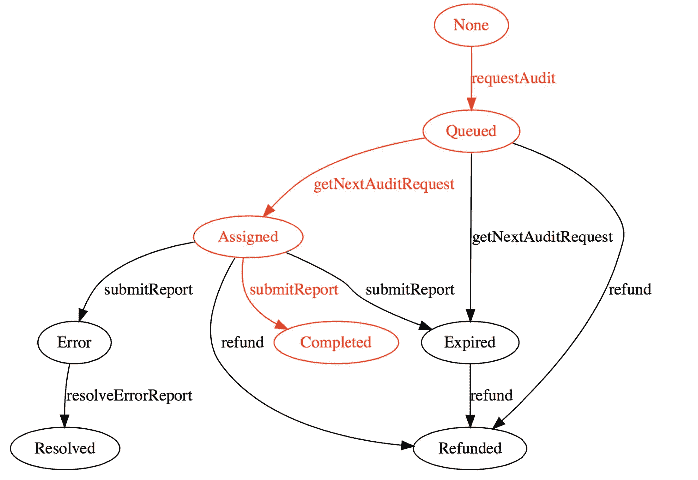

# 将 Quantstamp 合同表示为 javascript —审计已完成

> 原文：<https://medium.com/coinmonks/express-quantstamp-contracts-as-javascript-audit-completed-c53930cf7ed3?source=collection_archive---------2----------------------->

Quantstamp 是一个智能合同安全审计系统，具有可扩展性和成本效益。为了更好地理解，我将 Quantstamp 契约表示为 Javascript。更多信息请参考[白皮书](https://crushcrypto.com/wp-content/uploads/2017/10/QSP-Whitepaper.pdf)或[官方博客](/quantstamp/securing-smart-contracts-on-the-blockchain-a-technical-overview-of-the-quantstamp-betanet-protocol-f13dab2daa51)。

GitHub:[quant stamp-contracts-js](https://github.com/tak1827/quantstamp-contracts-js/tree/audit-completed)

## Quantstamp 简介

智能合约安全性对于防止类似 DAO 的安全事件至关重要。不幸的是，当前的智能合同验证过程需要人工专家，因此成本高昂且容易出错。Quantstamp 通过在以太网上构建审计系统解决了这个问题。



首先，开发者通过与 QST 令牌的 Quantstamp 合同提交他的代码，验证者将这些令牌作为奖励。验证器(由 Quantstamp 认证)接收提交的请求并执行安全检查。该检查是离线活动，由安全审计引擎完成。



这个引擎由几个组件组成，如安全库。该库不断发展以应对新漏洞。作为诽谤输出，引擎生成一个报告。验证器将报告添加到下一个以太坊块中。这种报告可以是公开的，也可以是秘密的。公共报告以人类可读的形式对每个人可见。私人报告是加密的。

## QST 状态转换



在审计过程中，有几种可能的状态，如上图所示。这次集中在红线过渡上。这个过渡是一个成功的过程，没有任何错误。让我们分成 3 个步骤

1.  *开发者请求审核*
2.  *验证器获取审计请求*
3.  *验证器提交报告*

## 1.开发者请求审计

一个开发者通过调用 QuantstampAudit.sol 的‘request audit’函数提交支付 10 QST 的‘Samp’契约进行验证，这个契约包含了审计过程的所有逻辑。

查看 requestAudit 函数的“requestId”。这是一个唯一的 id。

顺便说一下，请求存储在另一个名为“QuantstampAudit.sol”的契约中。这是一份仓储合同。

```
developer.run(function() { // Create a contract to be audit
  Samp = new Sample(); // Cost of verification
  const cost = 10; ... // Request audit
  requestId = QSTAudit.requestAudit(Samp.address, cost);});/********** QuantstampAudit.sol **********/requestAudit(contractUri, price) { ... const requestId = this.auditData.addAuditRequest(
    from, contractUri, price); // Add request to queue
  this.queueAuditRequest(requestId); return requestId;
}
```

请求的结构如下。

```
class Audit {
  ...
  {
    this.requestor = requestor;
    this.contractUri = contractUri;
    this.price = price;
    this.requestBlockNumber = requestBlockNumber;
    this.state = state;
    this.auditor = auditor;
    this.assignBlockNumber = assignBlockNumber;
    this.reportHash = reportHash;
    this.reportBlockNumber = reportBlockNumber;
    this.registrar = registrar;
  }
}
```

## 2.验证程序获取审计请求

验证程序调用“getNextAuditRequest”函数。然后，从队列中挑选一个审计。

请注意，获得的审计价格高于最低价格(对每个验证者都是唯一的)。

```
validator.run(function() { // Get audit request
  QSTAudit.getNextAuditRequest();});/********** QuantstampAudit.sol **********/getNextAuditRequest() {
 ... // there are no audits in the queue with a price high enough 
  // for the audit node
  const minPrice = this.auditData.getMinAuditPrice(msg.sender);
  const requestId = this.dequeueAuditRequest(minPrice);
  if (requestId === 0) return; // Update storage contract
  this.auditData.setAuditState(requestId, AuditState.Assigned);
  this.auditData.setAuditAuditor(requestId, from);
  this.auditData.setAuditAssignBlockNumber(requestId, block.number);

  ... // push to the tail
  this.assignedAudits.push(requestId);
}
```

## 3.验证程序提交报告

验证程序向合同提交一个报告，并附上一个报告散列。请注意，验证程序必须在审计超时期间提交报告。

最后，验证者获得 QST 令牌作为奖励，由开发者创建的契约被验证是安全的。

```
validator.run(function() { // Report hash -> Following creation is not real
  const reportHash = CryptoJS.RIPEMD160(
    CryptoJS.SHA256(JSON.stringify(Samp))).toString(); // Submit report
  QSTAudit.submitReport(
    requestId, AuditState.Completed, reportHash);});/********** QuantstampAudit.sol **********/submitReport(requestId, auditResult, reportHash) {
  ...

  const allowanceBlockNumber = 
    this.auditData.getAuditAssignBlockNumber(requestId) +
    this.auditData.auditTimeoutInBlocks;

  // auditor should not send a report after its allowed period
  if (allowanceBlockNumber < block.number) {
    // update assigned to expired state
    this.auditData.setAuditState(requestId, Expired);
    return;
  } // update the audit information held in this contract
  this.auditData.setAuditState(requestId, auditResult);
  this.auditData.setAuditReportHash(requestId, reportHash);
  this.auditData.setAuditReportBlockNumber(requestId, block.number); ...

  // Validator get QST token as reward
  this.auditData.token.transfer(from, auditPrice);

}
```

## 未来研究

这次，我只关注正常的状态转换。关于其他转换，请检查[实际智能合同](https://etherscan.io/address/0xb04aedd62775fe736be7d4b25289b3baed57258e#code)。

现在，Quantstamp 在以太坊主网上直播[。所以我们实际上可以请求审计。请也检查一下这个。](https://betanet.quantstamp.com/start)

> [在您的收件箱中直接获得最佳软件交易](https://coincodecap.com/?utm_source=coinmonks)

[](https://coincodecap.com/?utm_source=coinmonks)