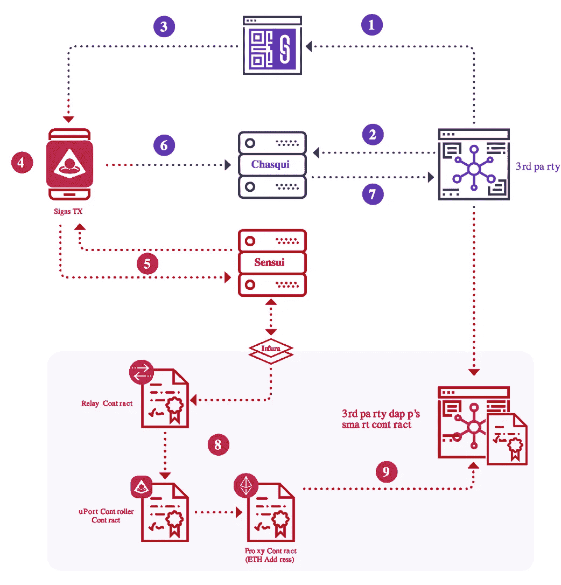

# 将 uPort 表示为 javascript —将交易转发给第三方 Dapp。

> 原文：<https://medium.com/coinmonks/express-uport-as-javascript-relay-transaction-to-3rd-party-dapp-12fd226acc2f?source=collection_archive---------4----------------------->

uPort 是著名的以太坊项目。在我看来，uPort 是区块链最成功的自我主权身份平台。所以我觉得了解它的策略对我们的事业是有帮助的。

我将 uPort 契约和 IPFS 或其他对象表示为 javascript。然后我模拟如何工作。老实说，我不确定我的理解是否正确，尽管我尽可能地注意到了准确性，参考了[白皮书](http://blockchainlab.com/pdf/uPort_whitepaper_DRAFT20161020.pdf)和 [Github](https://github.com/uport-project/uport-identity) 和[官方文件](https://developer.uport.me/gettingstarted)。请检查文件以获得准确的信息。

这一次，我将重点讨论事务中继。请参考下图中的红色部分。

uPort 为不懂以太坊的用户提供了很好的功能。用户可以发送无资金交易。Sensui 服务器替代基金天然气。在这种情况下，事务被中继 TxRelay 契约。TxRelay 契约也称为 IdentityManager 契约。

Github 上的代码: [uport-contract-js](https://github.com/tak1827/uport-contract-js/tree/relay-tx-to-3rdparty-dapp)

预发布:[将 uPort 表示为 javascript —将 IPFS 哈希设置为注册管理机构合同](/coinmonks/express-uport-as-javascript-set-ipfs-hash-to-registry-contract-600c2dbf8404)



## 分成 6 个步骤

我把整个过程分成 6 个步骤。让我从第一步跳到第四步来解释。请参考[上一篇](/coinmonks/express-uport-as-javascript-set-ipfs-hash-to-registry-contract-600c2dbf8404)。

另一方面，让我简单解释一下这个流程的用例。我们假设第三方作为公共许可证(证明)的颁发者，然后用户将 IPFS 哈希设置到第三方合同以进行许可证认证。许可证托管在 IPFS。

1.  *创建用户对象。*
2.  *创建代理作为身份*
3.  *生成 JWT*
4.  *增加 IPFS 认证*
5.  *为 txRelay* 创建签名
6.  *Sned 交易*

## *5。为 txRelay* 创建签名

在之前的帖子中，为了保持简单，我没有签名发送交易。此时，我创建签名，因为 TxRelay 契约在调用 IdentityManager 之前验证事务。

首先，我生成私钥并检索公钥。公钥用于 TxRelay 合同上的签名验证。

请注意，“lsitOwner”为空。此列表用于发送交易的委托。发送者和用户在这个时间是一样的，所以我让它为空。如果您想委托某人，您需要将发送者地址添加到 TxRelay 契约的白名单中。

请查看“data.className”。“第三方应用程序”是我新创建的第三方合同。内容与我之前在博客上创建的用户注册合同相同。

```
// Generate private key for txRelay 
user.txRelayKey = randomBytes(32);// Retrieve pub key and set as claimedSender
// This is used for signature verification
const claimedSender = privateToPublic(user.txRelayKey).toString('hex');// Empty because Tx sender is owner.
// User can delegate another user as sender.
const listOwner = '';// Nonce is for preventing from replay attack.
const nonce = TR.getNonce(claimedSender);// Data to sign
const data = { 
  claimedSender,
  sender: user.address,
  identity: user.proxy,
  className: 'ThirdPartyDapp', // Contract name called by proxy
  methodName: 'set', // Function name called by proxy
  data: {
    identifier: MIM.address,
    subject: user.subjects[0],
    value: hash
  }
};
```

接下来，我计算 hash witch 格式定义为 [EIP191](https://github.com/ethereum/EIPs/blob/master/EIPS/eip-191.md) 。uPort 使用这种格式。然后，使用私钥对哈希进行签名。

```
// Calculate EIP191 format hash
const eip191Hash = calculateEIP191Hash(
  listOwner, nonce, MIM.address, JSON.stringify(data)
)const sig = ecsign(eip191Hash, user.txRelayKey, 1);
```

## *6。Sned 交易*

用户向 Sensui 服务器发送交易以获得资金。但是我没有在代码中使用 gas 概念，所以我跳过了融资过程。

用户调用带有签名的 relayMetaTx 契约。

```
user.run(function() { // User send transaction with no fund. 
  // Then, funded by Sensui server. // Send transaction to txRelay contract
  TR.relayMetaTx(
    sig.v, sig.r, sig.s, MIM, data, listOwner
  );
});
```

“relayMetaTx”验证签名，比较传递的公钥和从签名中恢复的公钥。如果签名有效，则调用 IdentityManager 的 forwardTo 函数。

```
relayMetaTx(
    sigV,
    sigR,
    sigS,
    destination, 
    data, 
    listOwner
) { Assert(listOwner === '' || this.whitelist[listOwner][msg.sender],
    `Not allowed listOwner: ${listOwner}`
  ) // Get claimedSender property of data
  const claimedSender = this.getAddress(data); // EIP 191
  // 0x19 :: version :: relay :: whitelistOwner :: 
  // nonce :: destination :: data
  const h = calculateEIP191Hash(
    listOwner, 
    this.nonce[claimedSender],
    destination.address,
    JSON.stringify(data)
  ) // Recover public key from signature
  const addressFromSig = ecrecover(
    h, sigV, sigR, sigS, 1).toString('hex'); // Verify signature
  Assert(claimedSender === addressFromSig,
    `claimedSender don't correspond to addressFromSig`
  ) setSender(this.address);// Set sunder as TxRelay // Increment nonce
  this.nonce[claimedSender]++;

  // Specify forwardTo for simplification
  Assert(
    destination.forwardTo(
      data.sender,
      data.identity,
      data.className,
      data.methodName,
      data.data
    )
  );
}
```

说实话，IdentityManager 和以前的博客不一样。新的一个被称为 MetaIdentityManager，旨在从 TxRelay 协定中调用。MetaIdentityManager 仅接受来自 TxRelay 的事务。

```
forwardTo(sender, identity, className, methodName, data) {
  this.onlyAuthorized();// Only accept tx from txRelay
  this.onlyOwner(identity, sender); setSender(this.address);// Set sender as IdentityManager // Forward to proxy
  identity.forward(className, methodName, data); return true;
}
```

转发的事务由“ThiredPartyDapp”合同处理，与以前的博客相同。

> [在您的收件箱中直接获得最佳软件交易](https://coincodecap.com/?utm_source=coinmonks)

[](https://coincodecap.com/?utm_source=coinmonks)