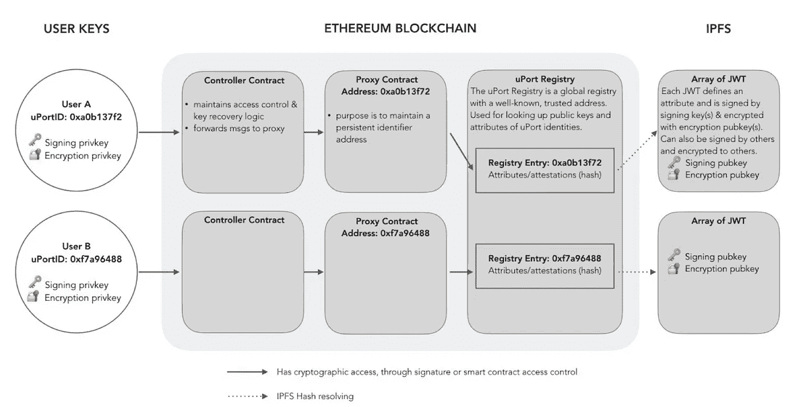

# 将 uPort 表示为 javascript —将 IPFS 哈希设置为注册管理机构合同

> 原文：<https://medium.com/coinmonks/express-uport-as-javascript-set-ipfs-hash-to-registry-contract-600c2dbf8404?source=collection_archive---------1----------------------->

uPort 是著名的以太坊项目。在我看来，uPort 是区块链最成功的自我主权身份平台。所以我觉得了解它的策略对我们的事业是有帮助的。

我将 uPort 契约和 IPFS 或其他对象表示为 javascript。然后我模拟如何工作。老实说，我不确定我的理解是否正确，尽管我尽可能地注意到了准确性，参考了[白皮书](http://blockchainlab.com/pdf/uPort_whitepaper_DRAFT20161020.pdf)和 [Github](https://github.com/uport-project/uport-identity) 和[官方文件](https://developer.uport.me/gettingstarted)。请检查文件以获得准确的信息。

这一次，我将重点介绍如何创建代理契约或 IPFS 哈希，并将哈希设置为注册中心契约。

Github 上的代码: [uport-contract-js](https://github.com/tak1827/uport-contract-js/tree/set-ipfs-hash-to-registry)

下一篇文章:[将 uPort 表示为 JavaScript——将事务转发给第三方 Dapp](/@t.tak/express-uport-as-javascript-relay-transaction-to-3rd-party-dapp-12fd226acc2f)



## 分成 6 个步骤

我把整个过程分成 6 个步骤。

1.  *创建用户对象。*
2.  *创建代理作为身份*
3.  *生成 JWT*
4.  *增加 IPFS 认证*
5.  *注册 IPFS 哈希到 UportRegistry 合同*
6.  由第三方验证 JWT

## *1。创建用户对象。*

首先，我创建由我定义的用户对象(不是 uPort)。用户对象持有代理对象和 JWT 私钥和主题(JWT 的标识)。

```
// User object hold proxy object and jwt private key
let user = new User("Christian Lundkvist");
```

## *2。创建代理身份*

代理是 uPort 上的身份契约。每个人都有一份代理合同。代理由名为 IdentityManager 的控制器合同创建。用户向此合同发送交易。

```
user.run(function() { // Proxy contract is deployed by IdentityManager
  this.proxy = IM.createIdentity(this.address);
});
```

在 IdentityManager 内部，生成了代理协定。请注意，代理生成的事务发送方(msg.sender)是 IdentityManager，因此代理的所有者是 IdentityManager。

```
createIdentity(owner) {
  setSender(this.address);// Set sender as IdentityManager // Generate Proxy contract
  const identity = new Proxy(); this.owners[identity.address] = {
    [owner]: (new Date()).getTime() - this.timeLock
  } return identity;
}
```

## 3.生成 JWT

JWT(Json Web Token)通常像 OpenID 一样用作身份认证。uPort 使用 JWT 实现离线验证。

从一开始，我定义 JWT 格式如下。这种格式与白皮书略有不同。首先，我将属性名如“Subject”改为“sub ”,因为 [JWT RFC](https://tools.ietf.org/html/rfc7519) 定义为 so 以减少令牌大小。第二，为了简化，我更改了有效载荷中的内容。

```
{
  header: {
    "alg": "ES256",
    "typ": "JWT"
  },
  payload: {
    attribute: {
      name: user name,
      identifier: IdenttityManager address
    },
    sub: Unique subject of this token,
    iss: Proxy address,
    exp: Expire datetime,
    iat: Issued datetime
  }
  signature: Signature
}
```

转到生成过程。首先，用户定义唯一主题来区分创建的令牌。然后，使用上述格式创建有效载荷。接下来，用户生成私钥来签名 JWT。请注意，我们需要使用 ECDSA 的‘secp 256 r 1’曲线，而不是‘secp 256k 1’。我已经在[的另一篇博文](/coinmonks/can-not-use-secp256k1-which-is-common-on-crypto-currency-to-create-jwt-d6685be35a66)中提到过。

```
// Define unique subject
user.subjects.push('First-JWT');const payload = buildPayload(
  { name: user.name, identifier: IM.address }, 
  user.subjects[0], 
  user.proxy.address,
);// Generate private key to sign JWT
user.jwtKey = generatePrivateKey();const token = sign(payload, user.jwtKey);
```

## 4.向 IPFS 添加证明

认证包含 JWT 和公钥，重要的是，认证托管在 IPFS 上，任何人都可以通过互联网访问。第三方验证 JWT 从证明中检索公钥。

证明的格式如下。

```
{
  token: JWT,
  data: {
    header: Header
    payload: Payload
    signature: Signature
  },
  encrypted: false,
  publicKey: Public key corresponding to signature
}
```

继续添加流程。首先，创建压缩的公钥，并按照上述格式构建证明。然后，将它添加到 IPFS 对象中。

```
// Include pubkey to assertion for signature verification
const pubkey = getCompressedPubkey(user.jwtKey);// Build attestation. 
const attestation = buildAttestation(token, pubkey);// Add to IPFS
const hash = IS.add( JSON.stringify(attestation) );
```

## 5.将 IPFS 哈希注册到 UportRegistry 合同

UportRegistry 是一个契约，它被用作存储 IPFS 哈希的注册表。第三方访问该合同并获得与 JWT 有效载荷对应的散列。请注意，用户不直接注册，而是通过 IdentityManager 注册。此外，IdentityManger 将事务转发给用户的代理，以便最终的 msg.sender 是代理。

```
user.run(function() { // IdentityManager delegate registration to Proxy
  // Proxy register hash to UportRegistry
  IM.forwardTo(
    this.proxy, 
    'UportRegistry',
    'set',
    { 
      identifier: IM.address,
      subject: user.subjects[0],
      value: hash
    }
  );
});forwardTo(identity, className, methodName, data) {
  this.onlyOwner(identity); setSender(this.address);// Set sender as IdentityManager // Forward to proxy
  identity.forward(className, methodName, data);
}
```

在代理契约内部的 forward 函数中，我将类名和函数名定义为参数，以区分应该运行哪个函数。

```
forward(className, methodName, data) {
  this.onlyOwner(); setSender(this.address);// Set sender as Proxy Assert(this.executeCall(className, functionName, data));
}executeCall(className, functionName, data) { if (className =='UportRegistry' && functionName =='set') {
    const { identifier, subject, value } = data; // Set IPFS hash to UportRegistry    
    UR.set(identifier, subject, value); } else if (className =='UportRegistry' && functionName =='get') {
    const { identifier, issur, subject } = data; // Get IPFS hash from UportRegistry    
    UR.get(identifier, issur, subject);
  } return true;
}
```

最后，调用 UportRegistry 契约的 Set 函数。请注意，IPFS 散列像这样存储在注册表中。

`registry[IdentigyManager.address][Proxy.address][Subject]`

```
set(identifier, subject, value){ if (typeof this.registry[identifier] =="undefined" ) {
    this.registry[identifier] = {};
  }

  if (typeof this.registry[identifier][msg.sender] =="undefined" ) {
    this.registry[identifier][msg.sender] = {}
  } this.registry[identifier][msg.sender][subject] = value;
}
```

## 6.由第三方验证 JWT

让我解释一下如何验证第三方使用 JWT。首先，第三方解码 JWT 并检索有效载荷。然后，获取相应的哈希。

```
// Decode token, then retrieve payload
const decodedPayload = JSON.parse( decodeBase64(token.split(".")[1]) );// Get IPFS hash from UportRegistry
const ipfsHash = UR.get(
  decodedPayload.attribute.identifier,
  decodedPayload.iss,
  decodedPayload.sub
);
```

接下来，从 IPFS 获得公钥。现在第三方可以证实 JWT。

```
// Get attestation from IPFS
const ipfsAtt = IS.cat(ipfsHash);// Retrieve compressed public key form attestation
const compressedPubkey = JSON.parse(ipfsAtt).publicKey;// Retrieve public key
const ipfsPubkey = getPubkeyFromCompressedPubkey(compressedPubkey);// Verify token using public key which is hosted by IPFS
verify(token, ipfsPubkey);
```

> [在您的收件箱中直接获得最佳软件交易](https://coincodecap.com/?utm_source=coinmonks)

[](https://coincodecap.com/?utm_source=coinmonks)